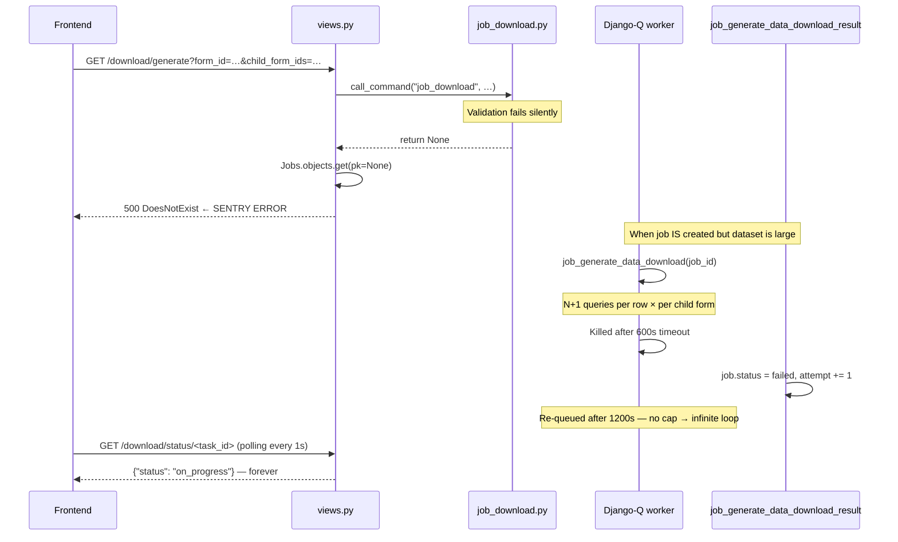
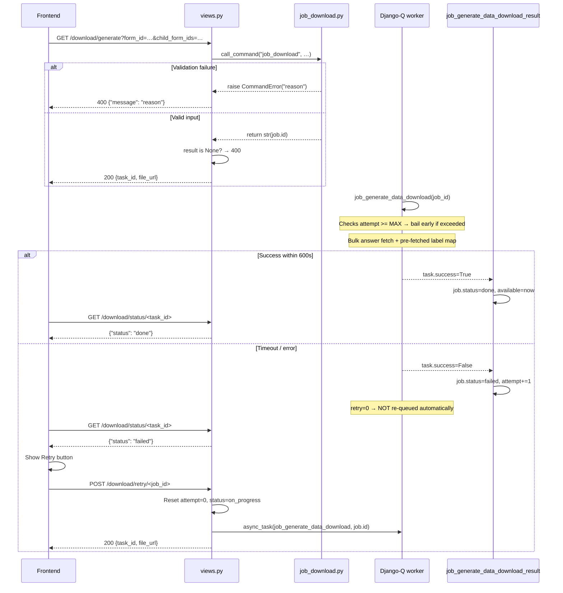

# Design: Fix Job Download Dead `on_progress`

## Current Flow (Broken)



## Fixed Flow



---

## Fix 1 — Disable Auto-Retry Per-Task (`job_download.py`)

**Do not change `settings.py`.** Pass `retry=0` directly on the `async_task` call so only download tasks skip auto-retry. Other job types are unaffected.

```python
# job_download.py — inside handle(), after job is created
task_id = async_task(
    "api.v1.v1_jobs.job.job_generate_data_download",
    job.id,
    **info,
    retry=0,      # ← isolates no-auto-retry to download tasks only
    hook="api.v1.v1_jobs.job.job_generate_data_download_result",
)
```

The same `retry=0` must be passed in the `download_retry` view (Fix 5) when the task is re-queued.

---

## Fix 2 — Raise `CommandError` Instead of Silent Return (`job_download.py`)

### Before

```python
if form.parent is not None:
    self.stdout.write(self.style.ERROR("…"))
    return          # → caller gets None

for child_form_id in child_form_ids:
    if child_form_id not in valid_child_form_ids:
        self.stdout.write(self.style.ERROR("…"))
        return      # → caller gets None
```

### After

```python
from django.core.management import BaseCommand, CommandError

if form.parent is not None:
    raise CommandError("Form id {0} is not a registration form".format(form.id))

for child_form_id in child_form_ids:
    if child_form_id not in valid_child_form_ids:
        raise CommandError(
            "{0} is not a child of form id {1}".format(child_form_id, form.id)
        )
```

---

## Fix 3 — Guard `None` in View (`views.py`)

```python
from django.core.management import CommandError

try:
    result = call_command(*cmd_args)
except CommandError as e:
    return Response({"message": str(e)}, status=status.HTTP_400_BAD_REQUEST)

if result is None:
    return Response(
        {"message": "Download could not be initiated"},
        status=status.HTTP_400_BAD_REQUEST,
    )

job = Jobs.objects.get(pk=result)
```

---

## Fix 4 — Cap Retries in Task Function (`job.py`)

Since `retry=0` disables Django-Q auto-retry, this guard is a safety net for cases where a job is manually retried too many times via the UI:

```python
MAX_DOWNLOAD_ATTEMPTS = 3

def job_generate_data_download(job_id, **kwargs):
    job = Jobs.objects.get(pk=job_id)
    if job.attempt >= MAX_DOWNLOAD_ATTEMPTS:
        logger.warning(
            "job %s exceeded max attempts (%s), skipping",
            job_id, MAX_DOWNLOAD_ATTEMPTS,
        )
        return None
    child_form_ids = job.info.get("child_form_ids", [])
    …
```

---

## Fix 5 — New Retry Endpoint (`views.py` + `urls.py`)

### View

```python
@extend_schema(
    description="Retry a failed or pending download job",
    tags=["Job"],
    responses={
        (200, "application/json"): inline_serializer(
            "RetryDownload",
            fields={
                "task_id": serializers.CharField(),
                "file_url": serializers.CharField(),
            },
        )
    },
)
@api_view(["POST"])
@permission_classes([IsAuthenticated])
def download_retry(request, version, job_id):
    job = get_object_or_404(Jobs, pk=job_id, user=request.user)
    if job.status == JobStatus.done:
        return Response(
            {"message": "Job is already complete"},
            status=status.HTTP_400_BAD_REQUEST,
        )
    # Delete the stale/partial GCS file from the previous attempt.
    if job.result and storage.check("download/{}".format(job.result)):
        storage.delete("download/{}".format(job.result))
    # Generate a fresh filename so a partial upload can never be served.
    form = Forms.objects.get(pk=job.info["form_id"])
    form_name = form.name.replace(" ", "_").lower()
    today = timezone.datetime.today().strftime("%y%m%d")
    ext = "zip" if job.info.get("child_form_ids") else "xlsx"
    new_file = "download-{0}-{1}-{2}.{3}".format(
        form_name, today, uuid.uuid4(), ext
    )
    job.result = new_file
    job.status = JobStatus.on_progress
    job.attempt = 0     # reset counter; MAX guard in task is a safety net only
    # Do NOT unpack **job.info — the task reads all params from job.info directly
    task_id = async_task(
        "api.v1.v1_jobs.job.job_generate_data_download",
        job.id,
        retry=0,
        hook="api.v1.v1_jobs.job.job_generate_data_download_result",
    )
    job.task_id = task_id
    job.save()
    return Response(
        {
            "task_id": task_id,
            "file_url": "/download/file/{0}".format(job.result),
        },
        status=status.HTTP_200_OK,
    )
```

### URL entry in `urls.py`

```python
re_path(
    r"^(?P<version>(v1))/download/retry/(?P<job_id>[0-9]+)$",
    download_retry,
),
```

**Ownership check**: `get_object_or_404(Jobs, pk=job_id, user=request.user)` ensures a user can only retry their own jobs.

**File lifecycle**: The old GCS file is deleted first. A new filename is generated with a fresh UUID. If the timeout happened mid-write, no stale partial file can ever be served.

**No `**job.info`**: `job_generate_data_download` reads all parameters from `job.info` directly; passing `**job.info` as kwargs would be redundant and risks silent schema mismatches.

---

## Fix 6 — Frontend Retry Button (`DownloadTable.jsx` + `ui-text.js`)

### State addition

```jsx
const [retrying, setRetrying] = useState(null);  // holds job id while retrying
```

### Handler

```jsx
const handleRetry = (row) => {
  setRetrying(row.id);
  api
    .post(`download/retry/${row.id}`)
    .then((res) => {
      setDataset((ds) =>
        ds.map((d) =>
          d.id === row.id
            ? { ...d, status: "on_progress", task_id: res.data.task_id }
            : d
        )
      );
    })
    .catch((e) => {
      notify({ type: "error", message: text.retryFailed });
      console.error(e);
    })
    .finally(() => {
      setRetrying(null);
    });
};
```

### Column render change (last column)

```jsx
<Space>
  <Button
    icon={
      row.status === "on_progress" || row.result === downloading
        ? <LoadingOutlined />
        : row.status === "done"
        ? <DownloadOutlined />
        : <ExclamationCircleOutlined style={{ color: "red" }} />
    }
    ghost
    disabled={row.status !== "done"}
    onClick={() => { handleDownload(row); }}
  >
    {row.status === "on_progress"
      ? text.generating
      : row.status === "failed"
      ? text.failed
      : text.download}
  </Button>
  {["failed", "pending"].includes(row.status) && (
    <Button
      ghost
      icon={<ReloadOutlined />}
      loading={retrying === row.id}
      onClick={() => { handleRetry(row); }}
    >
      {text.retryText}
    </Button>
  )}
  <Button ghost className="dev">
    {text.deleteText}
  </Button>
</Space>
```

Retry is shown only for `failed` and `pending` — not `on_progress` (already running) or `done`.

After a successful retry call, the row's `status` is updated to `on_progress` and `task_id` is replaced with the new task ID. The existing polling effect picks up the updated status automatically.

### Polling terminal-state fix

The polling `useEffect` must stop when the status is `done` **or** `failed`. Without this, a failed job polls indefinitely even after the Retry button is shown. Add `"failed"` alongside `"done"` as a cleanup/stop condition in the effect's dependency or condition check.

### `ui-text.js` additions

```js
retryText: "Retry",
retryFailed: "Failed to retry download. Please try again.",
```

### Icon import addition

```jsx
import {
  …
  ReloadOutlined,
} from "@ant-design/icons";
```

---

## Fix 7 — N+1 Cache `to_data_frame` (`job.py`)

Replace repeated `d.to_data_frame` calls inside the loop body with a single cached local variable:

```python
for d in data:
    parent_frame = d.to_data_frame  # evaluated once
    if download_type == DataDownloadTypes.recent:
        item = parent_frame
        for child_form in child_form_ids:
            dl = d.children.filter(…).first()
            if dl:
                child_frame = dl.to_data_frame
                item = {
                    **parent_frame,
                    **child_frame,
                    "datapoint_name": d.name,
                    "created_at": parent_frame.get("created_at"),
                    "created_by": d.created_by.get_full_name(),
                    "updated_at": child_frame.get("created_at"),
                    "updated_by": dl.created_by.get_full_name(),
                }
        data_items.append(item)
    if download_type == DataDownloadTypes.all:
        has_children = False
        for child_form in child_form_ids:
            for dl in d.children.filter(…).all():
                has_children = True
                child_frame = dl.to_data_frame  # evaluated once per child
                data_items.append({
                    **parent_frame,
                    **child_frame,
                    "datapoint_name": d.name,
                    "created_at": parent_frame.get("created_at"),
                    "created_by": d.created_by.get_full_name(),
                    "updated_at": child_frame.get("created_at"),
                    "updated_by": dl.created_by.get_full_name(),
                })
        if not has_children:
            data_items.append(parent_frame)
```

---

## Fix 8 — Pre-Fetch Option Labels (`job.py`)

Replace per-cell DB calls with a single bulk fetch before the DataFrame apply loop:

```python
def build_label_map(question_ids: list) -> dict:
    """Returns {question_id: {value: label}} for all given question IDs."""
    rows = QuestionOptions.objects.filter(
        question_id__in=question_ids
    ).values("question_id", "value", "label")
    mapping: dict = {}
    for row in rows:
        mapping.setdefault(row["question_id"], {})[row["value"]] = row["label"]
    return mapping

# Inside generate_data_sheet, before the apply loop:
option_question_ids = [
    info["id"]
    for info in question_map.values()
    if info["type"] in [QuestionTypes.option, QuestionTypes.multiple_option]
]
label_map = build_label_map(option_question_ids)   # 1 query total

new_columns = {}
if use_label:
    for col_name in actual_columns:
        base_name = col_name.split("_")[0] if "_" in col_name else col_name
        if base_name in question_map:
            q_info = question_map[base_name]
            if q_info["type"] in [QuestionTypes.option, QuestionTypes.multiple_option]:
                q_labels = label_map.get(q_info["id"], {})
                new_columns[col_name] = df[col_name].apply(
                    lambda x, ql=q_labels: (
                        "|".join(ql.get(v, v) for v in str(x).split("|"))
                        if x is not None and x == x
                        else x
                    )
                )
```

---

## Query Count Comparison

| Scenario | Before | After |
|----------|--------|-------|
| N=500 parents, M=3 child forms, K=2 children each — `type=all` | ~500×3×2×2 = 6000 answer queries | ~500 + 500×3×2 = 3500, or ~10 with prefetch |
| Option labels, 500 rows × 5 option cols × 2 values each | ~5000 queries | 1 query |
| Validation failure | 500 crash | 400 with message |
| Job timeout loop | infinite retries (every 20 min) | fails once → user retries manually |
