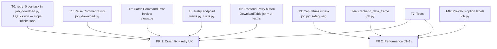

# Implementation Plan: Fix Job Download Dead `on_progress`

## Overview

Eight targeted changes across five files. No schema migrations needed. The changes are grouped into three PRs by risk/urgency.



**T1 and T2 must ship together.** T5 and T6 must ship together. T4a and T4b are independent within PR2.

---

## PR 1 — Crash Fix + Retry UX

### T0 — Disable Auto-Retry Per-Task (NOT global settings)

**File**: `backend/api/v1/v1_jobs/management/commands/job_download.py`

Add `retry=0` to the `async_task` call inside `handle()` (~line 102):

```python
# BEFORE
task_id = async_task(
    "api.v1.v1_jobs.job.job_generate_data_download",
    job.id,
    **info,
    hook="api.v1.v1_jobs.job.job_generate_data_download_result"
)

# AFTER
task_id = async_task(
    "api.v1.v1_jobs.job.job_generate_data_download",
    job.id,
    **info,
    retry=0,
    hook="api.v1.v1_jobs.job.job_generate_data_download_result"
)
```

`settings.py` is **not changed**. Other job types retain their Django-Q retry behaviour.

**Effort**: 5 min. **Risk**: Low.

---

### T1 — Raise `CommandError` in Management Command

**File**: `backend/api/v1/v1_jobs/management/commands/job_download.py`

1. Update the Django import on line 1:
   ```python
   from django.core.management import BaseCommand, CommandError
   ```

2. Replace both silent-return validation paths:

   ```python
   # ~line 54 — form.parent check
   # BEFORE
   if form.parent is not None:
       self.stdout.write(self.style.ERROR("…"))
       return

   # AFTER
   if form.parent is not None:
       raise CommandError(
           "Form id {0} is not a registration form".format(form.id)
       )
   ```

   ```python
   # ~line 68 — child form check
   # BEFORE
   for child_form_id in child_form_ids:
       if child_form_id not in valid_child_form_ids:
           self.stdout.write(self.style.ERROR("…"))
           return

   # AFTER
   for child_form_id in child_form_ids:
       if child_form_id not in valid_child_form_ids:
           raise CommandError(
               "{0} is not a child of form id {1}".format(
                   child_form_id, form.id
               )
           )
   ```

**Effort**: 15 min. **Risk**: Low. `CommandError` is the Django-idiomatic failure signal for management commands. No test expects the old silent behaviour (check before merging).

---

### T2 — Guard `None` in `download_generate` View

**File**: `backend/api/v1/v1_jobs/views.py`

1. Add import at top (alongside existing Django imports):
   ```python
   from django.core.management import CommandError
   ```

2. Wrap `call_command` at ~line 150:
   ```python
   # BEFORE
   result = call_command(*cmd_args)
   job = Jobs.objects.get(pk=result)

   # AFTER
   try:
       result = call_command(*cmd_args)
   except CommandError as e:
       return Response(
           {"message": str(e)},
           status=status.HTTP_400_BAD_REQUEST,
       )
   if result is None:
       return Response(
           {"message": "Download could not be initiated"},
           status=status.HTTP_400_BAD_REQUEST,
       )
   job = Jobs.objects.get(pk=result)
   ```

**Effort**: 15 min. **Risk**: Low. Only the error path changes; the success path is identical.

---

### T5 — New `download_retry` Endpoint

**File**: `backend/api/v1/v1_jobs/views.py`

Add after `download_status` view (around line 181):

```python
@extend_schema(
    description="Retry a failed or pending download job",
    tags=["Job"],
    responses={
        (200, "application/json"): inline_serializer(
            "RetryDownload",
            fields={
                "task_id": serializers.CharField(),
                "file_url": serializers.CharField(),
            },
        )
    },
)
@api_view(["POST"])
@permission_classes([IsAuthenticated])
def download_retry(request, version, job_id):
    job = get_object_or_404(Jobs, pk=job_id, user=request.user)
    if job.status == JobStatus.done:
        return Response(
            {"message": "Job is already complete"},
            status=status.HTTP_400_BAD_REQUEST,
        )
    if job.result and storage.check("download/{}".format(job.result)):
        storage.delete("download/{}".format(job.result))
    form = Forms.objects.get(pk=job.info["form_id"])
    form_name = form.name.replace(" ", "_").lower()
    today = timezone.datetime.today().strftime("%y%m%d")
    ext = "zip" if job.info.get("child_form_ids") else "xlsx"
    new_file = "download-{0}-{1}-{2}.{3}".format(form_name, today, uuid4(), ext)
    job.result = new_file
    job.status = JobStatus.on_progress
    job.attempt = 0
    task_id = async_task(
        "api.v1.v1_jobs.job.job_generate_data_download",
        job.id,
        retry=0,
        hook="api.v1.v1_jobs.job.job_generate_data_download_result",
    )
    job.task_id = task_id
    job.save()
    return Response(
        {
            "task_id": task_id,
            "file_url": "/download/file/{0}".format(job.result),
        },
        status=status.HTTP_200_OK,
    )
```

**File**: `backend/api/v1/v1_jobs/urls.py`

1. Add `download_retry` to the import list.
2. Add URL pattern:
   ```python
   re_path(
       r"^(?P<version>(v1))/download/retry/(?P<job_id>[0-9]+)$",
       download_retry,
   ),
   ```

**Notes**:
- `get_object_or_404(Jobs, pk=job_id, user=request.user)` prevents users retrying other users' jobs (ownership check).
- Old GCS file is deleted first; a new filename is generated with a fresh UUID — prevents a partial or stale file from being served.
- `job_generate_data_download` reads all params from `job.info`; do **not** pass `**job.info` as kwargs — task only needs `job.id`.
- `retry=0` is passed to `async_task` to keep auto-retry isolation consistent with T0.
- `job.attempt` is reset to 0; manual retries can always be performed regardless of prior attempt count.
- Need imports: `delete_file` from `utils.storage`, `Forms`, `uuid`, `timezone`.

**Effort**: 1 h. **Risk**: Low-medium.

---

### T6 — Frontend Retry Button

**Files**:
- `frontend/src/pages/downloads/components/DownloadTable.jsx`
- `frontend/src/lib/ui-text.js`

#### `ui-text.js` — add two keys

Inside the `en` block, after `failed: "Failed",`:

```js
retryText: "Retry",
retryFailed: "Failed to retry download. Please try again.",
```

#### `DownloadTable.jsx` — full diff

**1. Add `ReloadOutlined` to icon imports** (~line 14):

```jsx
import {
  LoadingOutlined,
  DownloadOutlined,
  ExclamationCircleOutlined,
  FileMarkdownFilled,
  FileWordFilled,
  FileZipFilled,
  FileExcelFilled,
  ReloadOutlined,           // ← add
} from "@ant-design/icons";
```

**2. Add `retrying` state** after the existing `downloading` state (~line 46):

```jsx
const [retrying, setRetrying] = useState(null);
```

**3. Add `handleRetry` function** after `handleDownload` (~line 96):

```jsx
const handleRetry = (row) => {
  setRetrying(row.id);
  api
    .post(`download/retry/${row.id}`)
    .then((res) => {
      setDataset((ds) =>
        ds.map((d) =>
          d.id === row.id
            ? { ...d, status: "on_progress", task_id: res.data.task_id }
            : d
        )
      );
    })
    .catch((e) => {
      notify({ type: "error", message: text.retryFailed });
      console.error(e);
    })
    .finally(() => {
      setRetrying(null);
    });
};
```

**4. Update the action column render** (last column in `columns`, ~line 262):

```jsx
{
  render: (row) => (
    <Space>
      <Button
        icon={
          row.status === "on_progress" || row.result === downloading ? (
            <LoadingOutlined />
          ) : row.status === "done" ? (
            <DownloadOutlined />
          ) : (
            <ExclamationCircleOutlined style={{ color: "red" }} />
          )
        }
        ghost
        disabled={row.status !== "done"}
        onClick={() => {
          handleDownload(row);
        }}
      >
        {row.status === "on_progress"
          ? text.generating
          : row.status === "failed"
          ? text.failed
          : text.download}
      </Button>
      {["failed", "pending"].includes(row.status) && (
        <Button
          ghost
          icon={<ReloadOutlined />}
          loading={retrying === row.id}
          onClick={() => {
            handleRetry(row);
          }}
        >
          {text.retryText}
        </Button>
      )}
      <Button ghost className="dev">
        {text.deleteText}
      </Button>
    </Space>
  ),
},
```

**Behaviour**:
- Retry button is visible only for `failed` and `pending` rows.
- While the API call is in-flight, `loading` spinner replaces the icon on that button.
- On success: the row's `status` becomes `on_progress` and `task_id` is updated to the new task. The existing 1-second polling `useEffect` picks this up automatically — no extra wiring needed.
- On error: a notification toast appears.

**Effort**: 1 h. **Risk**: Low.

---

### T8 — Stop Polling on `failed` Status ✅ Already implemented

**File**: `frontend/src/pages/downloads/components/DownloadTable.jsx`

The polling `useEffect` already treats both `done` and `failed` as terminal states. The relevant check at line ~129:

```jsx
if (["done", "failed"].includes(res?.data?.status)) {
  setDataset((ds) =>
    ds.map((d) =>
      d.task_id === pending?.[0]?.task_id
        ? { ...d, status: res.data.status }
        : d
    )
  );
}
updateStatus();
```

Once a job reaches `failed`, the dataset is updated with the terminal status and the Retry button becomes visible. No separate fix needed.

---

### T7 — Tests for PR 1

**Files**: extend `backend/api/v1/v1_jobs/tests/` (new test cases in relevant existing files)

```python
# tests_download_list_endpoint.py or new tests_download_retry.py

# TC-1: generate returns 400 when a monitoring form is passed as form_id
def test_generate_400_for_child_form_as_root(self):
    response = self.client.get(
        "/api/v1/download/generate",
        {"form_id": self.monitoring_form.id, "type": "all"},
        HTTP_AUTHORIZATION=f"Bearer {self.token}",
    )
    self.assertEqual(response.status_code, 400)
    self.assertIn("message", response.json())

# TC-2: generate returns 400 when child_form_id is not a child of form
def test_generate_400_for_invalid_child_form(self):
    response = self.client.get(
        "/api/v1/download/generate",
        {"form_id": self.form.id, "child_form_ids": [self.other_form.id], "type": "all"},
        HTTP_AUTHORIZATION=f"Bearer {self.token}",
    )
    self.assertEqual(response.status_code, 400)

# TC-3: retry returns 200 and new task_id for failed job
def test_retry_failed_job(self):
    job = Jobs.objects.create(
        type=JobTypes.download, user=self.user,
        status=JobStatus.failed, result="file.zip",
        task_id="old-task-id",
        info={"form_id": self.form.id, "child_form_ids": [], …},
    )
    response = self.client.post(
        f"/api/v1/download/retry/{job.id}",
        HTTP_AUTHORIZATION=f"Bearer {self.token}",
    )
    self.assertEqual(response.status_code, 200)
    self.assertIn("task_id", response.json())
    job.refresh_from_db()
    self.assertEqual(job.status, JobStatus.on_progress)
    self.assertEqual(job.attempt, 0)

# TC-4: retry returns 400 for a done job
def test_retry_done_job_returns_400(self):
    job = Jobs.objects.create(…, status=JobStatus.done)
    response = self.client.post(f"/api/v1/download/retry/{job.id}", …)
    self.assertEqual(response.status_code, 400)

# TC-5: retry returns 404 when job belongs to another user
def test_retry_other_users_job_returns_404(self):
    job = Jobs.objects.create(…, user=self.other_user)
    response = self.client.post(f"/api/v1/download/retry/{job.id}", …)
    self.assertEqual(response.status_code, 404)
```

---

## PR 2 — Performance (N+1 Fixes)

### T3 — Cap Retries in Task Function (`job.py`)

Safety net: even with `retry=0`, a user can click Retry multiple times. This guard prevents infinite manual retries.

Add constant near imports:
```python
MAX_DOWNLOAD_ATTEMPTS = 3
```

Add guard at start of `job_generate_data_download` (~line 650):
```python
def job_generate_data_download(job_id, **kwargs):
    job = Jobs.objects.get(pk=job_id)
    if job.attempt >= MAX_DOWNLOAD_ATTEMPTS:
        logger.warning(
            "job %s exceeded max attempts (%s), skipping",
            job_id, MAX_DOWNLOAD_ATTEMPTS,
        )
        return None
    …
```

**Effort**: 30 min.

---

### T4a — Cache `to_data_frame` in `download_data` (`job.py`)

In the main loop (~line 167), cache `d.to_data_frame` to a local variable so it is not re-evaluated per child iteration:

```python
for d in data:
    parent_frame = d.to_data_frame  # one DB query here, reused below

    if download_type == DataDownloadTypes.recent:
        item = parent_frame
        for child_form in child_form_ids:
            dl = d.children.filter(
                form_id=child_form, is_pending=False, is_draft=False,
                **date_filter,
            ).order_by("-created").first()
            if dl:
                child_frame = dl.to_data_frame
                item = {
                    **parent_frame,
                    **child_frame,
                    "datapoint_name": d.name,
                    "created_at": parent_frame.get("created_at"),
                    "created_by": d.created_by.get_full_name(),
                    "updated_at": child_frame.get("created_at"),
                    "updated_by": dl.created_by.get_full_name(),
                }
        data_items.append(item)

    if download_type == DataDownloadTypes.all:
        has_children = False
        for child_form in child_form_ids:
            for dl in d.children.filter(
                form_id=child_form, is_pending=False, is_draft=False,
                **date_filter,
            ).order_by("created").all():
                has_children = True
                child_frame = dl.to_data_frame
                data_items.append({
                    **parent_frame,
                    **child_frame,
                    "datapoint_name": d.name,
                    "created_at": parent_frame.get("created_at"),
                    "created_by": d.created_by.get_full_name(),
                    "updated_at": child_frame.get("created_at"),
                    "updated_by": dl.created_by.get_full_name(),
                })
        if not has_children:
            data_items.append(parent_frame)
```

**Effort**: 1 h. **Risk**: Medium — touches the hot path. Must run against existing download tests.

---

### T4b — Pre-Fetch Option Labels in `generate_data_sheet` (`job.py`)

1. Add helper function `build_label_map` before `generate_data_sheet`:

   ```python
   def build_label_map(question_ids: list) -> dict:
       """Pre-fetch {question_id: {value: label}} for the given question IDs."""
       rows = QuestionOptions.objects.filter(
           question_id__in=question_ids
       ).values("question_id", "value", "label")
       mapping: dict = {}
       for row in rows:
           mapping.setdefault(row["question_id"], {})[row["value"]] = row["label"]
       return mapping
   ```

2. Inside `generate_data_sheet`, before the `new_columns` block (~line 274):

   ```python
   # Build label lookup once for all option-type questions
   option_question_ids = [
       info["id"]
       for info in question_map.values()
       if info["type"] in [QuestionTypes.option, QuestionTypes.multiple_option]
   ]
   label_map = build_label_map(option_question_ids)  # 1 query

   new_columns = {}
   if use_label:
       for col_name in actual_columns:
           base_name = col_name.split("_")[0] if "_" in col_name else col_name
           if base_name in question_map:
               q_info = question_map[base_name]
               if q_info["type"] in [
                   QuestionTypes.option, QuestionTypes.multiple_option
               ]:
                   q_labels = label_map.get(q_info["id"], {})
                   new_columns[col_name] = df[col_name].apply(
                       lambda x, ql=q_labels: (
                           "|".join(ql.get(v, v) for v in str(x).split("|"))
                           if x is not None and x == x
                           else x
                       )
                   )
   ```

3. The original `get_answer_label` function can remain — it is not referenced by other callers and can be deleted in a follow-up cleanup.

**Effort**: 1 h. **Risk**: Medium — label output must be verified to match existing test fixtures.

---

### T7 — Tests for PR 2

```python
# TC-6: task function returns None and does not re-run when attempt >= MAX
def test_task_bails_when_max_attempts_exceeded(self):
    job = Jobs.objects.create(…, attempt=MAX_DOWNLOAD_ATTEMPTS)
    result = job_generate_data_download(job.id)
    self.assertIsNone(result)

# TC-7: download_data with type=all caches parent frame correctly
# Assert data_items matches expected output given mock data.
```

---

## File Change Summary

| File | PR | Change |
|------|----|--------|
| `backend/api/v1/v1_jobs/management/commands/job_download.py` | 1 | Add `retry=0` to `async_task`; raise `CommandError` |
| `backend/api/v1/v1_jobs/views.py` | 1 | Catch `CommandError`; add `download_retry` view (delete old file, new filename, `retry=0`) |
| `backend/api/v1/v1_jobs/urls.py` | 1 | Register `/download/retry/<job_id>` |
| `backend/api/v1/v1_jobs/tests/` | 1 | TC-1 through TC-5 |
| `frontend/src/lib/ui-text.js` | 1 | `retryText`, `retryFailed` keys |
| `frontend/src/pages/downloads/components/DownloadTable.jsx` | 1 | `retrying` state, `handleRetry`, Retry button |
| `frontend/src/pages/downloads/components/DownloadTable.jsx` | 1 | `retrying` state, `handleRetry`, Retry button; polling already stops on `failed` (T8 pre-existing) |
| `backend/api/v1/v1_jobs/job.py` | 2 | `MAX_DOWNLOAD_ATTEMPTS` guard, `build_label_map`, cache `parent_frame` |
| `backend/api/v1/v1_jobs/tests/` | 2 | TC-6, TC-7 |

---

## Rollout Order

```
PR 1 (crash + retry UX):
  T0 → T1 → T2 → T5 → T6 → T7

PR 2 (performance):
  T3 → T4a → T4b → T7
```

## Estimated Effort

| Task | Effort |
|------|--------|
| T0 — `retry=0` | 5 min |
| T1 — `CommandError` in command | 15 min |
| T2 — guard in view | 15 min |
| T5 — retry endpoint + URL | 45 min |
| T6 — frontend retry button | 1 h |
| T7 — PR 1 tests | 1.5 h |
| T3 — cap retries | 30 min |
| T4a — cache `to_data_frame` | 1 h |
| T4b — pre-fetch option labels | 1 h |
| T7 — PR 2 tests | 1 h |
| **Total** | **~7.5 h** |
