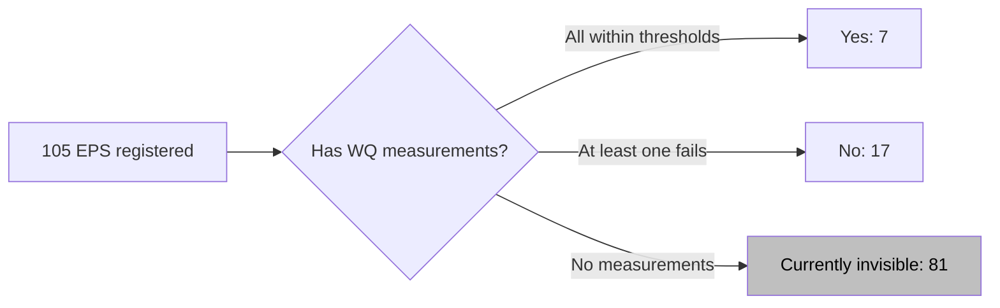

# Compliance chart — "No information available" bucket — SDD

Software Design Document for adding a third X-axis category (`No information available`) to the compute-driven `chart_drinking_water_compliance` stacked bar so its totals reconcile with `kpi_total_registered`.

**Status**: Requirements + design drafted. Implementation pending.
**Branch**: TBD (suggest `feature/<issue>-compliance-no-info`)
**Issue**: TBD (file via `bd create`)
**Companion**: [`/values` `_no_info` design](../no-available-info-in-vis-values-api/README.md) — this doc reuses that effort's group key, color, and i18n key but delivers the gap through a different mechanism because the compliance chart is compute-driven (no `api` block to attach `include_unanswered=true` to).
**Touches**: [`frontend/src/config/visualizations/1749623934933.json`](../../../frontend/src/config/visualizations/1749623934933.json), [`frontend/src/components/dashboard/compute/compliance.js`](../../../frontend/src/components/dashboard/compute/compliance.js), [`frontend/src/pages/dashboard/Dashboard.jsx`](../../../frontend/src/pages/dashboard/Dashboard.jsx), [`frontend/src/components/dashboard/ChartRenderer.jsx`](../../../frontend/src/components/dashboard/ChartRenderer.jsx), [`frontend/src/lib/ui-text.js`](../../../frontend/src/lib/ui-text.js)

---

## Documents in this folder

| Document | Purpose | Audience |
|---|---|---|
| [requirements.md](./requirements.md) | Locked functional / non-functional requirements + scope matrix | Reviewer approving the spec; PM / stakeholder |
| [design.md](./design.md) | Frontend wiring (compute helper signature, fetcher fan-out, ChartRenderer pass-through), edge cases, sequence diagrams, test matrix | Implementer needing the *what* and *why*; reviewer auditing the change |
| [implementation-plan.md](./implementation-plan.md) | Sequenced, checklisted task breakdown with file paths, line-number anchors, commit messages, rollback recipe | Implementer driving the PR; reviewer tracking progress |

---

## Problem in one sentence

The compliance stacked bar at [`1749623934933.json:300`](../../../frontend/src/config/visualizations/1749623934933.json#L300) shows `Yes (7)` and `No (17)` summing to **24**, but `kpi_total_registered` at [`1749623934933.json:137`](../../../frontend/src/config/visualizations/1749623934933.json#L137) reads **105** — the **81** EPS with no monitoring data are silently dropped, hiding a data-quality gap.



After this change, the chart shows three bars summing to **105**: `Yes (7)`, `No (17)`, `No information available (81)`.

## TL;DR

- Add **opt-in** flag `include_unanswered: true` on **any** `compute: "compliance"` chart item — single new field, dashboard-agnostic.
- Dashboard fan-out fires one extra `/values` call (count of registered universe), deriving `form_id` from the dashboard root's existing `parent_form_id`. Stored under `computeResponses.compliance_totals[chartId]`.
- `computeComplianceStackData()` gains an optional `totalRegistered` arg; when present, appends a third X-axis category `"No information available"` with a single `_no_info` stack and count `max(0, totalRegistered − yesCount − noCount)`.
- Reuses the [parent design](../no-available-info-in-vis-values-api/README.md)'s `_no_info` group key, `#bfbfbf` gray, and `noInformationAvailable` i18n key — no new vocabulary.
- Default behavior unchanged when the flag is absent — no surprise visual changes for anything else.
- Frontend-only — no backend code change. The totals fetch rides the existing count-mode `/values` endpoint already used by `kpi_total_registered` patterns.

### Generic by design

This spec defines a **dashboard-agnostic contract**, not a two-chart patch. The wiring (`ComplianceTotalsFetcher`, the compute-helper signature change, the `computeResponses.compliance_totals` channel) discovers eligible charts dynamically via `collectByCompute(config.items, "compliance")` and reads each dashboard's own `config.parent_form_id`. Today the contract is exercised by two known charts (EPS Overview and RWS Overview — both files happen to be named `chart_drinking_water_compliance`). Any future dashboard that adds a `compute: "compliance"` chart and sets the flag inherits the same behavior with zero additional code or wiring.

---

## Why a separate spec from the parent `_no_info` design

The parent design adds `include_unanswered=true` to `/api/v1/visualization/values` and emits one synthetic aggregate row per response. That mechanism solves the gap for **API-driven** widgets (donut, share_card, single-axis bar). It explicitly does not solve compute-driven widgets like `chart_drinking_water_compliance`:

```jsonc
// frontend/src/config/visualizations/1749623934933.json:300-333
{
  "id": "chart_drinking_water_compliance",
  "chart_type": "stack_bar",
  "compute": "compliance",          // ← no `api` block to attach the flag to
  "params_ref": ["param_e_coli", "param_total_coliform", ...],
  "globals_ref": "wq_globals"
}
```

Per-parameter `_no_info` rows can't be composed into a per-EPS classification because the parent design emits a single aggregate count per response, not per parent. The gap must be reconciled at the **chart compute layer** against the universe of registered EPS — what this spec delivers.

---

## Decisions locked from brainstorm

| Decision | Value | Rationale |
|---|---|---|
| Trigger model | Opt-in flag `include_unanswered: true` on the chart item — single new field | Mirrors the parent design's opt-in posture; default behavior unchanged |
| Source of "registered EPS" | Dashboard root's existing [`parent_form_id`](../../../frontend/src/config/visualizations/1749623934933.json#L2) | Already authoritative for the dashboard's universe. Adding a per-chart `total_api` block would duplicate the same fact and risk drift between the chart, `kpi_total_registered`, and the root. Override hook (`total_api`) can be added later if a chart ever wants a different universe |
| Fetch shape | `{ form_id: parent_form_id }` synthesized inside the fetcher | Same shape as [`kpi_total_registered.api`](../../../frontend/src/config/visualizations/1749623934933.json#L143); same backend path; if the dashboard fetch layer dedupes by URL the second call is free, otherwise one extra count call is negligible |
| Bucket position | **Third X-axis category**, label `"No information available"` | Confirmed in brainstorm. Semantically it's neither compliant nor failing — separate category, not a sub-stack of `No` |
| Stack key for the new bar | `_no_info` | Matches the [parent design's group key](../no-available-info-in-vis-values-api/README.md#decisions-locked-from-brainstorm); single neutral-gray segment, no parameter sub-stacks |
| Default color | `#bfbfbf` | Matches parent design |
| Translation key | `noInformationAvailable` | Reuses the parent design's [`ui-text.js`](../../../frontend/src/lib/ui-text.js) key |
| Filter scope | The universe fetch respects the same admin/date/customFilter state as the chart | Reconciles correctly under filtering — the gap shows the missing-data slice within the *filtered* universe |
| `noInfoCount` formula | `max(0, totalRegistered − yesCount − noCount)` | Clamp to 0 to defend against transient races where param fetches outpace the totals fetch (or vice versa); avoids rendering a negative bar |
| Empty bucket | When `noInfoCount === 0`, omit the third row | Don't pollute the chart with an empty bar |
| Default behavior | Unchanged when flag is absent | No surprise visual changes for any other dashboard or chart |
| Backend change | None | The universe fetch rides the existing count-mode `/values` endpoint; the gap is computed entirely on the frontend |

---

## Out of scope (explicitly deferred)

- Per-parameter `_no_info` (e.g., showing the gap **inside** the No bar) — would require per-parent `_no_info` rows in the API response, which the [parent design explicitly chose not to build](../no-available-info-in-vis-values-api/README.md#out-of-scope-explicitly-deferred).
- Splitting "never measured" vs "measured-but-blank" — collapsed to one `_no_info` bucket, matching the parent design.
- Auto-coloring or auto-appending the gray to `config.color` — the spec adds it via explicit config edit; an automatic helper can come later if more compliance dashboards adopt this.
- `compute: "compliance_kpi"` ratio cards (e.g. [`kpi_drinking_water_compliance`](../../../frontend/src/config/visualizations/1749621221728.json#L266) in RWS Overview) — already reconcile with the universe via their `denominator_api`. The data-quality gap is implicit in the percentage already (e.g. `7/105 (7%)` already counts the 81 unmonitored EPS in the denominator). Adding `include_unanswered` to a ratio KPI would be redundant. Matches the [parent design's exclusion](../no-available-info-in-vis-values-api/README.md#out-of-scope-explicitly-deferred) of `denominator_api`-driven KPI tiles.

---

## Workflow

1. **Brainstorm** (done) — captured in this folder.
2. **Requirements** (done) — see [requirements.md](./requirements.md).
3. **Design** (done) — see [design.md](./design.md).
4. **Implementation** — follow the phased, checklisted plan in [implementation-plan.md](./implementation-plan.md).
5. **Verification** — Jest tests on `compute/compliance.js` + manual smoke per [design.md "Test plan"](./design.md#test-plan).
6. **PR** — single PR with `[#<issue>]` prefix; flip the chart on in the same PR so the visible fix lands together with the wiring change.
