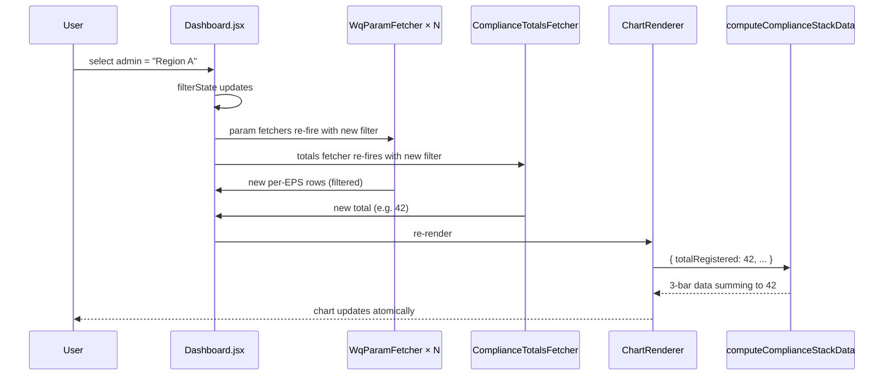

# Compliance chart `_no_info` bucket — Design

Frontend wiring, compute helper signature change, fetcher fan-out, edge cases, sequence diagrams, and test plan for the third "No information available" X-axis category on `chart_drinking_water_compliance`.

For the locked requirements this design satisfies, see [requirements.md](./requirements.md). For the rationale behind each choice, see [README.md](./README.md). For the broader API-driven `_no_info` work this builds on, see the [parent design](../no-available-info-in-vis-values-api/design.md).

---

## Architecture overview

```mermaid
flowchart LR
  subgraph CFG [Dashboard JSON]
    ROOT[parent_form_id at root]
    CHART[chart_drinking_water_compliance<br/>include_unanswered: true]
    PARAMS[param_e_coli ... param_salinity<br/>chart_type: histogram]
  end
  subgraph FE [Frontend Dashboard]
    DASH[Dashboard.jsx]
    WQ[WqParamFetcher × N]
    TOT[ComplianceTotalsFetcher × 1]
    CR[ChartRenderer]
    CC[compute/compliance.js<br/>computeComplianceStackData]
    UT[ui-text.js<br/>noInformationAvailable]
  end

  ROOT -->|config.parent_form_id| DASH
  CFG -->|item.params_ref[]| DASH
  CFG -->|item.include_unanswered| DASH
  DASH --> WQ
  DASH -->|parentFormId prop| TOT
  WQ -->|paramId → /values| BE[/api/v1/visualization/values/]
  TOT -->|form_id → /values count| BE
  WQ -->|complianceResponses[paramId]| DASH
  TOT -->|compliance_totals[chartId]| DASH
  DASH -->|computeResponses| CR
  CR -->|parameters, responsesByKey, options.totalRegistered| CC
  CR -->|noInfoLabel| UT
  CC -->|3-row data| CR
```

**Surgical change**: one new fetcher type that consumes the dashboard root's existing `parent_form_id`, one new key under `computeResponses`, one extended signature on the compute helper, one extra read in ChartRenderer's compliance branch, one explicit JSON-config flip per dashboard (just `include_unanswered: true` + a color-array entry). Zero backend changes. Zero new config keys per chart.

**Dashboard-agnostic by design.** The wiring discovers eligible charts via `collectByCompute(config.items, "compliance")` (the same helper already used by the existing param fan-out at [`Dashboard.jsx:189`](../../../frontend/src/pages/dashboard/Dashboard.jsx#L189)) and reads each dashboard's own `config.parent_form_id`. Any dashboard whose root sets `parent_form_id` and whose chart sets `include_unanswered: true` inherits the third bar — no per-dashboard code path, no hardcoded chart ids. Today there are two such charts (EPS Overview and RWS Overview); a third dashboard adopting the same pattern is a JSON-only change.

---

## Frontend

### Compute helper — `compute/compliance.js`

Extend [`computeComplianceStackData()`](../../../frontend/src/components/dashboard/compute/compliance.js) with an optional 3rd arg:

```js
/**
 * @param {Array<object>} parameters
 * @param {Object<string,object>} responsesByKey
 * @param {object} [options]
 * @param {number} [options.totalRegistered]  Universe size for the gap calc.
 * @param {string} [options.noInfoLabel]      Translated label for the new row.
 *                                            Defaults to "No information available".
 * @returns {{ data, stackLabels, yesCount, noCount, noInfoCount }}
 */
export const computeComplianceStackData = (
  parameters,
  responsesByKey,
  options = {},
) => {
  const activeParams = (parameters || []).filter((p) => !p.hide);
  const byEps = buildByEps(activeParams, responsesByKey);

  const yesRow = { compliance: "Yes", Compliant: 0 };
  const noRow = { compliance: "No" };
  activeParams.forEach((p) => {
    noRow[p.label] = 0;
  });

  let yesCount = 0;
  let noCount = 0;
  Object.values(byEps).forEach((eps) => {
    const failed = activeParams.filter((p) => fails(p.threshold, eps[p.key]));
    if (failed.length === 0) {
      yesRow.Compliant += 1;
      yesCount += 1;
    } else {
      failed.forEach((p) => {
        noRow[p.label] += 1;
      });
      noCount += 1;
    }
  });

  const data = [yesRow, noRow];
  const stackLabels = ["Compliant", ...activeParams.map((p) => p.label)];

  let noInfoCount = 0;
  if (typeof options.totalRegistered === "number") {
    noInfoCount = Math.max(
      0,
      options.totalRegistered - yesCount - noCount,
    );
    if (noInfoCount > 0) {
      const label = options.noInfoLabel || "No information available";
      data.push({ compliance: label, [label]: noInfoCount });
      stackLabels.push(label);
    }
  }

  return { data, stackLabels, yesCount, noCount, noInfoCount };
};
```

Notes:

- Existing 2-arg callers behave identically (NFR-1).
- `getCompliantCount()` is **not** changed — the KPI / table reuse it through the existing 2-arg path.
- Returning `noInfoCount` lets future consumers (e.g., a "Data quality" KPI) reuse the calc if needed.

### Dashboard fan-out — `Dashboard.jsx`

Add a new fetcher beside `WqParamFetcher` at [`Dashboard.jsx:26`](../../../frontend/src/pages/dashboard/Dashboard.jsx#L26):

```jsx
/**
 * Invisible totals fetcher for compute=compliance charts that opt into
 * include_unanswered. Fetches the parent-form count via /values (same
 * shape as kpi_total_registered) using the dashboard root's
 * parent_form_id, and reports the scalar back via onData.
 */
const ComplianceTotalsFetcher = ({
  chartId,
  parentFormId,
  filterState,
  fiscalYearStartMonth,
  customFilterDefs,
  onData,
}) => {
  const totalsApi = useMemo(
    () => ({ form_id: parentFormId }),
    [parentFormId],
  );
  const { data } = useDashboardValues(totalsApi, filterState, {
    fiscalYearStartMonth,
    customFilterDefs,
  });
  useEffect(() => {
    if (data) {
      const total = data?.data?.[0]?.value;
      if (typeof total === "number") {
        onData(chartId, total);
      }
    }
  }, [data, chartId, onData]);
  return null;
};
```

Collect the chart items needing totals. Skip charts whose dashboard has no `parent_form_id` and emit a one-time warning (FR-4):

```js
const complianceTotalsItems = useMemo(() => {
  if (!config) {
    return [];
  }
  const matches = collectByCompute(config.items, "compliance").filter(
    (item) => item.include_unanswered === true,
  );
  if (matches.length > 0 && !config.parent_form_id) {
    console.error(
      "compliance chart has include_unanswered=true but dashboard " +
        "config is missing parent_form_id; falling back to two-bar render",
    );
    return [];
  }
  return matches;
}, [config]);

const [complianceTotals, setComplianceTotals] = useState({});
const onComplianceTotalData = useCallback((id, total) => {
  setComplianceTotals((prev) =>
    prev[id] === total ? prev : { ...prev, [id]: total },
  );
}, []);
```

Render the fetchers next to the existing `WqParamFetcher` block:

```jsx
{complianceTotalsItems.map((chartItem) => (
  <ComplianceTotalsFetcher
    key={chartItem.id}
    chartId={chartItem.id}
    parentFormId={config.parent_form_id}
    filterState={filterState}
    fiscalYearStartMonth={fiscalYearStartMonth}
    customFilterDefs={customFilterDefs}
    onData={onComplianceTotalData}
  />
))}
```

Merge into the unified `computeResponses` so it reaches `ChartRenderer` through the existing channel:

```js
const computeResponses = useMemo(
  () => ({
    compliance: complianceResponses,
    compliance_totals: complianceTotals,        // ← new
    cross_tab: crossTabByItem,
    accessibility_bucket: accessibilityBucketByItem,
    kpi_stack: kpiStackByItem,
    accessibility_no_issues_kpi: accessibilityNoIssuesKpiByItem,
  }),
  [
    complianceResponses,
    complianceTotals,                            // ← new dep
    crossTabByItem,
    accessibilityBucketByItem,
    kpiStackByItem,
    accessibilityNoIssuesKpiByItem,
  ],
);
```

Storing under a new sibling key (`compliance_totals`) instead of nesting inside `complianceResponses` keeps the existing `complianceResponses[id]` shape pristine for back-compat consumers (`KPICard`, `criticalIssuesByEps`).

> **Why no per-chart `total_api`?** The dashboard root already declares `parent_form_id` (used for purposes like seeding mobile config and for `kpi_total_registered`'s default fetch). Adding a chart-level `total_api: { form_id: <parent> }` block would duplicate the same value in three places (root, KPI api, chart). Drift between them would silently break reconciliation. If a future chart ever needs a different universe form, an opt-in override (`item.total_api ?? { form_id: config.parent_form_id }`) is a one-line addition then.

### Chart wiring — `ChartRenderer.jsx`

In the `item.compute === "compliance"` branch at [`ChartRenderer.jsx:506`](../../../frontend/src/components/dashboard/ChartRenderer.jsx#L506), pass `totalRegistered` and the i18n label:

```jsx
if (item.compute === "compliance") {
  const responsesByKey = {};
  complianceParams.forEach((p) => {
    const resp = complianceResponses?.[p.id];
    if (resp) {
      responsesByKey[p.id] = resp;
    }
  });
  const normalised = complianceParams.map((p) => ({ ...p, key: p.id }));

  const totalRegistered =
    item.include_unanswered === true
      ? computeResponses?.compliance_totals?.[item.id]
      : undefined;

  return computeComplianceStackData(normalised, responsesByKey, {
    totalRegistered,
    noInfoLabel: uiText.en.noInformationAvailable,
  }).data;
}
```

`uiText` is the same translation map [`KPICard`](../../../frontend/src/components/dashboard/widgets/KPICard.jsx) and other widgets already consume.

### i18n — `ui-text.js`

If the [parent `_no_info` design](../no-available-info-in-vis-values-api/design.md#ui-textjs) hasn't landed yet, add the key in [`frontend/src/lib/ui-text.js`](../../../frontend/src/lib/ui-text.js):

```diff
   // Charts
   showEmpty: "Show empty values",
+  noInformationAvailable: "No information available",
```

If it has, this spec is a no-op for `ui-text.js`.

### Dashboard JSON config — generic two-line edit

The same dashboard-agnostic two-line diff applies to every `compute: "compliance"` chart that opts in. Apply to `chart_drinking_water_compliance` in **both** dashboards in this PR:

| File | Chart line | Dashboard `parent_form_id` |
|---|---|---|
| [`1749623934933.json`](../../../frontend/src/config/visualizations/1749623934933.json#L300) (EPS Overview) | 300 | 1749623934933 |
| [`1749621221728.json`](../../../frontend/src/config/visualizations/1749621221728.json#L538) (RWS Overview) | 538 | 1749621221728 |

The diff (identical for both):

```diff
 {
   "id": "chart_drinking_water_compliance",
   "chart_type": "stack_bar",
   ...
   "config": {
     "title": "Drinking Water Compliance",
     ...
     "color": [
       "#64A73B",
       "#e41a1c",
       "#ff7f00",
       "#984ea3",
       "#377eb8",
       "#a65628",
       "#f781bf",
       "#999999",
-      "#cccccc"
+      "#cccccc",
+      "#bfbfbf"
     ]
   },
   "compute": "compliance",
+  "include_unanswered": true,
   "params_ref": [...],
   "globals_ref": "wq_globals"
 }
```

Two-line edit per chart, no new per-chart config block. Each dashboard's universe `form_id` is sourced from its own root `parent_form_id` field (the same form `kpi_total_registered`-style cards already count for that dashboard). A future dashboard adopting the same pattern needs only the same two lines plus a root `parent_form_id` — no code change.

---

## Edge cases

| Case | Handling |
|---|---|
| `include_unanswered` absent / false | `totalRegistered` is `undefined`; compute helper returns 2-row data unchanged |
| `parent_form_id` missing from dashboard root while flag is true | `complianceTotalsItems` is empty; one-time `console.error`; helper falls through to 2-row mode |
| Universe fetch in flight | `complianceTotals[item.id]` is `undefined` until resolution; chart renders 2 rows, then re-renders with 3 rows once total arrives — same loading semantics the existing param fetchers already exhibit |
| Universe fetch errors | `useDashboardValues` swallows fetch errors and returns `{ data: undefined }`; `onData` never fires; chart stays at 2 rows; failure visible in network tab |
| `totalRegistered < yesCount + noCount` | Clamped to 0 via `Math.max(0, …)`; degrades to 2 visible rows even though signature returns 3 conceptually — handled by FR-5 ("omit row when count = 0") |
| `noInfoCount === 0` exactly | Third row not pushed (FR-5); `stackLabels` stays at param labels only |
| Filter narrows universe to 0 EPS | Both fetches return 0; helper returns `[Yes:0, No:0]`; existing "all-zero → no-data placeholder" path in ChartRenderer fires unchanged |
| `config.color` array shorter than `stackLabels.length` | ECharts wraps colors. We append `#bfbfbf` defensively in the JSON edit so palette resolution stays predictable |
| Dashboard mounts twice quickly (e.g., HMR) | `complianceTotals` is keyed by `item.id`; later resolution overwrites earlier; no leak |
| Multiple compliance charts on one dashboard | `complianceTotalsItems` finds them all; each has its own `__totals__[id]` slot; no cross-talk |

---

## Sequence diagrams

### Initial render (chart with `include_unanswered: true`)

```mermaid
sequenceDiagram
  participant U as User
  participant D as Dashboard.jsx
  participant WQ as WqParamFetcher × N
  participant TF as ComplianceTotalsFetcher
  participant API as /api/v1/visualization/values
  participant CR as ChartRenderer
  participant CC as computeComplianceStackData

  U->>D: open EPS Overview dashboard
  D->>WQ: render N invisible fetchers (one per param)
  D->>TF: render 1 invisible fetcher; pass config.parent_form_id
  WQ->>API: GET /values?form_id=monitoring&question_id=eColi&group_by=parent_id
  TF->>API: GET /values?form_id=parent_form_id  (count mode)
  API-->>WQ: per-EPS rows for each parameter
  API-->>TF: { data: [{ value: 105 }] }
  WQ->>D: complianceResponses[paramId] = response
  TF->>D: complianceTotals[chartId] = 105
  D->>CR: computeResponses (compliance + compliance_totals)
  CR->>CC: parameters, responsesByKey, { totalRegistered: 105, noInfoLabel }
  CC-->>CR: data: [Yes:7, No:17, "No information available":81]
  CR-->>U: render 3-bar stacked chart
```

### Filter applied



---

## Test plan

### Unit (Jest) — `compute/compliance.test.js`

Add to the existing test file beside [`computeComplianceStackData`](../../../frontend/src/components/dashboard/compute/compliance.js)'s current cases:

| Test | Setup | Assertion |
|---|---|---|
| `existing 2-arg signature unchanged` | call without `options` | identical output to today |
| `appends third row when totalRegistered exceeds yes+no` | totalRegistered=105, yes=7, no=17 | `data.length === 3`; row 3 is `{ compliance: "No information available", "No information available": 81 }`; `stackLabels` ends with `"No information available"`; returned `noInfoCount === 81` |
| `omits third row when totalRegistered equals yes+no` | totalRegistered=24, yes=7, no=17 | `data.length === 2`; `stackLabels` unchanged; `noInfoCount === 0` |
| `clamps to zero when totalRegistered less than yes+no` | totalRegistered=10, yes=7, no=17 | `data.length === 2`; `noInfoCount === 0` (no negative bar) |
| `respects custom noInfoLabel` | options.noInfoLabel="Sin información" | row 3's `compliance` field and series key are both `"Sin información"` |
| `does nothing when totalRegistered is undefined` | options={} | `data.length === 2`; `noInfoCount === 0`; `"No information available"` not in stackLabels |
| `does nothing when totalRegistered is non-number` | options.totalRegistered=null | identical to undefined |

### Component (RTL) — `ChartRenderer.test.js`

Extend the existing compliance-chart fixture:

- Renders three X-axis tick labels when `include_unanswered: true` and totals available.
- Renders two when totals fetch hasn't resolved yet (totals key absent in `computeResponses.compliance_totals`).
- Falls back to two when dashboard root's `parent_form_id` is missing while the flag is true (and emits one `console.error`).
- Color array of length 10 covers all stacks (smoke-check no console warning about palette overflow).

### Dashboard fetcher — `Dashboard.test.jsx`

If a Dashboard-level test fixture exists, extend it. Otherwise rely on the unit + component tests.

### Manual smoke

1. `./dc.sh up -d` and seed demo data (or the dataset that produced the screenshot showing 105 EPS / Yes 7 / No 17).
2. Visit the EPS Overview dashboard.
3. Confirm "Drinking Water Compliance" shows three bars: `Yes (7)`, `No (17)`, `No information available (81)`.
4. Hover the gray bar — tooltip reads "No information available: 81" (or the configured tooltip formatter's equivalent).
5. Confirm `7 + 17 + 81 === 105` matches the `kpi_total_registered` tile above.
6. Apply an administration filter; confirm the three counts shrink and still sum to the new KPI value.
7. Open DevTools → Network; on dashboard load, see one `/values` call with `form_id=1749623934933` (the universe fetch, derived from `config.parent_form_id`) alongside the existing param fetches.
8. Set `include_unanswered: false` (or remove it) in the JSON and reload — chart returns to two bars; confirm the totals call is no longer fired.

### Regression

```bash
cd frontend && npm run lint && npm run prettier
./dc.sh exec -T frontend npx jest --runInBand src/components/dashboard
```

All existing Jest cases (compliance helper, ChartRenderer, KPICard) must pass without modification (NFR-1).

---

## Risk register

| Risk | Likelihood | Impact | Mitigation |
|---|---|---|---|
| Stakeholder surprise at the chart "growing" a third large gray bar | Medium | Low | Note in PR body + dashboard release notes; this is the **correct** number, just newly visible |
| Universe fetch silently fails in production (CORS, auth, 500) | Low | Low | Chart degrades to two bars (existing behavior); error surfaces in network tab + Sentry per existing fetch error path |
| Race between param fetches and universe fetch causes visible flicker | Low | Low | The clamp formula prevents negative bars; intermediate render is correct (two bars) — this matches today's loading pattern for the param fetchers themselves |
| A future dashboard sets `include_unanswered: true` but forgets `parent_form_id` at root | Medium | Low | One-time `console.error` at config read time + automatic fallback to two-bar render; misconfig discoverable in DevTools |
| ECharts color array overflow if `config.color` is shorter than 10 | Low | Low | The JSON edit explicitly appends `#bfbfbf` as the 10th entry |
| Mobile seeder / SQLite generation reads visualization configs and chokes on the new key | Low | Medium | Verify [`generate_sqlite`](../../../backend/api/v1/v1_files/) command parses unknown JSON keys gracefully (it should — `include_unanswered` is a frontend-only field) |

---

## Implementation plan summary

Phased so the PR can land in one merge with clean commit boundaries:

1. **Compute helper + tests** — extend `compute/compliance.js`, add Jest cases. Pure-function change; safest first commit.
2. **i18n** — add `noInformationAvailable` to `ui-text.js` (skip if parent design landed first).
3. **Dashboard fan-out** — add `ComplianceTotalsFetcher`, wire into `complianceTotals` state and unified `computeResponses`.
4. **ChartRenderer pass-through** — read `compliance_totals[item.id]`, pass to compute helper with translated label.
5. **JSON config flip** — add `include_unanswered: true` and append `#bfbfbf` to color array (two-line edit; no new config block).
6. **Manual smoke + screenshot** in PR description.

For the line-by-line execution checklist (file paths, exact diffs, commit messages, smoke-test steps, rollback recipe), see [implementation-plan.md](./implementation-plan.md).
