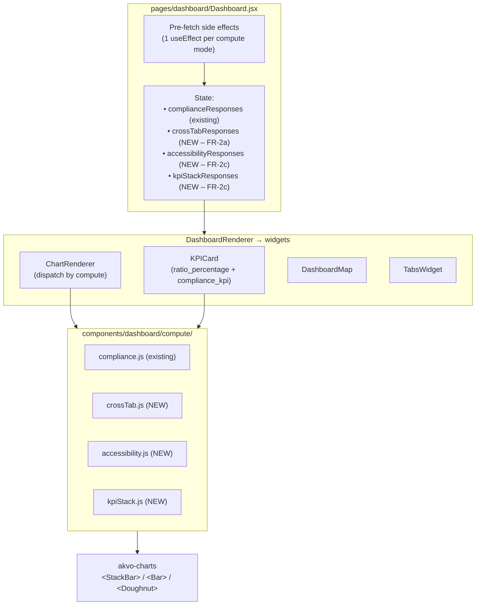
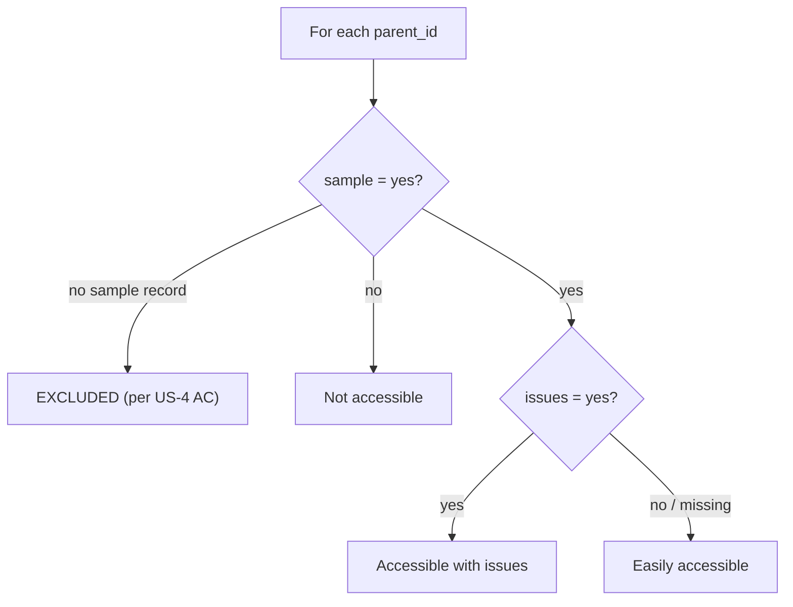
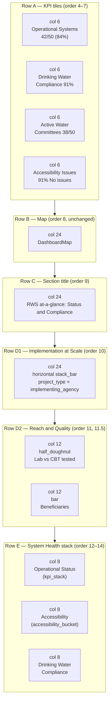
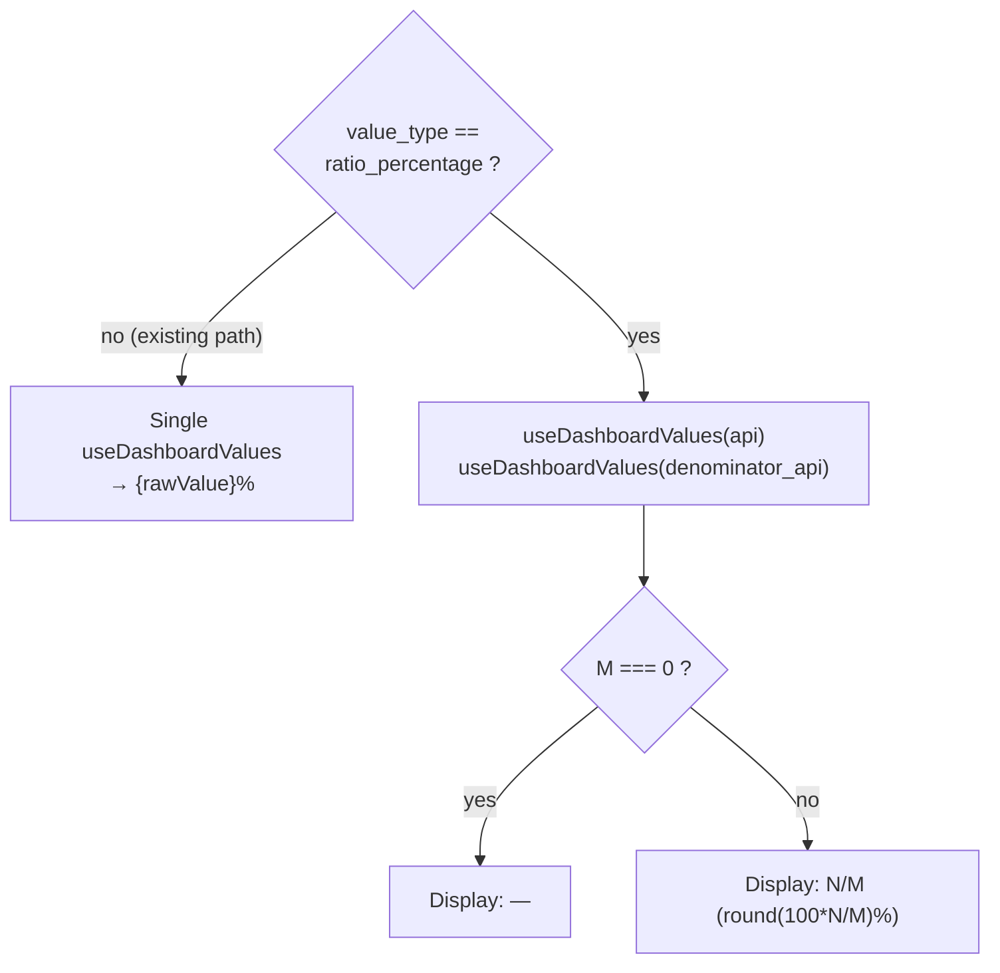
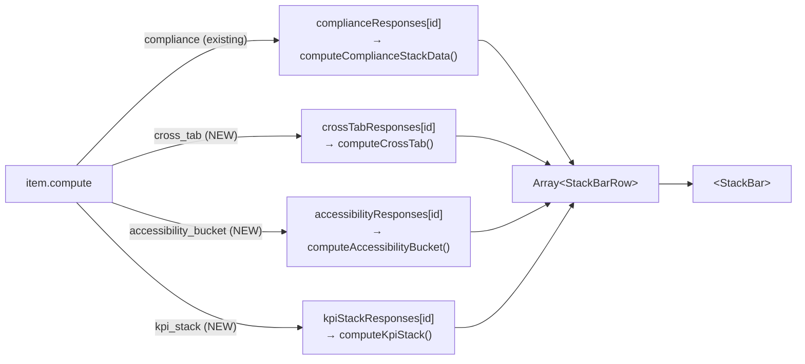

# RWS Dashboard Redesign — Design Specification v1.0

> Source requirements: [requirements.md](./requirements.md)
> Target config: [frontend/src/config/visualizations/1749621221728.json](../../../frontend/src/config/visualizations/1749621221728.json)
> Produced via `/sc:design`. Next step: `/sc:implement`.

## 0. Design Principles (from NFRs)

1. **Additive schema only** — no field rename/removal; EPS dashboard (1749623934933.json) stays untouched.
2. **Reuse the existing compute-and-join pattern** — model cross-form aggregations after the proven `compute: "compliance"` fan-out at [Dashboard.jsx:105-237](../../../frontend/src/pages/dashboard/Dashboard.jsx#L105-L237).
3. **Zero new backend endpoints** — only call `/visualization/values` with existing params; all cross-form joins happen client-side by `parent_id`.
4. **Renderer already supports `half_doughnut`** (ChartRenderer.jsx:12-18) — FR-2b half-doughnut is a config-only change.
5. **Single source of truth for compliance** — the FR-1 "Drinking Water Compliance" KPI and the FR-2c compliance column must share the same classification function (`computeComplianceStackData`).

## 1. Architectural Overview



**Pattern**: every cross-form widget follows the *compliance* template — parent `<Dashboard>` pre-fetches into a `*Responses` map, passes it as a prop, child `<ChartRenderer>` computes synchronously from the map.

## 2. Schema Extensions (additive)

All new fields are **optional**. Existing configs render unchanged.

### 2.1 `card` item — ratio KPI

Adds an optional `denominator_api` block and a new `value_type: "ratio_percentage"`.

```json
{
  "id": "kpi_operational_systems",
  "chart_type": "card",
  "order": 4,
  "col_span": 6,
  "label": "Operational Systems",
  "color": "#1890ff",
  "api": {
    "form_id": 1749631041125,
    "question_id": 1749631041155,
    "option_value": "operational",
    "monitoring": "latest",
    "sum_by": "parent_id",
    "value_type": "ratio_percentage"
  },
  "denominator_api": {
    "form_id": 1749621221728
  }
}
```

Renderer (KPICard.jsx) change:
- If `value_type === "ratio_percentage"`, run `useDashboardValues(denominator_api, …)` alongside `api`; display formatted as `"<N>/<M> (<P>%)"` with safe divide (display `"—"` when `M === 0`).

### 2.2 `stack_bar` item — cross-tab compute (FR-2a)

```json
{
  "id": "chart_implementation_at_scale",
  "chart_type": "stack_bar",
  "order": 10,
  "col_span": 24,
  "config": {
    "title": "Implementation at Scale",
    "xAxisLabel": "Number of RWS",
    "yAxisLabel": "Project type"
  },
  "compute": "cross_tab",
  "orientation": "horizontal",
  "category_api": {
    "form_id": 1749621962296,
    "question_id": 1749621851234,
    "monitoring": "latest",
    "sum_by": "parent_id"
  },
  "series_api": {
    "form_id": 1749621221728,
    "question_id": 1749622571775
  }
}
```

`category_api` returns `[{parent_id, label: <project_type option value>}, …]` (per-parent, latest). `series_api` returns `[{parent_id, label: <agency>}, …]` (multi-option → multiple rows per parent allowed). Client-side join by `parent_id`.

### 2.3 `stack_bar` item — accessibility_bucket compute (FR-2c column 2)

```json
{
  "id": "chart_accessibility_bucket",
  "chart_type": "stack_bar",
  "order": 13,
  "col_span": 8,
  "config": {
    "title": "Accessibility",
    "yAxisLabel": "RWS count"
  },
  "compute": "accessibility_bucket",
  "sample_api": {
    "form_id": 1749621962296,
    "question_id": 1749622785185,
    "monitoring": "latest",
    "sum_by": "parent_id"
  },
  "issues_api": {
    "form_id": 1749631041125,
    "question_id": 1749631041156,
    "monitoring": "latest",
    "sum_by": "parent_id"
  },
  "labels": {
    "easily_accessible": "Easily accessible",
    "accessible_with_issues": "Accessible with issues",
    "not_accessible": "Not accessible"
  }
}
```

Client-side bucketing per parent (A.2 rule):



Output shape: a **single-column** stack_bar (1 row, 3 fields) sized for col_span 8.

### 2.4 `stack_bar` item — kpi_stack compute (FR-2c column 1)

Two independent metrics rendered as one stacked column.

```json
{
  "id": "chart_operational_status_stack",
  "chart_type": "stack_bar",
  "order": 12,
  "col_span": 8,
  "config": { "title": "Operational Status", "yAxisLabel": "RWS count" },
  "compute": "kpi_stack",
  "segments": [
    {
      "key": "operational",
      "label": "Operational",
      "color": "#3C3CFF",
      "api": {
        "form_id": 1749631041125,
        "question_id": 1749631041155,
        "option_value": "operational",
        "monitoring": "latest",
        "sum_by": "parent_id"
      }
    },
    {
      "key": "issues",
      "label": "Issues with the system",
      "color": "#1AB99F",
      "api": {
        "form_id": 1749631041125,
        "question_id": 1749631041156,
        "option_value": "yes",
        "monitoring": "latest",
        "sum_by": "parent_id"
      }
    }
  ]
}
```

These are **independent measures** (B locked) — stack height may exceed 100%. Tooltip formatter must use `"{label}: {value} RWS"` (no "of" phrasing) to make the independence explicit.

### 2.5 Existing `stack_bar` with `compute: "compliance"` — reused verbatim

The existing `chart_drinking_water_compliance` definition is lifted into FR-2c column 3 with `col_span` changed 12 → 8. No new compute.

### 2.6 `doughnut` → `half_doughnut` (FR-2b)

No schema change — flip `chart_type` from `doughnut` to `half_doughnut`. The renderer already branches at ChartRenderer.jsx:514.

## 3. Layout Plan (Ant Design 24-col grid)



**Reach and Quality composition** — since the flat schema has no generic "group" container, Reach & Quality becomes two sibling items at `col_span 12` each on Row D2 (sibling row, not adjacent column). Design trade-off accepted to avoid introducing a new container primitive.

## 4. JSON Patch for `1749621221728.json`

Replaces items at `order: 4, 5, 6, 7, 9, 10, 11, 12, 13, 14` (10 items deleted; 8 new added). Item `8` (map) stays. See [config-patch.json](./config-patch.json) for the full replacement array.

Summary of the new item set (all at root level, siblings of filters/map/tabs):

| order | id | chart_type | compute | col_span |
|---|---|---|---|---|
| 4 | `kpi_operational_systems` | card | — (ratio_percentage) | 6 |
| 5 | `kpi_drinking_water_compliance` | card | compliance_kpi | 6 |
| 6 | `kpi_active_water_committees` | card | — (ratio_percentage) | 6 |
| 7 | `kpi_accessibility_no_issues` | card | accessibility_no_issues_kpi | 6 |
| 8 | `map_main` | map | — | 24 (unchanged) |
| 9 | `title_status_compliance` | section_title | — | 24 (text unchanged) |
| 10 | `chart_implementation_at_scale` | stack_bar | cross_tab | 24 |
| 11 | `chart_test_method_half` | half_doughnut | — | 12 |
| 11.5 | `chart_beneficiaries` | bar | — | 12 |
| 12 | `chart_operational_status_stack` | stack_bar | kpi_stack | 8 |
| 13 | `chart_accessibility_bucket` | stack_bar | accessibility_bucket | 8 |
| 14 | `chart_drinking_water_compliance` | stack_bar | compliance (existing) | 8 |

## 5. Renderer Changes

### 5.1 `widgets/KPICard.jsx` — ratio variant



Render inside the same `<Statistic>` wrapper. Keeps `item.color` behavior.

### 5.2 `ChartRenderer.jsx` — dispatch 3 new compute modes



The three compute modules live in `components/dashboard/compute/`:
- `crossTab.js` → `computeCrossTab(responses) → Array<StackBarRow>`
- `accessibility.js` → `computeAccessibilityBucket(responses, labels) → Array<StackBarRow>`
- `kpiStack.js` → `computeKpiStack(segments, responses) → Array<StackBarRow>`

### 5.3 `DashboardRenderer.jsx` — prop forwarding

Accept and forward three new props (mirrors the existing `complianceResponses` pass-through):
- `crossTabResponses`
- `accessibilityResponses`
- `kpiStackResponses`

### 5.4 `pages/dashboard/Dashboard.jsx` — pre-fetch side effects

For each visible item with one of the 3 new computes, fire the appropriate `fetchVisualizationValues(api)` calls in parallel and assemble the response map in local state. This extends the existing `complianceResponses` pattern at Dashboard.jsx:169.

Pseudocode:

```
useEffect(() => {
  const crossTabItems = collect(items, i => i.compute === "cross_tab")
  crossTabItems.forEach(async (item) => {
    const [cat, ser] = await Promise.all([
      fetchValues(expand(item.category_api)),
      fetchValues(expand(item.series_api)),
    ])
    setCrossTabResponses(prev => ({ ...prev, [item.id]: {category: cat, series: ser} }))
  })
}, [items, filterState])
```

Repeat for `accessibility_bucket` (two fetches) and `kpi_stack` (N fetches per segment). Each side-effect block is an independent `useEffect` keyed on `filterState`.

### 5.5 New compute modules — contracts

**`compute/crossTab.js`**
```
computeCrossTab({ category: {data:[{group, label}]}, series: {data:[{group, label}]} })
  → [{category: "<cat_label>", "<ser_label_1>": N1, "<ser_label_2>": N2, ...}]

Join key: row.group == parent_id.
Multi-option series: a parent can appear multiple times with different labels;
each (parent, series_label) increments the (cat_label, ser_label) cell by 1.
```

**`compute/accessibility.js`**
```
computeAccessibilityBucket({ sample, issues }, labels)
  → [{
      "category": "Accessibility",
      "<labels.easily_accessible>": N1,
      "<labels.accessible_with_issues>": N2,
      "<labels.not_accessible>": N3,
    }]
```
Per-parent derivation follows the A.2 decision tree in §2.3.

**`compute/kpiStack.js`**
```
computeKpiStack(segments, responses)
  → [{
      "category": item.config.title,
      "<segments[0].label>": responses[segments[0].key].data[0].value ?? 0,
      "<segments[1].label>": responses[segments[1].key].data[0].value ?? 0,
    }]
```

### 5.6 Compliance KPI (FR-1 card 2) — reuses existing compute

The ratio KPI's numerator is `M − nonCompliantCount`. Computed not via a direct backend call but by running `computeComplianceStackData` over the same `complianceResponses` map Dashboard.jsx already builds. A shared helper `getCompliantCount(responses, params)` exposes the existing `yesCount` return value.

The ratio KPI config uses `compute: "compliance_kpi"`:

```json
{
  "id": "kpi_drinking_water_compliance",
  "chart_type": "card",
  "order": 5,
  "col_span": 6,
  "label": "Drinking Water Compliance",
  "color": "#64A73B",
  "compute": "compliance_kpi",
  "params_ref": [
    "param_e_coli", "param_total_coliform", "param_fecal_coliform",
    "param_turbidity", "param_temperature", "param_ph",
    "param_conductivity", "param_salinity"
  ],
  "globals_ref": "wq_globals",
  "denominator_api": { "form_id": 1749621221728 }
}
```

## 6. Data-Flow Sequence (cross-form join: Implementation at Scale)

```mermaid
sequenceDiagram
    autonumber
    actor User
    participant Dash as Dashboard.jsx
    participant Hook as useEffect(cross_tab)
    participant API as /visualization/values
    participant CR as ChartRenderer
    participant Compute as computeCrossTab
    participant Chart as &lt;StackBar&gt;

    User->>Dash: navigates /dashboard/rws-overview
    Dash->>Hook: items + filterState change
    par fetch both APIs in parallel
        Hook->>API: GET category_api (form 1749621962296, q 1749621851234)
        API-->>Hook: [{group: 42, label: "borehole"}, ...]
    and
        Hook->>API: GET series_api (form 1749621221728, q 1749622571775)
        API-->>Hook: [{group: 42, label: "water_authority_of_fiji"}, {group: 42, label: "rotary_pacific"}, ...]
    end
    Hook->>Dash: setCrossTabResponses({[id]: {category, series}})
    Dash->>CR: props include crossTabResponses
    CR->>Compute: {category, series}
    Compute-->>CR: [{category:"surface_water_project","WAF":17,...},...]
    CR->>Chart: render horizontal stack
    Chart-->>User: visible bars
    Note over User,Dash: User changes filter → re-run useEffect → re-fetch → re-compute
```

## 7. Validation

### 7.1 Feasibility

| FR | Primitive needed | Renderer state |
|---|---|---|
| FR-1 | 2 fetches per card; formatter | **New** (`value_type: "ratio_percentage"`) |
| FR-1 / compliance KPI | reuse complianceResponses + helper | **No new fetch** |
| FR-2a | 2 fetches + client join | **New compute**: `cross_tab` |
| FR-2b / half-doughnut | config only | **Already exists** |
| FR-2b / beneficiaries | single-fetch bar | **Already exists** (`group_by: "option"`) |
| FR-2c / Operational Status | N=2 KPI-fetches + assemble | **New compute**: `kpi_stack` |
| FR-2c / Accessibility | 2 fetches + client join | **New compute**: `accessibility_bucket` |
| FR-2c / Drinking Water Compliance | reuse existing | **No change** |

All within 4 compute modules + 1 KPICard variant + 1 shared-helper refactor.

### 7.2 Backwards compatibility

- EPS dashboard (`1749623934933.json`) uses none of the new fields — renders identically.
- `value_type: "percentage"` continues to work (distinct from new `"ratio_percentage"`).
- `chart_type: "doughnut"` continues to work (distinct from existing `"half_doughnut"`).
- All new `compute` modes are opt-in; existing `compute: "compliance"` unchanged.

### 7.3 Failure modes

| Scenario | Behavior |
|---|---|
| `M === 0` on ratio KPI | Display `"—"` (no div-by-zero) |
| One of two cross-form fetches fails | Widget shows `<Alert>` with error; others still render |
| Parent has series row but no category row | Dropped from cross-tab (no inferred category) |
| Parent has category row but no series row | Counts under category with no series segment (omit, per existing compliance-chart behaviour) |
| Beneficiaries empty response | `<ChartRenderer>` "No data" placeholder |

### 7.4 Scale note (R-1 deferred)

Frontend join performs `O(N_parents × N_series_rows)` per widget. For the current RWS footprint (<500 registered projects), this is <5k rows of tallying — well within a single-render budget. Revisit with a backend endpoint past ~2k parents.

## 8. Test Plan (for `/sc:implement` handoff)

### 8.1 Unit tests

- `compute/crossTab.test.js` — correct tally for (1 parent, N categories, M series); multi-option row explosion; missing-parent cases.
- `compute/accessibility.test.js` — all 4 A.2 bucket cases; missing-parent exclusion; label mapping.
- `compute/kpiStack.test.js` — independent measure rendering; missing-segment → 0; N=2 and N=3 segment cases.
- `widgets/KPICard.test.js` — ratio format; `M === 0` → "—"; color pass-through; `compute: "compliance_kpi"` pathway.

### 8.2 Integration (Dashboard.jsx)

- Mock `/visualization/values` with fixtures matching the 3 new compute modes.
- Assert that each `*Responses` state object eventually contains keys for every item requiring it.
- Assert re-fetch fires when `filterState` changes.

### 8.3 E2E acceptance (maps to US-1..US-5)

| US | Assertion |
|---|---|
| US-1 | 4 KPI tiles render "N/M (P%)"; filter change re-fetches |
| US-2 | Horizontal stacked bar shows 4 type bars × 8 agency segments |
| US-3 | Half-doughnut arc opens downward; Beneficiaries renders 6 bars |
| US-4 | 3-column layout at col_span 8; accessibility excludes no-sample RWS |
| US-5 | Tabs tab set unchanged; Individual Overview still disabled for anon |

### 8.4 Regression

- Run existing `frontend/src/components/dashboard/__test__/` suite — must stay green.
- Snapshot-compare `/dashboard/eps-overview` before/after — must be identical.

## 9. Locked Design Decisions

- **D-1 ✅** — Ratio KPI shape: `api.value_type: "ratio_percentage"` + sibling `denominator_api` block. Rationale: keeps KPICard simple; denominator is just a scalar count; no new compute pathway needed.
- **D-2 ✅** — Compliance KPI: `compute: "compliance_kpi"` on a `card` item, reusing the existing `complianceResponses` fan-out. Rationale: zero backend change; single source of truth with FR-2c compliance column via shared `getCompliantCount` helper.
- **D-3 ✅** — Unified `computeResponses: {[computeMode]: {[itemId]: …}}` map on DashboardRenderer props (replaces separate `complianceResponses` / `crossTabResponses` / `accessibilityResponses` / `kpiStackResponses` props). Rationale: bounded prop surface that scales as new compute modes land. Migration note: existing `complianceResponses` prop kept as a deprecated alias for one release, new compute modes go via `computeResponses` from day one.

## 10. Handoff

Ready for `/sc:implement`. Deliverables expected from implementer:

1. Schema patch applied to `1749621221728.json` (see [config-patch.json](./config-patch.json))
2. `widgets/KPICard.jsx` — ratio_percentage + compliance_kpi + accessibility_no_issues_kpi branches
3. `compute/crossTab.js` + test
4. `compute/accessibility.js` + test
5. `compute/kpiStack.js` + test
6. Extract `getCompliantCount` helper from existing compliance compute
7. `ChartRenderer.jsx` — 3 new compute dispatches
8. `DashboardRenderer.jsx` — forward new `*Responses` props
9. `Dashboard.jsx` — 3 new pre-fetch `useEffect` blocks
10. README.md update — document new schema fields
11. Regression run: `./dc.sh exec -T frontend npm test -- --watchAll=false`
