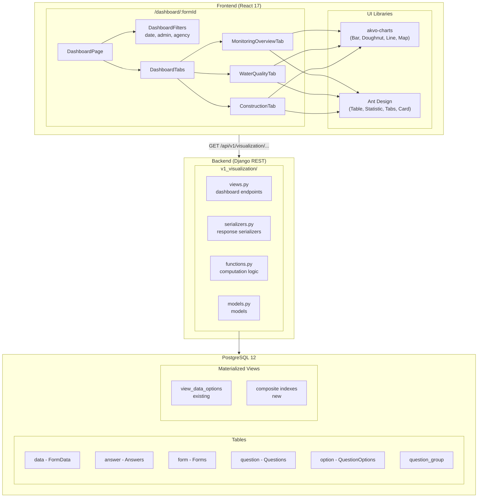
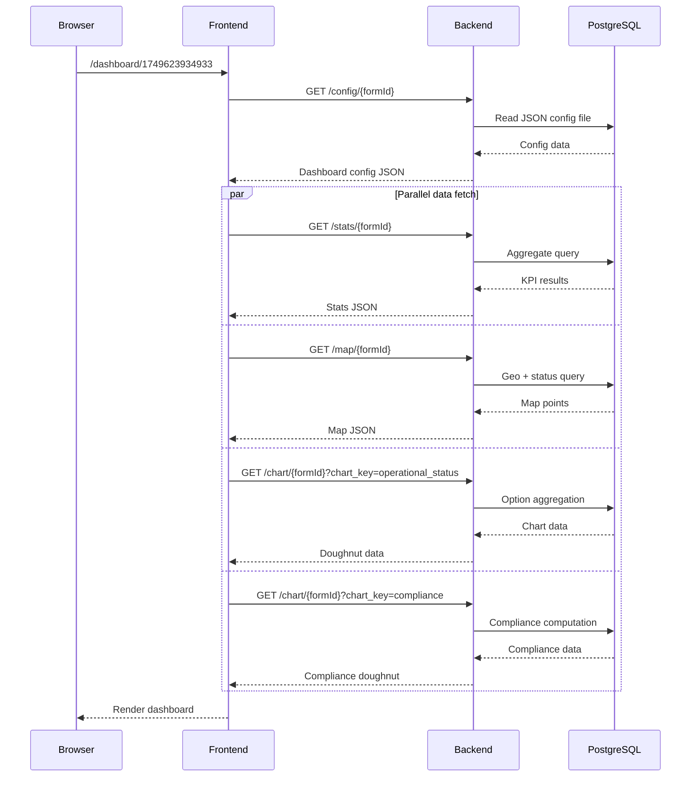
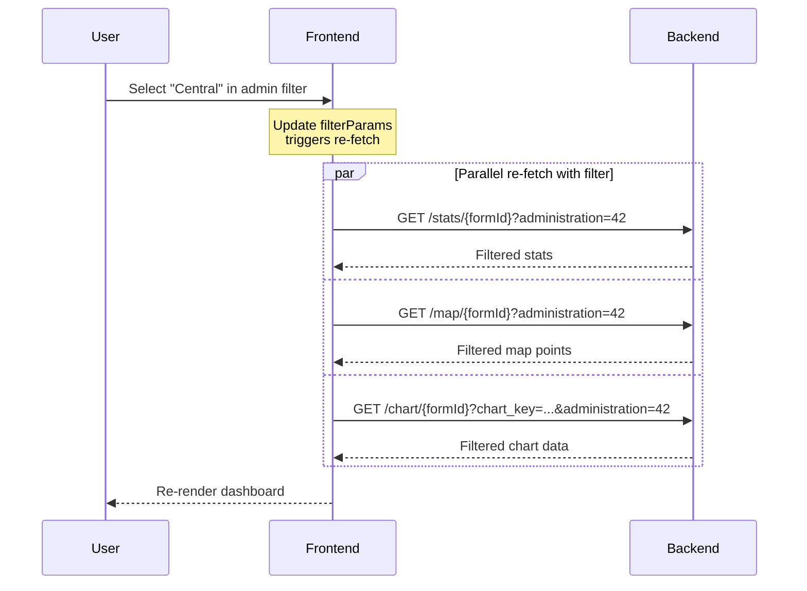

# Dashboard Visualization — Design Specification

## 1. System Architecture Overview



---

## 2. Dashboard Configuration

Rather than a new Django model (overkill for Phase 1), use **JSON config files** stored alongside form definitions. This mirrors the existing `backend/source/forms/` pattern.

### 2.1 Config File Location & Naming

```
backend/source/dashboard/
└── 1749623934933.json    # keyed by parent_form_id
```

### 2.2 Config Schema

```json
{
  "parent_form_id": 1749623934933,
  "name": "EPS Overview",
  "description": "Overview of EPS sites monitoring, water quality and construction information.",
  "tabs": [
    {
      "key": "monitoring_overview",
      "label": "Monitoring overview",
      "monitoring_form_id": 1749632545233
    },
    {
      "key": "water_quality",
      "label": "Water quality",
      "monitoring_form_id": 1749632545233
    },
    {
      "key": "construction_monitoring",
      "label": "Construction monitoring",
      "monitoring_form_id": 1749624452908
    }
  ],
  "filters": {
    "date": {
      "question_ids": [1749632545235, 1749624452911],
      "label": "Monitoring Period"
    },
    "administration": {
      "question_id": 1749624452990,
      "label": "Location"
    },
    "custom": [
      {
        "key": "implementing_agency",
        "question_id": 1749624452993,
        "label": "Implementing Agency",
        "type": "multiple_option"
      },
      {
        "key": "water_committee",
        "question_id": 1749624452105,
        "label": "Water Committee",
        "type": "option"
      }
    ]
  },
  "kpis": {
    "total_registered": {
      "label": "Total EPS registered",
      "type": "count_distinct_parent"
    },
    "under_construction": {
      "label": "Total EPS under construction",
      "type": "count_by_option",
      "question_id": 1749630516826,
      "option_value": "no",
      "monitoring_form_id": 1749624452908
    },
    "operational": {
      "label": "Total EPS operational",
      "type": "count_by_option",
      "question_id": 1749633373968,
      "option_value": "operational",
      "monitoring_form_id": 1749632545233
    },
    "critical_issues": {
      "label": "Total EPS with critical issues",
      "type": "count_by_option",
      "question_id": 1749633373968,
      "option_value": "issue_with_system",
      "monitoring_form_id": 1749632545233
    }
  },
  "charts": {
    "operational_status": {
      "type": "doughnut",
      "question_id": 1749633373968,
      "monitoring_form_id": 1749632545233
    },
    "water_committee": {
      "type": "doughnut",
      "question_id": 1749624452105,
      "source": "registration"
    },
    "implementing_authority": {
      "type": "doughnut",
      "question_id": 1749624452993,
      "source": "registration"
    },
    "test_method": {
      "type": "doughnut",
      "question_id": 1749633001462,
      "monitoring_form_id": 1749632545233
    },
    "inspections_per_month": {
      "type": "bar",
      "group_by": "month",
      "date_question_id": 1749632545235,
      "monitoring_form_id": 1749632545233
    }
  },
  "water_quality": {
    "sample_question_id": 1749632647507,
    "test_method_question_id": 1749633001462,
    "monitoring_form_id": 1749632545233,
    "parameters": [
      {
        "key": "e_coli",
        "label": "E-coli presence",
        "question_id": 1749633220746,
        "group": "microbial",
        "unit": "CFU/100ml",
        "threshold": { "max": 0 }
      },
      {
        "key": "total_coliform",
        "label": "Total coliform presence",
        "question_id": 1749633259392,
        "group": "microbial",
        "unit": "CFU/100ml",
        "threshold": { "max": 0 }
      },
      {
        "key": "turbidity",
        "label": "Turbidity",
        "question_id": 1749633220745,
        "group": "physical",
        "unit": "NTU",
        "threshold": { "max": 5 }
      },
      {
        "key": "temperature",
        "label": "Water Temperature",
        "question_id": 1797307852531,
        "group": "physical",
        "unit": "°C",
        "threshold": { "max": 30 }
      },
      {
        "key": "ph",
        "label": "pH",
        "question_id": 1797307852532,
        "group": "chemical",
        "unit": "",
        "threshold": { "min": 6.5, "max": 8.5 }
      },
      {
        "key": "conductivity",
        "label": "Conductivity",
        "question_id": 1797307852533,
        "group": "chemical",
        "unit": "µS/cm",
        "threshold": { "max": 1000 }
      },
      {
        "key": "salinity",
        "label": "Salinity",
        "question_id": 1797307852534,
        "group": "chemical",
        "unit": "PPT",
        "threshold": { "max": 1 }
      }
    ]
  },
  "compliance": {
    "description": "An EPS is compliant only if ALL parameters from the latest monitoring visit meet their thresholds.",
    "aggregation": "average",
    "note": "When a monitoring visit has multiple water quality test entries (repeatable group), use the average value."
  },
  "construction": {
    "monitoring_form_id": 1749624452908,
    "completion_question_id": 1749630516826,
    "proposed_date_question_id": 1749630516825,
    "start_date_question_id": 1749624452910,
    "scope_question_id": 1749624505915,
    "components": [
      {
        "key": "concrete_base",
        "label": "Concrete Base Construction",
        "question_ids": [1849633499999, 1849633498888, 1849633497777],
        "formula": "any_yes"
      },
      {
        "key": "urf_tank",
        "label": "URF Tank",
        "question_ids": [1849633720001],
        "formula": "completed_binary"
      },
      {
        "key": "eps_tank",
        "label": "EPS Tank Installation",
        "question_ids": [1849633900003],
        "formula": "completed_binary"
      },
      {
        "key": "balance_tank",
        "label": "Balance Tank",
        "question_ids": [1849634300002],
        "formula": "completed_binary"
      },
      {
        "key": "storage_tank",
        "label": "Storage Tank",
        "question_ids": [1849634690001],
        "formula": "completed_binary"
      },
      {
        "key": "standpipes",
        "label": "Standpipes",
        "question_ids": [1849634900001],
        "formula": "ratio"
      },
      {
        "key": "site_security",
        "label": "Site Security & Perimeter",
        "question_ids": [1849635500001],
        "formula": "multi_select_proportion",
        "total_items": 3
      }
    ]
  },
  "escalation": {
    "monitoring": {
      "criteria": [
        { "type": "option_equals", "question_id": 1749632647507, "value": "no", "label": "No water sample" },
        { "type": "option_equals", "question_id": 1749633373968, "value": "issue_with_system", "label": "System issue" },
        { "type": "quality_violation", "label": "Water quality violation" }
      ]
    },
    "construction": {
      "criteria": [
        { "type": "overdue", "completion_qid": 1749630516826, "deadline_qid": 1749630516825 }
      ]
    }
  }
}
```

### 2.3 Config Loading

The config is loaded once per dashboard page load via a dedicated endpoint. The backend reads the JSON file from disk (same pattern as form seeder loading form definitions from `backend/source/forms/`).

### 2.4 Config Type Reference

Use this section as a reference when creating dashboard configs for new form families.

#### KPI Types (`kpis[].type`)

| Type | Description | Required Fields | Returns |
|------|-------------|----------------|---------|
| `count_distinct_parent` | Count all registration (parent) records | — | `integer` |
| `count_by_option` | Count parents where latest monitoring answer matches an option value | `question_id`, `option_value`, `monitoring_form_id` | `integer` |
| `count_by_option_percentage` | Same as `count_by_option` but also returns percentage of total | `question_id`, `option_value`, `monitoring_form_id` | `{ count, total, percentage }` |
| `count_by_test_method` | Count parents where a multiple_option answer includes a specific value | `question_id`, `option_value`, `monitoring_form_id` | `integer` |
| `count_overdue` | Count incomplete projects past their deadline | `completion_question_id`, `deadline_question_id`, `monitoring_form_id` | `{ count, percentage }` |

**Example — defining a KPI for a new form:**
```json
{
  "total_projects": {
    "label": "Total Projects",
    "type": "count_distinct_parent"
  },
  "active_projects": {
    "label": "Active Projects",
    "type": "count_by_option",
    "question_id": 123456789,
    "option_value": "active",
    "monitoring_form_id": 987654321
  }
}
```

#### Chart Types (`charts[].type`)

| Type | Description | akvo-charts Component | `raw_config` | Notes |
|------|-------------|----------------------|--------------|-------|
| `doughnut` | Distribution of option/multiple_option answers | `Doughnut` | No | Colors taken from `QuestionOptions.color` |
| `bar` | Count grouped by month or category | `Bar` | No | `group_by: "month"` groups by date question |
| `bar_threshold` | Numeric values per EPS with acceptance threshold line | `Bar` | Yes (markLine) | Used for water quality parameters |

#### Chart Source (`charts[].source`)

| Source | Description | When to Use |
|--------|-------------|-------------|
| `registration` | Query answers from parent (registration) data | Questions on the registration form (e.g., water committee, implementing agency) |
| *(omitted / default)* | Query answers from latest monitoring data | Questions on monitoring forms (requires `monitoring_form_id`) |

**Example — defining charts for a new form:**
```json
{
  "project_status": {
    "type": "doughnut",
    "question_id": 123456789,
    "monitoring_form_id": 987654321
  },
  "target_group": {
    "type": "doughnut",
    "question_id": 111222333,
    "source": "registration"
  },
  "inspections_per_month": {
    "type": "bar",
    "group_by": "month",
    "date_question_id": 444555666,
    "monitoring_form_id": 987654321
  }
}
```

#### Construction Formula Types (`construction.components[].formula`)

| Formula | Description | Logic | Required Fields |
|---------|-------------|-------|----------------|
| `any_yes` | Binary — 100% if any listed question is answered 'Yes' | `any(answers == 'yes') → 100%, else 0%` | `question_ids[]` (multiple) |
| `completed_binary` | Binary — 100% if answered 'Completed' | `answer == 'completed' → 100%, else 0%` | `question_ids[]` (single) |
| `ratio` | Proportional — implemented ÷ planned | `answer_value / planned_value × 100%` | `question_ids[]` (single, numeric) |
| `multi_select_proportion` | Proportional — count of selected items ÷ total possible | `len(selected_options) / total_items × 100%` | `question_ids[]` (single), `total_items` |

**Overall progress** = average of all enabled components (only components listed in `scope_question_id` selection).

**Example — defining construction components for a new form:**
```json
{
  "components": [
    {
      "key": "foundation",
      "label": "Foundation Work",
      "question_ids": [111, 222, 333],
      "formula": "any_yes"
    },
    {
      "key": "plumbing",
      "label": "Plumbing Installation",
      "question_ids": [444],
      "formula": "completed_binary"
    },
    {
      "key": "taps",
      "label": "Tap Stands",
      "question_ids": [555],
      "formula": "ratio"
    }
  ]
}
```

#### Escalation Criteria Types (`escalation.criteria[].type`)

| Type | Description | Required Fields | Inclusion Logic |
|------|-------------|----------------|-----------------|
| `option_equals` | EPS where latest monitoring answer matches a value | `question_id`, `value`, `label` | `answer == value` |
| `quality_violation` | EPS with any water quality parameter outside threshold | *(none — uses `water_quality.parameters` thresholds)* | Any parameter fails threshold check |
| `overdue` | Incomplete project past its deadline | `completion_qid`, `deadline_qid` | `completion == 'no' AND deadline < TODAY` |

**Example — defining escalation for a new form:**
```json
{
  "monitoring": {
    "criteria": [
      { "type": "option_equals", "question_id": 123, "value": "inactive", "label": "System inactive" },
      { "type": "quality_violation", "label": "Water quality issue" }
    ]
  }
}
```

#### Filter Types (`filters.custom[].type`)

| Type | Description | Filter Behavior |
|------|-------------|-----------------|
| `option` | Single-select option question | `answer.options contains [value]` |
| `multiple_option` | Multi-select option question | `answer.options contains [value]` |

---

## 3. Backend API Specification

### 3.1 URL Patterns

All new endpoints added to `v1_visualization/urls.py`:

```python
# New dashboard endpoints
# All under: /api/v1/visualization/dashboard/...

urlpatterns += [
    re_path(
        r"^(?P<version>(v1))/visualization/dashboard/config/(?P<form_id>[0-9]+)",
        dashboard_config,
    ),
    re_path(
        r"^(?P<version>(v1))/visualization/dashboard/stats/(?P<form_id>[0-9]+)",
        dashboard_stats,
    ),
    re_path(
        r"^(?P<version>(v1))/visualization/dashboard/chart/(?P<form_id>[0-9]+)",
        dashboard_chart,
    ),
    re_path(
        r"^(?P<version>(v1))/visualization/dashboard/map/(?P<form_id>[0-9]+)",
        dashboard_map,
    ),
    re_path(
        r"^(?P<version>(v1))/visualization/dashboard/escalation/(?P<form_id>[0-9]+)",
        dashboard_escalation,
    ),
    re_path(
        r"^(?P<version>(v1))/visualization/dashboard/compliance/(?P<form_id>[0-9]+)",
        dashboard_compliance,
    ),
    re_path(
        r"^(?P<version>(v1))/visualization/dashboard/construction-progress/(?P<form_id>[0-9]+)",
        dashboard_construction_progress,
    ),
]
```

### 3.2 Endpoint Contracts

#### 3.2.1 GET `/visualization/dashboard/config/{form_id}`

Returns the dashboard configuration for a form family.

**Response** `200`:
```json
{
  "parent_form_id": 1749623934933,
  "name": "EPS Overview",
  "description": "...",
  "tabs": [...],
  "filters": {...},
  "kpis": {...},
  "charts": {...},
  "water_quality": {...},
  "construction": {...},
  "escalation": {...}
}
```

**Error** `404`: No dashboard config for this form.

**Notes**: No auth required (public dashboard info). Cacheable.

---

#### 3.2.2 GET `/visualization/dashboard/stats/{form_id}`

Returns all KPI card values in a single call.

**Query params** (all optional — common filters):
| Param | Type | Description |
|-------|------|-------------|
| `date_from` | `YYYY-MM-DD` | Start of monitoring period |
| `date_to` | `YYYY-MM-DD` | End of monitoring period |
| `administration` | `integer` | Administration ID (includes descendants) |
| `filter_{key}` | `string` | Custom filter values (e.g., `filter_implementing_agency=water_authority_of_fiji`) |

**Response** `200`:
```json
{
  "total_registered": 150,
  "under_construction": 40,
  "operational": 90,
  "critical_issues": 20,
  "monitored_fiscal_year": {
    "count": 52,
    "total": 150,
    "percentage": 34.67
  },
  "no_water_sample": 20,
  "water_sample_percentage": 65.0,
  "lab_tested": 20,
  "cbt_tested": 32,
  "construction_past_due": {
    "count": 12,
    "percentage": 20.0
  }
}
```

**Implementation approach**: Single DB query using conditional aggregation:
```python
# Pseudocode — single pass over latest monitoring data per EPS
from django.db.models import Count, Q, Case, When, Value, IntegerField

FormData.objects.filter(form=parent_form).annotate(
    latest_wq=Subquery(...),  # latest water quality monitoring
    latest_con=Subquery(...), # latest construction monitoring
).aggregate(
    total=Count('id'),
    operational=Count('id', filter=Q(latest_wq__system_status='operational')),
    ...
)
```

---

#### 3.2.3 GET `/visualization/dashboard/chart/{form_id}`

Returns aggregated data shaped for direct consumption by `akvo-charts` components.

The response contains `config` and `data` fields that map directly to akvo-charts props — **no frontend transformation needed**. akvo-charts uses row-based key-value format where the first key becomes the category axis and the second key becomes the value axis.

**Query params**:
| Param | Type | Required | Description |
|-------|------|----------|-------------|
| `chart_key` | `string` | Yes | Key from config `charts` or `water_quality.parameters` |
| `date_from` | `YYYY-MM-DD` | No | Filter |
| `date_to` | `YYYY-MM-DD` | No | Filter |
| `administration` | `integer` | No | Filter |
| `filter_{key}` | `string` | No | Custom filters (see examples below) |

**Custom filter examples** — the `{key}` maps to `filters.custom[].key` in the dashboard config:

```
# Filter by implementing agency
GET /visualization/dashboard/chart/1749623934933?chart_key=operational_status&filter_implementing_agency=water_authority_of_fiji

# Filter by water committee
GET /visualization/dashboard/chart/1749623934933?chart_key=operational_status&filter_water_committee=yes

# Combined with other filters
GET /visualization/dashboard/stats/1749623934933?date_from=2025-07-01&date_to=2026-06-30&administration=42&filter_implementing_agency=water_authority_of_fiji&filter_water_committee=yes
```

The backend strips the `filter_` prefix, looks up the corresponding `question_id` from the config's `filters.custom` array, and filters registration data answers accordingly.

**Response for doughnut charts** (e.g., `chart_key=operational_status`):
```json
{
  "type": "doughnut",
  "config": {
    "title": "Operational Status",
    "color": ["#64A73B", "#e41a1c"]
  },
  "data": [
    { "name": "Operational", "value": 90 },
    { "name": "Issue with the system", "value": 20 }
  ]
}
```

Frontend usage — pass directly, no mapping:
```jsx
<Doughnut config={response.config} data={response.data} />
```

**Response for bar charts** (e.g., `chart_key=inspections_per_month`):
```json
{
  "type": "bar",
  "config": {
    "title": "Inspections per Month",
    "xAxisLabel": "Month",
    "yAxisLabel": "Count"
  },
  "data": [
    { "month": "Apr 2025", "count": 12 },
    { "month": "May 2025", "count": 18 },
    { "month": "Jun 2025", "count": 15 }
  ]
}
```

Frontend usage:
```jsx
<Bar config={response.config} data={response.data} />
```

**Response for water quality parameter** (e.g., `chart_key=e_coli`):

Uses `raw_config` for the threshold markLine. When `raw_config` is present, it is passed as the `rawConfig` prop which provides direct ECharts option control for features like markLine that akvo-charts doesn't expose via its standard config.

```json
{
  "type": "bar",
  "config": {
    "title": "E-coli presence",
    "xAxisLabel": "EPS",
    "yAxisLabel": "CFU/100ml"
  },
  "data": [
    { "eps": "EPS Navua", "value": 0 },
    { "eps": "EPS Sigatoka", "value": 3.5 },
    { "eps": "EPS Nadi", "value": 0 }
  ],
  "raw_config": {
    "series": [{
      "type": "bar",
      "markLine": {
        "silent": true,
        "data": [{ "yAxis": 0, "name": "Threshold" }],
        "lineStyle": { "color": "#e41a1c", "type": "dashed" },
        "label": { "formatter": "Threshold: {c} CFU/100ml" }
      }
    }]
  }
}
```

Frontend usage:
```jsx
<Bar config={response.config} data={response.data} rawConfig={response.raw_config} />
```

**Generic chart renderer** — single component handles all chart types:
```jsx
import { Bar, Doughnut, Line, Pie } from "akvo-charts";

const chartComponents = { bar: Bar, doughnut: Doughnut, line: Line, pie: Pie };

const ChartRenderer = ({ chartData }) => {
  const { type, config, data, raw_config } = chartData;
  const Component = chartComponents[type];
  if (!Component) return null;
  return <Component config={config} data={data} rawConfig={raw_config} />;
};
```

**Notes**: Water quality values are **averaged** across repeatable group entries per monitoring visit.

---

#### 3.2.4 GET `/visualization/dashboard/map/{form_id}`

Returns geo points with status overlay for map visualization.

**Query params**: Same common filters as stats.

**Response** `200`:
```json
[
  {
    "id": 245170944,
    "name": "EPS Navua",
    "geo": [-18.0, 178.0],
    "administration_id": 42,
    "status": "operational",
    "status_color": "#64A73B"
  },
  {
    "id": 245170945,
    "name": "EPS Sigatoka",
    "geo": [-18.1, 177.5],
    "administration_id": 43,
    "status": "issue_with_system",
    "status_color": "#e41a1c"
  }
]
```

**Implementation**: Extends existing `GeolocationListView` pattern. Joins latest water quality monitoring to get `system_status` answer.

---

#### 3.2.5 GET `/visualization/dashboard/escalation/{form_id}`

Returns paginated escalation table data.

**Query params**:
| Param | Type | Required | Description |
|-------|------|----------|-------------|
| `tab` | `string` | Yes | `monitoring` or `construction` |
| `page` | `integer` | No | Default 1 |
| `page_size` | `integer` | No | Default 20 |
| + common filters | | | |

**Response for `tab=monitoring`**:
```json
{
  "count": 42,
  "next": "/api/v1/visualization/dashboard/escalation/1749623934933?tab=monitoring&page=2",
  "previous": null,
  "results": [
    {
      "id": 245170944,
      "eps_name": "EPS Navua",
      "village_name": "Navua Village",
      "administration_path": "Central > Rewa > Bau",
      "last_monitoring": "2025-12-15",
      "operational_status": "issue_with_system",
      "operational_status_color": "#e41a1c",
      "water_collection": "no",
      "critical_issues": ["E.coli above threshold", "Temperature > 30°C"]
    }
  ]
}
```

**Response for `tab=construction`**:
```json
{
  "count": 8,
  "next": null,
  "previous": null,
  "results": [
    {
      "id": 245170946,
      "eps_name": "EPS Lami",
      "last_monitoring": "2025-11-20",
      "components": {
        "concrete_base": 100,
        "urf_tank": 100,
        "eps_tank": 0,
        "balance_tank": 0,
        "storage_tank": 0,
        "standpipes": 50,
        "site_security": 33
      },
      "overall_progress": 40.43,
      "expected_progress": 75.0,
      "deadline": "2025-10-01"
    }
  ]
}
```

---

#### 3.2.6 GET `/visualization/dashboard/compliance/{form_id}`

Returns per-EPS drinking water compliance status.

**Query params**: Common filters.

**Response** `200`:
```json
{
  "summary": {
    "compliant": 65,
    "non_compliant": 25,
    "no_data": 60
  },
  "config": {
    "title": "Drinking Water Compliance",
    "color": ["#64A73B", "#e41a1c", "#cccccc"]
  },
  "data": [
    { "name": "Compliant", "value": 65 },
    { "name": "Non-compliant", "value": 25 },
    { "name": "No data", "value": 60 }
  ]
}
```

This is used for the "Drinking Water Compliance" doughnut chart. The `config` and `data` fields are passed directly to `<Doughnut />`:
```jsx
<Doughnut config={response.config} data={response.data} />
```

---

#### 3.2.7 GET `/visualization/dashboard/construction-progress/{form_id}`

Returns construction progress distribution for histogram.

**Query params**: Common filters.

**Response** `200`:
```json
{
  "histogram": {
    "config": {
      "title": "Percentage of projects completed",
      "xAxisLabel": "Progress",
      "yAxisLabel": "Number of EPS"
    },
    "data": [
      { "progress": "0-10%", "count": 5 },
      { "progress": "11-20%", "count": 3 },
      { "progress": "21-30%", "count": 7 },
      { "progress": "31-40%", "count": 4 },
      { "progress": "41-50%", "count": 6 },
      { "progress": "51-60%", "count": 2 },
      { "progress": "61-70%", "count": 3 },
      { "progress": "71-80%", "count": 5 },
      { "progress": "81-90%", "count": 2 },
      { "progress": "91-100%", "count": 3 }
    ]
  },
  "completion_timeline": {
    "config": {
      "title": "Proposed completion data",
      "xAxisLabel": "Month",
      "yAxisLabel": "Number of EPS"
    },
    "data": [
      { "month": "Jan 2026", "count": 4 },
      { "month": "Feb 2026", "count": 6 },
      { "month": "Mar 2026", "count": 3 }
    ],
    "raw_config": {
      "series": [{
        "type": "bar",
        "markLine": {
          "silent": true,
          "data": [{ "xAxis": "Apr 2026", "name": "Today" }],
          "lineStyle": { "color": "#1890ff", "type": "solid", "width": 2 },
          "label": { "formatter": "TODAY" }
        }
      }]
    }
  }
}
```

Frontend usage — both charts pass through directly:
```jsx
<Bar config={response.histogram.config} data={response.histogram.data} />
<Bar
  config={response.completion_timeline.config}
  data={response.completion_timeline.data}
  rawConfig={response.completion_timeline.raw_config}
/>
```

---

## 4. Backend Module Design

### 4.1 File Structure

```
backend/api/v1/v1_visualization/
├── __init__.py
├── admin.py
├── apps.py
├── models.py                    # ViewDataOptions (existing) + ViewDashboardStats (new)
├── views.py                     # Existing + new dashboard views
├── serializers.py               # Existing + new dashboard serializers
├── functions.py                 # refresh_materialized_data (existing)
├── urls.py                      # Existing + new dashboard URL patterns
├── constants.py                 # NEW: formula types, threshold logic
├── dashboard_config.py          # NEW: config loader + validator
├── dashboard_views.py           # NEW: all dashboard endpoint views
├── dashboard_serializers.py     # NEW: dashboard-specific serializers
├── dashboard_functions.py       # NEW: computation logic (KPIs, compliance, progress)
├── tests/
│   ├── __init__.py
│   ├── test_dashboard_config.py
│   ├── test_dashboard_stats.py
│   ├── test_dashboard_chart.py
│   ├── test_dashboard_escalation.py
│   ├── test_dashboard_compliance.py
│   └── test_dashboard_construction.py
└── migrations/
    ├── __init__.py
    ├── 0001_create_view_data_options.py    # existing
    └── 0002_add_composite_indexes.py # NEW
```

### 4.2 Key Module: `dashboard_config.py`

```python
import json
from pathlib import Path
from django.conf import settings
from rest_framework.exceptions import NotFound

DASHBOARD_CONFIG_DIR = Path(settings.BASE_DIR) / "source" / "dashboard"

_config_cache = {}


def get_dashboard_config(parent_form_id: int) -> dict:
    """Load and cache dashboard config for a form family."""
    if parent_form_id in _config_cache:
        return _config_cache[parent_form_id]

    config_path = DASHBOARD_CONFIG_DIR / f"{parent_form_id}.json"
    if not config_path.exists():
        raise NotFound(
            f"No dashboard configuration for form {parent_form_id}"
        )

    with open(config_path) as f:
        config = json.load(f)

    _config_cache[parent_form_id] = config
    return config


def clear_config_cache():
    """Clear config cache (call on config file changes)."""
    _config_cache.clear()
```

### 4.3 Key Module: `dashboard_functions.py`

```python
"""
Core computation functions for dashboard data.

Each function takes:
- parent_form: Forms instance (registration form)
- config: dict (dashboard config)
- filters: dict (validated common filter params)

Returns dict shaped for the corresponding serializer.
"""
from datetime import date
from django.db.models import (
    Avg, Count, Q, Subquery, OuterRef, F, Value, Case, When,
    IntegerField, FloatField, CharField
)
from django.db.models.functions import TruncMonth, Coalesce
from api.v1.v1_data.models import FormData, Answers
from api.v1.v1_forms.models import Forms


def apply_common_filters(queryset, filters, config):
    """Apply common dashboard filters to a FormData queryset.

    Args:
        queryset: FormData queryset (parent registration data).
        filters: Validated filter dict with keys:
            date_from, date_to, administration, custom filters.
        config: Dashboard config dict.

    Returns:
        Filtered queryset.
    """
    # Administration filter (includes descendants via path)
    if filters.get("administration"):
        adm = filters["administration"]
        adm_path = f"{adm.path}{adm.id}." if adm.path else f"{adm.id}."
        queryset = queryset.filter(
            Q(administration=adm)
            | Q(administration__path__startswith=adm_path)
        )

    # Date filters applied to monitoring children
    # (handled per-endpoint via subquery filters)

    # Custom filters (implementing_agency, water_committee, etc.)
    # Applied via registration answers
    for key, value in filters.get("custom", {}).items():
        filter_conf = next(
            (f for f in config["filters"].get("custom", [])
             if f["key"] == key),
            None,
        )
        if filter_conf:
            qid = filter_conf["question_id"]
            if filter_conf["type"] == "multiple_option":
                queryset = queryset.filter(
                    data_answer__question_id=qid,
                    data_answer__options__contains=[value],
                )
            else:
                queryset = queryset.filter(
                    data_answer__question_id=qid,
                    data_answer__options__contains=[value],
                )
    return queryset


def get_latest_monitoring_subquery(
    monitoring_form_id: int,
    date_from: date = None,
    date_to: date = None,
    date_question_ids: list = None,
):
    """Subquery returning the latest monitoring FormData ID per parent.

    Uses the most recent non-pending, non-draft monitoring entry.
    Date filters are applied to the inspection date answer if configured.

    Returns:
        Subquery suitable for annotation.
    """
    qs = FormData.objects.filter(
        parent=OuterRef("pk"),
        form_id=monitoring_form_id,
        is_pending=False,
        is_draft=False,
    )
    # Date filtering via inspection date answer
    if date_from and date_question_ids:
        qs = qs.filter(
            data_answer__question_id__in=date_question_ids,
            data_answer__name__gte=date_from.isoformat(),
        )
    if date_to and date_question_ids:
        qs = qs.filter(
            data_answer__question_id__in=date_question_ids,
            data_answer__name__lte=date_to.isoformat(),
        )
    return Subquery(qs.order_by("-created").values("id")[:1])


def compute_kpi_stats(parent_form, config, filters):
    """Compute all KPI card values.

    Args:
        parent_form: Forms instance.
        config: Dashboard config.
        filters: Common filters dict.

    Returns:
        Dict of KPI key-value pairs.
    """
    # Implementation: single queryset with annotations
    # for latest monitoring per form, then conditional aggregation
    ...


def compute_chart_data(parent_form, config, filters, chart_key):
    """Compute data for a specific chart.

    Args:
        parent_form: Forms instance.
        config: Dashboard config.
        filters: Common filters dict.
        chart_key: Key identifying the chart in config.

    Returns:
        Dict with type, title, data shaped for akvo-charts.
    """
    ...


def compute_compliance(parent_form, config, filters):
    """Compute drinking water compliance per EPS.

    For each EPS, checks latest monitoring visit.
    Averages values across repeatable group entries.
    Compares against thresholds from config.

    Returns:
        Dict with summary counts and per-EPS details.
    """
    ...


def compute_construction_progress(parent_form, config, filters):
    """Compute construction progress per EPS.

    For each EPS under construction, evaluates each component
    using the formula specified in config.

    Formulas:
        - any_yes: 100% if any question answer is 'Yes'
        - completed_binary: 100% if 'Completed', else 0%
        - ratio: implemented / planned * 100%
        - multi_select_proportion: count(selected) / total_items * 100%

    Overall progress = average of enabled components.

    Returns:
        Dict with histogram buckets and per-EPS breakdown.
    """
    ...
```

### 4.4 Performance: Composite Indexes

Instead of a materialized view (which introduces staleness and refresh complexity), we use composite indexes that make all dashboard queries fast on live data.

**Existing indexes** (auto-created by Django):
- `data_parent_id_*` — single column on `parent_id`
- `data_form_id_*` — single column on `form_id`
- `answer_data_id_*` — single column on `data_id`
- `answer_question_id_*` — single column on `question_id`

**New composite indexes** (added via migration):

```sql
-- Optimizes "latest monitoring per parent" subquery
-- Covers: WHERE parent_id=X AND form_id=Y ORDER BY created DESC LIMIT 1
CREATE INDEX idx_data_monitoring_latest
    ON data (parent_id, form_id, created DESC)
    WHERE is_pending = FALSE AND is_draft = FALSE
      AND parent_id IS NOT NULL;

-- Optimizes answer lookups by data + question
-- Covers: WHERE data_id IN (...) AND question_id = X
CREATE INDEX idx_answer_data_question
    ON answer (data_id, question_id);
```

**Why not a materialized view?**
- At 150 EPS / ~2,000 monitoring records, indexed queries take ~50-100ms for a full dashboard load
- New submissions are immediately reflected — no staleness risk
- No Django-Q refresh task needed — simpler operations
- Reconsider materialized views only if data grows beyond 10,000 registrations

### 4.5 Serializers: `dashboard_serializers.py`

```python
from rest_framework import serializers
from api.v1.v1_data.models import Administration
from utils.custom_serializer_fields import CustomPrimaryKeyRelatedField


class DashboardFilterSerializer(serializers.Serializer):
    """Validates common dashboard filter parameters."""
    date_from = serializers.DateField(required=False)
    date_to = serializers.DateField(required=False)
    administration = CustomPrimaryKeyRelatedField(
        queryset=Administration.objects.all(),
        required=False,
    )

    def validate(self, data):
        if data.get("date_from") and data.get("date_to"):
            if data["date_from"] > data["date_to"]:
                raise serializers.ValidationError(
                    "date_from must be before date_to"
                )
        return data


class KPIStatsSerializer(serializers.Serializer):
    total_registered = serializers.IntegerField()
    under_construction = serializers.IntegerField()
    operational = serializers.IntegerField()
    critical_issues = serializers.IntegerField()
    monitored_fiscal_year = serializers.DictField()
    no_water_sample = serializers.IntegerField()
    water_sample_percentage = serializers.FloatField()
    lab_tested = serializers.IntegerField()
    cbt_tested = serializers.IntegerField()
    construction_past_due = serializers.DictField()


class ChartDataItemSerializer(serializers.Serializer):
    name = serializers.CharField()
    value = serializers.FloatField()
    color = serializers.CharField(required=False)


class ChartDataSerializer(serializers.Serializer):
    type = serializers.CharField()
    title = serializers.CharField()
    subtitle = serializers.CharField(required=False)
    threshold = serializers.DictField(required=False)
    unit = serializers.CharField(required=False)
    data = ChartDataItemSerializer(many=True)


class MapPointSerializer(serializers.Serializer):
    id = serializers.IntegerField()
    name = serializers.CharField()
    geo = serializers.ListField(child=serializers.FloatField())
    administration_id = serializers.IntegerField()
    status = serializers.CharField()
    status_color = serializers.CharField()


class EscalationMonitoringSerializer(serializers.Serializer):
    id = serializers.IntegerField()
    eps_name = serializers.CharField()
    village_name = serializers.CharField()
    administration_path = serializers.CharField()
    last_monitoring = serializers.DateField()
    operational_status = serializers.CharField()
    operational_status_color = serializers.CharField()
    water_collection = serializers.CharField()
    critical_issues = serializers.ListField(
        child=serializers.CharField()
    )


class EscalationConstructionSerializer(serializers.Serializer):
    id = serializers.IntegerField()
    eps_name = serializers.CharField()
    last_monitoring = serializers.DateField()
    components = serializers.DictField()
    overall_progress = serializers.FloatField()
    expected_progress = serializers.FloatField()
    deadline = serializers.DateField()


class ComplianceSummarySerializer(serializers.Serializer):
    summary = serializers.DictField()
    data = ChartDataItemSerializer(many=True)


class ConstructionProgressSerializer(serializers.Serializer):
    histogram = serializers.ListField(child=serializers.DictField())
    completion_timeline = serializers.ListField(child=serializers.DictField())
```

---

## 5. Frontend Component Design

### 5.1 File Structure

```
frontend/src/pages/dashboard/
├── Dashboard.jsx                    # REPLACE existing (stale)
├── DashboardPage.jsx                # Main page component
├── components/
│   ├── DashboardFilters.jsx         # Common filter bar
│   ├── KPICardRow.jsx               # Row of stat cards
│   ├── DashboardMap.jsx             # Map with status markers
│   ├── GlanceSection.jsx            # Grid of doughnut charts
│   ├── EscalationTable.jsx          # Paginated table + export
│   ├── ParameterChart.jsx           # Bar chart with threshold line
│   ├── ConstructionHistogram.jsx    # Progress distribution chart
│   └── CompletionTimeline.jsx       # Proposed completion chart
├── hooks/
│   ├── useDashboardConfig.js        # Fetch + cache config
│   ├── useDashboardStats.js         # Fetch KPI stats
│   ├── useDashboardChart.js         # Fetch chart data
│   └── useDashboardFilters.js       # Filter state management
└── style.scss
```

### 5.2 Data Flow

```
DashboardPage
  │
  ├── useDashboardConfig(formId)
  │     → GET /visualization/dashboard/config/{formId}
  │     → Returns config (cached in state)
  │
  ├── useDashboardFilters(config)
  │     → Manages filter state (date range, admin, custom)
  │     → Returns { filters, setFilter, resetFilters, filterParams }
  │
  ├── useDashboardStats(formId, filterParams)
  │     → GET /visualization/dashboard/stats/{formId}?{filterParams}
  │     → Returns KPI values
  │
  └── Per chart:
        useDashboardChart(formId, chartKey, filterParams)
          → GET /visualization/dashboard/chart/{formId}?chart_key={key}&{filterParams}
          → Returns { type, title, data }
```

### 5.3 Component Specifications

#### `DashboardPage.jsx`

```jsx
// Route: /dashboard/:formId
// Replaces existing stale Dashboard.jsx

const DashboardPage = () => {
  const { formId } = useParams();
  const { config, loading: configLoading } = useDashboardConfig(formId);
  const { filters, filterParams, setFilter, resetFilters } = useDashboardFilters(config);
  const { stats, loading: statsLoading } = useDashboardStats(formId, filterParams);

  if (configLoading) return <Spin />;
  if (!config) return <Result status="404" title="No dashboard configured" />;

  return (
    <div className="dashboard-page">
      <DashboardHeader config={config} />
      <DashboardFilters config={config} filters={filters} onChange={setFilter} onReset={resetFilters} />
      <KPICardRow stats={stats} config={config.kpis} loading={statsLoading} />
      <Tabs items={config.tabs.map(tab => ({
        key: tab.key,
        label: tab.label,
        children: <TabContent tab={tab} formId={formId} config={config} filterParams={filterParams} />
      }))} />
    </div>
  );
};
```

#### `KPICardRow.jsx`

```jsx
// Renders 4 stat cards using Ant Design Statistic
// Props: stats (object), config (kpis config), loading (bool)

const KPICardRow = ({ stats, config, loading }) => (
  <Row gutter={[16, 16]}>
    {Object.entries(config).map(([key, kpi]) => (
      <Col key={key} xs={12} md={6}>
        <Card className="kpi-card">
          <Statistic
            title={kpi.label}
            value={stats?.[key] ?? 0}
            loading={loading}
          />
        </Card>
      </Col>
    ))}
  </Row>
);
```

#### `ParameterChart.jsx`

Uses the generic `ChartRenderer` pattern — the API returns `config`, `data`, and `raw_config` ready for direct pass-through:

```jsx
// Props: formId, chartKey, filterParams

const ParameterChart = ({ formId, chartKey, filterParams }) => {
  const { chartData, loading } = useDashboardChart(formId, chartKey, filterParams);

  if (loading) return <Spin />;
  if (!chartData) return null;

  // API response already contains config, data, and raw_config
  // shaped for akvo-charts — no frontend transformation needed
  return (
    <div className="parameter-chart">
      <Bar
        config={chartData.config}
        data={chartData.data}
        rawConfig={chartData.raw_config}
      />
    </div>
  );
};
```

The `raw_config` from the API contains the ECharts `markLine` for threshold lines — this is built server-side from the dashboard config's threshold definitions. The frontend doesn't need to know about thresholds.

#### `DashboardMap.jsx`

```jsx
// Props: formId, filterParams, config

const DashboardMap = ({ formId, filterParams }) => {
  const [points, setPoints] = useState([]);

  useEffect(() => {
    api.get(`/visualization/dashboard/map/${formId}?${filterParams}`)
      .then((res) => setPoints(res.data));
  }, [formId, filterParams]);

  // Navigate to EPS detail on marker click
  const onMarkerClick = (point) => {
    window.location.href =
      `/control-center/data/${formId}/monitoring/${point.id}`;
  };

  return (
    <Map.Container center={[-17.7, 178.0]} zoom={7}>
      <Map.TileLayer />
      {points.map((p) => (
        <Map.Marker
          key={p.id}
          position={p.geo}
          color={p.status_color}
          onClick={() => onMarkerClick(p)}
          tooltip={p.name}
        />
      ))}
    </Map.Container>
  );
};
```

#### Custom Hook: `useDashboardConfig.js`

```jsx
import { useState, useEffect } from "react";
import { api } from "../../lib";

const configCache = {};

const useDashboardConfig = (formId) => {
  const [config, setConfig] = useState(configCache[formId] || null);
  const [loading, setLoading] = useState(!configCache[formId]);

  useEffect(() => {
    if (configCache[formId]) {
      setConfig(configCache[formId]);
      setLoading(false);
      return;
    }
    setLoading(true);
    api
      .get(`/visualization/dashboard/config/${formId}`)
      .then((res) => {
        configCache[formId] = res.data;
        setConfig(res.data);
      })
      .catch(() => setConfig(null))
      .finally(() => setLoading(false));
  }, [formId]);

  return { config, loading };
};

export default useDashboardConfig;
```

---

## 6. Sequence Diagrams

### 6.1 Dashboard Page Load



### 6.2 Filter Change



---

## 7. Implementation Order

### Phase 1: Foundation
```
Backend:
  1. Create backend/source/dashboard/1749623934933.json
  2. Create dashboard_config.py (loader + cache)
  3. Add GET /config/{formId} endpoint
  4. Create dashboard_serializers.py (DashboardFilterSerializer)
  5. Add GET /stats/{formId} endpoint (KPI computation)

Frontend:
  6. Create useDashboardConfig hook
  7. Create useDashboardFilters hook
  8. Create DashboardPage with filter bar + KPI cards
  9. Replace existing Dashboard.jsx route
```

### Phase 2: Monitoring Overview
```
Backend:
  10. Add GET /map/{formId} endpoint
  11. Add GET /chart/{formId} for doughnut + bar charts
  12. Add GET /escalation/{formId}?tab=monitoring

Frontend:
  13. DashboardMap component
  14. GlanceSection (6 doughnut charts)
  15. InspectionsChart (bar)
  16. EscalationTable (monitoring)
```

### Phase 3: Water Quality
```
Backend:
  17. Add GET /compliance/{formId} endpoint
  18. Extend GET /chart/{formId} for water quality parameters
      (average across repeatable groups)

Frontend:
  19. ParameterChart component (with rawConfig threshold lines)
  20. Water quality sub-tab KPIs
  21. Render 7 parameter charts grouped by microbial/physical/chemical
```

### Phase 4: Construction
```
Backend:
  22. Add GET /construction-progress/{formId} endpoint
  23. Add GET /escalation/{formId}?tab=construction

Frontend:
  24. ConstructionHistogram component
  25. CompletionTimeline component
  26. EscalationTable (construction variant)
```

### Phase 5: Polish & Reusability
```
  27. Add composite indexes migration (idx_data_monitoring_latest, idx_answer_data_question)
  29. Remove stale frontend code
  30. Create dashboard config for Rural Water Project form
  31. Verify reusability with second form family
```
