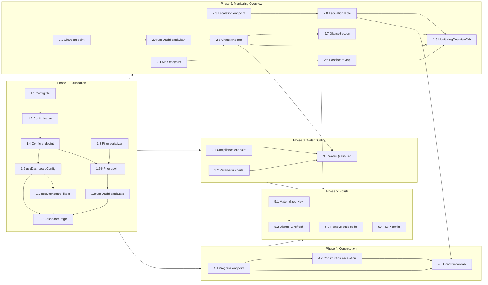

# Dashboard Visualization — Implementation Workflow

**Source**: [design-spec](dashboard-visualization-design-spec.md) | [requirements](dashboard-visualization-requirements.md)
**Parent form**: `1749623934933` (EPS Registration)
**Monitoring forms**: `1749632545233` (Water Quality), `1749624452908` (Construction)

---

## Phase 1: Foundation

> Goal: Dashboard route loads, shows config-driven filter bar and KPI cards with real data.

### Step 1.1 — Dashboard config file

**Create** `backend/source/dashboard/1749623934933.json`

- Copy the config schema from design spec section 2.2
- Validate all question IDs exist in the form JSON files
- Ensure `backend/source/dashboard/` directory exists

**Files**: `backend/source/dashboard/1749623934933.json` (new)
**Depends on**: Nothing
**Validate**: JSON is valid, question IDs match form definitions

---

### Step 1.2 — Config loader module

**Create** `backend/api/v1/v1_visualization/dashboard_config.py`

- `get_dashboard_config(parent_form_id)` — loads + caches JSON from disk
- `clear_config_cache()` — cache invalidation
- Raises `NotFound` if no config file exists

**Files**: `backend/api/v1/v1_visualization/dashboard_config.py` (new)
**Depends on**: Step 1.1
**Validate**: Unit test — load config, cache hit, missing config returns 404

---

### Step 1.3 — Dashboard filter serializer

**Create** `backend/api/v1/v1_visualization/dashboard_serializers.py`

- `DashboardFilterSerializer` — validates `date_from`, `date_to`, `administration`, `filter_{key}` params
- Reused by all dashboard endpoints

**Files**: `backend/api/v1/v1_visualization/dashboard_serializers.py` (new)
**Depends on**: Nothing
**Validate**: Unit test — valid/invalid filter params

---

### Step 1.4 — Config endpoint

**Add** `GET /api/v1/visualization/dashboard/config/{form_id}`

- View function in new `backend/api/v1/v1_visualization/dashboard_views.py`
- Calls `get_dashboard_config()`, returns JSON response
- Register URL in `urls.py`

**Files**:
- `backend/api/v1/v1_visualization/dashboard_views.py` (new)
- `backend/api/v1/v1_visualization/urls.py` (edit — add URL pattern)

**Depends on**: Step 1.2
**Validate**: `curl /api/v1/visualization/dashboard/config/1749623934933` returns config

---

### Step 1.5 — Common filter helper + KPI computation

**Create** `backend/api/v1/v1_visualization/dashboard_functions.py`

- `apply_common_filters(queryset, filters, config)` — admin hierarchy, date range, custom filters
- `get_latest_monitoring_subquery(form_id, date_from, date_to, date_qids)` — subquery for latest monitoring per parent
- `compute_kpi_stats(parent_form, config, filters)` — returns all KPI values

**Add** `GET /api/v1/visualization/dashboard/stats/{form_id}` to `dashboard_views.py`

- Uses `DashboardFilterSerializer` for query param validation
- Calls `compute_kpi_stats()`, returns `KPIStatsSerializer` response

**Add** `KPIStatsSerializer` to `dashboard_serializers.py`

**Files**:
- `backend/api/v1/v1_visualization/dashboard_functions.py` (new)
- `backend/api/v1/v1_visualization/dashboard_views.py` (edit)
- `backend/api/v1/v1_visualization/dashboard_serializers.py` (edit)
- `backend/api/v1/v1_visualization/urls.py` (edit)

**Depends on**: Steps 1.2, 1.3, 1.4
**Validate**: Endpoint returns correct counts for test data. Test with/without filters.

---

### Step 1.6 — Frontend: useDashboardConfig hook

**Create** `frontend/src/pages/dashboard/hooks/useDashboardConfig.js`

- Fetches `GET /visualization/dashboard/config/{formId}`
- Caches in module-level object
- Returns `{ config, loading }`

**Files**: `frontend/src/pages/dashboard/hooks/useDashboardConfig.js` (new)
**Depends on**: Step 1.4
**Validate**: Hook fetches and caches config

---

### Step 1.7 — Frontend: useDashboardFilters hook

**Create** `frontend/src/pages/dashboard/hooks/useDashboardFilters.js`

- Manages filter state (date range, administration, custom filters)
- Builds query string from state: `filterParams`
- Provides `setFilter(key, value)`, `resetFilters()`
- Reads filter definitions from config

**Files**: `frontend/src/pages/dashboard/hooks/useDashboardFilters.js` (new)
**Depends on**: Step 1.6
**Validate**: Filter state changes produce correct query strings

---

### Step 1.8 — Frontend: useDashboardStats hook

**Create** `frontend/src/pages/dashboard/hooks/useDashboardStats.js`

- Fetches `GET /visualization/dashboard/stats/{formId}?{filterParams}`
- Re-fetches when `filterParams` change
- Returns `{ stats, loading }`

**Files**: `frontend/src/pages/dashboard/hooks/useDashboardStats.js` (new)
**Depends on**: Step 1.5
**Validate**: Stats update when filters change

---

### Step 1.9 — Frontend: DashboardPage + KPICardRow + DashboardFilters

**Replace** `frontend/src/pages/dashboard/Dashboard.jsx` with new `DashboardPage`

**Create**:
- `frontend/src/pages/dashboard/DashboardPage.jsx` — main page with config/filters/tabs
- `frontend/src/pages/dashboard/components/DashboardFilters.jsx` — filter bar (date picker, admin cascade, custom dropdowns)
- `frontend/src/pages/dashboard/components/KPICardRow.jsx` — 4 stat cards using Ant Design `Statistic`

**Edit** `frontend/src/pages/dashboard/Dashboard.jsx` — re-export DashboardPage (preserves existing route)

**Files**:
- `frontend/src/pages/dashboard/DashboardPage.jsx` (new)
- `frontend/src/pages/dashboard/components/DashboardFilters.jsx` (new)
- `frontend/src/pages/dashboard/components/KPICardRow.jsx` (new)
- `frontend/src/pages/dashboard/Dashboard.jsx` (edit)
- `frontend/src/pages/dashboard/style.scss` (new or edit)

**Depends on**: Steps 1.6, 1.7, 1.8
**Validate**: `/dashboard/1749623934933` shows filter bar and 4 KPI cards with real data

---

### Phase 1 Checkpoint

- [ ] Config file loads via API
- [ ] Stats endpoint returns correct KPIs
- [ ] Filters apply to stats
- [ ] Dashboard page renders with KPI cards
- [ ] Backend tests pass
- [ ] Frontend renders without errors

---

## Phase 2: Monitoring Overview Tab

> Goal: Complete first tab with map, donut charts, escalation table, and inspections bar chart.

### Step 2.1 — Map endpoint

**Add** `GET /api/v1/visualization/dashboard/map/{form_id}`

- Extends existing `GeolocationListView` pattern
- Joins latest monitoring to get `system_status` answer for each EPS
- Returns `[{ id, name, geo, administration_id, status, status_color }]`
- Applies common filters

**Add** `MapPointSerializer` to `dashboard_serializers.py`

**Files**:
- `backend/api/v1/v1_visualization/dashboard_views.py` (edit)
- `backend/api/v1/v1_visualization/dashboard_serializers.py` (edit)
- `backend/api/v1/v1_visualization/dashboard_functions.py` (edit)
- `backend/api/v1/v1_visualization/urls.py` (edit)

**Depends on**: Phase 1
**Validate**: Returns geo points with correct status colors

---

### Step 2.2 — Chart endpoint (doughnut + bar)

**Add** `GET /api/v1/visualization/dashboard/chart/{form_id}?chart_key=...`

- Reads chart definition from config (`charts` section)
- For **doughnut** charts: aggregates option answers, returns `{ type, config, data }`
- For **bar** charts (inspections_per_month): groups by month, returns `{ type, config, data }`
- `config` and `data` shaped for direct akvo-charts pass-through
- Colors from `QuestionOptions.color` field

**Add** `ChartDataSerializer` to `dashboard_serializers.py`

**Files**:
- `backend/api/v1/v1_visualization/dashboard_views.py` (edit)
- `backend/api/v1/v1_visualization/dashboard_serializers.py` (edit)
- `backend/api/v1/v1_visualization/dashboard_functions.py` (edit — `compute_chart_data()`)
- `backend/api/v1/v1_visualization/urls.py` (edit)

**Depends on**: Phase 1
**Validate**: Each `chart_key` returns correct aggregation. Test doughnut and bar separately.

---

### Step 2.3 — Escalation endpoint (monitoring tab)

**Add** `GET /api/v1/visualization/dashboard/escalation/{form_id}?tab=monitoring`

- Paginated (DRF pagination)
- Inclusion criteria: no water sample OR system issue OR quality violation
- Returns `{ count, next, previous, results: [...] }`

**Add** `EscalationMonitoringSerializer` to `dashboard_serializers.py`

**Files**:
- `backend/api/v1/v1_visualization/dashboard_views.py` (edit)
- `backend/api/v1/v1_visualization/dashboard_serializers.py` (edit)
- `backend/api/v1/v1_visualization/dashboard_functions.py` (edit)
- `backend/api/v1/v1_visualization/urls.py` (edit)

**Depends on**: Phase 1
**Validate**: Pagination works. Only EPS meeting escalation criteria are included.

---

### Step 2.4 — Frontend: useDashboardChart hook

**Create** `frontend/src/pages/dashboard/hooks/useDashboardChart.js`

- Fetches `GET /visualization/dashboard/chart/{formId}?chart_key={key}&{filterParams}`
- Returns `{ chartData, loading }` — chartData contains `{ type, config, data, raw_config }`
- Re-fetches on filter change

**Files**: `frontend/src/pages/dashboard/hooks/useDashboardChart.js` (new)
**Depends on**: Step 2.2
**Validate**: Hook returns chart data for different chart keys

---

### Step 2.5 — Frontend: ChartRenderer component

**Create** `frontend/src/pages/dashboard/components/ChartRenderer.jsx`

- Generic component: maps `type` → akvo-charts component (Bar, Doughnut, Line, Pie)
- Passes `config`, `data`, `rawConfig` directly — zero transformation
- Handles loading state

**Files**: `frontend/src/pages/dashboard/components/ChartRenderer.jsx` (new)
**Depends on**: Step 2.4
**Validate**: Renders correct chart type based on API response

---

### Step 2.6 — Frontend: DashboardMap component

**Create** `frontend/src/pages/dashboard/components/DashboardMap.jsx`

- Uses `akvo-charts` Map component
- Fetches from map endpoint
- Status-colored markers
- Click navigates to `/control-center/data/{formId}/monitoring/{dataId}`

**Files**: `frontend/src/pages/dashboard/components/DashboardMap.jsx` (new)
**Depends on**: Step 2.1
**Validate**: Map renders with colored markers, click navigates correctly

---

### Step 2.7 — Frontend: GlanceSection component

**Create** `frontend/src/pages/dashboard/components/GlanceSection.jsx`

- Grid layout (2x3) of doughnut charts
- Each chart uses `ChartRenderer` with its own `useDashboardChart` call
- Charts: operational_status, compliance, water_committee, implementing_authority, test_method, placeholder

**Files**: `frontend/src/pages/dashboard/components/GlanceSection.jsx` (new)
**Depends on**: Steps 2.2, 2.5
**Validate**: All 6 donuts render with correct data

---

### Step 2.8 — Frontend: EscalationTable component

**Create** `frontend/src/pages/dashboard/components/EscalationTable.jsx`

- Ant Design Table with server-side pagination
- Excel export via `antd-table-saveas-excel`
- Columns configured from props (reusable for monitoring + construction tabs)

**Files**: `frontend/src/pages/dashboard/components/EscalationTable.jsx` (new)
**Depends on**: Step 2.3
**Validate**: Pagination works, export produces valid Excel

---

### Step 2.9 — Frontend: MonitoringOverviewTab assembly

**Create** `frontend/src/pages/dashboard/tabs/MonitoringOverviewTab.jsx`

- Assembles: KPICardRow (sub-tab KPIs) + DashboardMap + GlanceSection + InspectionsChart (Bar via ChartRenderer) + EscalationTable
- Wires up all hooks with shared `filterParams`

**Edit** `DashboardPage.jsx` — render MonitoringOverviewTab inside Tabs

**Files**:
- `frontend/src/pages/dashboard/tabs/MonitoringOverviewTab.jsx` (new)
- `frontend/src/pages/dashboard/DashboardPage.jsx` (edit)

**Depends on**: Steps 2.5–2.8
**Validate**: Full monitoring overview tab renders with all sections

---

### Phase 2 Checkpoint

- [ ] Map shows colored EPS markers
- [ ] 6 donut charts render with correct aggregations
- [ ] Inspections per month bar chart renders
- [ ] Escalation table paginates and exports to Excel
- [ ] All sections respond to filter changes
- [ ] Backend tests for map, chart, escalation endpoints

---

## Phase 3: Water Quality Tab

> Goal: 7 parameter bar charts with threshold lines, compliance doughnut, sub-tab KPIs.

### Step 3.1 — Compliance endpoint

**Add** `GET /api/v1/visualization/dashboard/compliance/{form_id}`

- For each EPS: get latest water quality monitoring, average values across repeatable groups
- Compare each parameter against thresholds from config
- Returns `{ summary, config, data }` — config/data for Doughnut pass-through

**Files**:
- `backend/api/v1/v1_visualization/dashboard_views.py` (edit)
- `backend/api/v1/v1_visualization/dashboard_serializers.py` (edit — `ComplianceSummarySerializer`)
- `backend/api/v1/v1_visualization/dashboard_functions.py` (edit — `compute_compliance()`)
- `backend/api/v1/v1_visualization/urls.py` (edit)

**Depends on**: Phase 1
**Validate**: Correct compliant/non-compliant/no-data counts. Test with edge cases (partial parameters).

---

### Step 3.2 — Water quality parameter charts

**Extend** `compute_chart_data()` in `dashboard_functions.py`

- When `chart_key` matches a `water_quality.parameters[].key`:
  - Query latest monitoring per EPS
  - Average across repeatable group entries (index > 0)
  - Build `raw_config` with markLine threshold from config
  - Return `{ type: "bar", config, data, raw_config }`

**Files**:
- `backend/api/v1/v1_visualization/dashboard_functions.py` (edit)

**Depends on**: Step 2.2 (chart endpoint already exists)
**Validate**: Each of 7 parameters returns correct averaged values. Threshold markLine in raw_config.

---

### Step 3.3 — Frontend: WaterQualityTab

**Create** `frontend/src/pages/dashboard/tabs/WaterQualityTab.jsx`

- Sub-tab KPIs: water sample %, lab tested count, CBT tested count (from stats)
- Compliance doughnut (dedicated fetch to compliance endpoint)
- 3 sections: Microbial (2 charts), Physical (2 charts), Chemical (3 charts)
- Each parameter chart uses `ChartRenderer` — pass-through from API

**Edit** `DashboardPage.jsx` — add WaterQualityTab to Tabs

**Files**:
- `frontend/src/pages/dashboard/tabs/WaterQualityTab.jsx` (new)
- `frontend/src/pages/dashboard/DashboardPage.jsx` (edit)

**Depends on**: Steps 3.1, 3.2, 2.5 (ChartRenderer)
**Validate**: All 7 parameter charts render with threshold lines. Compliance doughnut shows correct counts.

---

### Phase 3 Checkpoint

- [ ] Compliance computation handles all 7 parameters
- [ ] Average aggregation works for repeatable groups
- [ ] Threshold markLines render correctly in all charts
- [ ] Sub-tab KPIs show correct percentages
- [ ] Backend tests for compliance and parameter queries

---

## Phase 4: Construction Monitoring Tab

> Goal: Progress histogram, completion timeline, construction escalation table.

### Step 4.1 — Construction progress endpoint

**Add** `GET /api/v1/visualization/dashboard/construction-progress/{form_id}`

- For each EPS under construction (is_project_completed == 'no'):
  - Evaluate each component using formula from config
  - Calculate overall progress (average of enabled components)
- Returns `{ histogram: { config, data }, completion_timeline: { config, data, raw_config } }`

**Add** progress formula implementations to `dashboard_functions.py`:
- `any_yes`, `completed_binary`, `ratio`, `multi_select_proportion`

**Files**:
- `backend/api/v1/v1_visualization/dashboard_views.py` (edit)
- `backend/api/v1/v1_visualization/dashboard_serializers.py` (edit — `ConstructionProgressSerializer`)
- `backend/api/v1/v1_visualization/dashboard_functions.py` (edit — `compute_construction_progress()`)
- `backend/api/v1/v1_visualization/urls.py` (edit)

**Depends on**: Phase 1
**Validate**: Progress formulas produce correct percentages. Histogram buckets are correct.

---

### Step 4.2 — Construction escalation endpoint

**Extend** escalation endpoint: `GET /escalation/{form_id}?tab=construction`

- Inclusion: incomplete AND overdue (proposed_completion_date < TODAY)
- Returns per-component progress, overall %, expected %, deadline

**Files**:
- `backend/api/v1/v1_visualization/dashboard_views.py` (edit)
- `backend/api/v1/v1_visualization/dashboard_serializers.py` (edit — `EscalationConstructionSerializer`)
- `backend/api/v1/v1_visualization/dashboard_functions.py` (edit)

**Depends on**: Step 4.1 (reuses progress formulas)
**Validate**: Only overdue incomplete projects appear. Expected progress calculation is correct.

---

### Step 4.3 — Frontend: ConstructionTab

**Create** `frontend/src/pages/dashboard/tabs/ConstructionTab.jsx`

- Sub-tab KPIs: under construction count, past-due count (from stats)
- Construction histogram: `<Bar>` via ChartRenderer
- Completion timeline: `<Bar>` with rawConfig TODAY markLine via ChartRenderer
- Escalation table: reuse `EscalationTable` with construction columns

**Edit** `DashboardPage.jsx` — add ConstructionTab to Tabs

**Files**:
- `frontend/src/pages/dashboard/tabs/ConstructionTab.jsx` (new)
- `frontend/src/pages/dashboard/DashboardPage.jsx` (edit)

**Depends on**: Steps 4.1, 4.2, 2.5 (ChartRenderer), 2.8 (EscalationTable)
**Validate**: Both charts render. Escalation table shows overdue projects.

---

### Phase 4 Checkpoint

- [ ] Construction progress formulas are correct
- [ ] Histogram shows proper distribution
- [ ] TODAY markLine appears on completion timeline
- [ ] Escalation table filters to overdue only
- [ ] Backend tests for all construction endpoints

---

## Phase 5: Polish & Reusability

> Goal: Performance optimization, stale code cleanup, verify reusability.

### Step 5.1 — Materialized view for dashboard stats

**Create** migration `0002_create_view_dashboard_stats.py`

- Pre-joins latest monitoring per parent form
- Includes key answer values needed for KPI computation
- Refresh function added to `functions.py`

**Files**:
- `backend/api/v1/v1_visualization/migrations/0002_create_view_dashboard_stats.py` (new)
- `backend/api/v1/v1_visualization/models.py` (edit — add ViewDashboardStats)
- `backend/api/v1/v1_visualization/functions.py` (edit — refresh function)

**Depends on**: Phases 1-4 (optimize after correctness proven)
**Validate**: Stats endpoint returns same results but faster. Refresh works.

---

### Step 5.2 — Django-Q refresh task

**Add** task that refreshes materialized views on new monitoring submission

- Hook into form data submission flow (post-save signal or explicit call)
- Rate-limit to max 1 refresh per minute

**Files**:
- `backend/api/v1/v1_visualization/functions.py` (edit)
- `backend/api/v1/v1_data/views.py` or signal handler (edit — trigger refresh)

**Depends on**: Step 5.1
**Validate**: Submit monitoring data → materialized view refreshes → stats endpoint reflects new data

---

### Step 5.3 — Remove stale frontend code

**Delete**:
- `frontend/src/components/chart/` (internal ECharts wrappers)
- `frontend/src/components/visualisation/` (old visualization components)
- `frontend/src/pages/dashboard/` old files (Glaas.jsx, GlaasReportDashboard.jsx, ReportDashboard.jsx, old components/, example.js)
- `frontend/src/pages/visualisation/` (old visualization page)

**Edit**: Remove dead imports in `App.js` and any other files referencing deleted components.

**Files**: Multiple deletes + edits
**Depends on**: Phase 2-4 complete (new dashboard fully working)
**Validate**: `npm run build` succeeds. `npm test` passes. No broken imports.

---

### Step 5.4 — Verify reusability with Rural Water Project

**Create** `backend/source/dashboard/1749621221728.json` for Rural Water Project form

- Map relevant question IDs from the RWP registration form
- May only have subset of tabs (no construction, no water quality — depending on monitoring forms)
- Verify `/dashboard/1749621221728` loads and renders

**Files**: `backend/source/dashboard/1749621221728.json` (new)
**Depends on**: Phase 1-4
**Validate**: Dashboard loads for a different form family. Tabs/charts render based on config.

---

### Phase 5 Checkpoint

- [ ] Materialized view speeds up stats endpoint
- [ ] Auto-refresh triggers on submission
- [ ] Stale code removed, build passes
- [ ] Rural Water Project dashboard loads
- [ ] All backend + frontend tests pass

---

## Dependency Graph



---

## Parallel Execution Opportunities

Within each phase, backend and frontend work can be parallelized:

| Phase | Backend (can run in parallel) | Frontend (after backend) |
|-------|-------------------------------|--------------------------|
| 1 | Steps 1.1-1.5 | Steps 1.6-1.9 |
| 2 | Steps 2.1-2.3 (all independent) | Steps 2.4-2.9 |
| 3 | Steps 3.1-3.2 (independent) | Step 3.3 |
| 4 | Steps 4.1-4.2 | Step 4.3 |
| 5 | Steps 5.1-5.2 | Steps 5.3-5.4 |

**Cross-phase parallelism**: Phases 2, 3, and 4 all depend on Phase 1 but are independent of each other. They can run in parallel once Phase 1 is complete.

---

## Git Branch Strategy

```
main
  └── feature/dashboard-visualization
        ├── PR 1: Phase 1 (foundation)
        ├── PR 2: Phase 2 (monitoring overview)
        ├── PR 3: Phase 3 (water quality)
        ├── PR 4: Phase 4 (construction)
        └── PR 5: Phase 5 (polish + cleanup)
```

Each phase = one PR for reviewability. Phase 1 merges first, then 2-4 can be reviewed in parallel.

---

## Estimated File Count

| Category | New Files | Edited Files |
|----------|-----------|-------------|
| Backend | 5 | 3 |
| Frontend | 15 | 3 |
| Config | 2 | 0 |
| Tests | 6 | 0 |
| **Total** | **28** | **6** |
