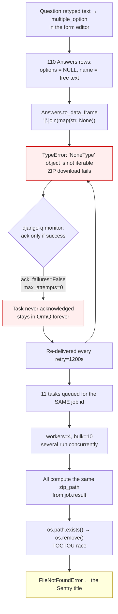

# Data download fails when a question type was changed after submission

> **Scope note.** The title names the root cause. Investigating it surfaced a
> second, independent defect — failed background jobs retry forever — which
> amplified this one from a single failure into a four-day storm. Both are
> planned here: PR 1 / PR 4 fix the retype, PR 2 / PR 3 fix the retry loop.
> Split out a second issue (*Failed background jobs retry forever — no ack on
> failure and no attempt cap*) if you want them tracked separately.

## Status

| | |
|---|---|
| Sentry event | `a8082c91b33445a8992f6b236bd43689` |
| Environment | test cluster `gke_akvo-lumen_europe-west1-d_test`, ns `iwsims-namespace`, pod `iwsims-df95f8b8-jt9jv` |
| Verified | 2026-08-24 against the live pod — every number below is a query result, not an estimate |
| Implemented | 2026-08-26 — `flake8` clean, full suite **1425 passed**, 14 new tests, manual testing signed off |
| Culprit commit | `00769bda` `[#28] Update RWS/WWTP/SPS forms and fix grammar across prod forms` — 2026-06-26 |
| Supersedes | `doc/claude/backend-job-download-dead-on_progress/` T0 and PR 2 (see [Relationship to prior work](#relationship-to-prior-work)) |

## Implementation notes (as built)

Three deviations from the tasks below, found while implementing them:

| # | Planned | As built | Why |
|---|---|---|---|
| **T1** | helper in `backend/utils/functions.py` | helper in `backend/api/v1/v1_data/models.py` | `utils/functions.py` imports `v1_data.models`, so `models.py` importing it back is a circular import. The helper reads `Answers` columns, so it belongs next to the model anyway. |
| **T9** | hooks use `Jobs.objects.filter(task_id=...).first()` and return on miss | shared `_job_for_task(task)` that falls back to `task.args[0]` | Silently returning would leave the job on `on_progress` forever — job 291's exact state. Every job function takes `job_id` as its first positional arg, so the row is always recoverable. Applied to all three hooks. |
| **T3d** *(new)* | — | `get_answer_label` keeps a value that matches no option instead of dropping it | Found by TC-3. Without it the crash is fixed but `use_label=True` blanks the recovered text during the option-label lookup, so **U2 still fails**. Also stops silently losing answers whose option was later removed from the form. |

Not implemented — still the [open decision](#open-decision-the-110-orphaned-answers): **option C**, the `form_seeder` guard that would refuse a data-orphaning retype. The seven-commit history means the eighth occurrence is a form edit away.

## Problem

The Sentry title is `FileNotFoundError … download-waf_wastewater_treatment_plant-…zip`. That is **not** the bug. It is the third-order symptom of three independent defects stacked on top of each other.



| Layer | Defect |
|---|---|
| **Disease** | `Answers.to_data_frame` picks its branch from the question's *current* type but reads a column written under the *old* type. |
| **Amplifier** | Failed django-q tasks are never acked and have no attempt cap → infinite 20-minute retry. |
| **Reported symptom** | Concurrent duplicates of one job share one zip path → TOCTOU on `os.remove`. |

## Evidence

### The poisoned rows

```
TOTAL_NULL_OPTIONS: 110      (options IS NULL, question.type ∈ {geo, option, multiple_option})
  name IS NOT NULL: 110      ← all carry real submitted text
  value IS NOT NULL: 0
  created: 2025-08-19 → 2026-06-26

95  WAF Wastewater Treatment Plant - Monitoring   (form 1748905550055)
 8  EPS Projects Construction - Monitoring
 7  WAF Water Treatment Plant - Quick Monitoring
```

Form `1748905550055` is exactly what the failing job asks for in `child_form_ids`.

### The retry storm

```
OrmQ backlog (unacked): 14   — all 14 are job_generate_data_download
queued tasks per job_id: {296: 11, 291: 1, 302: 2}
Jobs: 130 download done · 17 download failed · 1 stuck on_progress since 2026-08-18

job 296  status=failed  attempt=239   ← 4 days ÷ 20 min ≈ 288 cycles
job 302  status=failed  attempt=238
job 291  status=on_progress  attempt=0   (hook never ran)
```

Of the 11 task ids queued for job 296, only **1** matches `job.task_id`. The other 10 are orphans whose hook can only ever raise `Jobs matching query does not exist` — 7 such lines appear in the event's breadcrumbs.

### The `./tmp` leak

```
./tmp → 386 MB, 32 files
38M datapoint-report-eps_inspection-260821-5563117a….docx
38M datapoint-report-eps_inspection-260821-72d80909….docx
35M datapoint-report-eps_inspection-260821-4c29ca5b….docx   (…and 29 more)
```

`storage.upload()` is a `shutil.copy2` — it copies and returns. No caller deletes the source.

## Root cause: the retype

`backend/api/v1/v1_data/models.py:200`

```python
if q.type in [geo, option, multiple_option]:
    answer = "|".join(map(str, self.options))   # self.options is NULL
```

The branch comes from `question.type` *as it is today*. When a question is edited from `input`/`text` → `multiple_option`, every pre-existing answer keeps its text in `name` and leaves `options` NULL.

The proof is inside a single submission — FormData **13898**, where the client was writing correct arrays for type-6 questions in that very request:

```
q 1748913763000  type=6  options=['facultative_ponds','maturation_ponds',…]
q 1748911325583  type=6  options=['normal']
q 1748907201859  type=6  options=['effluent_clear']
q 1748907016509  type=6  options=None  name='Pond is clear with small plants growing…'  ← broken
q 1748916372852  type=6  options=None  name='Maturation ponds are clear'                ← broken
q 1748918679465  type=3  options=None  name='Increase in human resources'               ← what they used to be
```

Corroborating:

- `AnswerHistory` for both questions = **0** — the answers were never edited; the *definition* was.
- Question `1748916372852` is **48 of 48** NULL — every answer it ever received predates the retype.
- Both labels start with *"Comment on…"* and their slugs are `comment_on_the_operation_of_…` — free-text prompts, now carrying 11 enum options.
- The API path is correctly guarded (`serializers.py:139-149` rejects a non-list for option types), so this could not have entered through `/form-pending-data`.

### When it happened

Form definitions are versioned in the repo, so the change *is* traceable — just not from the database. Tracing question `1748907016509` across all 22 revisions of `backend/source/forms/5_1748905550055.monitoring.prod.json`:

```
5be0c11e 2025-06-12  type=text,opts=0     [#61] Rename file of WAF Wastewater Treatment Plan form
   … 20 revisions, type unchanged …
b32e86bc 2026-06-15  type=text,opts=0     [#18] Standardise question names across monitoring form fam…
00769bda 2026-06-26  type=multiple_option,opts=11   [#28] Update RWS/WWTP/SPS forms…
```

Both crashing questions flip in **`00769bda`**, whose own message names the change:

> - Add multi-select condition checklist to Oxidation/Polishing/Maturation/Facultative ponds
>
> Note: corrections applied to display labels/descriptions only; option value keys left unchanged to preserve stored data.

The note shows the data-preservation risk was considered — for option *value keys*. What slipped through is that a `text` → `multiple_option` retype **reused the same question id**, so 95 existing text answers stayed attached to a question that now reads a different column. A fresh id would have left them parked harmlessly on a retired question.

That commit retyped five questions in this form; only two orphan data:

| Question | Change | Effect |
|---|---|---|
| `1748907016509` `comment_on_the_operation_of_the_facultative_pond` | `text` → `multiple_option` | **crash** |
| `1748916372852` `comment_on_the_operation_of_the_maturation_pond` | `text` → `multiple_option` | **crash** |
| `1754995400903` / `1754995400933` oxidation / polishing ponds | `option` → `multiple_option` | safe — both read `options` |
| `1748904102151` `num_pump_stations` | `number` → `autofield` | silent: old answers sit in `value`, `autofield` reads `name` → exports blank, no crash |

The last row is a second, quieter instance of the same defect class. It is not in the traceback because it does not crash.

### It has happened seven times

Sweeping every form JSON's full history for type changes that move data between columns — 15 such retypes across 7 commits:

| Commit | Date | Form | Orphaning retypes |
|---|---|---|---|
| `5de8744e` | 2025-08-06 | Rural Water Project - Monitoring | 1 |
| `20078758` | 2025-08-07 | EPS Projects Construction - Monitoring | 1 |
| `e112bc6b` | 2025-09-12 | EPS Projects Construction - Monitoring | 1 |
| `0ca5dd4f` | 2025-09-17 | WAF Water Treatment Plant - Quick Monitoring | 4 |
| `7cd2ba45` | 2025-10-16 | Rural Water Project - Monitoring | 1 |
| `2691a72f` | 2025-10-28 | Rural Water Project - Monitoring | 6 |
| **`00769bda`** | **2026-06-26** | **WAF Wastewater Treatment Plant - Monitoring** | **2** |

This reconciles the 110 poisoned rows exactly:

```
95  WAF Wastewater Treatment Plant - Monitoring   ← 00769bda
 8  EPS Projects Construction - Monitoring        ← 20078758 + e112bc6b
 7  WAF Water Treatment Plant - Quick Monitoring  ← 0ca5dd4f
 0  Rural Water Project - Monitoring              ← 8 orphaning retypes, no data yet
───
110
```

Rural Water Project got away with eight of them purely because nobody had answered those questions at the time. Luck, not process.

### Where the retype is applied

`backend/api/v1/v1_forms/management/commands/form_seeder.py:274`, on the update branch of the question upsert:

```python
question.type = getattr(QuestionTypes, q["type"])   # no check for existing answers
question.save()
```

`Questions` has no `created`/`updated` column, so the **database** keeps no record of when or by whom a type changed — only git does, and only for questions seeded from the repo.

## Blast radius

| Site | Impact |
|---|---|
| `v1_data/models.py:200` | ZIP + Excel downloads. The crash. |
| `v1_jobs/job.py:789`, `:903` | Datapoint report. Same crash, **masked** by the bare `except Exception` at `job.py:962` → reports render empty instead of failing. |
| `v1_jobs/job.py:795`, `:909` | `options.filter(value__in=None)`. |
| `v1_visualization/views.py:100` | `for v in a.options:` — a **live API endpoint**, not a background job. |
| `utils/functions.py:44` | Returns `None` rather than crashing, so `get_answer_value` serves `value: null` for a *required* question. **The 110 answers are already invisible in the web and mobile forms and nobody was told.** |

The crash only fires when `child_form_ids` includes a monitoring form owning a retyped question. Parent-only downloads never call `generate_monitoring_data_sheet`, which is why 130 downloads succeeded while these two cannot.

## Reproduction

Minimal fixture, straight from production:

```
FormData 13895  "Natahua Wastewater Treatment Plant - Fiji - Western"
  form=1748903240763  admin=2
  └─ FormData 13898  form=1748905550055
       q 1748907016509  type=6  options=None  name='Pond is clear with small plants…'
       q 1748916372852  type=6  options=None  name='Maturation ponds are clear'
```

Job payload (jobs 296 and 302, identical):

```json
{
  "form_id":        1748903240763,
  "child_form_ids": [1748905550055, 1748918946591],
  "selection_ids":  [13895],
  "download_type":  "recent",
  "use_label":      false,
  "date_from":      "2026-05-01",
  "date_to":        "2026-08-21",
  "administration": null
}
```

**R1 — reproduces the cause, not just the state:**

```python
q = Questions.objects.get(name="other_final_recommendations")  # type=3
fd = Answers.objects.filter(question=q).first().data
q.type = QuestionTypes.multiple_option    # the form edit
q.save()
fd.to_data_frame        # TypeError: 'NoneType' object is not iterable
```

**R2 — end to end, matches the traceback exactly** (`job.py:632 → :377 → :354 → models.py:200`):

```python
job = Jobs.objects.create(
    type=JobTypes.download, status=JobStatus.on_progress, user=user,
    result="repro.zip",
    info={"form_id": PARENT_ID, "child_form_ids": [MONITORING_ID],
          "selection_ids": [PARENT_DATA_ID]},
)
job_generate_data_download(job.id, download_type="recent", use_label=False,
                           date_from="2026-05-01", date_to="2026-08-21")
```

**R3 — the `FileNotFoundError` needs two concurrent workers; force it deterministically:**

```python
with patch("os.path.exists", return_value=True):
    _generate_zip_download(job)     # FileNotFoundError at job.py:579
```

## User AC

| # | Given | When | Then |
|---|---|---|---|
| **U1** | A monitoring form contains a question that was retyped to `option`/`multiple_option` after data was submitted | I request a ZIP download including that monitoring form | The download completes and I get a ZIP — no silent failure, no stuck job |
| **U2** | Same as U1 | I open the monitoring sheet in the ZIP | The cell shows the **original submitted text** (e.g. `Maturation ponds are clear`), not blank and not an error |
| **U3** | A download job fails for any reason | I look at the Downloads page | Status reaches **Failed** within one attempt and stops changing — it does not sit on *In progress* forever |
| **U4** | A download job has failed | I click **Retry** | The new file honours the **same** date range, download type and label setting I originally chose |
| **U5** | A download job has failed and I never click Retry | I wait | Nothing re-runs. No new Sentry errors, no new files, no worker time consumed |
| **U6** | I click **Retry** several times | — | Only the most recent request produces a file; earlier attempts do not race it or overwrite it |
| **U7** | A required question was retyped and my old text answer no longer matches any option | I open that datapoint in the web or mobile form | I can see the stored text is not a valid option, rather than the field appearing silently empty |

U7 is currently violated and is **not** fixed by the code changes below — see [Open decision](#open-decision-the-110-orphaned-answers).

## Tech AC

| # | Criterion | How to verify |
|---|---|---|
| **T-AC1** | `Answers.to_data_frame` never raises when `options` is NULL for a geo/option/multiple_option question | R1 returns a dict instead of raising |
| **T-AC2** | The fallback returns `name`, then `value`, then `None` — and output is **byte-identical** to today when `options` is populated | Existing download tests pass unchanged |
| **T-AC3** | Every direct reader of `Answers.options` is guarded, not just the download path | `grep -rn "\.options" backend/api backend/utils` shows no unguarded iteration |
| **T-AC4** | A failed task is acknowledged and removed from `OrmQ` | `OrmQ.objects.count()` does not grow after a deliberately failing job |
| **T-AC5** | `Jobs.attempt` stops climbing for a failed job | Job 296's counter is frozen after deploy |
| **T-AC6** | At most one task per job id is ever queued | `Counter(task.args[0] for task in OrmQ)` has no value > 1 |
| **T-AC7** | `download_retry` commits `job` before enqueueing | The hook resolves `Jobs` on the first try; zero `Jobs matching query does not exist` in Sentry |
| **T-AC8** | `download_retry` forwards `download_type`, `use_label`, `date_from`, `date_to` from `job.info` | Queued task kwargs equal the original job's `info` |
| **T-AC9** | No `os.path.exists()` → `os.remove()` pair remains in `job.py` | R3 no longer raises |
| **T-AC10** | `./tmp` does not accumulate deliverables | File count is stable across 3 consecutive download jobs |
| **T-AC11** | The Excel importer cannot write a NULL/non-list `options` for an option question | New unit tests on `seed_data` |
| **T-AC12** | `flake8` clean, backend test suite green | `./dc.sh exec backend flake8 && ./dc.sh exec backend python manage.py test` |

## Changes

### PR 1 — Stop the crash

#### T1 — Shared fallback helper

**File**: `backend/api/v1/v1_data/models.py`

One helper, because four call sites read `Answers.options` directly and patching only the download path leaves the report job and the visualization endpoint broken.

It lives beside the `Answers` model, not in `utils/functions.py` as first planned: that module imports `v1_data.models`, so importing it back from `models.py` is a circular import.

```python
def option_answer_text(answer, separator: str = "|") -> str:
    """Display text for a geo/option/multiple_option answer.

    Falls back to name/value when `options` is NULL. That is the shape left
    behind when a question is retyped to an option type after the answer was
    written: the submitted value stays in `name` and `options` was never
    populated. See doc/claude/download-fails-on-question-type-change.md
    """
    if answer.options:
        return separator.join(map(str, answer.options))
    if answer.name is not None:
        return str(answer.name)
    return "" if answer.value is None else str(answer.value)
```

#### T2 — Guard `to_data_frame`

**File**: `backend/api/v1/v1_data/models.py:195-200`

```python
# BEFORE
if q.type in [geo, option, multiple_option]:
    answer = "|".join(map(str, self.options))

# AFTER
if q.type in [geo, option, multiple_option]:
    answer = option_answer_text(self)
```

#### T3 — Guard the report job

**File**: `backend/api/v1/v1_jobs/job.py`

Lines 789 and 903 (geo): `value = option_answer_text(answer, separator=",")`

Lines 794 and 908 (option/multiple_option): skip the `QuestionOptions` lookup when `answer.options` is falsy and fall back to `answer.name`:

```python
if not answer.options:
    value = answer.name or ""
else:
    options = answer.question.options.filter(value__in=answer.options)
    value = "|".join([opt.label for opt in options]) if options else ""
```

#### T3d — Keep an answer that matches no option

**File**: `backend/api/v1/v1_jobs/job.py` — `get_answer_label`

Not in the original plan. Found by TC-3: with T1–T3 alone the crash is gone, but a labelled export (`use_label=True`) still loses the recovered text, because the option-label lookup drops every value it cannot resolve. The cell came out `nan` — **U2 still failing**.

```python
        if options:
            answer_label.append(options.label)
+       else:
+           # No matching option: either the option was removed from the
+           # form, or the question was retyped after this answer was
+           # written and the stored text was never an option value.
+           # Keep it — dropping it silently loses the submitted answer.
+           answer_label.append(value)
    return "|".join(answer_label)
```

This also stops silently discarding answers whose option was later removed from the form — the same data loss, from a different cause.

#### T4 — Guard the visualization endpoint

**File**: `backend/api/v1/v1_visualization/views.py:100`

```python
for v in (a.options or []):
```

### PR 2 — Kill the retry storm

#### T5 — Cluster config

**File**: `backend/mis/settings.py:251`

```python
Q_CLUSTER = {
    "name": "DjangORM",
    "workers": 4,
    "timeout": 600,
    "retry": 1200,
    "queue_limit": 50,
    "bulk": 10,
    "orm": "default",
    "ack_failures": True,   # NEW — else failed tasks re-run every 20 min forever
    "max_attempts": 3,      # NEW — backstop for tasks killed without reporting
}
```

**Behaviour change, intentional**: a task that exceeds `timeout=600` is currently auto-retried. It will now be acked and marked failed, and the user re-runs it with the existing **Retry** button. This is the trade we want — an unattended retry of a job that already timed out has never once succeeded in the 17 failed jobs on record.

#### T6 — Delete the inert `retry=0`

**Files**: `backend/api/v1/v1_jobs/views.py:251`, `backend/api/v1/v1_jobs/management/commands/job_download.py:102`

`retry` is not in django-q's `opt_keys` (`hook, group, save, sync, cached, ack_failure, iter_count, iter_cached, chain, broker, timeout`). Unrecognised kwargs fall through to `task["kwargs"]` and are handed to the job function, which swallows them via `**kwargs`. Proof from the live queue:

```python
{'form_id': 1749611049520, …, 'retry': 0}   ← sitting in the task payload
```

Delete both. T5 provides what T0 intended.

#### T7 — Fix `download_retry` ordering, kwargs, and queue hygiene

**File**: `backend/api/v1/v1_jobs/views.py:236-255`

Three defects in nine lines:

```python
# BEFORE
job.result = new_file
job.status = JobStatus.on_progress
job.attempt = 0
task_id = async_task(                       # (a) worker can start HERE
    "api.v1.v1_jobs.job.job_generate_data_download",
    job.id,
    retry=0,                                # (b) inert; original kwargs lost
    hook="api.v1.v1_jobs.job.job_generate_data_download_result",
)
job.task_id = task_id
job.save()                                  # …only committed HERE

# AFTER
purge_queued_task(job.task_id)              # (c) drop the stale OrmQ row
job.result = new_file
job.status = JobStatus.on_progress
job.attempt = 0
job.save()                                  # commit BEFORE enqueue

task_id = async_task(
    "api.v1.v1_jobs.job.job_generate_data_download",
    job.id,
    download_type=job.info.get("download_type", DataDownloadTypes.recent),
    use_label=job.info.get("use_label", True),
    date_from=job.info.get("date_from"),
    date_to=job.info.get("date_to"),
    administration=job.info.get("administration"),
    hook="api.v1.v1_jobs.job.job_generate_data_download_result",
)
job.task_id = task_id
job.save(update_fields=["task_id"])
```

(b) is a **user-visible correctness bug found while writing this doc**. `_generate_zip_download` reads `download_type`, `use_label`, `date_from`, `date_to` from `**kwargs`, not from `job.info`. Since `download_retry` passes none of them, a retried download silently falls back to `download_type='recent'`, **`use_label=True`** (the user asked for `False`) and **no date filter at all**. The queue shows it plainly:

```python
# original enqueue
{'form_id': …, 'download_type': 'recent', 'use_label': False,
 'date_from': '2026-05-01', 'date_to': '2026-08-21', 'retry': 0}
# every task from download_retry
{'retry': 0}
```

The data was always in `job.info`. The retry just never read it.

#### T8 — Purge helper

**File**: `backend/api/v1/v1_jobs/job.py` — extend the existing django-q import, which currently pulls in `Task` only:

```python
from django_q.models import Task, OrmQ
```

```python
def purge_queued_task(task_id: str) -> int:
    """Drop a task from the broker queue by its django-q task id.

    OrmQ stores a signed payload, so the id is only readable by unpacking
    each row. ponytail: linear scan — the queue is capped at queue_limit=50,
    index the unpacked id if that ever changes.
    """
    if not task_id:
        return 0
    removed = 0
    for row in OrmQ.objects.all():
        if row.task().get("id") == task_id:
            row.delete()
            removed += 1
    return removed
```

#### T9 — Hooks must not raise

**File**: `backend/api/v1/v1_jobs/job.py:1049`, `:1073`, `:1151`

A hook is the one place that must not be able to fail — when it does, the job's terminal status is never written and the UI spins forever (job 291).

Returning quietly on a miss is not enough: it silences the exception but still leaves the job on `on_progress`, which *is* job 291. Every job function takes `job_id` as its first positional arg, so the row is always recoverable from the task payload.

```python
def _job_for_task(task):
    """Resolve the Jobs row a finished task belongs to.

    `task_id` is written by the enqueueing caller *after* async_task returns,
    so a fast worker can finish before that column is set. Every job function
    takes job_id as its first positional arg, so fall back to that rather
    than raising out of a hook — an exception here leaves the job stuck on
    `on_progress` forever.
    """
    job = Jobs.objects.filter(task_id=task.id).first()
    if job:
        return job
    args = task.args or ()
    if args:
        job = Jobs.objects.filter(pk=args[0]).first()
    if not job:
        logger.warning(
            f"No Jobs row for task {task.id} ({task.name}); orphaned task"
        )
    return job
```

Applied to all three result hooks: `job_generate_data_download_result`,
`seed_data_job_result`, `validate_excel_result`.

### PR 3 — File handling

#### T10 — Remove the TOCTOU

**File**: `backend/api/v1/v1_jobs/job.py:544`, `:578`, `:1002`

`Path.unlink(missing_ok=True)` exists in Python 3.8. `job.py` does not import `pathlib` today — add `from pathlib import Path`.

```python
# BEFORE
if os.path.exists(zip_path):
    os.remove(zip_path)

# AFTER
Path(zip_path).unlink(missing_ok=True)
```

#### T11 — Clean up after upload

**Files**: `_generate_excel_download`, `_generate_zip_download`, `job_generate_data_report`

```python
try:
    url = upload(file=zip_path, folder="download")
    return url
finally:
    Path(zip_path).unlink(missing_ok=True)
    shutil.rmtree(scratch_dir, ignore_errors=True)
```

`storage.upload()` copies; it never deletes the source. This reclaims the 386 MB.

### PR 4 — Close the source

#### T12 — Guard the Excel importer

**File**: `backend/api/v1/v1_jobs/seed_data.py:132-143`

```python
# BEFORE
if q.type == QuestionTypes.option:
    answer.options = [aw] if aw else None      # valid stays True → row saved

# AFTER
if q.type == QuestionTypes.option:
    if aw:
        answer.options = [aw]
    else:
        valid = False                          # matches geo/date above
```

`valid` is never set to `False` here, unlike the `geo` and `date` branches immediately above which *do* guard. So a blank cell for an `option` question persists a NULL-options row, regenerating the crash from a plain bulk upload.

Two lines down, `answer.options = aw` is assigned unconditionally in the non-`str` branch, so a numeric option code read by pandas as `1.0` is stored as a bare float — producing `TypeError: 'float' object is not iterable` from the same `map(str, …)` line:

```python
# AFTER
else:
    answer.options = aw if isinstance(aw, list) else [str(aw)]
```

## File change summary

| File | PR | Change |
|---|---|---|
| `backend/api/v1/v1_data/models.py` | 1 | `option_answer_text()` helper; `to_data_frame` uses it |
| `backend/api/v1/v1_jobs/job.py` | 1 | Report job guards (4 sites); `get_answer_label` keeps unmatched values |
| `backend/api/v1/v1_visualization/views.py` | 1 | `a.options or []` |
| `backend/mis/settings.py` | 2 | `ack_failures`, `max_attempts` |
| `backend/api/v1/v1_jobs/views.py` | 2 | Drop `retry=0`; purge stale task; save before enqueue; forward `job.info` kwargs |
| `backend/api/v1/v1_jobs/management/commands/job_download.py` | 2 | Drop `retry=0` |
| `backend/api/v1/v1_jobs/job.py` | 2 | `purge_queued_task()`; `_job_for_task()` behind all three hooks |
| `backend/api/v1/v1_jobs/job.py` | 3 | `Path.unlink(missing_ok=True)` x3; `finally` cleanup x3 |
| `backend/api/v1/v1_jobs/seed_data.py` | 4 | Option/multiple_option import guards |
| `backend/api/v1/v1_jobs/tests/tests_question_retype.py` | 1-4 | new — 11 tests |
| `backend/api/v1/v1_jobs/tests/tests_download_retry_endpoint.py` | 2 | +3 tests |

## Tests

14 tests, all passing. `tests_question_retype.py` retypes a seeded free-text question to `multiple_option` — reproducing the cause, not just the end state.

| ID | Test | Covers |
|---|---|---|
| TC-1 | `test_to_data_frame_returns_text_when_options_null` | T-AC1, U2 |
| TC-1b | `test_form_data_to_data_frame_does_not_raise` | the exact production frame |
| TC-2 | `test_output_unchanged_when_options_present` | T-AC2 |
| TC-2b | `test_helper_falls_back_to_value_then_empty` | T-AC2 |
| TC-3 | `test_zip_download_succeeds_and_keeps_original_text` | U1, U2 — caught the T3d gap |
| TC-4 | `test_report_transform_survives_retype` | the crash masked by `except Exception` |
| TC-5 | `test_failed_tasks_are_acked_and_capped` | T-AC4, T-AC5 |
| TC-6 | `test_retry_forwards_the_original_download_options` | T-AC8, U4 |
| TC-7 | `test_retry_purges_the_previous_task` | T-AC6, U6 |
| TC-7b | `test_retry_commits_job_before_enqueueing` | T-AC7 |
| TC-8 | `test_job_for_task_falls_back_to_job_id_arg` | U3 — job 291's failure mode |
| TC-8b | `test_job_for_task_returns_none_for_orphan` | orphaned task, no raise |
| TC-9 | `test_zip_download_leaves_no_local_file` | T-AC10 |
| TC-9b | `test_zip_download_survives_vanishing_target` | T-AC9 |

## Rollout

```
Step 0  (ops, no deploy)  Purge the 14 zombie OrmQ rows; set job 291 → failed.
                          Sentry noise and wasted workers stop immediately.
                          Nothing else is fixed.

PR 2    T5 → T6 → T7 → T8 → T9        highest leverage: every future task-level
                                       bug becomes 3 attempts instead of a storm
PR 1    T1 → T2 → T3 → T4             the actual crash
PR 3    T10 → T11                     race + 386 MB
PR 4    T12                           stop new poisoned rows
```

PR 2 lands first deliberately. PR 1 fixes *this* crash; PR 2 makes sure the *next* one costs three attempts instead of four days and 239.

**Shipped as one commit** (`[#69]`), not four — the tasks are small, share a test fixture, and splitting them would have left the tree in states where the crash is fixed but the retry storm still amplifies it. Step 0 (purging the 14 zombie `OrmQ` rows and settling job 291) is an ops action and has **not** been done.

## Open decision: the 110 orphaned answers

T2 makes downloads succeed by exporting the stored text — which is arguably correct, but it also **buries the problem**. A `required` `multiple_option` question answered with `Maturation ponds are clear` matches none of its 11 options, and after T2 nobody will ever notice again.

Three options, needs a product call before PR 1 merges:

| Option | Effect |
|---|---|
| **A — fallback only** (this plan) | Downloads work. 110 answers stay unmapped and invisible in the form UI (violates U7). |
| **B — fallback + backfill** | A data migration maps `name` → option `value` where it matches, flags the rest for manual review. Fixes U7 for the mappable subset. |
| **C — fallback + block the retype** | `form_seeder` refuses a data-orphaning type change when answers exist, unless given an explicit `--allow-retype` flag. Prevents recurrence. |

Recommendation: **A + C together.** The seven-commit history above is why C is no longer a "next" — T2 only stops the seventh occurrence from crashing, and the eighth is a form edit away. C is cheap:

```python
# form_seeder.py, update branch, before assigning question.type
new_type = getattr(QuestionTypes, q["type"])
COLUMN = {  # which column each type stores its answer in
    **{t: "options" for t in (QuestionTypes.geo, QuestionTypes.option,
                              QuestionTypes.multiple_option)},
}
moves_column = COLUMN.get(question.type) != COLUMN.get(new_type)
if moves_column and question.question_answer.exists():
    raise CommandError(
        f"Question {question.id} ({question.name}): {question.type} -> "
        f"{new_type} would orphan "
        f"{question.question_answer.count()} existing answers. "
        f"Use a new question id, or re-run with --allow-retype."
    )
```

B is worth a spike before committing to it — the stored samples (`'Yes'`, `'Ok'`, `'Wj'`, `'Maturation ponds are clear'`) suggest very few of the 110 will map to a valid option value.

Independently: adding `created`/`updated` to `Questions` would give the database its own audit trail, rather than relying on git — which only covers questions seeded from the repo.

## Relationship to prior work

`doc/claude/backend-job-download-dead-on_progress/` diagnosed the same retry loop and proposed two fixes. Neither works:

| Prior item | Status | Why |
|---|---|---|
| **T0** — add `retry=0` to `async_task`, "settings.py is not changed" | Shipped to both enqueue sites | `retry` is not a valid `async_task` option. It became a job kwarg and did nothing. T5 + T6 replace it. |
| **PR 2** — `MAX_DOWNLOAD_ATTEMPTS` guard in `job.py` | Never shipped | No such symbol in the tree. This is why job 296 reached attempt 239. T5's `max_attempts` replaces it at the framework level. |

The lesson worth keeping: T0 tried to scope the fix to one call site to avoid touching global settings. The setting *was* the right place — the per-task option it assumed exists does not.

## Out of scope

- Frontend polling strategy (already terminates on `failed`)
- Django-Q worker infrastructure / broker replacement
- The `except Exception` at `job.py:962` that masks report failures — noted, separate cleanup
- Report generator memory use (the 38 MB `.docx` files are large but not a defect here)
- Recovering the `num_pump_stations` answers stranded by the `number` → `autofield` retype in the same commit — same defect class, no crash, deserves its own ticket
