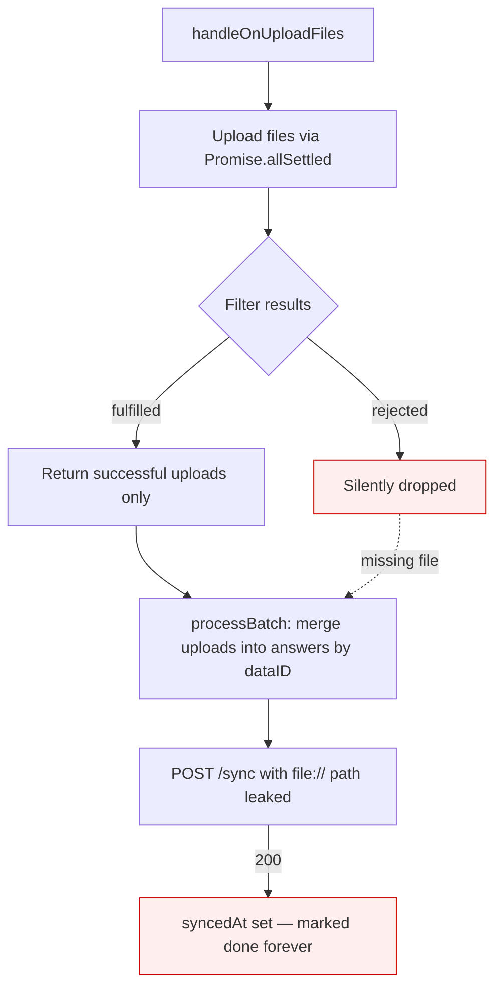
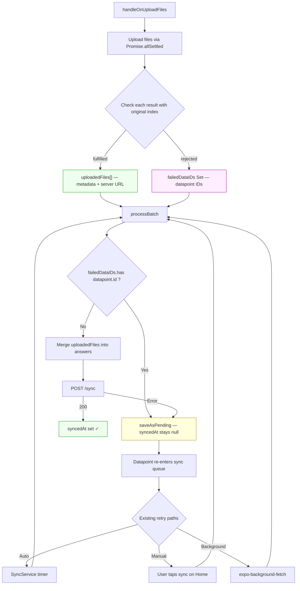

# Plan: Failed File Upload Retry for Submission Sync

## Problem

In `background-task.js`, `handleOnUploadFiles` silently drops failed uploads.
The downstream `processBatch` sends the datapoint to `/sync` with a raw
`file://` local path instead of the server URL. If the POST succeeds, the
datapoint gets `syncedAt` set and is **never retried** — the file is
permanently lost.

## Current flow (broken)



## Fixed flow



## Changes

### `handleOnUploadFiles` — return `{ uploadedFiles, failedDataIDs }`

```js
const uploadedFiles = [];
const failedDataIDs = new Set();
results.forEach((result, i) => {
  if (result.status === 'fulfilled') {
    uploadedFiles.push({ ...allFiles[i], ...result.value.data });
  } else {
    failedDataIDs.add(allFiles[i].dataID);
  }
});
return { uploadedFiles, failedDataIDs };
```

### `processBatch` — skip datapoints with failed uploads

```js
const { uploadedFiles: photos, failedDataIDs: failedPhotos } =
  await handleOnUploadFiles(data, '/images', [QUESTION_TYPES.photo]);
const { uploadedFiles: attachments, failedDataIDs: failedAttachments } =
  await handleOnUploadFiles(data, '/attachments', [QUESTION_TYPES.attachment]);

const failedUploadIDs = new Set([...failedPhotos, ...failedAttachments]);

// Inside reduce loop, before building syncData:
if (failedUploadIDs.has(d.id)) {
  counts.failed += 1;
  await crudDataPoints.saveAsPending(db, d.id);
  return;
}
```

### Files to change

Only `app/src/lib/background-task.js` — no other files need changes.

## Edge cases

| Case | Behavior |
|------|----------|
| Photo + attachment both fail for same datapoint | Both sets merged, datapoint skipped once |
| 2 photos, 1 fails | Whole datapoint skipped; on retry all files re-uploaded |
| All uploads succeed | `failedDataIDs` is empty Set, zero overhead |
| No files in batch | Returns `{ uploadedFiles: [], failedDataIDs: new Set() }`, no change |
