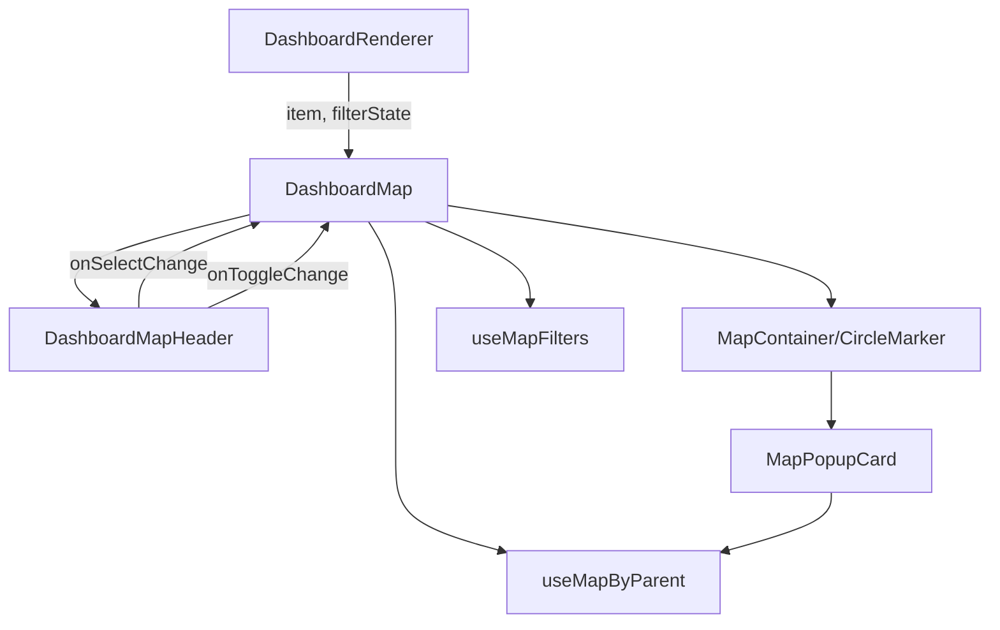
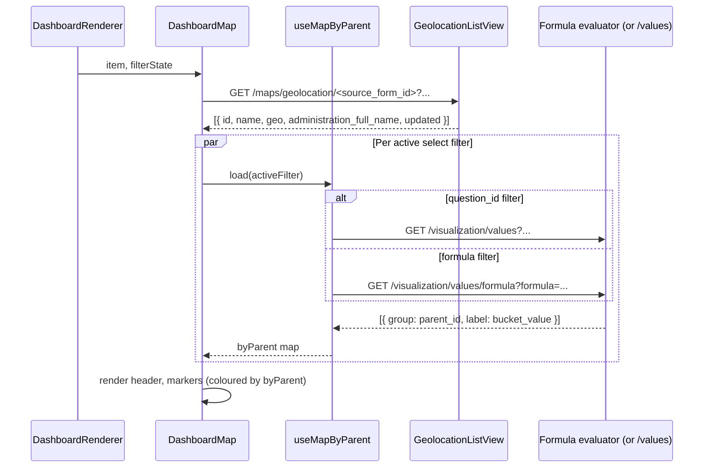
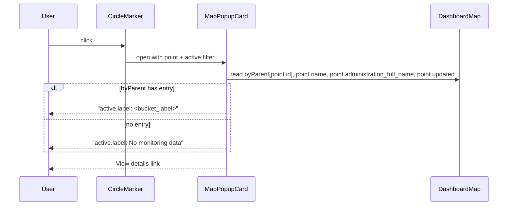

# Design — Filters for Dashboard Map View

Implements the requirements in [requirements.md](./requirements.md).
Decision log lives in [README.md](./README.md).

## 1. Config Schema

The `chart_type: "map"` item gains two new optional fields:
`filters[]` and `click_action`. Three legacy fields (`status_colors`,
`status_question_id`, `status_monitoring_form_id`) are removed. The
old `popup_fields[]` proposal is dropped — popup rows are now
implicit (3 fixed FormData rows + 1 dynamic row tied to the active
filter).

```jsonc
{
  "id": "map_main",
  "chart_type": "map",
  "title": "Monitored EPS",
  "order": 8,
  "col_span": 24,
  "height": 400,
  "source_form_id": 1749623934933,

  "filters": [
    {
      "type": "select",
      "key": "operational_status",
      "label": "Operational status",
      "form_id": 1749632545233,
      "question_id": 1749633373968,
      "color_map": {
        "operational": "#64A73B",
        "issue_with_system": "#e41a1c",
        "_no_info": "#999"
      }
    },
    {
      "type": "select",
      "key": "drinking_water_compliance",
      "label": "Drinking water compliance",
      "form_id": 1749632545233,
      "formula": {
        "buckets": [
          {
            "value": "compliant",
            "label": "Yes",
            "all_of": [
              { "question_id": 1749633220746, "op": "<=", "value": 0 },
              { "question_id": 1749633220745, "op": "<=", "value": 5 },
              { "question_id": 1749633259392, "op": "<=", "value": 0 },
              { "question_id": 1749633295165, "op": "<=", "value": 0 },
              { "question_id": 1797307852531, "op": "<=", "value": 30 },
              { "question_id": 1797307852532, "op": "between", "min": 6.5, "max": 8.5 },
              { "question_id": 1797307852533, "op": "<=", "value": 1000 },
              { "question_id": 1797307852534, "op": "<=", "value": 1 }
            ]
          }
        ],
        "default": { "value": "non_compliant", "label": "No" }
      },
      "color_map": {
        "compliant": "#64A73B",
        "non_compliant": "#e41a1c",
        "_no_info": "#999"
      }
    },
    {
      "type": "toggle",
      "key": "monitored_last_year",
      "label": "Monitored last year",
      "default": true,
      "rolling_months": 12
    }
  ],

  "click_action": "popup",
  "click_url_template": "/control-center/data/{parent_form_id}/monitoring/{data_id}"
}
```

### 1.1 Field reference

| Field | Type | Required | Notes |
|-------|------|----------|-------|
| `title` | string | no | Header title. Empty/absent → no title. |
| `filters[]` | array | no | Header controls; absent → no header row. |
| `filters[i].type` | `"select"` \| `"toggle"` | yes | Discriminator. |
| `filters[i].key` | string | yes | Stable identifier; used as React key and as an internal grouping key. |
| `filters[i].label` | string | yes | Visible label / placeholder. |
| `filters[i].form_id` | number | yes (select) | Form whose questions back the filter. Usually the **monitoring** form. |
| `filters[i].question_id` | number | mut. excl. with `formula` | When set, filter is question-id mode (FR-2). |
| `filters[i].formula` | object | mut. excl. with `question_id` | When set, filter is formula mode (FR-3). |
| `filters[i].color_map` | object | yes (select) | Maps bucket/answer value → CSS colour. `_no_info` is the fallback key. |
| `filters[i].default` | boolean | no (toggle) | Initial state. Default `false`. |
| `filters[i].rolling_months` | number | yes (toggle) | Months to subtract from `today` for `from_date`. |
| `click_action` | `"popup"` \| `"navigate"` | no | Default `"popup"`. `"navigate"` preserves legacy new-tab. |
| `click_url_template` | string | no | Used by both popup ("View details" link) and `"navigate"`. |

### 1.2 Formula schema

```jsonc
{
  "buckets": [
    {
      "value": "<bucket_value>",     // matches color_map key
      "label": "<bucket_label>",     // shown in dropdown + popup
      "all_of": [
        // Condition shapes (all evaluated against the LATEST repeat
        // of each question_id):
        { "question_id": 1234, "op": "<=", "value": 5 },
        { "question_id": 1235, "op": "between", "min": 6.5, "max": 8.5 },
        { "question_id": 1236, "op": "option_equals", "value": "yes" },
        { "question_id": 1237, "op": "option_in", "values": ["a", "b"] }
      ]
    }
  ],
  "default": { "value": "<fallback_value>", "label": "<fallback_label>" }
}
```

Supported operators (Phase 1):

| `op` | Numeric | Option | Notes |
|------|:-:|:-:|------|
| `<`, `<=`, `>`, `>=`, `==`, `!=` | yes | no | Numeric comparison (`Answers.value`). |
| `between` | yes | no | Inclusive: `min ≤ answer ≤ max`. |
| `option_equals` | no | yes | Single-option match (`Answers.options` includes value). |
| `option_in` | no | yes | OR-of-options. |

Buckets are evaluated **in declared order**; first match wins. If none
match, the `default` bucket is returned. If a referenced
`question_id` has no answer for the datapoint, that condition fails.
If the datapoint has no monitoring child, the popup shows "No
monitoring data" and the marker uses `color_map._no_info`.

## 2. Component Breakdown

The redesigned `DashboardMap.jsx` decomposes into one parent and four
small leaf modules, all in
`frontend/src/components/dashboard/DashboardMap/`:

```
DashboardMap/
├── index.jsx                    # main component (was DashboardMap.jsx)
├── DashboardMapHeader.jsx       # title + filters + legend row
├── MapPopupCard.jsx             # 4-row popup body
├── useMapFilters.js             # local filter state + derived URL params
├── useMapByParent.js            # fetches & caches per-parent filter values
└── styles.scss                  # popup tail-hide + chip styles
```

A backwards-compat re-export keeps
`frontend/src/components/dashboard/DashboardMap.jsx` working as a
one-liner that re-exports the new module.

### 2.1 Component dependencies



### 2.2 Data flow on mount



### 2.3 Data flow on marker click



No additional fetch is required on click — all data is already on the
component. (Decision #9: cache per-parent values for the lifetime of
the active filter.)

## 3. Backend Contract

### 3.1 `GET /api/v1/maps/geolocation/{form_id}` — extended

Existing endpoint at `backend/api/v1/v1_visualization/views.py:248`
(`GeolocationListView`). Two changes:

1. New query parameter:

   | Param | Type | Default | Description |
   |-------|------|---------|-------------|
   | `include_monitoring` | boolean | `false` | When `true`, the existing `from_date` / `to_date` params filter by the datapoint's **monitoring children's** `created` date instead of the datapoint's own. |

2. Per-point payload gains two fields:

   ```json
   {
     "id": 999,
     "name": "EPS A",
     "geo": [-17.5, 178.0],
     "administration_full_name": "Eastern | Lomaiviti | Levuka",
     "updated": "2026-05-04T12:34:56Z"
   }
   ```

#### 3.1.1 Server logic change (sketch)

In `GeolocationListView.get`, replace the existing date-filter block
(currently lines 308–313 of `views.py`):

```python
from_date = serializer.validated_data.get("from_date")
to_date = serializer.validated_data.get("to_date")
include_monitoring = serializer.validated_data.get(
    "include_monitoring", False
)

if include_monitoring:
    child_q = Q()
    if from_date:
        child_q &= Q(children__created__date__gte=from_date)
    if to_date:
        child_q &= Q(children__created__date__lte=to_date)
    if child_q:
        queryset = queryset.filter(
            child_q,
            children__is_pending=False,
            children__is_draft=False,
        ).distinct()
else:
    if from_date:
        queryset = queryset.filter(created__date__gte=from_date)
    if to_date:
        queryset = queryset.filter(created__date__lte=to_date)
```

`children` is the existing reverse relation on `FormData`
(`parent = ForeignKey(self, related_name="children")`, see
`backend/api/v1/v1_data/models.py:14`).

#### 3.1.2 Serializer changes

- Add `include_monitoring = serializers.BooleanField(required=False, default=False)`
  to `GeoLocationFilterSerializer`.
- Extend the per-point response serializer with
  `administration_full_name` (computed from
  `obj.administration.full_name` — already exposed on
  `Administration`) and `updated`.

### 3.2 New endpoint — formula evaluator

`GET /api/v1/visualization/values/formula`

Returns the same structure as the existing `GET /visualization/values`
endpoint so the frontend's `byParent` table works identically. GET
chosen for consistency with `/visualization/values` and because this
is a side-effect-free fetch.

#### Query parameters

| Param | Type | Required | Notes |
|-------|------|----------|-------|
| `form_id` | int | yes | The **monitoring** form (holds the questions referenced by the formula). |
| `group_by` | string | yes | Only `"parent_id"` supported in Phase 1. |
| `monitoring` | string | no | Default `"latest"`; selects the most recent monitoring child per `parent_id`. |
| `formula` | string | yes | URL-encoded JSON blob — see §1.2 for the shape. Same trick `criteria` uses for its mini-grammar. |
| `criteria` | string | no | Reuses the existing `apply_criteria_to_monitoring_qs` helper so formula composes with question-id filters. |
| `from_date` | ISO date | no | Reused for the toggle filter. |
| `to_date` | ISO date | no | Reused for the toggle filter. |

#### URL-length note

The example formula in §1 (one bucket, eight conditions) URL-encodes
to ~700 chars. nginx's default `large_client_header_buffers` is 8 KB
— a 10× headroom. If a future formula grows past that limit, the
endpoint can switch to POST without breaking callers (the request
serializer already validates a JSON object; only the verb changes).

#### Response

```json
{
  "data": [
    { "group": 999, "label": "compliant" },
    { "group": 1000, "label": "non_compliant" }
  ]
}
```

Identical shape to existing `GET /visualization/values`. `group` is
the `parent_id` and `label` is the matched bucket's `value` (not its
human label — frontend already has the human label from the config).

#### Server logic (sketch)

```python
def evaluate_formula(formula, answers_by_question):
    """answers_by_question: dict[int, Answers] — latest repeat already picked."""
    for bucket in formula["buckets"]:
        if all(_match(cond, answers_by_question) for cond in bucket["all_of"]):
            return bucket["value"]
    return formula["default"]["value"]


def _match(cond, answers):
    ans = answers.get(cond["question_id"])
    if ans is None:
        return False
    op = cond["op"]
    if op in {"<", "<=", ">", ">=", "==", "!="}:
        return _numeric_op(op, ans.value, cond["value"])
    if op == "between":
        return cond["min"] <= ans.value <= cond["max"]
    if op == "option_equals":
        return cond["value"] in (ans.options or [])
    if op == "option_in":
        return any(v in (ans.options or []) for v in cond["values"])
    return False
```

The "latest repeat" rule is realised by ordering each datapoint's
answers by `(question, -index)` and picking the first per
`question_id`.

#### Permissions

Mirror `/visualization/values` — same auth class, same admin-scope
filter.

### 3.3 Frontend hook contract

```js
// useMapByParent.js (signature)
export const useMapByParent = ({
  sourceFormId,
  monitoringFormId,
  activeFilter, // { type, key, question_id?, formula? }
  filterState,  // dashboard-level
}) => {
  // returns { byParent: Map<id, bucket_value>, loading, error }
};
```

Internally the hook routes to `GET /visualization/values` for
question-id filters and `GET /visualization/values/formula` for
formula filters. Both produce a
`Map<parent_id, bucket_value_string>`.

## 4. URL Composition Examples

### 4.1 Question-id filter active, toggle ON, no dashboard date filter

```
GET /api/v1/maps/geolocation/1749623934933
  ?criteria=option_equals:1749633373968:operational
  &from_date=2025-05-04
  &to_date=2026-05-04
  &include_monitoring=true

GET /api/v1/visualization/values
  ?form_id=1749632545233
  &question_id=1749633373968
  &group_by=parent_id
  &monitoring=latest
```

### 4.2 Formula filter active, toggle OFF

```
GET /api/v1/maps/geolocation/1749623934933

GET /api/v1/visualization/values/formula
  ?form_id=1749632545233
  &group_by=parent_id
  &monitoring=latest
  &formula=%7B%22buckets%22%3A%5B%7B%22value%22%3A%22compliant%22%2C%22label%22%3A%22Yes%22%2C%22all_of%22%3A%5B...%5D%7D%5D%2C%22default%22%3A%7B%22value%22%3A%22non_compliant%22%2C%22label%22%3A%22No%22%7D%7D
```

The `formula` value is the URL-encoded JSON of:
```json
{
  "buckets": [{ "value": "compliant", "label": "Yes", "all_of": [...] }],
  "default": { "value": "non_compliant", "label": "No" }
}
```

If the user then picks "Yes" in the dropdown, the geolocation list
itself does **not** narrow server-side (formula evaluation is too
expensive to run twice). Instead the frontend filters its already-
fetched points by `byParent[point.id] === selectedBucketValue` before
rendering markers. Marker hide is therefore client-side for formula
filters and server-side for question-id filters. The user-visible
behaviour is identical.

### 4.3 Dashboard-level date filter active

Toggle is disabled, `include_monitoring` is omitted, `from_date` /
`to_date` filter the datapoint's own `created` (legacy behaviour).

## 5. Popup Rendering

### 5.1 Layout

```
┌───────────────────────────────────────────┐
│ Name:          EPS A                      │
├───────────────────────────────────────────┤
│ Location:      Eastern | Lomaiviti | Levuka│
├───────────────────────────────────────────┤
│ Last update:   23/05/2022                 │
├───────────────────────────────────────────┤
│ Operational status: Operational           │
├───────────────────────────────────────────┤
│                       [View details ↗]    │
└───────────────────────────────────────────┘
```

### 5.2 Active filter resolution

`MapPopupCard` reads the active filter from the parent (most-recently-
changed select filter, falling back to the first declared select
filter). It then:

1. Reads `byParent[point.id]` from `useMapByParent`.
2. If `bucket_value` is a known key in the active filter's `color_map`
   (or a known bucket label), looks up the human label:
   - Question-id filter: resolve via `window.forms[form_id]` for the
     option's `label`.
   - Formula filter: resolve via the filter's `formula.buckets[]` (or
     `formula.default`).
3. If `byParent[point.id]` is missing, render "No monitoring data".

### 5.3 Tail/pointer hidden

`styles.scss`:

```scss
.dashboard-map-popup .leaflet-popup-tip,
.dashboard-map-popup .leaflet-popup-tip-container {
  display: none;
}
.dashboard-map-popup .leaflet-popup-content-wrapper {
  border-radius: 8px;
  padding: 0;
}
.dashboard-map-popup .map-popup-row {
  display: flex;
  justify-content: space-between;
  padding: 8px 12px;
  border-bottom: 1px solid #f0f0f0;
}
.dashboard-map-popup .map-popup-row:last-child {
  border-bottom: none;
}
```

The `MapContainer` adds `className="dashboard-map-popup"` so the rules
do not bleed into other Leaflet popups in the app.

## 6. ESLint compliance notes

- All `if`/`else` bodies use braces (`curly: error`).
- No bare `undefined` identifier — use `typeof x === "undefined"` or
  default destructuring.
- All callbacks passed to `Array.prototype.map`/`.filter`/etc. are
  arrow functions.
- `useEffect` early-returns return a no-op `() => {}` cleanup.

## 7. Migration Plan

1. **Backend — `include_monitoring` + popup metadata.**
   - Add the param to `GeoLocationFilterSerializer`.
   - Update `GeolocationListView` filter logic.
   - Add `administration_full_name` and `updated` to the
     `GeoLocationListSerializer`.
   - Backend tests for the three behaviour paths
     (`include_monitoring=false`, `=true`, combined with `criteria`).
2. **Backend — formula evaluator.**
   - New `GET /api/v1/visualization/values/formula` view + serializer.
   - Latest-repeat resolution helper.
   - Tests covering numeric ops, `between`, option ops, default
     bucket, missing-answer condition failure, and parent_id grouping.
3. **Frontend — refactor `DashboardMap`.**
   - Move `DashboardMap.jsx` into the new module folder.
   - Implement `DashboardMapHeader`, `MapPopupCard`, `useMapFilters`,
     `useMapByParent`.
   - Drop `status_colors`, `status_question_id`,
     `status_monitoring_form_id` reads.
4. **Frontend — tests.**
   - Header rendering, filter changes, toggle semantics.
   - Popup rendering for question-id and formula filters.
   - "No monitoring data" branch.
5. **Config migration.**
   - Update `frontend/src/config/visualizations/1749621221728.json`
     and `1749623934933.json` to use the new schema, drawing actual
     question IDs from `backend/source/forms/`.
6. **Visual verification.**
   - Both dashboards render in the browser with the new header,
     popup, and toggle.
   - `yarn lint && yarn prettier` in the frontend container.
   - `./dc.sh exec backend python manage.py test` for backend tests.

## 8. Out of Scope (noted for future tickets)

- Cross-widget filter propagation (decision #7).
- Multi-language labels for `filter.label` and bucket labels.
- Per-repeat answer rendering inside the popup (decision #14 — latest
  repeat only).
- Marker clustering for very dense forms.
- A configurable basemap selector.
- Frontend formula evaluation (decision #13 — Phase 1 is backend).
- Aggregating across repeats (sum, average, all-must-pass, etc.).
