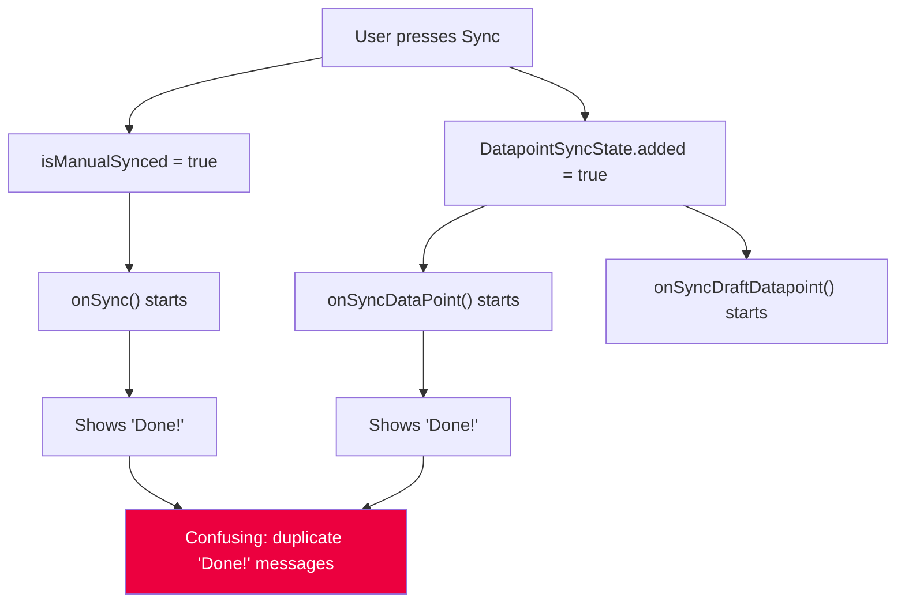
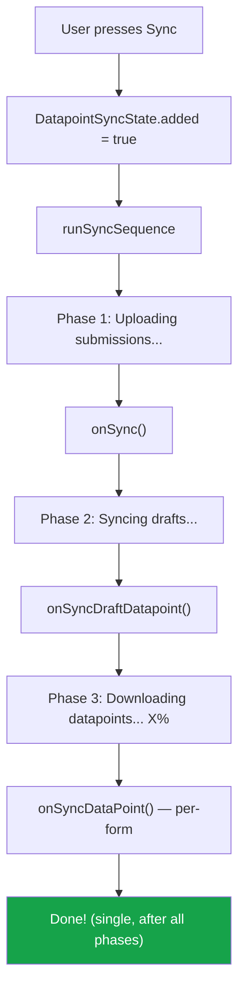
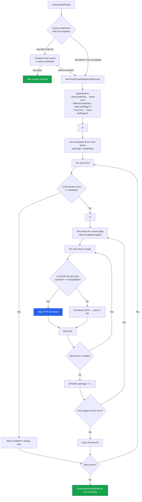

# Fix Memory Bottlenecks: Per-Form Datapoint Sync

## Context

The mobile app crashes with OOM on Samsung Galaxy A14 (5.96GB RAM) when syncing large datasets (15+ forms, 500+ datapoints). The screenshot shows Android's "Clear cache for DWS DataPro?" dialog - the app is being killed by the OS.

**Root Cause 1 - Memory accumulation**: `SyncService.onSyncDataPoint()` processes ALL datapoints across ALL forms in a single stream. The `formCache` Map accumulates parsed JSON definitions for every form encountered (~50-200KB each). With 15 forms, this is 750KB-3MB of parsed objects that can't be GC'd until the entire sync finishes.

**Root Cause 2 - Crash in background-task.js**: Sentry shows `TypeError: Cannot convert undefined value to object` at `processBatch` line 189: `new Set([...failedPhotos, ...failedAttachments])`. Under memory pressure, `handleOnUploadFiles` returns undefined, and the destructured variables become undefined.

**Root Cause 3 - Concurrent sync confusion**: Three sync processes (`onSync`, `onSyncDraftDatapoint`, `onSyncDataPoint`) run concurrently, causing duplicate "Done!" statusBar messages and confusing UX. The user has no visibility into which sync phase is active.

**Strategy**: Download and process datapoints one form at a time. Show per-form progress on Home page cards. Fix the crash defensively. Run all sync processes sequentially with phase-specific status messages.

## Files Modified

| # | File | Change |
|---|------|--------|
| 1 | `app/src/lib/background-task.js` | Fix crash: defensive defaults for `handleOnUploadFiles` return; guard success statusBar |
| 2 | `app/src/store/datapoint-sync.js` | Add `syncingFormId` and `formProgress` to store |
| 3 | `app/src/lib/sync-datapoints.js` | Add `fetchAndGroupDatapointsByForm()`; skip-unchanged check in `downloadDatapointsJson` |
| 4 | `app/src/components/SyncService.js` | Per-form processing + sequential sync orchestrator + persistent queue |
| 5 | `app/src/components/Card.js` | Add sync progress bar UI |
| 6 | `app/src/components/BaseLayout/Content.js` | Subscribe directly to `DatapointSyncState` for sync state; pass to Card with type-safe formId comparison |
| 7 | `app/src/pages/Home.js` | Guard duplicate job creation; handle stale ON_PROGRESS jobs (no longer passes sync props to Content) |
| 8 | `app/src/components/NetworkStatusBar.js` | Show phase-specific sync labels |
| 9 | `app/src/lib/i18n/ui-text.js` | Add i18n keys for sync phases (en + fr) |
| 10 | `app/src/database/tables.js` | Add `datapoint_sync_queue` table definition |
| 11 | `app/src/lib/constants.js` | Bump `DATABASE_VERSION` from 3 to 4 |
| 12 | `app/src/database/migrations/04_create_datapoint_sync_queue.js` | New migration for sync queue table |
| 13 | `app/src/database/migrations/index.js` | Export `m04` |
| 14 | `app/App.js` | Add v3→v4 migration step |
| 15 | `app/src/database/crud/crud-sync-queue.js` | CRUD module for persistent sync queue (`upsertQueue`, `hasEntries`, `hasIncomplete`, etc.) |
| 16 | `app/src/database/crud/index.js` | Export `crudSyncQueue` |
| 17 | `app/src/database/crud/crud-datapoints.js` | Add `countSyncedByFormId(db, backendFormId)` for quick local count check |
| 18 | `app/src/components/LogoutButton.js` | Truncate `datapoint_sync_queue`; reset all `DatapointSyncState` fields; reset `UIState.statusBar` |

## Step 1: Fix crash in `background-task.js`

**File**: `app/src/lib/background-task.js`

### What the Sentry crash shows

The `failed-upload-retry-plan.md` was already implemented - `handleOnUploadFiles` now returns
`{ uploadedFiles, failedDataIDs }` (lines 162-171). Every code path has an explicit return.
Yet the crash still occurs at line 191: `new Set([...failedPhotos, ...failedAttachments])`.

Sentry error: `TypeError: Cannot convert undefined value to object`
This is Hermes engine's error for `[...undefined]` - meaning `failedPhotos` or `failedAttachments` is `undefined`.

### Why it crashes despite correct return statements

Both `handleOnUploadFiles` calls completed **without throwing** - if they had thrown,
the error would appear at the destructuring line, not at line 191. Yet one of the destructured
`failedDataIDs` values is `undefined`, meaning the function returned an object missing that property.

Under severe memory pressure, the Hermes JS engine can produce incomplete/corrupted return
objects rather than throwing cleanly - a known class of issues in constrained JS runtimes.

### The fix: two layers of defense

```javascript
// Defensive defaults: under OOM conditions, Hermes can produce incomplete return objects
// from handleOnUploadFiles. The `|| {}` + default values prevent TypeError on spread.
const {
  uploadedFiles: photos = [],
  failedDataIDs: failedPhotos = new Set(),
} = (await handleOnUploadFiles(data, '/images', [QUESTION_TYPES.photo])) || {};
const {
  uploadedFiles: attachments = [],
  failedDataIDs: failedAttachments = new Set(),
} = (await handleOnUploadFiles(data, '/attachments', [QUESTION_TYPES.attachment])) || {};

const failedUploadIDs = new Set([...failedPhotos, ...failedAttachments]);
```

**Layer 1: `|| {}`** - If `handleOnUploadFiles` returns `undefined`/`null` entirely
(function return corrupted by OOM), fall back to empty object so destructuring doesn't crash.

**Layer 2: `= new Set()` / `= []` defaults** - If the returned object is missing `failedDataIDs`
or `uploadedFiles` properties (incomplete object from OOM), default to safe empty values.

### StatusBar guard in `syncFormSubmission`

Added `DatapointSyncState.getRawState()` check before showing success statusBar:

```javascript
if (totalSuccess > 0 && totalFailed === 0) {
  const { inProgress: datapointSyncActive } = DatapointSyncState.getRawState();
  UIState.update((s) => {
    s.isManualSynced = false;
    s.refreshPage = true;
    // Only show success if datapoint sync is not still running
    if (!datapointSyncActive) {
      s.statusBar = {
        type: SYNC_STATUS.success,
        bgColor: '#16a34a',
        icon: 'checkmark-done',
      };
    }
  });
}
```

This prevents `syncFormSubmission` from showing premature "Done!" when the sequential
sync orchestrator is still running Phase 2 or Phase 3.

## Step 2: Expand `DatapointSyncState` store

**File**: `app/src/store/datapoint-sync.js`

Added two new fields (plain object for Pullstate compatibility, not Map):

```javascript
const DatapointSyncState = new Store({
  inProgress: false,
  progress: 0,
  added: false,
  completed: false,
  draftInProgress: false,
  syncingFormId: null,    // backend formId currently being synced (download phase)
  formProgress: {},       // { [formId]: { total: number, processed: number } }
});
```

## Step 3: Add `fetchAndGroupDatapointsByForm` to `sync-datapoints.js`

**File**: `app/src/lib/sync-datapoints.js`

New exported function that pages through `/datapoint-list` and groups lightweight metadata by `form_id`.
Accepts an optional `onPageReceived` callback for incremental UI updates during metadata collection:

```javascript
export const fetchAndGroupDatapointsByForm = async (onPageReceived = null, pageSize = 20) => {
  const formGroups = new Map();
  let totalCount = 0;

  const fetchPage = async (currentPage, totalPages) => {
    if (currentPage > totalPages) { return; }
    const { data: apiData } = await api.get(
      `/datapoint-list?page=${currentPage}&page_size=${pageSize}`,
    );
    const { data, total_page: totalPage, current: page } = apiData;

    data.forEach((item) => {
      const { form_id: formId } = item;
      if (!formGroups.has(formId)) { formGroups.set(formId, []); }
      formGroups.get(formId).push({
        url: item.url,
        formId,
        administrationId: item.administration_id,
        lastUpdated: item.last_updated,
      });
    });
    totalCount += data.length;

    if (onPageReceived) {
      await onPageReceived(formGroups, totalCount);
    }

    await fetchPage(page + 1, totalPage);
  };

  await fetchPage(1, 1);
  return { formGroups, totalCount };
};
```

**Default page size**: 20 (not 100) to keep memory per page low.

**Incremental callback**: The `onPageReceived` callback fires after each page, allowing
`SyncService` to update `DatapointSyncState.formProgress` incrementally. Without this,
formProgress would jump from empty to fully populated, which is confusing in the UI.

**Memory**: ~100 bytes/item metadata. 500 items = ~50KB total. Negligible compared to current approach.

## Step 4: Refactor `SyncService.js` — Per-form processing + Sequential sync

**File**: `app/src/components/SyncService.js`

### Per-form datapoint processing (`onSyncDataPoint`)

Replaced single-stream approach with two-phase per-form processing:

1. **Metadata phase**: Call `fetchAndGroupDatapointsByForm(onPageReceived)` to collect metadata,
   updating `formProgress` incrementally as each page arrives
2. **Download phase**: Iterate forms using `reduce` pattern (ESLint compliant), fresh `formCache` per form

Key details:
- Import `fetchAndGroupDatapointsByForm` instead of `fetchDatapointsPageByPage`
- Reset `syncingFormId`/`formProgress` on start and end
- Process forms sequentially with `formEntries.reduce(async ...)`
- Create fresh `formCache = new Map()` per form, call `.clear()` after each
- Update `DatapointSyncState.syncingFormId` as each form starts
- Update `DatapointSyncState.formProgress[formId].processed` per item

**Memory win**: formCache holds at most 1 entry (current form) instead of accumulating all 15+ forms.

### Sequential sync orchestrator (`runSyncSequence`)

Replaced two concurrent trigger effects with a single `runSyncSequence` callback that
chains the three sync processes sequentially:

```javascript
const runSyncSequence = useCallback(async () => {
  // Prevent premature success statusBar from syncFormSubmission
  DatapointSyncState.update((s) => { s.inProgress = true; });

  // Phase 1: Upload submitted datapoints
  UIState.update((s) => {
    s.statusBar = {
      type: SYNC_STATUS.on_progress, bgColor: '#2563eb',
      icon: 'cloud-upload', syncPhase: 'uploading',
    };
  });
  try { await onSync(); } catch (error) { Sentry.captureException(error); }

  // Phase 2: Sync draft datapoints
  UIState.update((s) => {
    s.statusBar = {
      type: SYNC_STATUS.on_progress, bgColor: '#2563eb',
      icon: 'cloud-upload', syncPhase: 'syncing_drafts',
    };
  });
  try { await onSyncDraftDatapoint(); } catch (error) { Sentry.captureException(error); }

  // Phase 3: Download all datapoints from server
  UIState.update((s) => {
    s.statusBar = {
      type: SYNC_STATUS.on_progress, bgColor: '#2563eb',
      icon: 'cloud-download', syncPhase: 'downloading',
    };
  });
  try { await onSyncDataPoint(); } catch (error) { Sentry.captureException(error); }

  // All phases complete
  UIState.update((s) => {
    s.isManualSynced = false;
    s.refreshPage = true;
    s.statusBar = {
      type: SYNC_STATUS.success, bgColor: '#16a34a', icon: 'checkmark-done',
    };
  });
}, [onSync, onSyncDraftDatapoint, onSyncDataPoint]);
```

**Trigger**: Single `DatapointSyncState.subscribe(s => s.added)` subscription calls `runSyncSequence`.
The periodic timer for background `onSync` (submission upload) remains independent.

**StatusBar ownership**: Individual functions (`onSync`, `onSyncDraftDatapoint`, `onSyncDataPoint`)
no longer set success statusBar or `refreshPage`. The orchestrator handles the final success
after all phases complete. Each phase sets `statusBar.syncPhase` so `NetworkStatusBar` knows
which phase is active.

**Premature success prevention**: The orchestrator sets `DatapointSyncState.inProgress = true`
at the start. This prevents `syncFormSubmission` (called by `onSync` in Phase 1) from showing
"Done!" before Phases 2 and 3 complete, since `syncFormSubmission` checks
`DatapointSyncState.getRawState().inProgress` before setting success statusBar.

## Step 5: Update `Card.js` with sync progress bar

**File**: `app/src/components/Card.js`

Added `syncing` and `syncProgress` props. When syncing, show a blue border and a thin View-based progress bar:

```javascript
const Card = ({ title = null, subTitles = [], syncing = false, syncProgress = 0 }) => (
  <RneCard containerStyle={[styles.container, syncing && styles.syncingContainer]}>
    {title && <RneCard.Title style={styles.title}>{title}</RneCard.Title>}
    {subTitles?.map((s, sx) => (<Text key={sx}>{s}</Text>))}
    {syncing && (
      <View style={styles.progressBarContainer} testID="sync-progress-bar">
        <View style={[styles.progressBarFill,
          { width: `${Math.min(Math.max(syncProgress, 0), 100)}%` }]} />
      </View>
    )}
  </RneCard>
);
```

- `syncingContainer`: `borderColor: '#2563eb'`, `borderWidth: 2`
- Progress bar: 4px height, `#e5e7eb` background, `#2563eb` fill (matches sync status bar color)

## Step 6: Update `Content.js` to pass sync state to cards

**File**: `app/src/components/BaseLayout/Content.js`

Subscribe **directly** to `DatapointSyncState` via `useState` (no longer receives props from Home).
Type-safe comparison using `Number()`:

```javascript
import { DatapointSyncState } from '../../store';

const Content = ({ children = null, data = [], columns = 1, action = null }) => {
  const syncingFormId = DatapointSyncState.useState((s) => s.syncingFormId);
  const formProgress = DatapointSyncState.useState((s) => s.formProgress);

  // ... in the map:
  const cardFormId = d?.formId ? Number(d.formId) : null;
  const isSyncing = syncingFormId != null && cardFormId === Number(syncingFormId);
  const progress = cardFormId ? formProgress[cardFormId] : null;
  const syncPercent = isSyncing && progress?.total > 0
    ? (progress.processed / progress.total) * 100 : 0;
  // Pass syncing={isSyncing} syncProgress={syncPercent} to Card
};
```

**Type safety**: `formId` from the database may be a string, while `syncingFormId` from the
backend API is a number. Using `Number()` on both sides ensures correct comparison.

Cards remain tappable during sync (users can view existing submissions).

## Step 7: Update `Home.js` — simplified (sync state moved to Content)

**File**: `app/src/pages/Home.js`

No longer subscribes to `DatapointSyncState.syncingFormId` or `formProgress` — those are now
consumed directly by `Content.js` via `useState`. Home still uses `DatapointSyncState` for:
- `.subscribe()` in `useEffect` to track `inProgress`/`draftInProgress` for button loading state
- `.update()` in `handleOnSync` to set `inProgress`/`added`

No `syncingFormId`/`formProgress` props passed to Content:

```javascript
<BaseLayout.Content
  data={filteredData}
  action={goToSubmission}
  columns={2}
/>
```

## Step 8: Update `NetworkStatusBar.js` with phase-specific labels

**File**: `app/src/components/NetworkStatusBar.js`

Replaced static `syncingLabel` with `getSyncPhaseLabel()` that reads `statusBar.syncPhase`:

```javascript
const getSyncPhaseLabel = () => {
  const { syncPhase } = statusBar || {};
  if (syncPhase === 'uploading') return trans.uploadingSubmissionsText;
  if (syncPhase === 'syncing_drafts') return trans.syncingDraftsText;
  if (syncPhase === 'downloading') {
    return syncInProgress && syncProgress > 0
      ? `${trans.downloadingDatapointsText} ${Math.round(syncProgress)}%`
      : trans.downloadingDatapointsText;
  }
  // Fallback for timer-based background sync
  return syncInProgress && syncProgress > 0
    ? `${trans.syncingText} ${Math.round(syncProgress)}%`
    : trans.syncingText;
};
```

The user now sees phase-specific messages in the status bar:
- "Uploading submissions..." (Phase 1)
- "Syncing drafts..." (Phase 2)
- "Downloading datapoints... 42%" (Phase 3, with progress)
- "Done!" (all phases complete, auto-dismisses after 3 seconds)

## Step 9: Add i18n keys

**File**: `app/src/lib/i18n/ui-text.js`

Added three new keys in both English and French:

| Key | English | French |
|-----|---------|--------|
| `uploadingSubmissionsText` | Uploading submissions... | Envoi des soumissions... |
| `syncingDraftsText` | Syncing drafts... | Synchronisation des brouillons... |
| `downloadingDatapointsText` | Downloading datapoints... | Téléchargement des données... |

## Sync Flow: Before vs After

### Before (concurrent)



All three run concurrently, each managing its own statusBar → duplicate "Done!" messages.

### After (sequential)



## Memory Impact

| Metric | Before | After |
|--------|--------|-------|
| formCache entries during sync | All forms (15+) | 1 form at a time |
| Peak form JSON in memory | 750KB-3MB (15 forms) | 50-200KB (1 form) |
| Metadata collection | None (stream) | ~50KB (500 items) |
| Crash on undefined uploads | Yes (TypeError) | No (defensive defaults) |
| Concurrent sync processes | 3 simultaneous | 1 at a time (sequential) |
| StatusBar "Done!" messages | Multiple/confusing | Single, after all phases |

## Verification (Steps 1-9)

1. Run `npx eslint --no-cache` in `app/` to verify ESLint compliance
2. Test on device with production data (`start.sh` already points to prod server):
   - Press sync button on Home page
   - Verify status bar shows phase-specific messages sequentially
   - Verify cards show blue border + progress bar one at a time during Phase 3
   - Verify app does NOT crash during full sync
   - Verify single "Done!" appears only after all phases complete
   - Verify all datapoints are synced correctly after completion
3. Test background submission sync still works (periodic timer calls `onSync` independently)
4. Test re-sync: if Phase 3 fails, `DatapointSyncState.added=true` triggers a new full sequence

---

# Step 10: Resumable Datapoint Sync with Per-Form Page Tracking

## Context

`onSyncDataPoint` always starts from scratch — fetching all metadata pages and downloading every datapoint JSON via HTTP. If the user closes the app mid-sync (this is a foreground-only process), all progress is lost. With 500+ datapoints each requiring an HTTP download, restarting from zero is very time-consuming.

Additionally, the backend updates `MobileAssignment.last_synced_at` when the client fetches the **last metadata page** (`backend/api/v1/v1_mobile/views.py:607-609`), not when downloads complete. If the app closes after metadata fetch but before all downloads finish, those undownloaded items won't appear in future metadata fetches — they're lost.

**Solution**: Track sync progress per form in SQLite. Each form records which page (batch of items) was last completed and the total expected count. On resume, skip completed forms and continue partially-done forms from the next page. The skip-unchanged check in `downloadDatapointsJson` handles individual items within a partially-completed page.

## New table: `datapoint_sync_queue`

```sql
CREATE TABLE IF NOT EXISTS datapoint_sync_queue (
  id INTEGER PRIMARY KEY AUTOINCREMENT,
  formId INTEGER NOT NULL,
  lastPage INTEGER DEFAULT 0,
  totalPage INTEGER DEFAULT 0,
  totalData INTEGER DEFAULT 0
)
```

One row per form. Fields:
- `formId` — backend form ID
- `lastPage` — last fully-processed page (batch) of items for this form
- `totalPage` — total pages for this form (`ceil(totalData / PAGE_SIZE)`)
- `totalData` — total datapoints from backend for verification

Example state mid-sync:

| formId | lastPage | totalPage | totalData |
|--------|----------|-----------|-----------|
| 100    | 3        | 5         | 95        |
| 200    | 5        | 5         | 100       |
| 300    | 0        | 8         | 150       |

Form 200 is fully done (skip). Form 100 resumes from page 4. Form 300 starts from page 1.

## Revised sync flow



## Files modified (Step 10)

| # | File | Change |
|---|------|--------|
| 10a | `app/src/database/tables.js` | Add `datapoint_sync_queue` table definition |
| 10b | `app/src/lib/constants.js` | Bump `DATABASE_VERSION` from 3 to 4 |
| 10c | `app/src/database/migrations/04_create_datapoint_sync_queue.js` | New migration |
| 10d | `app/src/database/migrations/index.js` | Export `m04` |
| 10e | `app/App.js` | Add v3→v4 migration step |
| 10f | `app/src/database/crud/crud-sync-queue.js` | New CRUD module (`upsertQueue` replaces `populateQueue`/`clearQueue`) |
| 10g | `app/src/database/crud/index.js` | Export `crudSyncQueue` |
| 10h | `app/src/lib/sync-datapoints.js` | Skip-unchanged check in `downloadDatapointsJson` |
| 10i | `app/src/components/SyncService.js` | Refactor `onSyncDataPoint` — unified flow with quick re-check skip |
| 10j | `app/src/pages/Home.js` | Guard duplicate job creation; handle stale ON_PROGRESS jobs |
| 10k | `app/src/database/crud/crud-datapoints.js` | Add `countSyncedByFormId(db, backendFormId)` |
| 10l | `app/src/components/LogoutButton.js` | Truncate `datapoint_sync_queue`; reset `DatapointSyncState` and `UIState.statusBar` |

### 10a: Table definition

**File**: `app/src/database/tables.js` — Add to `tables` array:

```javascript
{
  name: 'datapoint_sync_queue',
  fields: {
    id: 'INTEGER PRIMARY KEY AUTOINCREMENT',
    formId: 'INTEGER NOT NULL',
    lastPage: 'INTEGER DEFAULT 0',
    totalPage: 'INTEGER DEFAULT 0',
    totalData: 'INTEGER DEFAULT 0',
  },
},
```

### 10b–10e: Database migration

Same as before — bump `DATABASE_VERSION` to 4, create migration file, export, register in `App.js`.

### 10f: CRUD module

**File**: `app/src/database/crud/crud-sync-queue.js`

| Method | Purpose |
|--------|---------|
| `hasIncomplete(db)` | `SELECT COUNT(*) WHERE lastPage < totalPage` — quick check for resume |
| `hasEntries(db)` | `SELECT COUNT(*) FROM datapoint_sync_queue` — check if queue has any rows at all |
| `getIncompleteForms(db)` | `SELECT * WHERE lastPage < totalPage` |
| `getAllProgress(db)` | Get all rows (for building `formProgress` state) |
| `upsertQueue(db, formEntries)` | Per-form upsert: if exists AND `totalData` changed → reset `lastPage=0`, update `totalPage`/`totalData`; if exists AND `totalData` matches → leave as-is (completed, will be skipped); if new → insert with `lastPage=0` |
| `updateLastPage(db, formId, lastPage)` | `UPDATE SET lastPage = ? WHERE formId = ?` |

Note: `clearQueue` and `populateQueue` were removed. The `upsertQueue` method replaces `populateQueue` with smarter merge logic that preserves completed entries when data hasn't changed.

### 10g: Export from CRUD index

Same as before.

### 10h: Skip-unchanged optimization

**File**: `app/src/lib/sync-datapoints.js`

Same as before — resolve form from cache first, extract UUID, check `syncedAt >= lastUpdated`, skip HTTP if up-to-date.

### 10i: Refactor `onSyncDataPoint`

**File**: `app/src/components/SyncService.js`

Page size constant: `SYNC_PAGE_SIZE = 20` (items per page within a form).

Simplified from 3 separate paths to a unified flow:

1. **Quick check**: If queue `hasEntries` AND all entries are complete (`!hasIncomplete`), compare local synced counts (`countSyncedByFormId`) against `totalData` for each form. If all match, skip entirely (instant re-check).
2. **Otherwise**: Fetch metadata via `fetchAndGroupDatapointsByForm()` → `upsertQueue` (handles fresh, resume, and data-changed cases) → download incomplete forms.

**`upsertQueue` behavior**:
- Forms with same `totalData` stay completed (skipped on download)
- Forms with different `totalData` get reset to `lastPage=0` (re-downloaded)
- New forms inserted with `lastPage=0`

**Per-form processing**:
1. Get this form's items from metadata
2. Check local synced count — skip if already fully synced
3. Skip first `lastPage * SYNC_PAGE_SIZE` items (already completed)
4. Process remaining items in pages of `SYNC_PAGE_SIZE`
5. After each page: `crudSyncQueue.updateLastPage(db, formId, currentPage)`
6. Skip-unchanged check in `downloadDatapointsJson` handles items within a partially-completed page
7. Clear `formCache` after each form

**No `clearQueue` calls**: Queue is preserved after successful sync for the next re-check. Stale job detection also does not call `clearQueue`.

### 10j: Fix job handling

**File**: `app/src/pages/Home.js`

Guard duplicate job creation — check for existing `SYNC_DATAPOINT_JOB_NAME` job before creating a new one (same pattern already used for `SYNC_FORM_SUBMISSION_TASK_NAME`).

**File**: `app/src/components/SyncService.js`

Handle stale ON_PROGRESS jobs in `onSyncDataPoint` — if a job is ON_PROGRESS (app was killed mid-sync), reset it to PENDING with `attempt + 1` so the queue can resume. If `attempt >= MAX_ATTEMPT`, delete the job and reset sync state.

## Resume behavior

| Scenario | What happens |
|----------|-------------|
| Fresh sync (empty queue) | Fetch metadata → upsertQueue → process page-by-page → queue preserved |
| App closed mid-download | Queue persists with `lastPage` per form → next sync resumes from `lastPage + 1` |
| Partially-completed page | Skip-unchanged check skips already-downloaded items on the page |
| Form fully done (`lastPage = totalPage`) | Skipped entirely on resume |
| `totalData` mismatch on resume | `upsertQueue` resets that form's `lastPage=0` (others stay completed) |
| Second sync, no changes | Queue has completed entries, local counts match → skip entirely (instant) |
| Second sync, some new data | `upsertQueue` resets changed forms, leaves unchanged forms completed |
| Stale ON_PROGRESS job | Reset to PENDING → resume queue (no clearQueue) |

## Verification (Step 10)

1. `npx eslint --no-cache` on all modified files
2. Test on device:
   - Fresh sync: queue populated, progress indicators work, queue preserved after
   - Kill app mid-sync: reopen, verify sync resumes from next page (not from page 1)
   - Second sync (no server changes): queue has completed entries, local counts match → skip entirely (instant)
   - Second sync (some new data): changed forms re-downloaded, unchanged forms skipped
   - Verify `totalData` matches between backend and local count
   - Verify migration works on existing v3 database
   - Verify stale ON_PROGRESS job is recovered on app reopen
   - Verify logout truncates `datapoint_sync_queue` and resets all sync state
