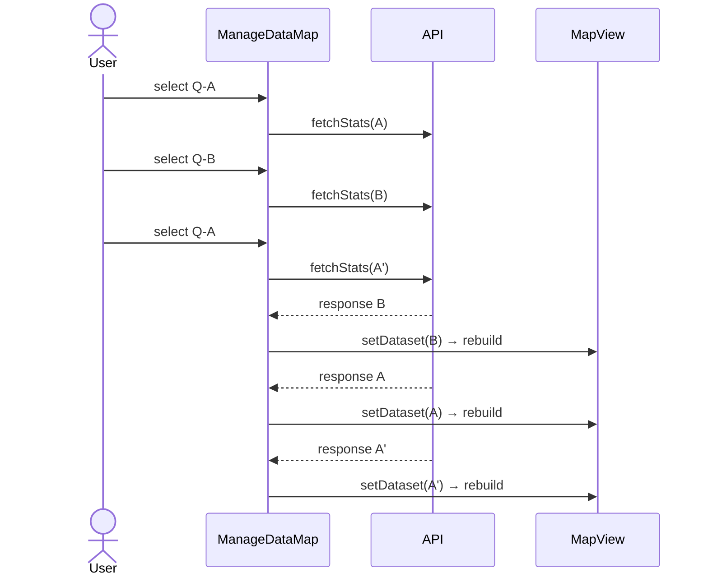
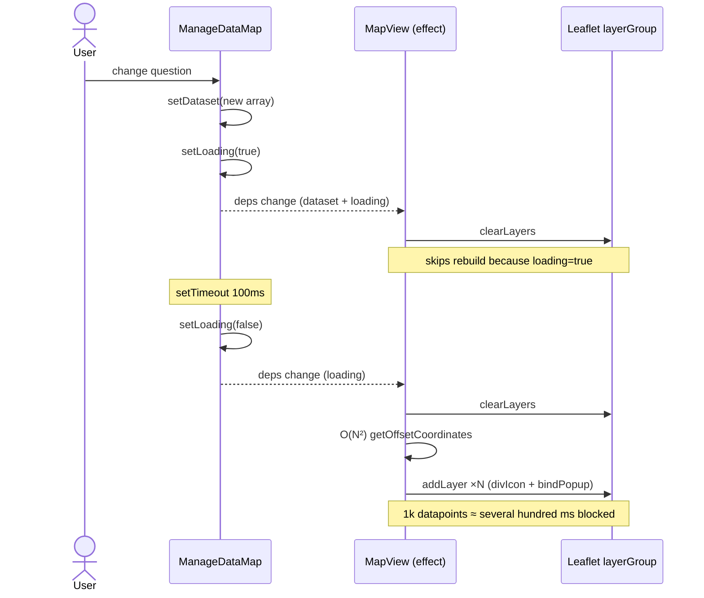

# Map View — Performance Findings

**Scope**: [frontend/src/pages/manage-data/components/ManageDataMap.jsx](../../../frontend/src/pages/manage-data/components/ManageDataMap.jsx) and [frontend/src/components/map-view/MapView.jsx](../../../frontend/src/components/map-view/MapView.jsx).

**Symptom reported by user**
Map view occasionally **freezes** during normal use, especially when the user rapidly switches the question dropdown ("monkey testing").

Findings are ordered by severity. `[blocking]` items are real bugs that surface under monkey testing; `[important]` items are performance regressions that compound the user-visible jank; `[nit]` items are smaller cleanups.

---

## 🔴 [blocking] 1. Race conditions in `fetchStats` — no request cancellation

**Location**: [ManageDataMap.jsx:160-285](../../../frontend/src/pages/manage-data/components/ManageDataMap.jsx#L160-L285)

When the user rapidly switches between questions, multiple `api.get(...)` requests fire concurrently. Responses can resolve out of order, so a stale response can overwrite the latest selection.

```js
const fetchStats = async (questionId, questionType, questionForm = null) => {
  const { data: apiData } = await api.get(apiURL);   // no abort
  // ... setDataset(_dataset)  ← stale write possible
};
```



Three rebuilds for what should have been one. Combined with the O(N²) marker rebuild in MapView (see #4), this triples the freeze window.

**Reproducible monkey test**: Click question A → B → A in <500 ms. The map briefly renders B's state, then settles. With slow network, B can win permanently.

**Fix** — track the latest request token via `useRef` and ignore stale responses (or use `AbortController`):

```js
const requestIdRef = useRef(0);

const fetchStats = async (questionId, questionType, questionForm = null) => {
  const reqId = ++requestIdRef.current;
  try {
    const { data: apiData } = await api.get(apiURL);
    if (reqId !== requestIdRef.current) { return; }   // discard stale
    // ... continue with state updates
  } catch (e) { /* ... */ }
};
```

---

## 🔴 [blocking] 2. `setTimeout(setLoading, 100)` pattern leaks across unmount and rapid clicks

**Location**: 9 occurrences — [ManageDataMap.jsx:144-148, 154-157, 174-177, 226-230, 277-281, 301-304](../../../frontend/src/pages/manage-data/components/ManageDataMap.jsx#L144)

```js
setLoading(true);
setTimeout(() => { setLoading(false); }, 100);
```

These timers are **never cleared**. Under monkey testing this means:
- On unmount → React state update on unmounted component (warning + leak).
- On rapid clicks → 5–10 queued timers all flipping `loading`, causing visible flicker.
- The pattern looks like a hack to force `MapView` to re-render Leaflet markers — and it sits in `MapView`'s effect dep array, so each interaction tears down and rebuilds **twice** (once when loading flips on, once when it flips off).

**Fix** — extract to a single helper with cleanup:

```js
const loadingTimerRef = useRef(null);
const flashLoading = useCallback(() => {
  setLoading(true);
  clearTimeout(loadingTimerRef.current);
  loadingTimerRef.current = setTimeout(() => setLoading(false), 100);
}, []);

useEffect(() => () => clearTimeout(loadingTimerRef.current), []);
```

Better: identify *why* the flash is needed (likely Leaflet `divIcon` re-render) and replace with a deterministic key on `<MapView>`, or call `mapInstance.current?.getMap()?.invalidateSize()` directly. The 100 ms hack is fragile.

---

## 🔴 [blocking] 3. `fetchData` has `dataset` in its deps but also writes it

**Location**: [ManageDataMap.jsx:338-394](../../../frontend/src/pages/manage-data/components/ManageDataMap.jsx#L338-L394)

```js
const fetchData = useCallback(async () => {
  // ...
  if (dataset?.length > 0 && prevForm !== selectedForm) {
    const _dataset = dataset.map((d) => ...);   // reads dataset
    setDataset(_dataset);                        // writes dataset
  }
}, [selectedAdm, prevForm, selectedForm, dataset, mapForms, isLocationFetched]);

useEffect(() => { fetchData(); }, [fetchData]);
```

The closure over `dataset` means `fetchData` is recreated on every dataset update. Combined with `useEffect(() => fetchData(), [fetchData])`, this is one bug away from a render loop. The `isLocationFetched` guard masks it but is fragile, and every `dataset` change still:

1. Re-creates `fetchData`
2. Re-runs the effect
3. Allocates a new async frame that bails immediately

During monkey testing this contributes microtask churn and GC pressure.

**Fix** — drop `dataset` from deps and use functional updaters:

```js
setDataset((prev) => prev.map((d) => /* ... */));
```

---

## 🟡 [important] 4. O(N²) overlap detection in MapView, rerun on every dataset reference change

**Location**: [MapView.jsx:100-129](../../../frontend/src/components/map-view/MapView.jsx#L100-L129)

```js
const getOffsetCoordinates = (coordinates, index, allCoordinates) => {
  let offsetIndex = 0;
  for (let i = 0; i < index; i++) {        // inner loop
    const otherCoords = allCoordinates[i];
    if (otherCoords && Math.abs(coordinates[0] - otherCoords[0]) < threshold && ...) {
      offsetIndex++;
    }
  }
  // ...
};
```

Combined with the outer `filteredDataset.forEach` at [MapView.jsx:143](../../../frontend/src/components/map-view/MapView.jsx#L143), this is **O(N²)**. For 1 000 datapoints that is one million comparisons; for 5 000 it is twenty-five million — easily several seconds of synchronous work that blocks the main thread. **This is the primary freeze cause.**

The marker-rebuild effect runs whenever `dataset` or `loading` changes:

```js
useEffect(() => { /* clearLayers + rebuild N markers */ },
  [lg, selectedForm, dataset, loading]);
```



Rapid clicks queue up before the previous teardown finishes → main thread stalls → freeze.

**Fix** — make overlap detection O(N) with a spatial bucket map:

```js
const buckets = new Map();
filteredDataset.forEach((d, idx) => {
  const key = `${Math.round(d.geo[0] / threshold)}_${Math.round(d.geo[1] / threshold)}`;
  const offsetIndex = buckets.get(key) || 0;
  buckets.set(key, offsetIndex + 1);
  // apply spiral offset using offsetIndex
});
```

That alone takes 1 M ops down to ~1 k.

---

## 🟡 [important] 5. Full dataset rebuild (O(N)) on every minor interaction

**Location**: [ManageDataMap.jsx:166-170, 216-225, 239-275, 294-300](../../../frontend/src/pages/manage-data/components/ManageDataMap.jsx#L166)

`ManageDataMap` writes a brand-new `dataset` array on:

| Trigger | Code |
|---|---|
| Question change (option) | [ManageDataMap.jsx:276](../../../frontend/src/pages/manage-data/components/ManageDataMap.jsx#L276) |
| Question change (numeric) | [ManageDataMap.jsx:226](../../../frontend/src/pages/manage-data/components/ManageDataMap.jsx#L226) |
| Empty stats response | [ManageDataMap.jsx:173](../../../frontend/src/pages/manage-data/components/ManageDataMap.jsx#L173) |
| Form change | [ManageDataMap.jsx:300](../../../frontend/src/pages/manage-data/components/ManageDataMap.jsx#L300) |
| Question cleared | [ManageDataMap.jsx:327](../../../frontend/src/pages/manage-data/components/ManageDataMap.jsx#L327) |
| Initial geolocation fetch | [ManageDataMap.jsx:364, 371](../../../frontend/src/pages/manage-data/components/ManageDataMap.jsx#L364) |

Each rebuild is `dataset.map((d) => ({ ...d, color: null, ... }))` — O(N) allocations of new objects, all of which trigger downstream `useMemo` / `MapView` re-renders. For thousands of datapoints, monkey-clicking the question dropdown allocates a fresh array + N object spreads on each click.

**Fix** — split state: keep an immutable `geoDataset` (locations only, set once after `fetchData`), and a separate `statsByQuestion` map keyed by question id. Then `filteredDataset` becomes a pure derivation. This eliminates the rebuild-and-mutate pattern entirely.

---

## 🟡 [important] 6. `colorScale` re-runs over full dataset on every state change

**Location**: [ManageDataMap.jsx:75-102](../../../frontend/src/pages/manage-data/components/ManageDataMap.jsx#L75-L102)

```js
const colorScale = useMemo(() => {
  const numericValues = dataset.map((d) => d.value).filter(...);
  // ... domain calculation
}, [dataset, isNumeric]);
```

`dataset` mutates on *any* interaction (filter click, form change, even legend selection — see #5), so this O(N) compute runs again unnecessarily. The same calculation is also duplicated inside `fetchStats` ([lines 190-214](../../../frontend/src/pages/manage-data/components/ManageDataMap.jsx#L190-L214)).

**Fix** — extract a pure helper `computeColorScale(values)` and call it **once inside `fetchStats`** when numeric data arrives. Store the resulting scale in state. Drop the `useMemo` version entirely.

---

## 🟡 [important] 7. Subscribe handler captures stale `prevForm` / `isLocationFetched`

**Location**: [ManageDataMap.jsx:401-421](../../../frontend/src/pages/manage-data/components/ManageDataMap.jsx#L401-L421)

```js
useEffect(() => {
  const unsubscribe = store.subscribe(
    ({ selectedForm, administration }) => ({ selectedForm, administration }),
    ({ selectedForm, administration }) => {
      const isFormChanged = selectedForm && selectedForm !== prevForm;  // stale closure
      if ((isFormChanged || administration) && isLocationFetched) { ... }
    }
  );
  return () => unsubscribe();
}, [prevForm, selectedForm, isLocationFetched]);
```

Each render tears down and re-creates the subscription. Under monkey testing this oscillates rapidly, and there's a window where the old handler still fires with stale state. Pullstate's subscribe is cheap individually, but during a freeze it adds GC pressure.

**Fix** — store `prevForm` / `isLocationFetched` in `useRef`, and keep the effect dep array empty:

```js
const stateRef = useRef({ prevForm, isLocationFetched });
useEffect(() => { stateRef.current = { prevForm, isLocationFetched }; });

useEffect(() => {
  const unsubscribe = store.subscribe(/* ... */, ({ selectedForm, administration }) => {
    const { prevForm, isLocationFetched } = stateRef.current;
    /* ... */
  });
  return unsubscribe;
}, []);
```

---

## 🟡 [important] 8. No debouncing on question selection

**Location**: [ManageDataMap.jsx:436-451](../../../frontend/src/pages/manage-data/components/ManageDataMap.jsx#L436-L451)

`onQuestionChange` immediately fires `fetchStats`. With keyboard navigation in the antd `Select`, every arrow key triggers a network request.

**Fix** — wrap with `lodash.debounce(150)` (already a dep) or guard with the request-id ref from #1 so only the most recent intent actually fetches.

---

## 🟡 [important] 9. Legend clicks force a full marker rebuild

**Location**: [ManageDataMap.jsx:142-158](../../../frontend/src/pages/manage-data/components/ManageDataMap.jsx#L142-L158)

```js
const handleMarkerLegendClick = (option) => {
  setSelectedLegendOption(option);
  setLoading(true);
  setTimeout(() => { setLoading(false); }, 100);
  ...
};
```

Even legend clicks force the entire MapView teardown + O(N²) rebuild. Filter-only changes should never rebuild markers — `filteredDataset` already handles hiding.

**Fix** — remove the `setLoading(true) + setTimeout` from legend handlers. Filtering is a pure transform of the existing dataset; no Leaflet rebuild needed if MapView responds to `filteredDataset` directly with `setLatLng` / `setIcon` for surviving markers, or simply lets React skip the effect because `dataset` ref didn't change.

---

## 🟢 [nit] 10. `dynamicColors` regenerated on every `fetchStats`

**Location**: [ManageDataMap.jsx:233](../../../frontend/src/pages/manage-data/components/ManageDataMap.jsx#L233)

`color.forMarker(apiData?.options?.length)` allocates a 29-color palette and slices it on each call. Cache by length:

```js
const dynamicColorsCache = new Map();
const getDynamicColors = (n) => {
  if (!dynamicColorsCache.has(n)) {
    dynamicColorsCache.set(n, color.forMarker(n));
  }
  return dynamicColorsCache.get(n);
};
```

---

## 🟢 [nit] 11. Duplicate logic between `fetchStats` numeric branch and `colorScale` useMemo

Both compute `domainMax` with the same rounding rules ([lines 89-98](../../../frontend/src/pages/manage-data/components/ManageDataMap.jsx#L89-L98) and [lines 204-209](../../../frontend/src/pages/manage-data/components/ManageDataMap.jsx#L204-L209)). Extract to a util `roundDomainMax(maxValue)`.

---

## 🟢 [nit] 12. `mapForms` / `mapQuestions` read `window.forms` outside React reactivity

[Lines 30, 35-37](../../../frontend/src/pages/manage-data/components/ManageDataMap.jsx#L30): if `window.forms` is replaced after mount (e.g., on language change), `useMemo` won't recompute. Acceptable today but worth a comment, or surface `forms` via store/context.

---

## Recommended fix order

Targeted to remove the freeze with minimum churn.

| # | Fix | Severity | Effort | Impact |
|---|---|---|---|---|
| 1 | Cancel stale `fetchStats` requests (`useRef` request-id token or `AbortController`); ignore late responses. | 🔴 blocking | small | cuts wasted rebuilds and stops UI flashes from out-of-order data |
| 2 | Replace `setLoading(true) + setTimeout(100, setLoading(false))` flash with a single `loadingTimerRef` + cleanup. If MapView needs a Leaflet nudge, call `invalidateSize()` directly. | 🔴 blocking | small | halves the rebuild cost per interaction; removes leaked timers |
| 3 | Remove `dataset` from `fetchData`'s dep array and switch to `setDataset((prev) => …)`. | 🔴 blocking | small | removes redundant fetchData re-creations and async-frame churn |
| 4 | Replace O(N²) `getOffsetCoordinates` with a hash-bucket O(N) version. | 🟡 important | small | removes freeze for any N |
| 5 | Move legend (`MarkerLegend`, `GradationLegend`) clicks to a filter-only path; do not mutate `dataset` or flip `loading`. | 🟡 important | small | filtering should not rebuild Leaflet markers |
| 6 | Move the store-subscription `useEffect` to `[]` deps with a ref-backed snapshot. | 🟡 important | small | stops subscribe/unsubscribe churn on every render |
| 7 | Debounce / dedupe `onQuestionChange`. | 🟡 important | small | removes extra fetches during keyboard navigation |
| 8 | (Optional refactor) Split `dataset` into immutable `locations` and per-question `stats`; derive markers via `useMemo`. | 🟡 important | medium | structurally eliminates the rebuild-everything-on-every-click pattern |

Items 1–4 alone should eliminate the freeze.

---

## Quick reproduction notes

- **Freeze**: on a deployment with several thousand datapoints, open Map View and rapidly cycle through ≥5 different questions in <2 seconds. Page locks for ≥1 s; longer with larger N.
