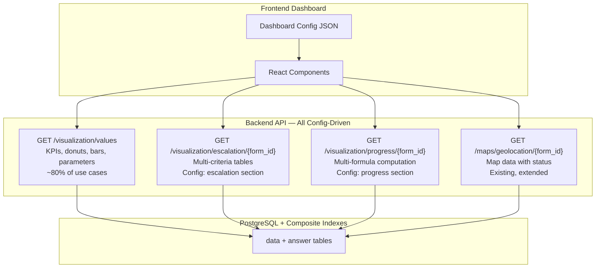

# Generic Visualization API Specification

## Overview

A single generic endpoint that serves data for all chart types. The frontend composes visualization by combining API calls with dashboard configuration. This replaces the need for dashboard-specific endpoints like `/dashboard/stats`, `/dashboard/chart`, `/dashboard/compliance`.

**Endpoint**: `GET /api/v1/visualization/values`

---

## Query Parameters

### Required

| Param | Type | Description |
|-------|------|-------------|
| `form_id` | integer | Which form to query |

### Question Selection (optional)

| Param | Type | Description |
|-------|------|-------------|
| `question_id` | integer | Which question's answers to aggregate. **Omit to count data points only.** |

### Scope

| Param | Type | Options | Default | Description |
|-------|------|---------|---------|-------------|
| `monitoring` | string | `latest`, `all` | `latest` | `latest`: only most recent monitoring per parent. `all`: all submissions. |

### Grouping

| Param | Type | Options | Default | Description |
|-------|------|---------|---------|-------------|
| `group_by` | string | `date`, `month`, `id`, `parent_id`, `option` | *(none)* | How to group results. When omitted, returns a single aggregate value. |

### Aggregation

| Param | Type | Options | Default | Description |
|-------|------|---------|---------|-------------|
| `sum_by` | string | `id`, `parent_id` | *(none)* | Aggregation scope |
| `value_type` | string | `number`, `percentage` | `number` | Format of returned values |
| `repeat_agg` | string | `average`, `sum`, `max`, `min`, `last` | `average` | How to aggregate answers in repeatable question groups |

### Filtering

| Param | Type | Description |
|-------|------|-------------|
| `from_date` | YYYY-MM-DD | Start date filter |
| `to_date` | YYYY-MM-DD | End date filter |
| `date_question_id` | integer | Which date question to filter against. Omit to use `FormData.created`. |
| `administration_id` | integer | Filter by administration hierarchy (includes descendants) |
| `option_value` | string | Filter by specific option answer value (exact match) |

---

## Response Format

```json
{
  "data": [
    {
      "value": 42,
      "label": "Jan 2024",
      "group": "2024-01"
    }
  ],
  "labels": ["Jan 2024", "Feb 2024", "Mar 2024"]
}
```

| Field | Type | Description |
|-------|------|-------------|
| `data` | array | Array of data point objects |
| `data[].value` | number \| string | Numeric value, percentage, or date based on `value_type` |
| `data[].label` | string | Human-readable label for visualization |
| `data[].group` | string (optional) | Group identifier for multi-series charts |
| `data[].color` | string (optional) | Hex color from `QuestionOptions.color` (only when `group_by=option`) |
| `labels` | array | All unique labels for axis or legend configuration |

---

## Behavior Matrix

How the endpoint behaves based on parameter combinations:

### Without `question_id` — Count Mode

Counts FormData records matching the filters.

| `group_by` | Returns |
|-----------|---------|
| *(none)* | `{ data: [{ value: 150, label: "Total" }], labels: ["Total"] }` |
| `month` | `{ data: [{ value: 12, label: "Jan 2025", group: "2025-01" }, ...] }` |
| `parent_id` | `{ data: [{ value: 3, label: "EPS Navua", group: "245170944" }, ...] }` |

### With `question_id` — Value Mode

Aggregates answer values for the specified question.

**Number questions** (`QuestionTypes.number = 4`):

| `group_by` | Returns |
|-----------|---------|
| *(none)* | Single aggregated value (average/sum of all answers) |
| `parent_id` | Value per parent EPS (uses `repeat_agg` for repeatable groups) |
| `month` | Value grouped by month |

**Option questions** (`QuestionTypes.option = 5`, `multiple_option = 6`):

| `group_by` | Returns |
|-----------|---------|
| `option` | Count per option value — **used for donut charts** |
| `month` | Count of submissions per month |
| `parent_id` | Option value per parent |

**Date questions** (`QuestionTypes.date = 9`):

| `group_by` | Returns |
|-----------|---------|
| `month` | Count per month extracted from date answers |

### With `option_value` — Filtered Count

Filters to only answers matching the option value, then counts.

```
# Count EPS where system_status == 'operational'
?form_id=1749632545233&question_id=1749633373968&option_value=operational&monitoring=latest&sum_by=parent_id

→ { data: [{ value: 90, label: "operational" }], labels: ["operational"] }
```

### With `value_type=percentage`

Returns the count as a percentage of total parent records:

```
# What % of EPS are operational?
?form_id=1749632545233&question_id=1749633373968&option_value=operational&monitoring=latest&sum_by=parent_id&value_type=percentage

→ { data: [{ value: 60.0, label: "operational" }], labels: ["operational"] }
```

---

## Dashboard Use Case Mapping

### KPI Cards

```
# Total EPS registered (count parent records)
GET /values?form_id=1749623934933

# EPS operational (count where option matches)
GET /values?form_id=1749632545233&question_id=1749633373968
    &option_value=operational&monitoring=latest&sum_by=parent_id

# EPS under construction
GET /values?form_id=1749624452908&question_id=1749630516826
    &option_value=no&monitoring=latest&sum_by=parent_id

# EPS with critical issues
GET /values?form_id=1749632545233&question_id=1749633373968
    &option_value=issue_with_system&monitoring=latest&sum_by=parent_id

# EPS monitored in fiscal year (%)
GET /values?form_id=1749632545233&monitoring=latest&sum_by=parent_id
    &from_date=2025-07-01&to_date=2026-06-30
    &date_question_id=1749632545235&value_type=percentage

# Lab tested count
GET /values?form_id=1749632545233&question_id=1749633001462
    &option_value=lab_test&monitoring=latest&sum_by=parent_id

# CBT tested count
GET /values?form_id=1749632545233&question_id=1749633001462
    &option_value=cbt_test&monitoring=latest&sum_by=parent_id
```

### Donut Charts

```
# Operational status distribution
GET /values?form_id=1749632545233&question_id=1749633373968
    &group_by=option&monitoring=latest

→ {
    "data": [
      { "value": 90, "label": "Operational", "group": "operational", "color": "#64A73B" },
      { "value": 20, "label": "Issue with the system", "group": "issue_with_system", "color": "#e41a1c" }
    ],
    "labels": ["Operational", "Issue with the system"]
  }

# Water committee (from registration form)
GET /values?form_id=1749623934933&question_id=1749624452105&group_by=option

# Implementing authority (from registration form)
GET /values?form_id=1749623934933&question_id=1749624452993&group_by=option

# Lab vs CBT test method
GET /values?form_id=1749632545233&question_id=1749633001462
    &group_by=option&monitoring=latest
```

### Bar Charts

```
# Inspections per month
GET /values?form_id=1749632545233&group_by=month
    &date_question_id=1749632545235
    &from_date=2025-04-01&to_date=2026-03-31

→ {
    "data": [
      { "value": 12, "label": "Apr 2025", "group": "2025-04" },
      { "value": 18, "label": "May 2025", "group": "2025-05" }
    ],
    "labels": ["Apr 2025", "May 2025", ...]
  }
```

### Water Quality Parameter Charts

```
# E.coli values per EPS (average across repeatable entries)
GET /values?form_id=1749632545233&question_id=1749633220746
    &group_by=parent_id&monitoring=latest&repeat_agg=average

→ {
    "data": [
      { "value": 0, "label": "EPS Navua", "group": "245170944" },
      { "value": 3.5, "label": "EPS Sigatoka", "group": "245170945" }
    ],
    "labels": ["EPS Navua", "EPS Sigatoka", ...]
  }

# Turbidity, pH, Conductivity, Salinity, Temperature, Coliform — same pattern
# Frontend adds threshold markLine via rawConfig based on dashboard config
```

---

## Complementary Endpoints

The generic `/values` endpoint handles ~80% of dashboard use cases. These 3 additional endpoints handle the remaining cases that require multi-question logic. All are **config-driven** — zero backend code changes needed for new form families.

| Endpoint | Purpose | Config Source |
|----------|---------|--------------|
| `GET /visualization/values` | KPIs, donut charts, bar charts, parameter charts | `kpis[].api`, `charts[].api`, `water_quality.parameters[].api` |
| `GET /visualization/escalation/{form_id}` | Paginated multi-criteria tables | `escalation` section |
| `GET /visualization/progress/{form_id}` | Multi-component progress computation | `progress` section |
| `GET /maps/geolocation/{form_id}` | Map data with status overlay (existing) | — |

**Compliance (pass/fail)** is computed frontend-side from water quality `/values` calls + config thresholds.

---

## Escalation Endpoint

### `GET /api/v1/visualization/escalation/{form_id}`

Returns paginated table of records matching **any** escalation criteria (OR logic), with configurable columns.

#### Query Parameters

| Param | Type | Required | Default | Description |
|-------|------|----------|---------|-------------|
| `tab` | string | Yes | — | Which criteria set from config (e.g., `monitoring`, `construction`) |
| `page` | integer | No | 1 | Page number |
| `page_size` | integer | No | 20 | Results per page |
| `from_date` | YYYY-MM-DD | No | — | Date filter |
| `to_date` | YYYY-MM-DD | No | — | Date filter |
| `administration_id` | integer | No | — | Admin hierarchy filter |

#### Response Format

```json
{
  "count": 42,
  "next": "/api/v1/visualization/escalation/1749623934933?tab=monitoring&page=2",
  "previous": null,
  "results": [
    {
      "id": 245170944,
      "eps_name": "EPS Navua",
      "village_name": "Navua Village",
      "last_monitoring": "2025-12-15",
      "operational_status": "issue_with_system",
      "water_collection": "no",
      "critical_issues": ["E.coli above threshold", "Temperature > 30°C"]
    }
  ]
}
```

Response columns are **dynamic** — defined in the config's `escalation[tab].columns` array.

#### Config Format

```json
{
  "escalation": {
    "monitoring": {
      "monitoring_form_id": 1749632545233,
      "date_question_id": 1749632545235,
      "criteria": [
        { "type": "option_equals", "question_id": 1749632647507, "value": "no", "label": "No water sample" },
        { "type": "option_equals", "question_id": 1749633373968, "value": "issue_with_system", "label": "System issue" },
        { "type": "threshold_violation", "parameters_ref": "water_quality", "label": "Water quality violation" }
      ],
      "columns": [
        { "key": "eps_name", "source": "parent_name" },
        { "key": "village_name", "source": "administration" },
        { "key": "last_monitoring", "source": "latest_date", "date_question_id": 1749632545235 },
        { "key": "operational_status", "source": "answer", "question_id": 1749633373968 },
        { "key": "water_collection", "source": "answer", "question_id": 1749632647507 },
        { "key": "critical_issues", "source": "violations" }
      ]
    },
    "construction": {
      "monitoring_form_id": 1749624452908,
      "date_question_id": 1749624452911,
      "criteria": [
        { "type": "overdue", "completion_qid": 1749630516826, "deadline_qid": 1749630516825 }
      ],
      "columns": [
        { "key": "eps_name", "source": "parent_name" },
        { "key": "last_monitoring", "source": "latest_date", "date_question_id": 1749624452911 },
        { "key": "overall_progress", "source": "computed_progress", "progress_ref": "construction" },
        { "key": "expected_progress", "source": "expected_progress", "progress_ref": "construction" },
        { "key": "deadline", "source": "answer_date", "question_id": 1749630516825 }
      ]
    }
  }
}
```

#### Criteria Types Reference

| Type | Description | Required Fields | SQL Logic |
|------|-------------|----------------|-----------|
| `option_equals` | Answer matches a specific option value | `question_id`, `value` | `answer.options @> '[value]'` |
| `threshold_violation` | Any parameter in referenced group outside threshold | `parameters_ref` (points to `water_quality` or similar section) | Checks each parameter's value against its `threshold.min`/`threshold.max` |
| `overdue` | Incomplete and past deadline | `completion_qid`, `deadline_qid` | `completion == 'no' AND deadline < TODAY` |

#### Column Source Types Reference

| Source | Description | Required Fields | Returns |
|--------|-------------|----------------|---------|
| `parent_name` | Registration datapoint name | — | `string` |
| `administration` | Administration path (e.g., "Central > Rewa > Bau") | — | `string` |
| `latest_date` | Date from latest monitoring (answer or FormData.created) | `date_question_id` (optional) | `date` |
| `answer` | Answer value from latest monitoring | `question_id` | `string` (option label) |
| `answer_date` | Date answer from latest monitoring | `question_id` | `date` |
| `violations` | List of threshold violation labels | — (uses `water_quality.parameters`) | `string[]` |
| `computed_progress` | Overall progress from progress computation | `progress_ref` | `float` |
| `expected_progress` | Expected progress based on elapsed time | `progress_ref` | `float` |

#### Reusability Example — Different Form Family

```json
{
  "escalation": {
    "maintenance": {
      "monitoring_form_id": 888777666,
      "criteria": [
        { "type": "option_equals", "question_id": 999111, "value": "broken", "label": "System broken" },
        { "type": "option_equals", "question_id": 999222, "value": "no", "label": "No maintenance" }
      ],
      "columns": [
        { "key": "project_name", "source": "parent_name" },
        { "key": "status", "source": "answer", "question_id": 999111 },
        { "key": "last_inspection", "source": "latest_date", "date_question_id": 999333 }
      ]
    }
  }
}
```

#### Django Implementation

```python
# Criteria type → Q object builder mapping
CRITERIA_BUILDERS = {
    "option_equals": build_option_equals_filter,
    "threshold_violation": build_threshold_filter,
    "overdue": build_overdue_filter,
}

# Column source → value extractor mapping
COLUMN_EXTRACTORS = {
    "parent_name": lambda parent, col, cfg: parent.name,
    "administration": lambda parent, col, cfg: get_admin_path(parent),
    "latest_date": lambda parent, col, cfg: get_latest_date(
        parent.latest_id, col.get("date_question_id")
    ),
    "answer": lambda parent, col, cfg: get_answer_display(
        parent.latest_id, col["question_id"]
    ),
    "answer_date": lambda parent, col, cfg: get_answer_value(
        parent.latest_id, col["question_id"]
    ),
    "violations": lambda parent, col, cfg: get_violations(
        parent.latest_id, cfg
    ),
    "computed_progress": lambda parent, col, cfg: compute_eps_progress(
        parent.latest_id, cfg["progress"][col["progress_ref"]]
    ),
    "expected_progress": lambda parent, col, cfg: compute_expected(
        parent.latest_id, cfg["progress"][col["progress_ref"]]
    ),
}


def build_option_equals_filter(criterion, config, latest_ids):
    """Build Q filter: answer for question matches option value."""
    matching_data_ids = Answers.objects.filter(
        data_id__in=latest_ids,
        question_id=criterion["question_id"],
        options__contains=[criterion["value"]],
    ).values_list("data_id", flat=True)
    return Q(latest_id__in=matching_data_ids)


def build_threshold_filter(criterion, config, latest_ids):
    """Build Q filter: any water quality parameter outside threshold."""
    params = config[criterion["parameters_ref"]]["parameters"]
    violating_data_ids = set()
    for param in params:
        qs = Answers.objects.filter(
            data_id__in=latest_ids,
            question_id=param["api"]["question_id"],
            value__isnull=False,
        )
        threshold = param["threshold"]
        if "max" in threshold:
            violating_data_ids |= set(
                qs.filter(value__gt=threshold["max"])
                .values_list("data_id", flat=True)
            )
        if "min" in threshold:
            violating_data_ids |= set(
                qs.filter(value__lt=threshold["min"])
                .values_list("data_id", flat=True)
            )
    return Q(latest_id__in=violating_data_ids)


def build_overdue_filter(criterion, config, latest_ids):
    """Build Q filter: incomplete AND past deadline."""
    from datetime import date
    # Incomplete
    incomplete_ids = set(Answers.objects.filter(
        data_id__in=latest_ids,
        question_id=criterion["completion_qid"],
        options__contains=["no"],
    ).values_list("data_id", flat=True))
    # Past deadline
    overdue_ids = set(Answers.objects.filter(
        data_id__in=latest_ids,
        question_id=criterion["deadline_qid"],
        name__lt=date.today().isoformat(),
    ).values_list("data_id", flat=True))
    return Q(latest_id__in=incomplete_ids & overdue_ids)


@extend_schema(
    description="Config-driven escalation table with dynamic criteria and columns",
    tags=["Visualization"],
)
@api_view(["GET"])
def visualization_escalation(request, form_id, version):
    config = get_dashboard_config(form_id)
    tab = request.query_params.get("tab")
    if not tab or tab not in config.get("escalation", {}):
        return Response(
            {"detail": f"Invalid tab. Options: {list(config.get('escalation', {}).keys())}"},
            status=status.HTTP_400_BAD_REQUEST,
        )

    esc_config = config["escalation"][tab]
    parent_form = get_object_or_404(Forms, pk=form_id)
    monitoring_form_id = esc_config["monitoring_form_id"]

    # Get parents with latest monitoring
    parents = FormData.objects.filter(
        form=parent_form,
        parent__isnull=True,
        is_pending=False,
        is_draft=False,
    ).annotate(
        latest_id=latest_monitoring_subquery(monitoring_form_id),
    ).filter(latest_id__isnull=False)

    # Apply admin filter
    if request.query_params.get("administration_id"):
        parents = apply_administration_filter(
            parents, int(request.query_params["administration_id"])
        )

    latest_ids = list(parents.values_list("latest_id", flat=True))

    # Build OR query from criteria
    or_condition = Q()
    for criterion in esc_config["criteria"]:
        builder = CRITERIA_BUILDERS[criterion["type"]]
        or_condition |= builder(criterion, config, latest_ids)

    matching_parents = parents.filter(or_condition)

    # Paginate
    page = int(request.query_params.get("page", 1))
    page_size = int(request.query_params.get("page_size", 20))
    total = matching_parents.count()
    paginated = matching_parents[(page - 1) * page_size:page * page_size]

    # Build dynamic columns
    results = []
    for parent in paginated:
        row = {"id": parent.id}
        for col in esc_config["columns"]:
            extractor = COLUMN_EXTRACTORS[col["source"]]
            row[col["key"]] = extractor(parent, col, config)
        results.append(row)

    return Response({
        "count": total,
        "next": f"?tab={tab}&page={page + 1}" if page * page_size < total else None,
        "previous": f"?tab={tab}&page={page - 1}" if page > 1 else None,
        "results": results,
    })
```

---

## Progress Endpoint

### `GET /api/v1/visualization/progress/{form_id}`

Computes multi-component progress per record using configurable formulas.

#### Query Parameters

| Param | Type | Required | Default | Description |
|-------|------|----------|---------|-------------|
| `progress_key` | string | Yes | — | Which progress config to use (e.g., `construction`) |
| `from_date` | YYYY-MM-DD | No | — | Date filter |
| `to_date` | YYYY-MM-DD | No | — | Date filter |
| `administration_id` | integer | No | — | Admin hierarchy filter |

#### Response Format

```json
{
  "histogram": {
    "config": {
      "title": "Percentage of projects completed",
      "xAxisLabel": "Progress",
      "yAxisLabel": "Number of EPS"
    },
    "data": [
      { "progress": "0-10%", "count": 5 },
      { "progress": "11-20%", "count": 3 },
      { "progress": "91-100%", "count": 3 }
    ]
  },
  "completion_timeline": {
    "config": {
      "title": "Proposed completion data",
      "xAxisLabel": "Month",
      "yAxisLabel": "Number of EPS"
    },
    "data": [
      { "month": "Jan 2026", "count": 4 },
      { "month": "Feb 2026", "count": 6 }
    ]
  },
  "details": [
    {
      "label": "EPS Navua",
      "group": "245170944",
      "components": {
        "concrete_base": 100.0,
        "urf_tank": 100.0,
        "eps_tank": 0.0,
        "standpipes": 50.0,
        "site_security": 66.67
      },
      "overall": 63.3
    }
  ]
}
```

#### Config Format

```json
{
  "progress": {
    "construction": {
      "monitoring_form_id": 1749624452908,
      "filter": {
        "question_id": 1749630516826,
        "option_value": "no",
        "label": "Under construction"
      },
      "scope_question_id": 1749624505915,
      "deadline_question_id": 1749630516825,
      "components": [
        {
          "key": "concrete_base",
          "label": "Concrete Base",
          "question_ids": [1849633499999, 1849633498888, 1849633497777],
          "formula": "any_yes"
        },
        {
          "key": "urf_tank",
          "label": "URF Tank",
          "question_ids": [1849633720001],
          "formula": "completed_binary"
        },
        {
          "key": "standpipes",
          "label": "Standpipes",
          "question_ids": [1849634900001],
          "formula": "ratio"
        },
        {
          "key": "site_security",
          "label": "Site Security",
          "question_ids": [1849635500001],
          "formula": "multi_select_proportion",
          "total_items": 3
        }
      ]
    }
  }
}
```

#### Formula Types Reference

| Formula | Description | Logic | Required Fields |
|---------|-------------|-------|----------------|
| `any_yes` | Binary — 100% if any question answered 'Yes' | `any(answers == 'yes') → 100%, else 0%` | `question_ids[]` |
| `completed_binary` | Binary — 100% if answered 'Completed' | `answer == 'completed' → 100%, else 0%` | `question_ids[]` |
| `ratio` | Proportional — value as percentage | `answer.value` (already a percentage) | `question_ids[]` |
| `multi_select_proportion` | Proportional — selected ÷ total | `len(selected) / total_items × 100%` | `question_ids[]`, `total_items` |

**Overall progress** = average of all component scores (filtered by `scope_question_id` if configured).

#### Reusability Example — Different Form Family

```json
{
  "progress": {
    "installation": {
      "monitoring_form_id": 888777666,
      "filter": {
        "question_id": 888111,
        "option_value": "in_progress"
      },
      "components": [
        { "key": "piping", "label": "Piping", "question_ids": [888222], "formula": "completed_binary" },
        { "key": "electrical", "label": "Electrical", "question_ids": [888333], "formula": "completed_binary" },
        { "key": "testing", "label": "Testing", "question_ids": [888444], "formula": "ratio" }
      ]
    }
  }
}
```

#### Django Implementation

```python
FORMULA_HANDLERS = {
    "any_yes": compute_any_yes,
    "completed_binary": compute_completed_binary,
    "ratio": compute_ratio,
    "multi_select_proportion": compute_multi_select_proportion,
}


def compute_any_yes(latest_data_id, question_ids, **kwargs):
    """100% if ANY question answered 'Yes', else 0%."""
    has_yes = Answers.objects.filter(
        data_id=latest_data_id,
        question_id__in=question_ids,
        options__contains=["yes"],
    ).exists()
    return 100.0 if has_yes else 0.0


def compute_completed_binary(latest_data_id, question_ids, **kwargs):
    """100% if answered 'Completed', else 0%."""
    is_completed = Answers.objects.filter(
        data_id=latest_data_id,
        question_id__in=question_ids,
        options__contains=["completed"],
    ).exists()
    return 100.0 if is_completed else 0.0


def compute_ratio(latest_data_id, question_ids, **kwargs):
    """Value as percentage (numeric answer)."""
    answer = Answers.objects.filter(
        data_id=latest_data_id,
        question_id__in=question_ids,
    ).first()
    if not answer or answer.value is None:
        return 0.0
    return float(answer.value)


def compute_multi_select_proportion(latest_data_id, question_ids,
                                     total_items=1, **kwargs):
    """Percentage based on number of selected options."""
    answer = Answers.objects.filter(
        data_id=latest_data_id,
        question_id__in=question_ids,
    ).first()
    if not answer or not answer.options:
        return 0.0
    return round((len(answer.options) / total_items) * 100, 2)


@extend_schema(
    description="Config-driven progress computation with multiple formulas",
    tags=["Visualization"],
)
@api_view(["GET"])
def visualization_progress(request, form_id, version):
    config = get_dashboard_config(form_id)
    progress_key = request.query_params.get("progress_key")
    if not progress_key or progress_key not in config.get("progress", {}):
        return Response(
            {"detail": f"Invalid progress_key. Options: {list(config.get('progress', {}).keys())}"},
            status=status.HTTP_400_BAD_REQUEST,
        )

    prog_config = config["progress"][progress_key]
    parent_form = get_object_or_404(Forms, pk=form_id)
    monitoring_form_id = prog_config["monitoring_form_id"]

    # Get parents with latest monitoring
    parents = FormData.objects.filter(
        form=parent_form,
        parent__isnull=True,
        is_pending=False,
        is_draft=False,
    ).annotate(
        latest_id=latest_monitoring_subquery(monitoring_form_id),
    ).filter(latest_id__isnull=False)

    # Apply filter (e.g., only "under construction")
    pf = prog_config.get("filter")
    if pf:
        matching_data_ids = Answers.objects.filter(
            data_id__in=parents.values_list("latest_id", flat=True),
            question_id=pf["question_id"],
            options__contains=[pf["option_value"]],
        ).values_list("data_id", flat=True)
        parents = parents.filter(latest_id__in=matching_data_ids)

    # Apply admin filter
    if request.query_params.get("administration_id"):
        parents = apply_administration_filter(
            parents, int(request.query_params["administration_id"])
        )

    # Compute per-EPS progress
    components = prog_config["components"]
    eps_results = []
    for parent in parents:
        scores = {}
        for comp in components:
            handler = FORMULA_HANDLERS[comp["formula"]]
            kwargs = {}
            if comp.get("total_items"):
                kwargs["total_items"] = comp["total_items"]
            scores[comp["key"]] = handler(
                parent.latest_id, comp["question_ids"], **kwargs
            )
        overall = (
            round(sum(scores.values()) / len(scores), 1)
            if scores else 0.0
        )
        eps_results.append({
            "label": parent.name,
            "group": str(parent.id),
            "components": scores,
            "overall": overall,
        })

    # Build histogram
    buckets = [
        "0-10%", "11-20%", "21-30%", "31-40%", "41-50%",
        "51-60%", "61-70%", "71-80%", "81-90%", "91-100%",
    ]
    histogram_counts = [0] * 10
    for eps in eps_results:
        idx = min(int(eps["overall"] / 10), 9)
        histogram_counts[idx] += 1

    # Build completion timeline
    deadline_qid = prog_config.get("deadline_question_id")
    timeline_data = []
    if deadline_qid:
        deadline_answers = Answers.objects.filter(
            data_id__in=parents.values_list("latest_id", flat=True),
            question_id=deadline_qid,
            name__isnull=False,
        ).values_list("name", flat=True)
        from collections import Counter
        month_counts = Counter()
        for d in deadline_answers:
            month_key = d[:7]  # "YYYY-MM"
            month_counts[month_key] += 1
        for month_key in sorted(month_counts.keys()):
            timeline_data.append({
                "month": format_month(month_key),
                "count": month_counts[month_key],
            })

    return Response({
        "histogram": {
            "config": {
                "title": "Percentage of projects completed",
                "xAxisLabel": "Progress",
                "yAxisLabel": "Count",
            },
            "data": [
                {"progress": buckets[i], "count": histogram_counts[i]}
                for i in range(10)
            ],
        },
        "completion_timeline": {
            "config": {
                "title": "Proposed completion data",
                "xAxisLabel": "Month",
                "yAxisLabel": "Count",
            },
            "data": timeline_data,
        },
        "details": eps_results,
    })

---

## Updated Dashboard Config Format

With the generic API, the dashboard config changes from specifying backend computation types to specifying API call parameters:

```json
{
  "parent_form_id": 1749623934933,
  "name": "EPS Overview",
  "description": "Overview of EPS sites monitoring, water quality and construction information.",
  "tabs": [
    {
      "key": "monitoring_overview",
      "label": "Monitoring overview"
    },
    {
      "key": "water_quality",
      "label": "Water quality"
    },
    {
      "key": "construction_monitoring",
      "label": "Construction monitoring"
    }
  ],
  "filters": {
    "date": {
      "date_question_ids": [1749632545235, 1749624452911],
      "label": "Monitoring Period"
    },
    "administration": {
      "label": "Location"
    },
    "custom": [
      {
        "key": "implementing_agency",
        "question_id": 1749624452993,
        "form_id": 1749623934933,
        "label": "Implementing Agency"
      },
      {
        "key": "water_committee",
        "question_id": 1749624452105,
        "form_id": 1749623934933,
        "label": "Water Committee"
      }
    ]
  },
  "kpis": {
    "total_registered": {
      "label": "Total EPS registered",
      "api": {
        "form_id": 1749623934933
      }
    },
    "under_construction": {
      "label": "Total EPS under construction",
      "api": {
        "form_id": 1749624452908,
        "question_id": 1749630516826,
        "option_value": "no",
        "monitoring": "latest",
        "sum_by": "parent_id"
      }
    },
    "operational": {
      "label": "Total EPS operational",
      "api": {
        "form_id": 1749632545233,
        "question_id": 1749633373968,
        "option_value": "operational",
        "monitoring": "latest",
        "sum_by": "parent_id"
      }
    },
    "critical_issues": {
      "label": "Total EPS with critical issues",
      "api": {
        "form_id": 1749632545233,
        "question_id": 1749633373968,
        "option_value": "issue_with_system",
        "monitoring": "latest",
        "sum_by": "parent_id"
      }
    }
  },
  "charts": {
    "operational_status": {
      "chart_type": "doughnut",
      "api": {
        "form_id": 1749632545233,
        "question_id": 1749633373968,
        "group_by": "option",
        "monitoring": "latest"
      }
    },
    "water_committee": {
      "chart_type": "doughnut",
      "api": {
        "form_id": 1749623934933,
        "question_id": 1749624452105,
        "group_by": "option"
      }
    },
    "implementing_authority": {
      "chart_type": "doughnut",
      "api": {
        "form_id": 1749623934933,
        "question_id": 1749624452993,
        "group_by": "option"
      }
    },
    "test_method": {
      "chart_type": "doughnut",
      "api": {
        "form_id": 1749632545233,
        "question_id": 1749633001462,
        "group_by": "option",
        "monitoring": "latest"
      }
    },
    "inspections_per_month": {
      "chart_type": "bar",
      "config": {
        "title": "Inspections per Month",
        "xAxisLabel": "Month",
        "yAxisLabel": "Count"
      },
      "api": {
        "form_id": 1749632545233,
        "group_by": "month",
        "date_question_id": 1749632545235
      }
    }
  },
  "water_quality": {
    "sample_question_id": 1749632647507,
    "test_method_question_id": 1749633001462,
    "monitoring_form_id": 1749632545233,
    "parameters": [
      {
        "key": "e_coli",
        "label": "E-coli presence",
        "chart_type": "bar",
        "config": {
          "title": "E-coli presence",
          "xAxisLabel": "EPS",
          "yAxisLabel": "CFU/100ml"
        },
        "threshold": { "max": 0 },
        "api": {
          "form_id": 1749632545233,
          "question_id": 1749633220746,
          "group_by": "parent_id",
          "monitoring": "latest",
          "repeat_agg": "average"
        }
      },
      {
        "key": "total_coliform",
        "label": "Total coliform presence",
        "chart_type": "bar",
        "config": {
          "title": "Total coliform presence",
          "xAxisLabel": "EPS",
          "yAxisLabel": "CFU/100ml"
        },
        "threshold": { "max": 0 },
        "api": {
          "form_id": 1749632545233,
          "question_id": 1749633259392,
          "group_by": "parent_id",
          "monitoring": "latest",
          "repeat_agg": "average"
        }
      },
      {
        "key": "turbidity",
        "label": "Turbidity",
        "chart_type": "bar",
        "config": {
          "title": "Turbidity",
          "xAxisLabel": "EPS",
          "yAxisLabel": "NTU"
        },
        "threshold": { "max": 5 },
        "api": {
          "form_id": 1749632545233,
          "question_id": 1749633220745,
          "group_by": "parent_id",
          "monitoring": "latest",
          "repeat_agg": "average"
        }
      },
      {
        "key": "temperature",
        "label": "Water Temperature",
        "chart_type": "bar",
        "config": {
          "title": "Water Temperature",
          "xAxisLabel": "EPS",
          "yAxisLabel": "°C"
        },
        "threshold": { "max": 30 },
        "api": {
          "form_id": 1749632545233,
          "question_id": 1797307852531,
          "group_by": "parent_id",
          "monitoring": "latest",
          "repeat_agg": "average"
        }
      },
      {
        "key": "ph",
        "label": "pH",
        "chart_type": "bar",
        "config": {
          "title": "pH",
          "xAxisLabel": "EPS",
          "yAxisLabel": ""
        },
        "threshold": { "min": 6.5, "max": 8.5 },
        "api": {
          "form_id": 1749632545233,
          "question_id": 1797307852532,
          "group_by": "parent_id",
          "monitoring": "latest",
          "repeat_agg": "average"
        }
      },
      {
        "key": "conductivity",
        "label": "Conductivity",
        "chart_type": "bar",
        "config": {
          "title": "Conductivity",
          "xAxisLabel": "EPS",
          "yAxisLabel": "µS/cm"
        },
        "threshold": { "max": 1000 },
        "api": {
          "form_id": 1749632545233,
          "question_id": 1797307852533,
          "group_by": "parent_id",
          "monitoring": "latest",
          "repeat_agg": "average"
        }
      },
      {
        "key": "salinity",
        "label": "Salinity",
        "chart_type": "bar",
        "config": {
          "title": "Salinity",
          "xAxisLabel": "EPS",
          "yAxisLabel": "PPT"
        },
        "threshold": { "max": 1 },
        "api": {
          "form_id": 1749632545233,
          "question_id": 1797307852534,
          "group_by": "parent_id",
          "monitoring": "latest",
          "repeat_agg": "average"
        }
      }
    ]
  },
  "progress": {
    "construction": {
      "monitoring_form_id": 1749624452908,
      "filter": {
        "question_id": 1749630516826,
        "option_value": "no",
        "label": "Under construction"
      },
      "scope_question_id": 1749624505915,
      "deadline_question_id": 1749630516825,
      "components": [
        {
          "key": "concrete_base",
          "label": "Concrete Base Construction",
          "question_ids": [1849633499999, 1849633498888, 1849633497777],
          "formula": "any_yes"
        },
        {
          "key": "urf_tank",
          "label": "URF Tank",
          "question_ids": [1849633720001],
          "formula": "completed_binary"
        },
        {
          "key": "eps_tank",
          "label": "EPS Tank Installation",
          "question_ids": [1849633900003],
          "formula": "completed_binary"
        },
        {
          "key": "balance_tank",
          "label": "Balance Tank",
          "question_ids": [1849634300002],
          "formula": "completed_binary"
        },
        {
          "key": "storage_tank",
          "label": "Storage Tank",
          "question_ids": [1849634690001],
          "formula": "completed_binary"
        },
        {
          "key": "standpipes",
          "label": "Standpipes",
          "question_ids": [1849634900001],
          "formula": "ratio"
        },
        {
          "key": "site_security",
          "label": "Site Security & Perimeter",
          "question_ids": [1849635500001],
          "formula": "multi_select_proportion",
          "total_items": 3
        }
      ]
    }
  },
  "escalation": {
    "monitoring": {
      "monitoring_form_id": 1749632545233,
      "date_question_id": 1749632545235,
      "criteria": [
        { "type": "option_equals", "question_id": 1749632647507, "value": "no", "label": "No water sample" },
        { "type": "option_equals", "question_id": 1749633373968, "value": "issue_with_system", "label": "System issue" },
        { "type": "threshold_violation", "parameters_ref": "water_quality", "label": "Water quality violation" }
      ],
      "columns": [
        { "key": "eps_name", "source": "parent_name" },
        { "key": "village_name", "source": "administration" },
        { "key": "last_monitoring", "source": "latest_date", "date_question_id": 1749632545235 },
        { "key": "operational_status", "source": "answer", "question_id": 1749633373968 },
        { "key": "water_collection", "source": "answer", "question_id": 1749632647507 },
        { "key": "critical_issues", "source": "violations" }
      ]
    },
    "construction": {
      "monitoring_form_id": 1749624452908,
      "date_question_id": 1749624452911,
      "criteria": [
        { "type": "overdue", "completion_qid": 1749630516826, "deadline_qid": 1749630516825 }
      ],
      "columns": [
        { "key": "eps_name", "source": "parent_name" },
        { "key": "last_monitoring", "source": "latest_date", "date_question_id": 1749624452911 },
        { "key": "overall_progress", "source": "computed_progress", "progress_ref": "construction" },
        { "key": "expected_progress", "source": "expected_progress", "progress_ref": "construction" },
        { "key": "deadline", "source": "answer_date", "question_id": 1749630516825 }
      ]
    }
  }
}
```

---

## Performance Strategy: Composite Indexes (No Materialized View)

### Why Not Materialized Views?

| Concern | Materialized View | Composite Indexes |
|---------|------------------|-------------------|
| Data freshness | Stale until refresh (0-60s) | **Always live** |
| New submission visible | After refresh task runs | **Immediately** |
| Operational complexity | Django-Q task, refresh scheduling, monitoring | **None** |
| Query performance (150 EPS) | ~5ms | **~50-100ms** (acceptable) |
| Scale limit | Good beyond 10K records | Good up to ~10K records |

### Required Indexes

**Existing** (auto-created by Django FKs):
- `data_parent_id_*` — `(parent_id)`
- `data_form_id_*` — `(form_id)`
- `data_administration_id_*` — `(administration_id)`
- `answer_data_id_*` — `(data_id)`
- `answer_question_id_*` — `(question_id)`

**New** (added via migration `0002_add_composite_indexes.py`):

```sql
-- Optimizes "latest monitoring per parent" subquery
-- Used by every monitoring=latest call
CREATE INDEX idx_data_monitoring_latest
    ON data (parent_id, form_id, created DESC)
    WHERE is_pending = FALSE AND is_draft = FALSE
      AND parent_id IS NOT NULL;

-- Optimizes answer lookups by data + question
-- Used by every question_id call
CREATE INDEX idx_answer_data_question
    ON answer (data_id, question_id);
```

### Expected Performance

| Scenario | Queries | Time (with indexes) |
|----------|---------|-------------------|
| Single KPI card | 1 | ~10-20ms |
| Full dashboard load (10 parallel calls) | 10 | ~50-100ms total |
| Water quality tab (7 parameter charts) | 7 | ~50-70ms total |
| Donut chart (group_by=option) | 1 | ~15-25ms |

### When to Reconsider

Add materialized views only if:
- Dashboard queries consistently take >500ms
- Data grows beyond 10,000 registration records
- Cross-form aggregation is needed (querying multiple form families)

---

## Django Query Implementation

### Database Tables Reference

```
data (FormData)
  ├── id, name, form_id, parent_id, administration_id, geo
  ├── is_pending, is_draft, created, updated
  └── children → self-referential FK (parent_id)

answer (Answers)
  ├── data_id → FK to data
  ├── question_id → FK to question
  ├── name (text answer), value (numeric), options (JSON array)
  └── index (0-based, for repeatable question groups)

form (Forms)
  ├── id, name, parent_id → self-referential FK
  └── type (1=registration, 2=monitoring)

question (Questions)
  ├── id, form_id, question_group_id, type, name, label
  └── type: 1=geo, 2=admin, 3=text, 4=number, 5=option, 6=multiple_option, 9=date

option (QuestionOptions)
  └── id, question_id, label, value, color, order
```

### Core Helper: Get Latest Monitoring Per Parent

Used when `monitoring=latest` — returns subquery for the most recent monitoring FormData ID per parent.

```python
from django.db.models import Subquery, OuterRef

def latest_monitoring_subquery(form_id, date_filters=None):
    """
    Returns a Subquery that resolves to the latest monitoring
    data ID for each parent.

    Usage:
        FormData.objects.filter(form=parent_form).annotate(
            latest_mon_id=latest_monitoring_subquery(monitoring_form_id)
        )
    """
    qs = FormData.objects.filter(
        parent=OuterRef("pk"),
        form_id=form_id,
        is_pending=False,
        is_draft=False,
    )
    if date_filters:
        # Filter by date answer if date_question_id provided
        if date_filters.get("date_question_id"):
            qs = qs.filter(
                data_answer__question_id=date_filters["date_question_id"],
            )
            if date_filters.get("from_date"):
                qs = qs.filter(
                    data_answer__name__gte=date_filters["from_date"],
                )
            if date_filters.get("to_date"):
                qs = qs.filter(
                    data_answer__name__lte=date_filters["to_date"],
                )
        else:
            # Fall back to FormData.created
            if date_filters.get("from_date"):
                qs = qs.filter(created__date__gte=date_filters["from_date"])
            if date_filters.get("to_date"):
                qs = qs.filter(created__date__lte=date_filters["to_date"])
    return Subquery(qs.order_by("-created").values("id")[:1])
```

### Core Helper: Administration Filter

```python
from django.db.models import Q

def apply_administration_filter(queryset, administration_id):
    """
    Filter queryset to include the given administration
    and all its descendants via path prefix matching.
    """
    from api.v1.v1_profile.models import Administration
    adm = Administration.objects.get(pk=administration_id)
    adm_path = f"{adm.path}{adm.id}." if adm.path else f"{adm.id}."
    return queryset.filter(
        Q(administration_id=administration_id)
        | Q(administration__path__startswith=adm_path)
    )
```

### Case 1: Count Mode (no `question_id`)

**Total EPS registered**: `?form_id=1749623934933`

```python
# Base queryset: parent registration records
qs = FormData.objects.filter(
    form_id=form_id,
    parent__isnull=True,    # registration (parent) records only
    is_pending=False,
    is_draft=False,
)

# Apply administration filter if provided
if administration_id:
    qs = apply_administration_filter(qs, administration_id)

# No group_by → single count
result = qs.count()
# → { "data": [{ "value": 150, "label": "Total" }], "labels": ["Total"] }
```

**Count by month**: `?form_id=1749632545233&group_by=month`

```python
from django.db.models.functions import TruncMonth, ExtractYear, ExtractMonth
from django.db.models import Count

qs = FormData.objects.filter(
    form_id=form_id,
    is_pending=False,
    is_draft=False,
)

if date_question_id:
    # Group by date answer value
    qs = Answers.objects.filter(
        data__form_id=form_id,
        data__is_pending=False,
        data__is_draft=False,
        question_id=date_question_id,
        name__isnull=False,
    )
    # Parse date from answer.name (stored as "YYYY-MM-DDT...")
    # and group by month
    from django.db.models.functions import Substr
    qs = qs.annotate(
        year_month=Substr("name", 1, 7),  # "2025-04"
    ).values("year_month").annotate(
        count=Count("data_id", distinct=True),
    ).order_by("year_month")

    data = [
        {"value": r["count"], "label": format_month(r["year_month"]),
         "group": r["year_month"]}
        for r in qs
    ]
else:
    # Group by FormData.created
    qs = qs.annotate(
        month=TruncMonth("created"),
    ).values("month").annotate(
        count=Count("id"),
    ).order_by("month")

    data = [
        {"value": r["count"], "label": r["month"].strftime("%b %Y"),
         "group": r["month"].strftime("%Y-%m")}
        for r in qs
    ]
```

### Case 2: Option Questions with `group_by=option`

**Donut chart**: `?form_id=1749632545233&question_id=1749633373968&group_by=option&monitoring=latest`

```python
from api.v1.v1_forms.models import Questions, QuestionOptions

question = Questions.objects.get(pk=question_id)
options = QuestionOptions.objects.filter(
    question=question,
).order_by("order")

# Get parent form (registration form)
form = Forms.objects.get(pk=form_id)
parent_form = form.parent

# Get latest monitoring data IDs per parent
parent_qs = FormData.objects.filter(
    form=parent_form,
    parent__isnull=True,
    is_pending=False,
    is_draft=False,
).annotate(
    latest_id=latest_monitoring_subquery(form_id),
).filter(
    latest_id__isnull=False,
)
latest_ids = parent_qs.values_list("latest_id", flat=True)

# Count answers per option value
data = []
for opt in options:
    count = Answers.objects.filter(
        data_id__in=latest_ids,
        question_id=question_id,
        options__contains=[opt.value],
    ).count()
    data.append({
        "value": count,
        "label": opt.label,
        "group": opt.value,
        "color": opt.color,
    })

labels = [d["label"] for d in data]
# → { "data": [{ "value": 90, "label": "Operational", "color": "#64A73B" }, ...] }
```

### Case 3: Option with `option_value` Filter + `sum_by=parent_id`

**KPI count**: `?form_id=1749632545233&question_id=1749633373968&option_value=operational&monitoring=latest&sum_by=parent_id`

```python
form = Forms.objects.get(pk=form_id)
parent_form = form.parent

# Get latest monitoring per parent
parent_qs = FormData.objects.filter(
    form=parent_form,
    parent__isnull=True,
    is_pending=False,
    is_draft=False,
).annotate(
    latest_id=latest_monitoring_subquery(form_id),
).filter(
    latest_id__isnull=False,
)
latest_ids = parent_qs.values_list("latest_id", flat=True)

# Count parents where latest monitoring has this option value
count = Answers.objects.filter(
    data_id__in=latest_ids,
    question_id=question_id,
    options__contains=[option_value],
).values("data__parent_id").distinct().count()

# → { "data": [{ "value": 90, "label": "operational" }], "labels": ["operational"] }

# With value_type=percentage:
total = parent_qs.count()
percentage = (count / total * 100) if total > 0 else 0
# → { "data": [{ "value": 60.0, "label": "operational" }] }
```

### Case 4: Number Questions with `group_by=parent_id`

**Water quality per EPS**: `?form_id=1749632545233&question_id=1749633220746&group_by=parent_id&monitoring=latest&repeat_agg=average`

```python
from django.db.models import Avg, Max, Min, Sum

form = Forms.objects.get(pk=form_id)
parent_form = form.parent

# Get latest monitoring per parent
parent_qs = FormData.objects.filter(
    form=parent_form,
    parent__isnull=True,
    is_pending=False,
    is_draft=False,
).annotate(
    latest_id=latest_monitoring_subquery(form_id),
).filter(
    latest_id__isnull=False,
)

# Aggregation function based on repeat_agg param
agg_funcs = {
    "average": Avg,
    "sum": Sum,
    "max": Max,
    "min": Min,
}
agg_func = agg_funcs.get(repeat_agg, Avg)

# For each parent, aggregate answer values from latest monitoring
# (handles repeatable groups via index field)
data = []
for parent in parent_qs:
    result = Answers.objects.filter(
        data_id=parent.latest_id,
        question_id=question_id,
    ).aggregate(
        agg_value=agg_func("value"),
    )
    if result["agg_value"] is not None:
        data.append({
            "value": round(result["agg_value"], 2),
            "label": parent.name,   # EPS name
            "group": str(parent.id),
        })

labels = [d["label"] for d in data]
# → { "data": [{ "value": 0, "label": "EPS Navua" }, { "value": 3.5, "label": "EPS Sigatoka" }] }
```

### Case 5: Optimized Batch Query for Number + parent_id

The loop in Case 4 causes N+1 queries. Here's the optimized version:

```python
from django.db.models import Avg, F

# Get all latest monitoring IDs
latest_ids = list(
    parent_qs.values_list("latest_id", flat=True)
)

# Single query: aggregate per parent
results = Answers.objects.filter(
    data_id__in=latest_ids,
    question_id=question_id,
    value__isnull=False,
).values(
    parent_name=F("data__parent__name"),
    parent_id=F("data__parent_id"),
).annotate(
    agg_value=Avg("value"),
).order_by("parent_name")

data = [
    {
        "value": round(r["agg_value"], 2),
        "label": r["parent_name"],
        "group": str(r["parent_id"]),
    }
    for r in results
]
```

### Case 6: Count Mode with `monitoring=latest` + `sum_by=parent_id`

**EPS monitored in fiscal year**: `?form_id=1749632545233&monitoring=latest&sum_by=parent_id&from_date=2025-07-01&to_date=2026-06-30&date_question_id=1749632545235`

```python
form = Forms.objects.get(pk=form_id)
parent_form = form.parent

date_filters = {
    "date_question_id": date_question_id,
    "from_date": from_date,
    "to_date": to_date,
}

# Count parents that have at least one monitoring in date range
parent_qs = FormData.objects.filter(
    form=parent_form,
    parent__isnull=True,
    is_pending=False,
    is_draft=False,
).annotate(
    latest_id=latest_monitoring_subquery(form_id, date_filters),
).filter(
    latest_id__isnull=False,
)

count = parent_qs.count()
total = FormData.objects.filter(
    form=parent_form,
    parent__isnull=True,
    is_pending=False,
    is_draft=False,
).count()

if value_type == "percentage":
    value = round((count / total * 100), 2) if total > 0 else 0
else:
    value = count
```

### View Function Skeleton

```python
from rest_framework.decorators import api_view
from rest_framework.response import Response
from rest_framework import status
from rest_framework.permissions import IsAuthenticated
from drf_spectacular.utils import extend_schema, OpenApiParameter
from drf_spectacular.types import OpenApiTypes


@extend_schema(
    description="Generic visualization values endpoint",
    tags=["Visualization"],
    parameters=[
        OpenApiParameter(
            name="form_id", required=True,
            type=OpenApiTypes.INT,
            location=OpenApiParameter.QUERY,
        ),
        OpenApiParameter(
            name="question_id", required=False,
            type=OpenApiTypes.INT,
            location=OpenApiParameter.QUERY,
        ),
        OpenApiParameter(
            name="monitoring", required=False,
            type=OpenApiTypes.STR,
            location=OpenApiParameter.QUERY,
            enum=["latest", "all"],
        ),
        OpenApiParameter(
            name="group_by", required=False,
            type=OpenApiTypes.STR,
            location=OpenApiParameter.QUERY,
            enum=["date", "month", "id", "parent_id", "option"],
        ),
        OpenApiParameter(
            name="sum_by", required=False,
            type=OpenApiTypes.STR,
            location=OpenApiParameter.QUERY,
            enum=["id", "parent_id"],
        ),
        OpenApiParameter(
            name="value_type", required=False,
            type=OpenApiTypes.STR,
            location=OpenApiParameter.QUERY,
            enum=["number", "percentage"],
        ),
        OpenApiParameter(
            name="repeat_agg", required=False,
            type=OpenApiTypes.STR,
            location=OpenApiParameter.QUERY,
            enum=["average", "sum", "max", "min", "last"],
        ),
        OpenApiParameter(
            name="from_date", required=False,
            type=OpenApiTypes.DATE,
            location=OpenApiParameter.QUERY,
        ),
        OpenApiParameter(
            name="to_date", required=False,
            type=OpenApiTypes.DATE,
            location=OpenApiParameter.QUERY,
        ),
        OpenApiParameter(
            name="date_question_id", required=False,
            type=OpenApiTypes.INT,
            location=OpenApiParameter.QUERY,
        ),
        OpenApiParameter(
            name="administration_id", required=False,
            type=OpenApiTypes.INT,
            location=OpenApiParameter.QUERY,
        ),
        OpenApiParameter(
            name="option_value", required=False,
            type=OpenApiTypes.STR,
            location=OpenApiParameter.QUERY,
        ),
    ],
)
@api_view(["GET"])
def visualization_values(request, version):
    # 1. Parse and validate params
    form_id = request.query_params.get("form_id")
    if not form_id:
        return Response(
            {"detail": "form_id is required."},
            status=status.HTTP_400_BAD_REQUEST,
        )

    question_id = request.query_params.get("question_id")
    monitoring = request.query_params.get("monitoring", "latest")
    group_by = request.query_params.get("group_by")
    sum_by = request.query_params.get("sum_by")
    value_type = request.query_params.get("value_type", "number")
    repeat_agg = request.query_params.get("repeat_agg", "average")
    from_date = request.query_params.get("from_date")
    to_date = request.query_params.get("to_date")
    date_question_id = request.query_params.get("date_question_id")
    administration_id = request.query_params.get("administration_id")
    option_value = request.query_params.get("option_value")

    # 2. Get form and determine if it's registration or monitoring
    form = get_object_or_404(Forms, pk=form_id)

    # 3. Build base queryset
    if form.parent:
        # Monitoring form → work with parent registration data
        parent_form = form.parent
    else:
        # Registration form → work directly
        parent_form = form

    # 4. Route to appropriate query handler
    if not question_id:
        data, labels = handle_count_mode(
            form, parent_form, group_by, monitoring,
            from_date, to_date, date_question_id,
            administration_id, sum_by, value_type,
        )
    else:
        question = get_object_or_404(Questions, pk=question_id)
        if question.type == QuestionTypes.number:
            data, labels = handle_number_question(
                form, parent_form, question, group_by,
                monitoring, repeat_agg, from_date, to_date,
                date_question_id, administration_id,
                option_value, value_type,
            )
        elif question.type in [
            QuestionTypes.option,
            QuestionTypes.multiple_option,
        ]:
            data, labels = handle_option_question(
                form, parent_form, question, group_by,
                monitoring, from_date, to_date,
                date_question_id, administration_id,
                option_value, sum_by, value_type,
            )
        else:
            data, labels = handle_count_mode(
                form, parent_form, group_by, monitoring,
                from_date, to_date, date_question_id,
                administration_id, sum_by, value_type,
            )

    return Response(
        {"data": data, "labels": labels},
        status=status.HTTP_200_OK,
    )
```

---

## Architecture Summary



**Total backend endpoints**: 4 (was 7) — **all config-driven, all reusable**
- `GET /visualization/values` — generic, handles ~80% of use cases
- `GET /visualization/escalation/{form_id}` — config-driven criteria + columns
- `GET /visualization/progress/{form_id}` — config-driven formulas + components
- `GET /maps/geolocation/{form_id}` — existing, extended with status

**Zero backend code changes needed for new form families** — just create a new dashboard config JSON.

**Frontend responsibility**:
- Compose `/values` API calls from config's `api` params
- Build `rawConfig` markLines from threshold config
- Compute compliance pass/fail from parameter values + thresholds
- Render charts via akvo-charts pass-through
