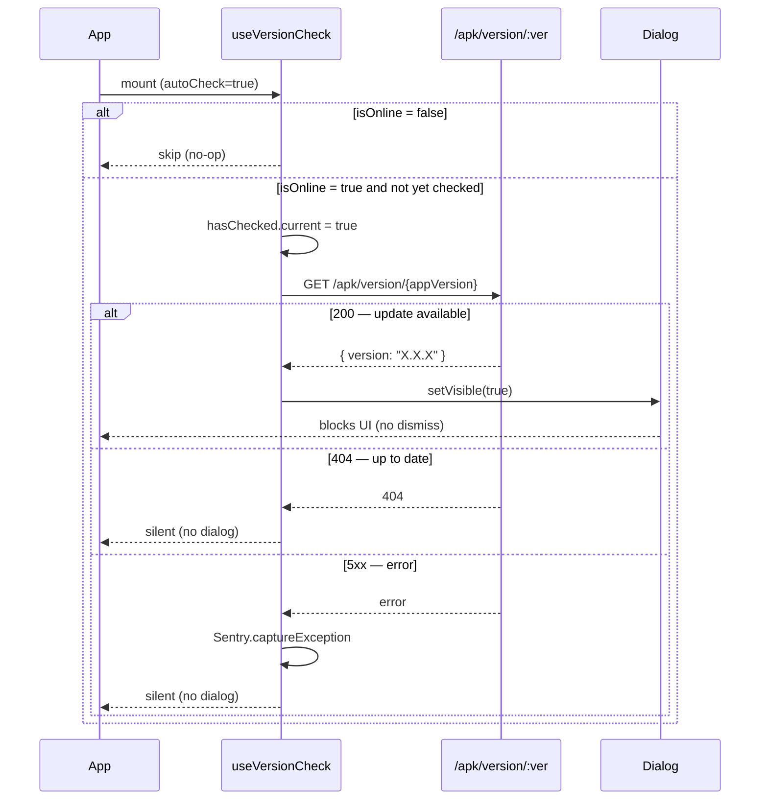

# Mobile Auto-Update — Design Plan

## Overview

When the app starts and a network connection is available, automatically check whether a newer APK is available. If an update exists, show a **non-dismissable** dialog that forces the user to install the update before continuing. If the device is offline the check is skipped entirely.

The existing manual check in `About.js` is preserved but refactored to share the same logic via a new shared hook.

---

## Behaviour Matrix

| Condition | Home screen | About screen |
|---|---|---|
| Offline on mount | Skip check, no dialog | Button disabled (existing behaviour) |
| Online → no update (404) | Silent, no dialog | Dialog: "No update found" + Cancel |
| Online → update found (200) | Force-update dialog (no dismiss) | Dialog: update text + Update + Cancel |
| Online → API error (5xx) | Silent (Sentry capture, no dialog) | Dialog: error text + Cancel |

---

## Architecture

```mermaid
flowchart TD
    HK[useVersionCheck hook]
    HK -->|autoCheck=true| Home
    HK -->|autoCheck=false| About

    subgraph "useVersionCheck({ autoCheck })"
        S1[isOnline from UIState]
        S2[appVersion + apkURL from BuildParamsState]
        S3[checkVersion(silent)]
        S4[handleUpdate → Linking.openURL]
        S5["visible / checking / updateInfo state"]
    end

    subgraph "Home.js (force-update)"
        H1["useEffect: autoCheck + isOnline → checkVersion(true)"]
        H2[Force-update Dialog — no cancel, onBackdropPress=no-op]
    end

    subgraph "About.js (manual)"
        A1[Button → checkVersion() — non-silent]
        A2[Dialog — shows loading + Cancel button]
    end

    HK --> H1
    HK --> A1
```

---

## Auto-check Trigger Logic



---

## Files

### New
| File | Purpose |
|---|---|
| `app/src/hooks/use-version-check.js` | Shared hook: API call, state, handleUpdate |

### Modified
| File | Change |
|---|---|
| `app/src/lib/i18n/ui-text.js` | Add `updateRequiredTitle` (en + fr) |
| `app/src/pages/Home.js` | Import hook, add force-update Dialog |
| `app/src/pages/About/About.js` | Remove inline state/logic, use hook |

> The hook is imported directly via its path: `import useVersionCheck from '../hooks/use-version-check'` (or `'../../hooks/use-version-check'` from About). No barrel `hooks/index.js` is added since this is the only hook in the directory.

---

## Hook API

```javascript
const {
  visible,      // boolean — controls Dialog visibility
  setVisible,   // setter — About.js uses to close dialog
  checking,     // boolean — true while API call in flight
  updateInfo,   // { status: number|null, text: string }
  checkVersion, // (silent?: boolean) => void — silent=true for Home
  handleUpdate, // () => Promise<void> — opens APkURL
} = useVersionCheck({ autoCheck: boolean });
```

**silent mode** (`checkVersion(true)`, used by autoCheck):
- Does NOT set `visible=true` on call
- Sets `visible=true` only in the `.then()` branch (update found)
- On 404/5xx: stays invisible

**non-silent mode** (`checkVersion()`, used by About button):
- Sets `visible=true` immediately (shows loading spinner)
- Updates `updateInfo` on result

---

## One-run guard

`hasChecked` is a `useRef(false)` inside the hook. The `autoCheck` effect gate:

```
autoCheck && isOnline && !hasChecked.current  →  check once, set hasChecked.current = true
```

Prevents re-checking when `isOnline` flips or language changes (which recreate `checkVersion` via `useCallback`).

---

## Force-update Dialog (Home.js)

```jsx
<Dialog isVisible={visible} onBackdropPress={() => {}}>
  <Dialog.Title title={trans.updateRequiredTitle} />
  <Text>{updateInfo.text}</Text>
  <Dialog.Actions>
    <Dialog.Button onPress={handleUpdate}>{trans.buttonUpdate}</Dialog.Button>
  </Dialog.Actions>
</Dialog>
```

Key props:
- `onBackdropPress={() => {}}` — tapping outside does nothing
- No Cancel / close button
- Android back button is NOT intercepted (acceptable — pressing back exits the app, which is fine)

---

## New Translation Keys

| Key | en | fr |
|---|---|---|
| `updateRequiredTitle` | `'Update Required'` | `'Mise à jour requise'` |

Existing keys reused: `newVersionAvailable`, `buttonUpdate`, `noUpdateFound`, `checkingVersion`.

---

## Constraints

- Airbnb ESLint: no `for...of`, no `await` in loops, arrow components
- No new npm dependencies — `@rneui/themed`, `expo-linking`, `@sentry/react-native` already available
- `checkVersion` must not run when `isOnline = false` (guard is inside the function and in the effect)
- About.js refactor must preserve identical visible behaviour for the user
