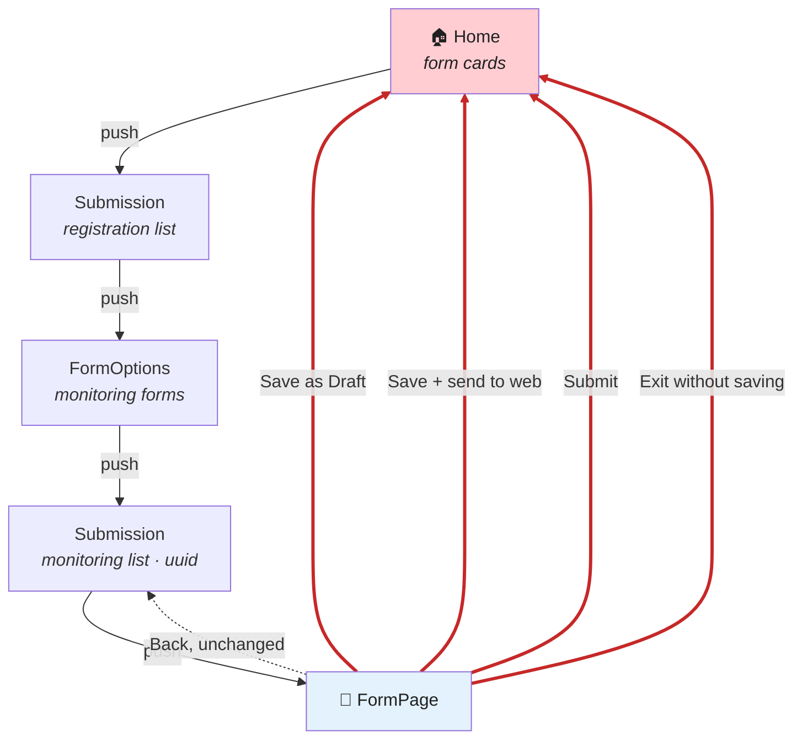
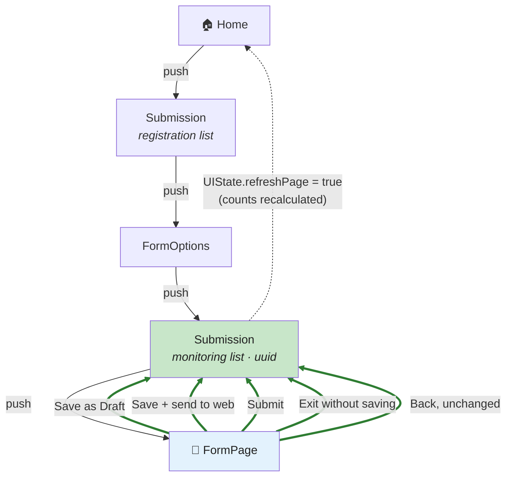
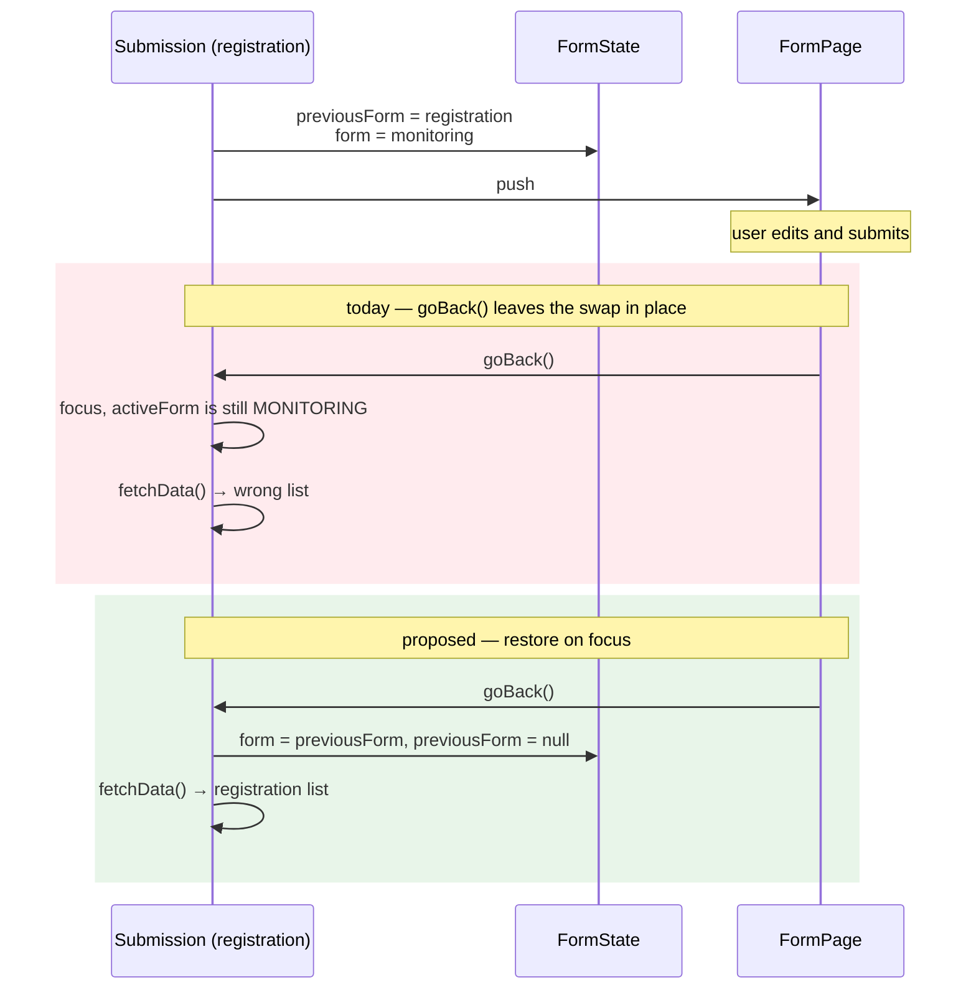

# Mobile: return to where you came from after saving, submitting or exiting a form

**Status:** implemented and verified on device.
**Issue:** [akvo/iwsims#67](https://github.com/akvo/iwsims/issues/67)
**Follows on from:** [`mobile-monitoring-draft-management.md`](doc/claude/mobile-monitoring-draft-management.md)
and [`mobile-unsaved-changes-dialog.md`](doc/claude/mobile-unsaved-changes-dialog.md).

---

## The problem

Every way out of `FormPage` except one jumps to Home, collapsing the stack the user built:

| Action | Current code | Lands on |
|---|---|---|
| Back, nothing changed | `navigation.goBack()` | previous screen ✅ |
| Save as Draft | `finishSave` → `navigation.navigate('Home', {...route?.params})` | **Home** ❌ |
| Save and send to web | same `finishSave` | **Home** ❌ |
| Submit | same `finishSave` | **Home** ❌ |
| Exit without saving | `handleOnExit` → `navigation.navigate('Home')` | **Home** ❌ |

`Home` sits at the bottom of the stack, so `navigate('Home')` pops everything above it. The deeper
the user was, the more it costs.

### What it costs

A monitoring visit is four screens deep:

```
Home → Submission (registration) → FormOptions → Submission (monitoring) → FormPage
```

Submit one monitoring form and all four are destroyed. To record the next one at the same water
point the enumerator taps: form card → datapoint → monitoring form → New Submission. Four
navigations to return to a screen they were on a second ago — repeated for every visit, all day.

The same applies to the drafts-only view added in #33: finish one draft, and you are at Home rather
than in the list of the remaining ones.

## Current behaviour



The one dotted path is the only one that behaves — and it is the path the user takes when they did
nothing.

## Proposed behaviour



Every exit returns one step. The list the user came from refetches and shows the result of what
they just did — the new submission, or the draft they just saved. Home still updates its counts,
but through the flag rather than by being navigated to.

## Why Home is navigated to today

Not arbitrary. Look at the argument:

```js
navigation.navigate('Home', { ...route?.params });
```

Those params are the *form's* params (`id`, `name`, `formId`, `uuid`, `dataPointId`,
`newSubmission`), and Home does not read any of them individually. It reads their existence:

```js
// Home.js — getUserForms
if (params || currentUserId || activeLang !== appLang || refreshPage) {
```

with `params` in the dependency array. **The redirect is a refresh mechanism.** Arriving at Home
with any params at all re-runs the form query, so the card counts pick up the new submission.

That was the only tool available when it was written. `UIState.refreshPage` now exists, is already
consumed by the same `getUserForms`, and is what the draft delete added in #33 uses. The params
carry no other meaning — and they leave Home holding a stale `dataPointId` afterwards.

## The wrinkle: `FormState.form` must be restored

`openFamilyDraft` (the grouped drafts view from #33) swaps the active form so `FormPage` renders the
right questions, and remembers the one it replaced:

```js
// Submission.js
FormState.update((s) => {
  s.previousForm = activeForm;   // the registration form
  s.form = targetForm;           // the monitoring form being edited
});
```

Restoration happens in Submission's `beforeRemove` listener — which fires only when Submission
**unmounts**. Today it does unmount, because the exit jumps to Home. The restore works by accident
of the bug this plan removes.

With `goBack()`, Submission stays mounted and regains focus with `FormState.form` still pointing at
the monitoring form. Its `fetchData` keys on `activeForm.id` / `activeForm.formId`, so the
registration list would silently reload as a monitoring list.

**This bug already exists.** The one exit that behaves correctly today — back with no changes —
already returns to a Submission whose active form was swapped. Open a monitoring draft from the
grouped view, press back without editing, and the registration list is wrong until you leave and
re-enter. Fixing the navigation makes it reachable from four more paths, so it has to be fixed with
them.



---

## Change 1 — `app/src/pages/FormPage.js`

### 1a. One helper for leaving the screen

```diff
+  // Every exit returns to the screen that opened the form — the list the user was
+  // working in, which refetches and shows what just happened. Home is only a
+  // fallback for a stack that has nothing to go back to (deep link, restored state).
+  const leaveForm = () => {
+    // Home stays mounted below and computes its card counts once, so it has to be
+    // told. This replaces navigating to Home purely to trigger that refresh.
+    UIState.update((s) => {
+      s.refreshPage = true;
+    });
+    if (navigation.canGoBack()) {
+      navigation.goBack();
+      return;
+    }
+    navigation.navigate('Home');
+  };
```

### 1b. Save, send-to-web and submit

```diff
   const finishSave = async (result, successText) => {
     if (result === 'failed') {
       if (Platform.OS === 'android') {
         ToastAndroid.show(trans.saveFailedKeepOpenText, ToastAndroid.LONG);
       }
       return;
     }
     if (Platform.OS === 'android') {
       ToastAndroid.show(
         result === 'fallback' ? trans.savedToDeviceText : successText,
         ToastAndroid.LONG,
       );
     }
     await refreshStorageWarning();
     await refreshForm();
-    navigation.navigate('Home', { ...route?.params });
+    leaveForm();
   };
```

### 1c. Exit without saving

```diff
   const handleOnExit = async () => {
     await refreshForm();
-    return navigation.navigate('Home');
+    return leaveForm();
   };
```

### 1d. Back with no changes

Already correct, but routed through the helper so all four exits share one definition — and so the
Home refresh happens on this path too, which it does not today:

```diff
   const handleOnPressArrowBackButton = async () => {
     if (hasUnsavedChanges) {
       setShowDialogMenu(true);
       return;
     }
     await refreshForm();
-    navigation.goBack();
+    leaveForm();
   };
```

## Change 2 — `app/src/pages/Submission.js`

Restore the swapped form when the screen regains focus, not only when it unmounts.

```diff
   useEffect(
     () =>
       // Restore the form the user came from, then let the navigation proceed on its
       // own. Nothing calls e.preventDefault() here, so re-dispatching e.data.action
       // would fire the same action a second time — and once this screen is gone the
       // duplicate has no navigator left to handle it ("GO_BACK was not handled").
       navigation.addListener('beforeRemove', () => {
         if (previousForm) {
           FormState.update((s) => {
             s.form = previousForm;
             s.previousForm = null;
           });
         }
       }),
     [navigation, previousForm],
   );
+
+  useEffect(
+    () =>
+      // openFamilyDraft swaps FormState.form to the monitoring form being edited and
+      // parks the registration form in previousForm. Returning from FormPage focuses
+      // this screen without unmounting it, so the swap has to be undone here or the
+      // registration list reloads itself as a monitoring list.
+      navigation.addListener('focus', () => {
+        if (previousForm) {
+          FormState.update((s) => {
+            s.form = previousForm;
+            s.previousForm = null;
+          });
+        }
+      }),
+    [navigation, previousForm],
+  );
```

Both listeners are kept: `focus` covers coming back from `FormPage`, `beforeRemove` covers leaving
Submission in the other direction.

**The focus listener must be armed, not merely guarded on `previousForm`.** It fires on a screen's
*first* focus too, and two callers set `previousForm` before pushing Submission:
`FormOptions.goToSubmission` and `openFamilyDraft`. An unguarded listener therefore fired the moment
the monitoring list mounted from FormOptions and restored the *registration* form onto it — after
which FormPage rendered monitoring answers against registration definitions and `TypeCascade` threw
`value?.includes is not a function`.

So the restore is armed by the one place that makes the swap:

```js
  // Armed only by openFamilyDraft, which is the one place that swaps the active form.
  const restoreFormOnFocusRef = useRef(false);

  // …in openFamilyDraft, immediately after the FormState.update that swaps the form:
  restoreFormOnFocusRef.current = true;

  // …in the focus listener:
  if (!restoreFormOnFocusRef.current) {
    return;
  }
  restoreFormOnFocusRef.current = false;
```

Chosen over "skip the first focus event", which would still misfire for any future screen that sets
`previousForm` before pushing here. Tying the restore to the swap keeps the two from drifting apart.

## Change 3 — `app/src/pages/Home.js`

Nothing required. `refreshPage` is already in `getUserForms`'s condition and dependency array:

```js
if (params || currentUserId || activeLang !== appLang || refreshPage) {
```

Optionally, `params` could be dropped from that condition now that nothing navigates to Home to
trigger a refresh — but `Home` is also the initial route and receives params from other paths, so
**leave it alone in this change**. Removing it is a separate cleanup with its own risk.

---

## What each flow looks like afterwards

| Starting point | Action | Lands on | Shows |
|---|---|---|---|
| Registration list → new form | Submit | registration list | the new datapoint |
| Registration list → draft row | Save as Draft | registration list | the draft, updated |
| Grouped drafts view → monitoring draft | Submit | grouped drafts view | one fewer draft |
| Monitoring list (uuid) → new form | Submit | monitoring list | the new monitoring entry |
| Monitoring list → any form | Exit without saving | monitoring list | unchanged |
| Any | Back, unchanged | previous screen | unchanged |

## Verification

1. **The main case.** Home → form card → datapoint → monitoring form → New Submission → fill →
   Submit. Lands on the monitoring list with the new entry visible; **New Submission** is one tap
   away for the next visit.
2. **The swap.** Registration list → *Show drafts only* → open a monitoring draft → Submit →
   returns to the registration list, showing registrations (not monitoring rows). Repeat with
   *Back, unchanged* — the pre-existing bug this fixes.
3. **Home counts.** After each of the above, back out to Home: Submitted / Draft / Synced reflect
   what just happened, without Home having been navigated to.
4. **Save as Draft** from a monitoring form → monitoring list, draft visible with its badge.
5. **Exit without saving** → previous list, nothing added.
6. **Failed save.** With saving forced to fail, the screen must stay put — `finishSave` returns
   before `leaveForm()` on `'failed'`, which this change must not disturb.
7. `cd app && npm run lint`.

## Risks

- **`canGoBack()` false.** Only reachable if `FormPage` is somehow the first screen — a restored
  navigation state or a future deep link. The fallback keeps today's behaviour rather than trapping
  the user.
- **Two listeners writing `previousForm`.** Both guard on it being set and both null it, so the
  second is a no-op. Worth confirming on device that returning from `FormPage` restores the list
  exactly once — visible as the list not flickering between form types.
- **Home refresh now fires more often** — on every form exit including plain back, where previously
  it only fired when Home was navigated to. It is one local SQLite aggregate against an open
  connection, on a screen the user is not looking at.
- **No automated coverage.** The mobile suite does not run (66 failed / 6 passed on stock `main`),
  so this ships on manual verification like the rest of #33.
