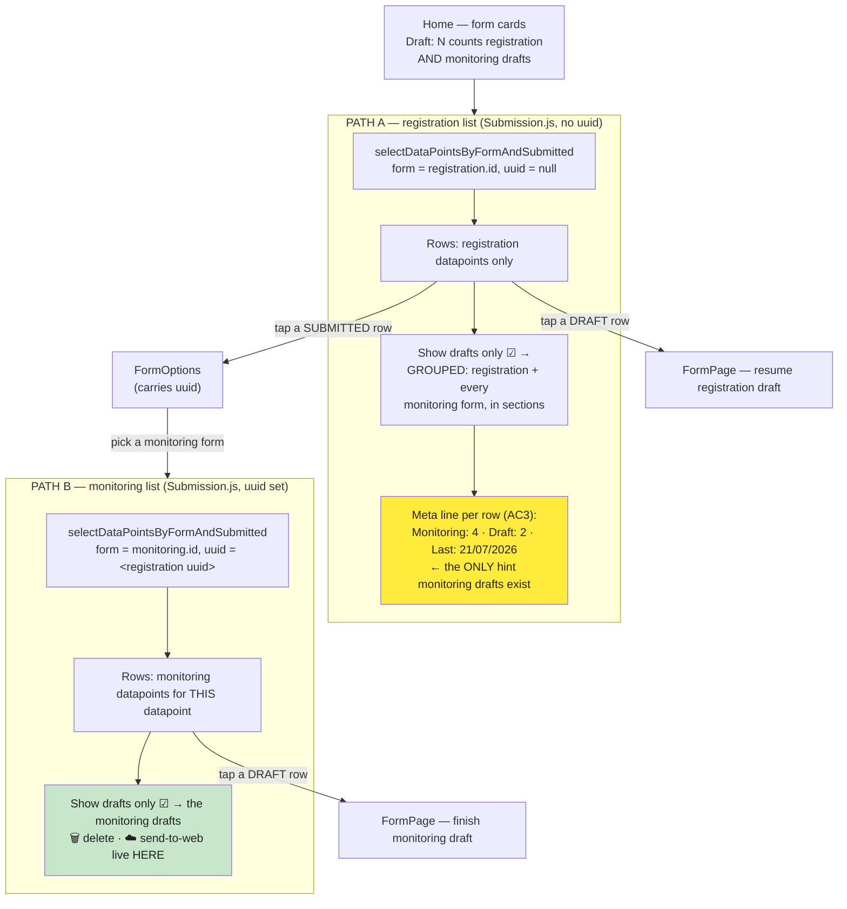
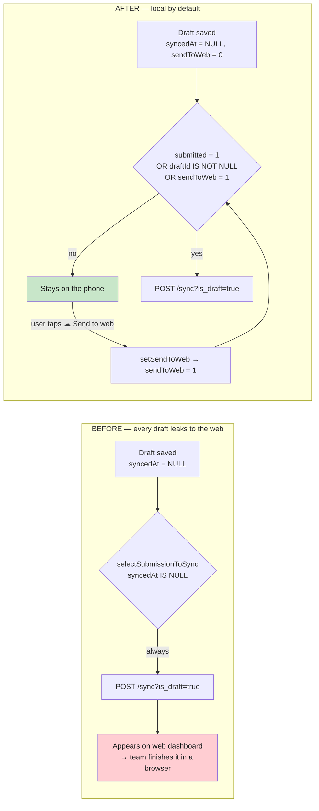
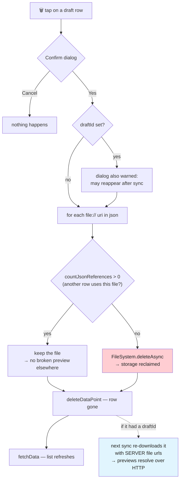
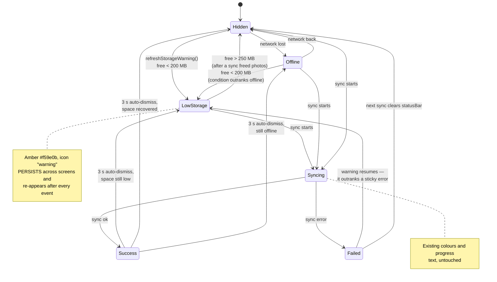
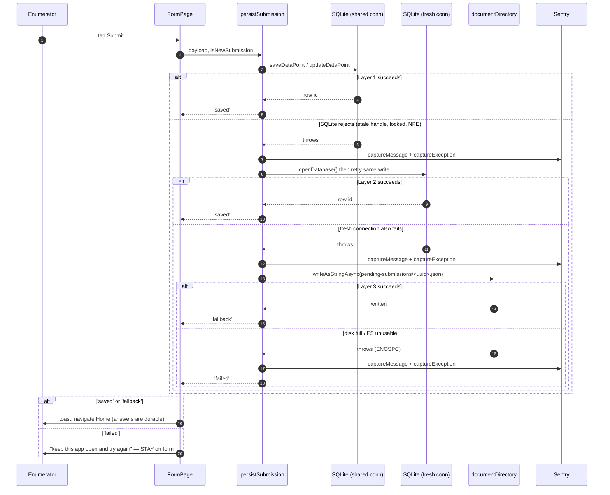
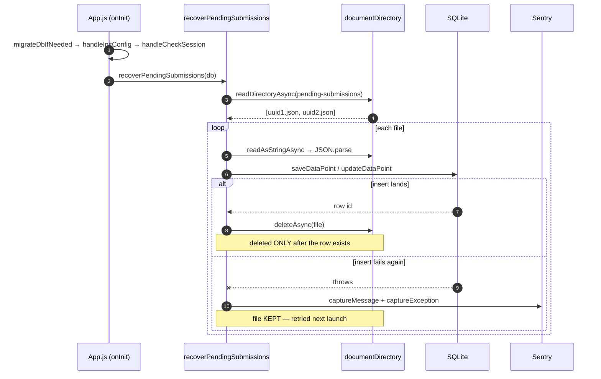
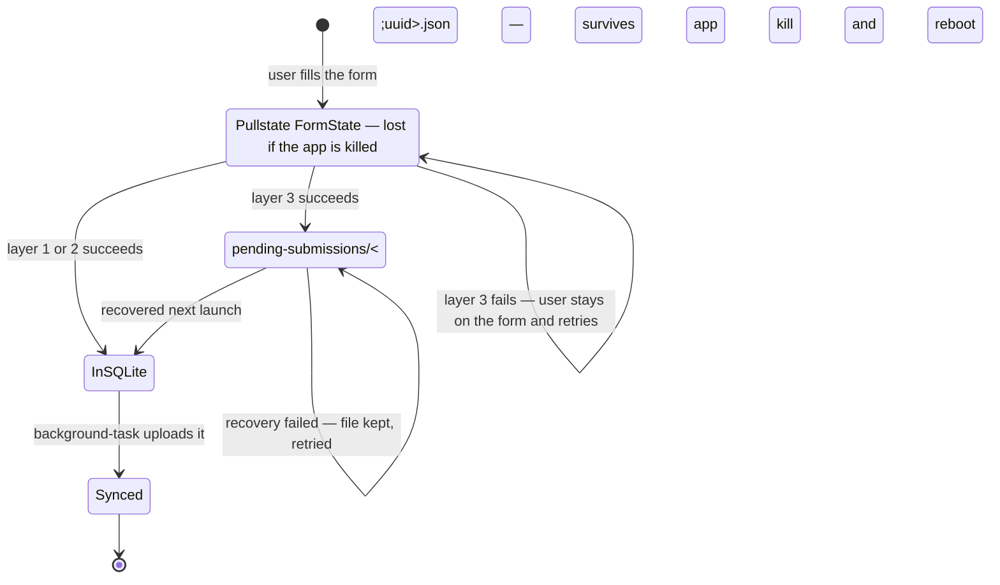
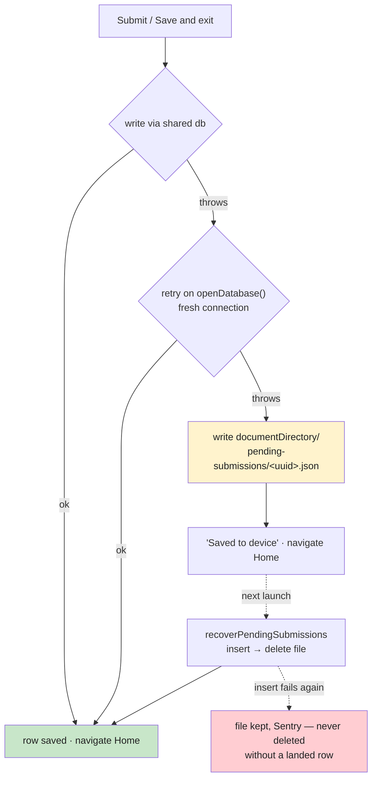

# Mobile App: Finding, Managing, and Finishing Monitoring Drafts

**Issues:** [akvo/iwsims#33](https://github.com/akvo/iwsims/issues/33) (drafts: find, manage,
finish) · [akvo/iwsims#16](https://github.com/akvo/iwsims/issues/16) (Step 0 — the SQLite
connection fix). One PR, two issue references.

Implementation plan. **No new screens, no redesign.** Almost entirely app-side; the single
backend change is one routed `destroy` action, explained under "Why deleting a web-known draft
requires connectivity". Most UI work lands in one
screen ([Submission.js](app/src/pages/Submission.js)); two smaller changes touch
[App.js](app/App.js) (Step 0) and [AttachmentView.js](app/src/components/FormDataDetails/AttachmentView.js) (Step 7).

## Acceptance criteria → change map

| # | Acceptance criterion | Where | Step |
|---|---|---|---|
| AC1 | Remove the draft icon everywhere | `Submission.js` header (`file-clock` toggle + red dot) — the only draft icon in the app | 3 |
| AC2 | Add a draft filter ("Show drafts only" checkbox) to the submission list | `Submission.js` filter bar; grouped family view | 4, 5c |
| AC3a | Show the number of drafts on the datapoint list | `getMonitoringStats` + row meta line | 2, 5 |
| AC3b | Show the last monitoring date | idem | 2, 5 |
| AC3c | Show the total number of monitoring submissions | idem | 2, 5 |
| AC4 | "Sort by Last Submission", including the latest monitoring submission | `Submission.js` sort chip + `sortAt` key | 4 |
| P3 | Delete a draft (trash + confirmation, local only) | `Submission.js` draft rows | 6 |
| P4 | Drafts stay on the phone; explicit "Send to web dashboard" | migration + `selectSubmissionToSync` | 1, 2, 6 |
| P5 | Attachments that are not images open through the system instead of failing | `AttachmentView.js` | 7 |
| [#16](https://github.com/akvo/iwsims/issues/16) | **Prerequisite:** a submission must survive any SQLite failure | `App.js`, `FormPage.js`, `StatusBanner.js`, new `submission-fallback.js` | 0 |

AC1–AC4 are the user-facing acceptance criteria of #33. P3/P4 are the remaining two problems from
that issue; they share the same screen and the same confirmation dialog, so they ship together.
Step 0 belongs to #16 and travels in the same PR as its own commit — P4 depends on it (see below).

---

## What shipped — deviations from this plan

Implemented on `feature/33-monitoring-draft-management`. The design decisions above all hold; these
are the places the code differs from the snippets, and why.

| # | Planned | Shipped | Why |
|---|---|---|---|
| 1 | `NetworkStatusBar` | **`StatusBanner`** | The component no longer reports only network state. `StatusBar` was rejected — it shadows React Native's own export. |
| 2 | Low-storage says "sync now to free space" | **"free up space on this device"**, one message everywhere | Syncing reclaims space only by deleting already-uploaded photos: impossible advice signed-out, a no-op signed-in with nothing pending. |
| 3 | `leftContent={(reset) => …}` render prop | Plain node + a `swipeToken` in each row's key | The render prop trips `react/no-unstable-nested-components`, and CLAUDE.md forbids disabling rules. Bumping the token on dialog-open remounts rows closed — the same job `reset()` did, and it also closes any other open row. |
| 4 | `<ListItem.Content>` + `<ListItem.Chevron />` | One wrapper `View` holding body + Ionicons chevron | RNEUI's `PadView` inserts an **unkeyed spacer** between siblings, so two children produce a "unique key" warning from inside the library. One child avoids it. |
| 5 | `draftCount` derived from `data` | `countFamilyDrafts` query (path A) / `totalSavedData` (path B) | `data` holds registration rows until the box is checked, so the label undercounted by every monitoring draft, then jumped. |
| 6 | Two web states: `On web` / nothing | **Three**: nothing → `Pending upload` → `On web`, keyed on `syncedAt` | "On web" meant "bound for the web", not "the web has this version". It contradicted the send-to-web toast, and went stale after an edit. |
| 7 | — | `beforeRemove` no longer re-dispatches `e.data.action` (Submission, FormOptions) | Neither listener calls `preventDefault()`, so the dispatch ran the action a second time — "GO_BACK was not handled by any navigator" once the screen was gone. |
| 8 | — | `FAButton`: `position: 'fixed'` → `'absolute'` + `useSafeAreaInsets()`; lists get `paddingBottom: 88` | `fixed` is not a React Native position value; it fell back to in-flow layout and painted a full-width band over the list. Going absolute then required handling the nav-bar inset explicitly. |
| 9 | — | `SaveDialogMenu` overlay sized by content; Cancel is `type="clear"` | `flex: 0.2` was tuned for three buttons and clipped the fourth once "Save and send to web dashboard" was added. |
| 10 | Deletion is local-only; the dialog warns the draft may reappear | **Atomic delete of both copies**, gated on connectivity — see below | The endpoint already existed, so the plan was wrong to assume a backend change was needed. |
| 11 | `swipeToken` in the row key, to close the swipe on confirm | **Removed** | It remounted the row — and the button being pressed — before the confirmation could open, so no dialog appeared at all. Losing the auto-close is cosmetic; a confirmation that never shows is not. |
| 12 | — | `destroy` action + route on the mobile `DraftFormDataViewSet`, and 8 tests for it | The PR's only backend change; the web delete endpoint is unreachable with a device token. |
| 13 | — | `UIState.refreshPage` set after a delete | Home stays mounted and would otherwise keep counting the deleted draft on its card. |

Also shipped as planned but worth noting concretely: `expo-intent-launcher@12.1.5`,
`BYTES_PER_MB` in constants, `DATABASE_VERSION` 9 → 10, and a `finishInit` helper in `App.js` so
config, session, recovery and the storage probe run on the migration path too — previously an
upgrade launch skipped them and the app looked logged out until restarted.

### Step 9 (tests): backend covered, mobile blocked

**Backend — added and passing.** `api/v1/v1_mobile/tests/tests_mobile_draft_delete.py`, 8 tests:
a successful delete asserted through `_base_manager` (so a soft delete would fail the test, since
a soft-deleted draft returns through the draft-list download); another user's draft 404s; a
*published* submission 404s, which is the worst thing this endpoint could get wrong; an invalid
token 401s; a web session token 403s, documenting the auth asymmetry that made this endpoint
necessary; the list route still resolves, guarding the unanchored-pattern ordering; and GET on the
detail route 405s.

**Mobile — still blocked.** The suite reports **66 failed / 6 passed, 17 failed tests**, and the
identical figures come back with every change on this branch stashed, on stock `main`. The causes
are `Cannot find native module 'ExpoTaskManager'` and react-test-renderer against React 19, neither
related to this work. Suites that cannot execute would read as coverage in review while proving
nothing, so the specs in Step 9 stand as the definition of what to add once the harness is
repaired.

---

## Workflow changes

### 1. Where a draft is visible — and where it is not

`Submission.js` renders two different lists depending on how it was reached. This is the single
most important thing to understand before implementing AC2/AC3, because a **monitoring draft never
appears as a row on the registration list** — it appears only as a *count*.



**Answer to "what happens when a monitoring draft is opened from path A":** in the *submitted*
list, it never appears — that query is `form = activeForm.id`, and a monitoring draft's `form`
column holds the monitoring form's row id. `Draft: 2` on the meta line is the only sign it exists.
Ticking **Show drafts only** switches to a different query (`getFamilyDrafts`) that spans the whole
form family, so the monitoring drafts do appear there, grouped by form — see the decision below.

### Decision: "Show drafts only" groups the whole form family

The earlier draft of this plan proposed a breadcrumb — a tappable `Draft: 2` leading down through
FormOptions to the monitoring list. That made a bad information architecture navigable. Grouping
removes the need to navigate at all.

**When `Show drafts only` is checked on path A, the list becomes a `SectionList` covering the whole
form family** — the registration form and every monitoring form under it:

```
☑ Show drafts only (3)
─────────────────────────────────
 Rural Water Project            (2)
 ─────────────────────────────────
   • Well 12 — Jinja             🗑 ☁ ›
   • Well 47 — Mbale             🗑 ☁ ›
 Rural Water Project Quick Monitoring   (1)
 ─────────────────────────────────
   • Well 03 — Gulu              🗑 ☁ ›
```

This is strictly better than the breadcrumb, for a reason worth stating: **Sarah's 12 drafts live
on 12 different datapoints.** Down the drill-down route she visits FormOptions once per datapoint —
roughly 12 × 4 taps, and only if she already knows which 12 to visit. In the grouped view they are
all in one section, in one tap, listed by datapoint name.

It also resolves both earlier consequences instead of working around them:

- **Monitoring drafts become reachable from path A** — the gap that made `Draft: 2` a dead end.
- **Delete and send-to-web keep their "act only on what you can see" property**, because the drafts
  are now visible rows. Nothing acts at a distance; the principle is preserved by making the
  objects visible rather than by making the actions remote.

Path B is unchanged: it stays the per-datapoint view, and is still where you land from FormOptions.

The plain (unchecked) list is unaffected — same rows, same order, plus the AC3 meta line. The meta
line stays useful for "which datapoints have unfinished work" while browsing submissions, but it no
longer has to carry navigation, so it needs no tappable affordance.

### Also needed: make the draft counts agree (Step 5b)

The counts must match at every step or the breadcrumb destroys the trust it is meant to build.
They do not match today:

| Screen | Query | Counts |
|---|---|---|
| Home card `Draft: N` | `selectLatestFormVersion` ([crud-forms.js:37-47](app/src/database/crud/crud-forms.js#L37-L47)) | every `submitted = 0` |
| FormOptions `draft` | `getFormOptions` ([crud-forms.js:148-151](app/src/database/crud/crud-forms.js#L148-L151)) | `submitted = 0` **AND `syncedAt IS NULL`** |
| New meta line | `getMonitoringStats` (Step 2) | every `submitted = 0` |

A draft downloaded from the web has `syncedAt` set, so FormOptions already reports fewer drafts
than Home does — an existing inconsistency that the new meta line would put side by side and make
obvious. Align on "every unfinished draft", since a synced draft is still one the user can open and
finish: drop `AND dp.syncedAt IS NULL` from `getFormOptions`. One line, and all three agree.

### 2. Draft sync: what P4 changes



The `draftId IS NOT NULL` arm is not optional: `onSyncDraftDatapoint` downloads every web draft on
each sync and dedups by `draftId`. Holding back a draft the server already knows about would make
the download insert a second copy.

### 3. Delete: row, files, and the two guards



## Findings that shape the design

- **`file-clock` is the only draft icon in the codebase** (`grep -rn "file-clock\|LucideIcon" src`
  → two hits, both in `Submission.js`). "Everywhere" is one place. `Home.js` and `FormOptions.js`
  show draft *counts as text*, never an icon, so they are untouched.
- **`PageTitle` renders the settings button when `rightComponent === null`**
  ([PageTitle.js:71-75](app/src/components/BaseLayout/PageTitle.js#L71-L75)). Dropping the
  `rightComponent` prop from `Submission.js` therefore restores the standard ⋮ button, matching
  every other screen. No extra work needed.

---

## Error-handling convention for this PR

Every `catch` added or touched by this work reports to Sentry. No bare `catch {}`, and no
`catch (error) {}` that only swallows — including the ones that *intentionally* continue, because
"we chose to continue here" and "this silently broke" look identical in production otherwise.
`crudJobs.getActiveJob` is the cautionary case: its bare `catch { return null; }` made a dead
database indistinguishable from "no active job", which is what let a whole session fail invisibly
until a later insert threw.

The shape, for a catch that continues:

```js
  } catch (error) {
    Sentry.captureMessage('[module] what was being attempted, and what happens now');
    Sentry.captureException(error);
    // …the deliberate fallback…
  }
```

`captureMessage` first so the Sentry issue has a readable title; `captureException` for the stack.
A one-line `.catch(() => null)` is acceptable **only** for genuinely idempotent cleanup whose
failure costs nothing — and even there, prefer a message when the failure leaves state behind
(an orphaned file, for instance).

**Existing bare catches in files this PR touches** — sweep them in the Step 0 commit:
`crud-jobs.js` `getActiveJob` (covered by the 0a port), `updateJob`, `deleteJob`, and the
`needsRetake` catch in `Submission.fetchData` ([Submission.js:165](app/src/pages/Submission.js#L165)),
which currently hides a JSON parse failure as "photo is fine".

---

## Step 0 — Prerequisite: make a submission survivable (L)

> Tracked as [#16](https://github.com/akvo/iwsims/issues/16). Ships in this PR as its own first
> commit, so it stays reviewable — and revertable — separately from the feature work.
>
> Four parts: **0a** removes the known cause, **0b** fixes two failure-handling bugs in
> `FormPage`, **0c** makes a submission durable even when SQLite is unusable, **0d** warns the user
> before the disk fills. 0a alone would close the Sentry reports; 0b-0d are the preventive half,
> and they are the reason a partner cannot hit silent data loss again from a cause we have not
> seen yet.

### Step 0a — Stop `SQLiteProvider` closing the database

Two production Sentry events from a deployment of this codebase, 19 Aug 2026, on two different
devices (Android 13 emulator, Samsung SM-A145F Android 15), both in the foreground with plenty of
memory and storage:

```
Error inserting row into table jobs: Call to function 'NativeDatabase.prepareAsync'
  has been rejected. → Caused by: java.lang.NullPointerException
  at insertRow (src/database/sql.js:112)

Error saving datapoint: Error inserting row into table datapoints: ... prepareAsync
  has been rejected. → Caused by: java.lang.NullPointerException
  at saveDataPoint (src/database/crud/crud-datapoints.js:94)
```

Those are the two writes in `FormPage.handleOnSubmitForm` — `saveDataPoint` then `crudJobs.addJob`.
**A user pressed Submit and lost the submission.**

### Root cause (confirmed in the installed expo-sqlite)

`SQLiteProvider` keys its setup effect on the `onInit` prop and its cleanup **closes the database**:

```js
// node_modules/expo-sqlite/build/hooks.js
async function teardown(db) { await db?.closeAsync(); }        // :92-95
return () => { const db = databaseRef.current; teardown(db); };
}, [databaseName, directory, options, onInit]);                 // :107  ← onInit is a dependency
```

The memo wrapper compares it by reference too (`prevProps.onInit === nextProps.onInit`, :28).

In [App.js](app/App.js), `migrateDbIfNeeded` is declared **inside** the `App` component (line 197)
and passed as `onInit` (line 338), while `App` subscribes to nine Pullstate values (lines 120-128).
So every store update re-renders `App` → new function identity → provider tears down →
`closeAsync()` → every screen still holding the `db` from `useSQLiteContext()` now has a dead
handle, and its next write throws the NPE above. `handleInitConfig` calls
`BuildParamsState.update` itself, so the loop can start during boot.

### Fix — hoist the init functions to module scope

Move `handleInitConfig`, `handleCheckSession` and `migrateDbIfNeeded` out of the `App` component to
**module scope**, and drop the eight `BuildParamsState.useState` subscriptions in favour of one
imperative read. A module-scope function has a stable identity, so `onInit` never changes and the
provider never tears the connection down:

```js
// Declared at module scope so their identity never changes. SQLiteProvider keys
// its setup effect on `onInit` and its cleanup closes the database, so a function
// recreated on every render tears the connection down mid-session.
const handleInitConfig = async (db) => {
  // Read imperatively rather than subscribing: a subscription re-renders App,
  // which changes the onInit identity and makes SQLiteProvider close and reopen
  // the database underneath every screen already holding it.
  const {
    serverURL: serverURLState,
    dataSyncInterval: syncValue,
    gpsThreshold,
    gpsAccuracyLevel,
    geoLocationTimeout,
    imageQuality,
    saveToGallery,
    appVersion,
  } = BuildParamsState.getRawState();
  // …body unchanged…
};

const handleCheckSession = async (db) => { /* unchanged, moved out */ };

const migrateDbIfNeeded = async (db) => { /* unchanged, moved out */ };

const App = () => {
  const locationIsGranted = UserState.useState((s) => s.locationIsGranted);
  // …
};
```

`locationIsGranted` is the only subscription `App` still needs; it does not feed `onInit`.

Port the companion `crud-jobs.js` change as well — `getActiveJob` swallowed every error as
"no active job", which is exactly what let a dead connection stay invisible until the next insert
threw:

```js
    } catch (error) {
      // Still null, so callers keep treating this as "no active job" — but a dead
      // connection used to be indistinguishable from that, which let a whole
      // session fail invisibly until the follow-up insert threw instead.
      Sentry.captureMessage('[crudJobs] getActiveJob failed, treating as no active job');
      Sentry.captureException(error);
      return null;
    }
```

### Why Step 0 blocks the rest of the plan

Step 6 adds two new writes (`deleteDataPoint`, `setSendToWeb`) on the same shared handle, and
Step 2 makes local drafts the **only** copy of the user's work. Today a write that dies this way
still had a chance of being recovered from the web dashboard; after P4 there is nothing to recover
from. Land Step 0 first, or P4 turns an intermittent write failure into permanent data loss.

The pattern has been validated against these exact Sentry signatures on another deployment of this
codebase, but that tree has diverged from this one — treat the code above as the specification and
apply it to `App.js` as it stands here, rather than transplanting a diff.

### Step 0b — Two bugs in `FormPage`'s failure handling

**The `crudJobs` calls sit outside the try** ([FormPage.js:85-93](app/src/pages/FormPage.js#L85-L93)):

```js
const handleOnSaveAndExit = async () => {
  const activeJob = await crudJobs.getActiveJob(db, SYNC_FORM_SUBMISSION_TASK_NAME);
  if (!activeJob) {
    await crudJobs.addJob(db, {...});   // ← outside try: rejection escapes the handler
  }
  ...
  try {
```

`getActiveJob` swallows every error as "no active job" ([crud-jobs.js:20](app/src/database/crud/crud-jobs.js#L20)),
so a dead connection routes straight into `addJob`, which rejects
([crud-jobs.js:31](app/src/database/crud/crud-jobs.js#L31)). Nothing catches it: **no toast, no
navigation, no save.** The user taps "Save and exit" and the app does nothing at all. That is the
`insertRow → jobs` stack in the first Sentry event above.

Fix: move both calls inside the `try`, and treat a failed job insert as non-fatal — the datapoint
matters, the job row is only a sync trigger that the next launch recreates:

```js
      try {
        const activeJob = await crudJobs.getActiveJob(db, SYNC_FORM_SUBMISSION_TASK_NAME);
        if (!activeJob) {
          await crudJobs.addJob(db, { user: userId, type: SYNC_FORM_SUBMISSION_TASK_NAME, status: jobStatus.PENDING });
        }
      } catch (error) {
        // Deliberately non-fatal: the answers are what matter, and SyncService
        // recreates a missing job on its next pass. Reported so a systematically
        // failing job insert cannot hide behind that.
        Sentry.captureMessage('[FormPage] could not queue the sync job, saving anyway');
        Sentry.captureException(error);
      }
```

**One uuid per form session.** Both handlers call `route.params?.uuid || Crypto.randomUUID()`
inline ([FormPage.js:104](app/src/pages/FormPage.js#L104), [:162](app/src/pages/FormPage.js#L162)),
so every retry after a failure mints a *different* uuid. Harmless while only one attempt can
succeed, but it makes the fallback file below un-keyable. Hoist it:

```js
  // Stable for the life of this screen, so a retry overwrites its own fallback
  // file instead of accumulating one per attempt.
  const submissionUuidRef = useRef(route.params?.uuid || Crypto.randomUUID());
```

### Step 0c — Retry on a fresh connection, then fall back to a file

One helper, used by both handlers, replacing the inline `crudDataPoints` calls. Three layers,
cheapest first:

```js
// app/src/lib/submission-fallback.js
import * as FileSystem from 'expo-file-system';
import * as Sentry from '@sentry/react-native';
import { openDatabase } from '../database';
import { crudDataPoints } from '../database/crud';

const FALLBACK_DIR = `${FileSystem.documentDirectory}pending-submissions`;

const writeRow = async (db, payload, isNewSubmission) =>
  (isNewSubmission ? crudDataPoints.saveDataPoint : crudDataPoints.updateDataPoint)(db, payload);

/**
 * Layer 1: the shared connection. Layer 2: a fresh one — this is what survives a
 * closed/stale handle, the failure mode behind both Sentry reports. Layer 3: a JSON
 * file on disk, so the answers outlive the process even when SQLite is unusable
 * (disk full, corruption, locked). Returns 'saved' | 'fallback'; throws never.
 */
export const persistSubmission = async (db, payload, isNewSubmission) => {
  try {
    await writeRow(db, payload, isNewSubmission);
    return 'saved';
  } catch (error) {
    Sentry.captureMessage('[persistSubmission] primary connection failed, retrying fresh');
    Sentry.captureException(error);
  }
  try {
    const freshDb = await openDatabase();
    await writeRow(freshDb, payload, isNewSubmission);
    return 'saved';
  } catch (error) {
    Sentry.captureMessage('[persistSubmission] fresh connection failed, writing fallback file');
    Sentry.captureException(error);
  }
  try {
    const { exists } = await FileSystem.getInfoAsync(FALLBACK_DIR);
    if (!exists) {
      await FileSystem.makeDirectoryAsync(FALLBACK_DIR, { intermediates: true });
    }
    // Keyed on the session uuid: a retry overwrites its own file rather than
    // queueing a second copy of the same submission.
    await FileSystem.writeAsStringAsync(
      `${FALLBACK_DIR}/${payload.uuid}.json`,
      JSON.stringify({ payload, isNewSubmission }),
    );
    return 'fallback';
  } catch (error) {
    // The last line of defence failed too — a full disk is the likely cause. The
    // answers now exist only in the Pullstate store, so the caller MUST keep the
    // user on the form. Reported loudly: this is the case we have never seen.
    Sentry.captureMessage('[persistSubmission] fallback file write failed — answers in memory only');
    Sentry.captureException(error);
    return 'failed';
  }
};
```

`persistSubmission` never throws — every layer reports to Sentry and the return value tells the
caller how much safety it actually has: `'saved'` (in SQLite), `'fallback'` (on disk, recovers next
launch), `'failed'` (memory only — do not navigate away).

`openDatabase` already exists ([database/index.js:14](app/src/database/index.js#L14)) with
`useNewConnection: true` and the busy_timeout pragma — layer 2 is a reuse, not new machinery.
Photo and attachment answers are URIs into `documentDirectory`, so the JSON is self-contained: the
files it points at are already durable.

**Recovery** — same module, called once per launch:

```js
export const recoverPendingSubmissions = async (db) => {
  try {
    return await restoreAll(db);
  } catch (error) {
    // Called from migrateDbIfNeeded, which is SQLiteProvider's onInit — an escape
    // here would fail the whole database setup and take the app down with it.
    Sentry.captureMessage('[recoverPendingSubmissions] recovery sweep failed');
    Sentry.captureException(error);
    return 0;
  }
};

const restoreAll = async (db) => {
  const { exists } = await FileSystem.getInfoAsync(FALLBACK_DIR);
  if (!exists) {
    return 0;
  }
  const files = await FileSystem.readDirectoryAsync(FALLBACK_DIR);
  const results = await Promise.all(
    files.map(async (name) => {
      try {
        const raw = await FileSystem.readAsStringAsync(`${FALLBACK_DIR}/${name}`);
        const { payload, isNewSubmission } = JSON.parse(raw);
        await writeRow(db, payload, isNewSubmission);
        await FileSystem.deleteAsync(`${FALLBACK_DIR}/${name}`, { idempotent: true });
        return 1;
      } catch (error) {
        // Keep the file. A recovery that cannot land the row must not delete the
        // only copy of it — better a retry next launch than silent loss.
        Sentry.captureMessage(`[recoverPendingSubmissions] could not restore ${name}`);
        Sentry.captureException(error);
        return 0;
      }
    }),
  );
  return results.reduce((a, b) => a + b, 0);
};
```

Call it at the end of `migrateDbIfNeeded` in [App.js](app/App.js), after `handleCheckSession` —
the connection is known-good there and it runs exactly once per launch.

**In `FormPage`, both handlers become:**

```js
      const result = await persistSubmission(db, payload, isNewSubmission);
      if (result === 'failed') {
        // Nothing durable exists. Staying put keeps the Pullstate answers alive so
        // the user can retry; navigating away would discard them.
        ToastAndroid.show(trans.saveFailedKeepOpenText, ToastAndroid.LONG);
        return;
      }
      ToastAndroid.show(
        result === 'fallback' ? trans.savedToDeviceText : trans.successSubmitted,
        ToastAndroid.LONG,
      );
      await refreshForm();
      navigation.navigate('Home', { ...route?.params });
```

`'saved'` and `'fallback'` are both durable, so navigating away is safe — which it is not today.
`'failed'` deliberately keeps today's behaviour of staying on the form, because the in-memory
answers are then the only copy. The `SQL: ${error}` toast goes either way: it told an enumerator
nothing.

### Step 0d — Low-storage warning in the existing status bar (S)

[StatusBanner](app/src/components/StatusBanner.js) already owns the full-width icon + text
bar at the bottom of every screen and already renders conditionally from `UIState`. A storage
warning is a new *reason* for that bar, not a new component.

#### The distinction that drives the design

Everything the bar shows today is an **event**: a sync starts, finishes, fails; the network drops.
Low storage is a **condition** — it stays true until the user does something about it. Events
interrupt; conditions resume. That single difference decides the whole precedence ladder:

| Priority | State | Kind | Lifetime |
|---|---|---|---|
| 1 | Sync in progress / re-syncing | event (with progress) | until the sync ends |
| 2 | Sync success | event | 3 s, then auto-dismissed ([StatusBanner.js:44-55](app/src/components/StatusBanner.js#L44-L55)) |
| 3 | **Low storage** | **condition** | **until free space recovers** |
| 4 | Sync failed | event, but sticky | until the next sync sets a new status |
| 5 | Offline | condition | until the network returns |
| 6 | Hidden | — | — |

Two placements in that ladder are deliberate:

- **Low storage sits above `failed`.** A `failed` status never auto-dismisses, so leaving it on top
  would let one sync error mask the warning indefinitely. A full disk is also a plausible *cause*
  of that failure, so the amber bar is the more actionable of the two, and the error re-appears on
  the next sync attempt.
- **Low storage sits above `offline`.** Offline is the normal condition in the field; a permanent
  offline bar would bury the one message that predicts data loss.

#### State flow



The line that matters most is `Success --> LowStorage`. The existing 3-second auto-dismiss sets
`statusBar = null`, which today means "hide the bar". With a condition present it means "fall back
to the condition" — so a sync that did not free enough space leaves the user looking at the warning
again rather than at nothing.

#### Checking free space

No polling. Free space only moves when the app writes or deletes, so the probe runs at exactly
those moments:

```js
// app/src/lib/constants.js
export const BYTES_PER_MB = 1024 * 1024;

// Below this Android itself starts failing writes and killing background work.
export const LOW_STORAGE_THRESHOLD = 200 * BYTES_PER_MB; // warn
export const LOW_STORAGE_CLEAR_THRESHOLD = 250 * BYTES_PER_MB; // stand down
```

`BYTES_PER_MB` names the conversion rather than the quantity, so the arithmetic reads as a
sentence — `200 * BYTES_PER_MB` is "200 times bytes-per-MB". A bare `MB` would read as well at the
call site but is too collision-prone for a module the whole app imports from, and `MB_UNIT` leaves
"unit" doing no work. Leaving it as `1024 * 1024` also keeps the derivation visible, which
`1048576` does not.

`image-compressor.js` has the same magic numbers today
([lines 15-31](app/src/lib/image-compressor.js#L15-L31), `200 * 1024`, `500 * 1024`) and could use
a matching `BYTES_PER_KB`. Out of scope here — worth a follow-up sweep, not a detour in this PR.

```js
// app/src/lib/submission-fallback.js — exported alongside persistSubmission
import * as FileSystem from 'expo-file-system';
import * as Sentry from '@sentry/react-native';
import { UIState } from '../store';
import { LOW_STORAGE_THRESHOLD, LOW_STORAGE_CLEAR_THRESHOLD } from './constants';

export const refreshStorageWarning = async () => {
  try {
    const free = await FileSystem.getFreeDiskStorageAsync();
    UIState.update((s) => {
      // Hysteresis: once warned, require a real recovery before standing down.
      // Compression transiently writes a second copy of a photo, so a single
      // threshold would flap the bar on and off during a capture.
      s.lowStorage = s.lowStorage
        ? free < LOW_STORAGE_CLEAR_THRESHOLD
        : free < LOW_STORAGE_THRESHOLD;
    });
  } catch (error) {
    // A failed probe must never block the caller. Leaving the flag untouched is
    // the safe default: a stale warning is harmless, a missed save is not.
    Sentry.captureMessage('[refreshStorageWarning] could not read free disk space');
    Sentry.captureException(error);
  }
};
```

Call sites — every point where disk usage actually changes:

| Where | Why |
|---|---|
| End of `migrateDbIfNeeded` ([App.js](app/App.js)) | the state at launch, before any work is lost |
| After every `persistSubmission` | a `'fallback'` or `'failed'` result is exactly when the user needs the reason |
| After a sync completes ([SyncService.js](app/src/components/SyncService.js), phase 3) | uploaded photos are deleted on success — this is what makes "sync now" visibly work |
| After a draft delete (Step 6) | P3 reclaims files, so the warning should stand down |

`FileSystem.getFreeDiskStorageAsync()` is available in the installed `expo-file-system`
([FileSystem.d.ts:93](app/node_modules/expo-file-system/build/FileSystem.d.ts#L93)); the app checks
disk space nowhere today.

#### Rendering

```jsx
  const lowStorage = UIState.useState((s) => s.lowStorage);

  const syncType = isOnline ? statusBar?.type : null;
  const isSyncEvent = [SYNC_STATUS.on_progress, SYNC_STATUS.re_sync, SYNC_STATUS.success].includes(
    syncType,
  );

  // The precedence ladder, in order. Events interrupt, conditions resume.
  let banner = null;
  if (isSyncEvent) {
    banner = {
      bg: statusBar?.bgColor || '#ef4444',
      icon: statusBar?.icon || 'cloud-offline',
      text: statusText?.[syncType],
    };
  } else if (lowStorage) {
    banner = { bg: '#f59e0b', icon: 'warning', text: trans.lowStorageText, isLowStorage: true };
  } else if (syncType === SYNC_STATUS.failed) {
    banner = { bg: statusBar?.bgColor || '#ef4444', icon: statusBar?.icon, text: trans.syncErrorText };
  } else if (!isOnline) {
    banner = { bg: '#ef4444', icon: 'cloud-offline', text: trans.offlineText };
  }

  if (!banner) {
    return null;
  }

  return (
    <View
      testID={banner.isLowStorage ? 'status-bar-low-storage' : 'status-bar'}
      style={{ ...styles.container, backgroundColor: banner.bg, marginBottom: insets.bottom }}
    >
      <Icon name={banner.icon} testID="offline-icon" style={styles.icon} />
      <Text style={styles.text} testID="offline-text">
        {banner.text}
      </Text>
    </View>
  );
```

Amber (`#f59e0b`) rather than the `#ef4444` used for offline and sync errors: this is a warning to
act on, not a failure that already happened. The `offline-icon` / `offline-text` testIDs stay as
they are so the existing
[StatusBanner.test.js](app/src/components/__tests__/StatusBanner.test.js) keeps passing; the
container testID is what distinguishes the new state.

**i18n** (`en` / `fr`):

```js
    lowStorageText: 'Storage almost full — free up space on this device',
    lowStorageText: 'Stockage presque plein — libérez de l’espace sur cet appareil',
```

"Sync now" is the advice because syncing is what reclaims space: uploaded photos are deleted after
a successful upload ([background-task.js:363](app/src/lib/background-task.js#L363)).

**Tests** — add to the existing suite: the warning renders when `lowStorage` is true and nothing
else is happening; an in-progress sync takes precedence; a `failed` status does **not** mask it;
it beats the offline bar; and after a success auto-dismisses, the warning returns rather than the
bar disappearing.

**Deliberately not done:** making the bar tappable to start a sync. It is a `View` today, and
wiring a navigate-or-sync action through a presentational component is a bigger change than the
warning is worth.

### Layer 3 data flow

Layer 3 is **not a backup of the database.** Nothing dumps, mirrors or copies SQLite. It is an
alternate write target for *one submission payload* when SQLite will not accept it, and a replay of
that payload into SQLite on the next launch. Scope is deliberately narrow:

| | In the fallback file | Not in it |
|---|---|---|
| The answers (`payload.json`) | ✅ | Forms, cascades, users, config — all re-downloadable |
| Row metadata (`form`, `user`, `uuid`, `submissionKey`, `submitted`, `duration`) | ✅ | Other datapoints — untouched |
| Photo/attachment **URIs** | ✅ | The image bytes — already durable in `documentDirectory` |

**Write path** — what happens the moment the user taps Submit:



Step 6 of that diagram is the whole point: the payload leaves the process and lands on disk, so the
answers survive the app being killed even though SQLite never accepted them.

**Replay path** — next launch, once the connection is known-good:



**Where the answers live over time** — the invariant is that at least one box is always occupied:



Two properties this buys, neither of which holds today:

- **App-kill safety.** Today a failed write leaves the answers only in the Pullstate store; the
  user force-quits in frustration and the visit is gone. After layer 3 they are on disk.
- **No half-states.** A fallback file is deleted only after its row lands, and a row is only
  written from a file that parsed. There is no window where the payload exists in neither place.

### Write path after Step 0



## Step 1 — Migration: `sendToWeb` column (S)

**New file** `app/src/database/migrations/10_add_sendToWeb_to_datapoints.js`:

```js
import sql from '../sql';

const tableName = 'datapoints';
const fieldName = 'sendToWeb';
const fieldType = 'TINYINT DEFAULT 0';

const up = async (db) => {
  await sql.addNewColumn(db, tableName, fieldName, fieldType);
  // No back-fill: drafts that already reached the web carry a draftId, which keeps
  // them syncing on its own (see selectSubmissionToSync). Everything else stays local.
};

const down = () => {
  throw new Error(
    'Migration 10 is irreversible. To remove sendToWeb, create a new forward migration.',
  );
};

export { up, down };
```

**`app/src/database/migrations/index.js`** — append:

```js
export * as m10 from './10_add_sendToWeb_to_datapoints';
```

**`app/src/database/tables.js`** — add to the `datapoints` fields
([tables.js:46-65](app/src/database/tables.js#L46-L65)), so fresh installs get the column too:

```js
      locallyCreated: 'TINYINT DEFAULT 0',
      submissionKey: 'TEXT',
      sendToWeb: 'TINYINT DEFAULT 0',
```

**`app/App.js`** — add directly after the existing `currentDbVersion === 8` block:

```js
    if (currentDbVersion === 9) {
      await sql.withTransaction(db, async (txDb) => {
        await m10.up(txDb);
        await txDb.execAsync('PRAGMA user_version = 10');
      });
      currentDbVersion = 10;
    }
```

…and add `m10` to the `migrations` import at the top of the file.

## Step 2 — `crud-datapoints.js` (M)

**a. Make `submitted` optional** so one query can feed both the submitted list and the
"Show Drafts" checkbox (AC2). Current code is
[crud-datapoints.js:16-22](app/src/database/crud/crud-datapoints.js#L16-L22); only
`Submission.js` calls it, so widening it is safe:

```js
  selectDataPointsByFormAndSubmitted: async (db, { form, submitted, user, uuid }) => {
    const uuidVal = uuid ? { uuid } : {};
    const userVal = user ? { user } : {};
    // Omitting `submitted` returns drafts and submissions together — the list
    // filters them client-side so the checkbox does not re-hit the database.
    const submittedVal = typeof submitted === 'number' ? { submitted } : {};
    const columns = { form, ...submittedVal, ...userVal, ...uuidVal };
    const rows = await sql.getFilteredRows(db, 'datapoints', { ...columns }, 'id', 'DESC', true);
    return rows;
  },
```

**b. Hold local drafts back from the web (P4)** — rewrite the WHERE in
`selectSubmissionToSync`:

```js
  selectSubmissionToSync: async (db, limit = null) => {
    const rows = await sql.executeQuery(
      db,
      `SELECT
          datapoints.*,
          forms.formId,
          forms.json AS json_form
        FROM datapoints
        JOIN forms ON datapoints.form = forms.id
        WHERE datapoints.syncedAt IS NULL
          AND (
            datapoints.submitted = 1
            -- A draft the server already knows about must keep syncing:
            -- onSyncDraftDatapoint dedups downloads by draftId, so holding it
            -- back locally would re-download it as a duplicate.
            OR datapoints.draftId IS NOT NULL
            OR datapoints.sendToWeb = 1
          )
        ORDER BY datapoints.createdAt ASC
        ${limit ? `LIMIT ${parseInt(limit, 10)}` : ''}`,
    );
    return rows;
  },
```

Callers unchanged: [background-task.js:251](app/src/lib/background-task.js#L251) (batch upload)
and [SyncService.js:44](app/src/components/SyncService.js#L44) (job creation).

**c. Three new functions**, appended before `countSyncedByFormId`:

```js
  /**
   * Local-only delete (P3). The server copy, if any, is untouched — a draft with a
   * draftId re-downloads on the next sync, which the confirmation dialog warns about.
   */
  deleteDataPoint: async (db, id) => {
    await sql.deleteRow(db, 'datapoints', id);
    return true;
  },
  /**
   * Opt a local-born draft into web upload (P4). Set once; updateDataPoint never
   * writes this column, so the flag survives every later edit of the draft.
   */
  setSendToWeb: async (db, id) => {
    const res = await sql.updateRow(db, 'datapoints', { id }, { sendToWeb: 1 });
    return res;
  },
  /**
   * Every unfinished draft in one form family — the registration form plus all of
   * its monitoring forms, across versions. Backs the grouped drafts-only view.
   * json is deliberately included (rows feed the same renderItem, which needs it
   * for the file cleanup on delete); the form's json is NOT, since it is large and
   * only needed on tap, via crudForms.selectFormById.
   */
  getFamilyDrafts: async (db, { formDbId, backendFormId, user }) => {
    const rows = await sql.safeExecuteQuery(
      db,
      `SELECT dp.*, f.formId AS groupFormId, f.name AS groupName, f.parentId AS groupParentId
        FROM datapoints dp
        JOIN forms f ON dp.form = f.id
        WHERE dp.submitted = 0 AND dp.user = ?
          AND (f.id = ? OR f.parentId = ?)
        ORDER BY f.parentId IS NULL DESC, f.name ASC, dp.createdAt DESC`,
      [user, formDbId, backendFormId],
      'getFamilyDrafts',
    );
    return rows;
  },
  /**
   * How many OTHER datapoints still reference this file URI. Guards the local file
   * cleanup on delete: a shared file must outlive the row being deleted, or the
   * surviving row shows a broken preview.
   */
  countJsonReferences: async (db, uri, excludeId) => {
    const res = await sql.safeGetFirstRow(
      db,
      'SELECT COUNT(*) AS total FROM datapoints WHERE id != ? AND json LIKE ?',
      [excludeId, `%${uri}%`],
      'countJsonReferences',
    );
    return res?.total || 0;
  },
  /**
   * Per-registration monitoring rollup for the datapoint list (AC3).
   * One query per list load, grouped by the registration uuid that monitoring
   * datapoints inherit. parentFormId is the registration form's BACKEND formId,
   * so every monitoring form version is covered.
   */
  getMonitoringStats: async (db, parentFormId, user) => {
    const rows = await sql.safeExecuteQuery(
      db,
      `SELECT dp.uuid,
          SUM(CASE WHEN dp.submitted = 0 THEN 1 ELSE 0 END) AS draftCount,
          SUM(CASE WHEN dp.submitted = 1 THEN 1 ELSE 0 END) AS submissionCount,
          MAX(CASE WHEN dp.submitted = 1 THEN dp.submittedAt END) AS lastSubmissionAt
        FROM datapoints dp
        JOIN forms f ON dp.form = f.id
        WHERE f.parentId = ? AND dp.user = ? AND dp.uuid IS NOT NULL
        GROUP BY dp.uuid`,
      [parentFormId, user],
      'getMonitoringStats',
    );
    return rows;
  },
```

Registration rows never appear in the result: registration forms have `parentId IS NULL`.

## Step 3 — AC1: remove the draft icon

**Delete** from [Submission.js](app/src/pages/Submission.js):

- the `LucideIcon` import (line 13) — no other file uses it;
- `isSubmitted` state (line 28) and `totalSavedData` state (line 29);
- `toggleIsSubmitted` (lines 87-94);
- the `crudDataPoints.totalSavedData` call in `fetchData` (lines 123-128) — it existed only to
  feed the red dot;
- the whole `rightComponent={…}` prop on `<BaseLayout>` (lines 284-298);
- the `redDot` / `redDotHide` styles (lines 376-388).

```diff
-      rightComponent={
-        <TouchableOpacity
-          onPress={toggleIsSubmitted}
-          testID="draft-submission-button"
-          style={{ padding: 8 }}
-          activeOpacity={0.6}
-        >
-          <View style={totalSavedData && isSubmitted === 1 ? styles.redDot : styles.redDotHide} />
-          {isSubmitted ? (
-            <LucideIcon name="file-clock" size={24} color="#677483" />
-          ) : (
-            <Icon name="close-outline" size={24} color="#677483" />
-          )}
-        </TouchableOpacity>
-      }
```

With the prop gone, `PageTitle` falls back to the standard ⋮ settings button.

`onClickItem` keeps its `selectedData?.submitted === 0 → FormPage` branch (line 97) — that is
what makes a draft row still open for editing now that drafts sit in the main list.

## Step 4 — AC2 + AC4: "Show drafts only" checkbox and Sort by Last Submission

**State** (replacing the removed `isSubmitted` / `totalSavedData`):

```js
  const [draftsOnly, setDraftsOnly] = useState(false);
  const [sortByLastSubmission, setSortByLastSubmission] = useState(false);
  const [confirmAction, setConfirmAction] = useState(null);

  // Replaces the red dot the removed header icon carried. Its own query, NOT derived
  // from `data`: until the box is checked the list holds registration rows only, so
  // deriving it would undercount by every monitoring draft and then jump on check.
  const [draftCount, setDraftCount] = useState(0);
```

**Import** `CheckBox` and `Dialog`:

```js
import { CheckBox, Dialog, Text as RNEText } from '@rneui/themed';
```

(`Text` from `react-native` is already imported — alias the RNE one or skip it and use the
plain `Text` inside the dialog, as [Home.js:380](app/src/pages/Home.js#L380) does.)

**Filter + sort in the existing memo** (replaces lines 39-45):

```js
  const datapoints = useMemo(() => {
    const filtered = data.filter((d) => {
      const matchSearch = !search || d?.name?.toLowerCase().includes(search.toLowerCase());
      // Checked shows drafts ALONE — the same view the removed header icon gave,
      // and the only way to see 12 unfinished drafts among 500 datapoints.
      const matchDraft = draftsOnly ? d.submitted === 0 : d.submitted === 1;
      return matchSearch && matchDraft;
    });
    if (!sortByLastSubmission) {
      return filtered;
    }
    // sortAt is the newest of: this row's submission, its creation, and its latest
    // monitoring submission — so "last submission" means the datapoint's last
    // activity, not just the registration's (AC4).
    return [...filtered].sort((a, b) => b.sortAt - a.sortAt);
  }, [data, search, draftsOnly, sortByLastSubmission]);
```

Sorting a copy matters: `data` is state, and `Array.prototype.sort` mutates in place.

**Filter bar JSX**, above the `FlatList` inside `<View style={styles.container}>`:

```jsx
          <View style={styles.filterBar}>
            <CheckBox
              checked={draftsOnly}
              onPress={() => setDraftsOnly((prev) => !prev)}
              title={`${trans.showDraftsOnlyLabel}${draftCount ? ` (${draftCount})` : ''}`}
              testID="show-drafts-checkbox"
              containerStyle={styles.filterCheckbox}
              textStyle={styles.filterCheckboxText}
            />
            <TouchableOpacity
              onPress={() => setSortByLastSubmission((prev) => !prev)}
              testID="sort-last-submission-button"
              style={[styles.sortChip, sortByLastSubmission && styles.sortChipActive]}
              activeOpacity={0.6}
            >
              <Icon
                name="swap-vertical"
                size={14}
                color={sortByLastSubmission ? '#ffffff' : '#424242'}
              />
              <Text
                style={[styles.sortChipText, sortByLastSubmission && styles.sortChipTextActive]}
              >
                {trans.sortLastSubmissionLabel}
              </Text>
            </TouchableOpacity>
          </View>
```

**Styles** to add:

```js
  filterBar: {
    flexDirection: 'row',
    alignItems: 'center',
    justifyContent: 'space-between',
    paddingHorizontal: 8,
    paddingTop: 4,
  },
  filterCheckbox: {
    backgroundColor: 'transparent',
    borderWidth: 0,
    padding: 0,
    margin: 0,
  },
  filterCheckboxText: {
    fontSize: 13,
    fontWeight: 'normal',
    color: '#424242',
  },
  sortChip: {
    flexDirection: 'row',
    alignItems: 'center',
    gap: 4,
    paddingVertical: 4,
    paddingHorizontal: 10,
    borderRadius: 14,
    borderWidth: 1,
    borderColor: '#cfd8dc',
    backgroundColor: '#ffffff',
  },
  sortChipActive: {
    backgroundColor: '#1651b6',
    borderColor: '#1651b6',
  },
  sortChipText: {
    fontSize: 12,
    color: '#424242',
  },
  sortChipTextActive: {
    color: '#ffffff',
  },
```

## Step 5 — AC3: monitoring information on each row

**`fetchData`** — drop the `totalSavedData` call and the `submitted` argument, add the stats
merge and the raw sort key:

```js
  const fetchData = useCallback(async () => {
    if (!activeForm?.id) {
      setLoading(false);
      return;
    }
    try {
      // Monitoring rollups only make sense on the registration list — a monitoring
      // list is already scoped to one uuid, and has no children of its own.
      const isRegistrationList = !activeForm?.parentId && !route?.params?.uuid;
      const stats = isRegistrationList
        ? await crudDataPoints.getMonitoringStats(db, activeForm.formId, activeUserId)
        : [];
      const statsByUuid = new Map(stats.map((s) => [s.uuid, s]));

      let rows = await crudDataPoints.selectDataPointsByFormAndSubmitted(db, {
        form: activeForm.id,
        user: activeUserId,
        uuid: route?.params?.uuid || null,
      });
      rows = await Promise.all(
        rows.map(async (res) => {
          const createdAt = moment(res.createdAt).format('DD/MM/YYYY hh:mm A');
          const syncedAt = res.syncedAt ? moment(res.syncedAt).format('DD/MM/YYYY hh:mm A') : '-';
          // …existing needsRetake block unchanged…

          const monitoring = statsByUuid.get(res.uuid);
          // Computed from the RAW columns: createdAt above is already a display string.
          const timestamps = [res.submittedAt, res.createdAt, monitoring?.lastSubmissionAt]
            .filter(Boolean)
            .map((d) => moment(d).valueOf())
            .filter((ms) => !Number.isNaN(ms));

          return {
            ...res,
            createdAt,
            syncedAt,
            isSynced: !!res.syncedAt,
            needsRetake,
            monitoringDrafts: monitoring?.draftCount || 0,
            monitoringSubmissions: monitoring?.submissionCount || 0,
            lastMonitoringAt: monitoring?.lastSubmissionAt || null,
            sortAt: timestamps.length ? Math.max(...timestamps) : 0,
          };
        }),
      );
      setData(rows);
    } catch (error) {
      Sentry.captureMessage('[Submission] Unable to fetch data points');
      Sentry.captureException(error);
      if (Platform.OS === 'android') {
        ToastAndroid.show(`SQL: ${error}`, ToastAndroid.LONG);
      }
    } finally {
      setLoading(false);
    }
  }, [activeForm?.id, activeForm?.formId, activeForm?.parentId, activeUserId, db, route?.params?.uuid]);
```

`isSubmitted` leaves the dependency array; `activeForm.formId` / `activeForm.parentId` join it.

**Row meta line** — inside `renderItem`, after the badge row:

```jsx
        {item.submitted === 1 && !activeForm?.parentId && (
          <Text style={styles.itemMeta} testID={`monitoring-meta-${item.id}`}>
            {`${trans.monitoringLabel}${item.monitoringSubmissions}`}
            {item.monitoringDrafts > 0 ? ` · ${trans.draftLabel}${item.monitoringDrafts}` : ''}
            {item.lastMonitoringAt
              ? ` · ${trans.lastMonitoringLabel}${moment(item.lastMonitoringAt).format('DD/MM/YYYY')}`
              : ''}
          </Text>
        )}
```

```js
  itemMeta: {
    fontSize: 12,
    color: '#546e7a',
    marginTop: 2,
  },
```

Renders `Monitoring: 4 · Draft: 2 · Last monitoring: 21/07/2026`. Drafts and date segments are
omitted when zero/absent, so a never-monitored point reads `Monitoring: 0`. Rows with
`uuid IS NULL` get zeros — correct, nothing can be joined to them.

The existing yellow `draftBadge` on `item.submitted === 0` rows **stays**: with drafts now mixed
into the main list by the checkbox, it is the only thing distinguishing a draft row.

## Step 5c — The grouped drafts-only view (M)

`Submission.js` moves from `FlatList` to `SectionList`. The pattern already exists in
[FormOptions.js:104-121](app/src/pages/FormOptions.js#L104-L121), so this is a reuse, not a new
idiom. One section with no header renders the ordinary list; the grouped view supplies several.

**Fetch** — in `fetchData`, the drafts-only view on path A takes a different query:

```js
      const isFamilyDraftView = draftsOnly && isRegistrationList;
      const rows = isFamilyDraftView
        ? await crudDataPoints.getFamilyDrafts(db, {
            formDbId: activeForm.id,
            backendFormId: activeForm.formId,
            user: activeUserId,
          })
        : await crudDataPoints.selectDataPointsByFormAndSubmitted(db, {
            form: activeForm.id,
            user: activeUserId,
            uuid: route?.params?.uuid || null,
          });
```

`draftsOnly` therefore joins `fetchData`'s dependency array — unlike the plain filter, this one
does change the query.

**Sections** — grouped by backend `formId`, so multiple *versions* of one form collapse into a
single section rather than repeating the name:

```js
  const sections = useMemo(() => {
    if (!isFamilyDraftView) {
      // One untitled section: the ordinary list, unchanged.
      return datapoints.length ? [{ title: null, data: datapoints }] : [];
    }
    const byForm = datapoints.reduce((acc, d) => {
      const key = d.groupFormId;
      if (!acc.has(key)) {
        acc.set(key, { title: d.groupName, isRegistration: !d.groupParentId, data: [] });
      }
      acc.get(key).data.push(d);
      return acc;
    }, new Map());
    // Registration first, then monitoring forms alphabetically — the SQL already
    // orders rows this way, and Map preserves insertion order.
    return [...byForm.values()];
  }, [datapoints, isFamilyDraftView]);
```

Search and the sort chip keep working: both operate on `datapoints` before it is grouped, and a
section whose rows all filter out simply never gets created.

**Header** with a per-section count:

```jsx
  const renderSectionHeader = ({ section }) =>
    section.title ? (
      <View style={styles.sectionHeader} testID={`section-${section.title}`}>
        <Text style={styles.sectionHeaderText}>{section.title}</Text>
        <Text style={styles.sectionHeaderCount}>{section.data.length}</Text>
      </View>
    ) : null;
```

**Tapping a monitoring draft from path A** is the one genuinely new piece of logic. `FormPage`
renders from `FormState.form`, so the monitoring form must be loaded before navigating — the same
handoff `FormOptions.goToSubmission` performs today:

```js
  const openFamilyDraft = async (item) => {
    // A row from another form in the family: load that form first, exactly as
    // FormOptions does, and remember the registration form so the existing
    // beforeRemove listener restores it on the way back.
    if (item.form !== activeForm.id) {
      const targetForm = await crudForms.selectFormById(db, { id: item.form });
      if (!targetForm) {
        Sentry.captureMessage(`[Submission] draft ${item.id} points at a missing form ${item.form}`);
        ToastAndroid.show(trans.formMissingText, ToastAndroid.LONG);
        return;
      }
      FormState.update((s) => {
        s.previousForm = activeForm;
        s.form = targetForm;
      });
      navigation.push('FormPage', {
        id: targetForm.id,
        name: targetForm.name,
        uuid: item.uuid,
        dataPointId: item.id,
        newSubmission: false,
      });
      return;
    }
    onClickItem(item);
  };
```

The form's `json` is fetched here rather than in `getFamilyDrafts` precisely because it is large and
only one row is ever opened.

**Row content in grouped mode** should lead with the datapoint name (already does) — that is what
distinguishes `Well 12` from `Well 47` inside the monitoring section.

### Edge cases

- **Monitoring draft whose registration is itself still a draft.** Both appear, in their own
  sections. Correct, and it is the only view in the app that would show them together.
- **Form deleted or replaced between save and open.** `selectFormById` returns nothing; report and
  toast rather than navigating into an empty form.
- **Empty state.** Checked with no drafts anywhere in the family → `sections` is `[]` and the
  existing `ListEmptyComponent` renders, as it does for `FlatList`.

## Step 6 — P3 + P4: delete and send-to-web

**Draft row actions** live behind a right-swipe rather than as inline icons — see Step 6b for the
markup and the reasoning. The `confirmAction` state, the dialog and the handlers below are shared
by both; only the affordance differs.

**Handlers:**

```js
  // A URI is only safe to delete when no other row references it. json is stored
  // with '' escaping, so match on the raw substring rather than parsing every row.
  const isFileReferencedElsewhere = async (uri, excludeId) => {
    const rows = await crudDataPoints.countJsonReferences(db, uri, excludeId);
    return rows > 0;
  };

  const removeLocalFiles = async (item) => {
    if (!item?.json) {
      return;
    }
    try {
      const values = JSON.parse(item.json.replace(/''/g, "'"));
      const uris = Object.values(values).filter(
        (v) => typeof v === 'string' && v.startsWith('file://'),
      );
      // Same best-effort pattern as background-task.js after a successful upload,
      // but reported: a failed delete leaves an orphan file behind, which is a
      // storage leak worth knowing about even though it must not block the delete.
      await Promise.all(
        uris.map(async (uri) => {
          if (await isFileReferencedElsewhere(uri, item.id)) {
            return;
          }
          try {
            await FileSystem.deleteAsync(uri, { idempotent: true });
          } catch (error) {
            Sentry.captureMessage(`[Submission] orphaned file after draft delete: ${uri}`);
            Sentry.captureException(error);
          }
        }),
      );
    } catch (error) {
      Sentry.captureException(error);
    }
  };

  const handleConfirmAction = async () => {
    const { type, item } = confirmAction || {};
    setConfirmAction(null);
    if (!item) {
      return;
    }
    try {
      if (type === 'delete') {
        await removeLocalFiles(item);
        await crudDataPoints.deleteDataPoint(db, item.id);
      } else {
        await crudDataPoints.setSendToWeb(db, item.id);
        if (Platform.OS === 'android') {
          ToastAndroid.show(trans.sendToWebToast, ToastAndroid.LONG);
        }
      }
      await fetchData();
    } catch (error) {
      Sentry.captureMessage('[Submission] Unable to apply draft action');
      Sentry.captureException(error);
    }
  };
```

**One dialog for both actions**, after `</BaseLayout.Content>`, following
[Home.js:378-389](app/src/pages/Home.js#L378-L389):

```jsx
      <Dialog isVisible={!!confirmAction} onBackdropPress={() => setConfirmAction(null)}>
        <Dialog.Title
          title={
            confirmAction?.type === 'delete' ? trans.deleteDraftTitle : trans.sendToWebTitle
          }
        />
        <Text>
          {confirmAction?.type === 'delete'
            ? `${trans.deleteDraftMessage}${
                confirmAction?.item?.draftId ? ` ${trans.deleteDraftWebWarning}` : ''
              }`
            : trans.sendToWebMessage}
        </Text>
        <Dialog.Actions>
          <Dialog.Button testID="confirm-action-button" onPress={handleConfirmAction}>
            {trans.buttonYes}
          </Dialog.Button>
          <Dialog.Button testID="cancel-action-button" onPress={() => setConfirmAction(null)}>
            {trans.buttonCancel}
          </Dialog.Button>
        </Dialog.Actions>
      </Dialog>
```

```js
  swipeActions: {
    flex: 1,
    flexDirection: 'row',
    alignItems: 'center',
    justifyContent: 'flex-start',
    backgroundColor: '#f1f5f9',
  },
  swipeAction: {
    width: 56,
    height: '100%',
    alignItems: 'center',
    justifyContent: 'center',
  },
  swipeHint: {
    fontSize: 11,
    color: '#78909c',
    fontStyle: 'italic',
    paddingHorizontal: 12,
    paddingBottom: 4,
  },
  onWebLabel: {
    fontSize: 11,
    color: '#1651b6',
    fontWeight: 'bold',
  },
```

### Step 6b — Swipe-right actions instead of inline icons

Inline `🗑 ☁` icons were a mistake for this data. Monitoring datapoint names are commonly a full
timestamp plus a place — `2026-08-21 08:02:14 Well 12 — Jinja` — so two icons plus a chevron leave
the name a squashed column that wraps to three lines or truncates the part that identifies it.

**Actions move behind a right-swipe**, revealing them on the *left* edge. Right, not left, because
the right edge already belongs to the chevron: swiping left would fight the affordance that says
"tap here to go forward".

```
Normal
┌──────────────────────────────────────────────┐
│ 2026-08-21 08:02:14 Well 12 — Jinja        › │
│ Draft · Created: 21/08/2026 08:02 AM         │
└──────────────────────────────────────────────┘

Swiped right
┌──────────────────────────────────────────────┐
│ 🗑  ☁ │ 2026-08-21 08:02:14 Well 12 — Ji...   │
└──────────────────────────────────────────────┘
```

The full row width now belongs to the name in the resting state, which is the state the user reads
in 99% of scrolls.

#### Implementation — no new dependency

`ListItem.Swipeable` is already available through the installed `@rneui/themed`
(re-exported from `@rneui/base/dist/ListItem/ListItem.Swipeable`), and it is built on
`PanResponder` + `Animated` — **not** `react-native-gesture-handler`, which this app does not have.

```jsx
import { CheckBox, Dialog, ListItem } from '@rneui/themed';

  const renderItem = ({ item }) => {
    // Submitted rows have nothing to swipe to — keep them a plain row so the
    // gesture only exists where it does something.
    if (item.submitted !== 0) {
      return renderPlainRow(item);
    }
    return (
      <ListItem.Swipeable
        key={item.id}
        onPress={() => onClickItem(item)}
        containerStyle={[styles.itemContainer, styles.itemDraftBorder]}
        testID={`submission-item-${item.id}`}
        leftWidth={112}
        minSlideWidth={40}
        leftContent={(reset) => (
          <View style={styles.swipeActions}>
            <TouchableOpacity
              onPress={() => {
                reset();
                setConfirmAction({ type: 'delete', item });
              }}
              testID={`delete-draft-${item.id}`}
              style={styles.swipeAction}
            >
              <Icon name="trash-outline" size={22} color="#B91C1C" />
            </TouchableOpacity>
            {!item.draftId && !item.sendToWeb && (
              <TouchableOpacity
                onPress={() => {
                  reset();
                  setConfirmAction({ type: 'sendToWeb', item });
                }}
                testID={`send-to-web-${item.id}`}
                style={styles.swipeAction}
              >
                <Icon name="cloud-upload-outline" size={22} color="#1651b6" />
              </TouchableOpacity>
            )}
          </View>
        )}
      >
        <ListItem.Content>{renderRowBody(item)}</ListItem.Content>
        <ListItem.Chevron />
      </ListItem.Swipeable>
    );
  };
```

`reset()` closes the swipe before the dialog opens — otherwise the row stays open behind the
confirmation and is still open when the list refetches.

`leftWidth={112}` fits two 56 px targets (Android's 48 dp minimum plus padding). When a draft is
already on the web there is one action, not two, and the panel is simply narrower — no disabled
icon, since "you cannot do this" is better expressed by absence than by a greyed control.

#### Name rendering

With the row no longer sharing width, the title takes two lines and truncates at the tail:

```jsx
  <Text style={styles.itemTitle} numberOfLines={2} ellipsizeMode="tail">
    {item.name}
  </Text>
```

Tail truncation is the right end to cut: in `2026-08-21 08:02:14 Well 12 — Jinja` the timestamp
prefix is what distinguishes one monitoring draft from the next in the same section.

#### Discoverability

A hidden gesture is a real cost — an enumerator who never swipes never learns the actions exist.
Mitigated cheaply, and honestly:

- The **primary action stays a tap** (open and finish the draft). Swipe only hides the secondary,
  rarer actions — deleting a mistake, pushing to the web for a lab result.
- A one-line hint under the section header in the drafts-only view: `trans.swipeHintText` —
  *"Swipe a draft right for more actions"*. Static text, no gesture tutorial, no new state.

**Rejected:** a long-press action sheet as a second path. Two routes to the same two actions is
more surface to test and explain than the actions justify.

#### Tests

`ListItem.Swipeable` renders `leftContent` in the tree regardless of swipe position, so the
existing action tests keep working by testID — `fireEvent.press(getByTestId('delete-draft-2'))`
still reaches the button without simulating a gesture. Add one assertion that a submitted row
renders the plain variant and exposes no `delete-draft-*` testID.

### Step 6c — "Save and send to web dashboard" in the form menu

[SaveDropdownMenu](app/src/form/support/SaveDropdownMenu.js) and
[SaveDialogMenu](app/src/form/support/SaveDialogMenu.js) — the kebab menu and the back-press
dialog, both FormPage-only — offer `Save and exit` / `Exit without saving`. Two candidate
additions, and they get different answers.

#### Send to web: yes, but as a save variant

The lab-test case *is* the justification for `sendToWeb`, and the moment the enumerator knows they
need it is while standing in the form realising they cannot finish it. Making them save, exit, find
the row in a list of hundreds and swipe it is friction at exactly the wrong moment.

But it is not a third action alongside saving — it is **how you save this one**:

```jsx
        <MenuItem
          onPress={() => handleOnSaveAndExit && handleOnSaveAndExit({ sendToWeb: true })}
          testID="save-and-send-to-web-menu-item"
        >
          {trans.buttonSaveNSendToWeb}
        </MenuItem>
```

Same item in `SaveDialogMenu` as an outline `Dialog.Button`, directly under `Save and exit`, so the
two save routes sit together and `Exit without saving` stays visually last.

`handleOnSaveAndExit` takes an options object rather than a second handler — one save path, one
flag:

```js
  const handleOnSaveAndExit = async ({ sendToWeb = false } = {}) => {
    // …
      const payload = {
        ...currentDataPoint,
        ...saveData,
        duration: duration === 0 ? 1 : duration,
        repeats: Object.keys(repeats).length ? JSON.stringify(repeats) : null,
        syncedAt: null,
        ...(sendToWeb ? { sendToWeb: 1 } : {}),
      };
```

**Careful with the existing call sites.** Both menus currently call `handleOnSaveAndExit()` from an
`onPress`, so without the `= {}` default the press event object would arrive as the options
argument and `event.sendToWeb` would read as undefined — harmless here, but only by luck. The
default makes it explicit.

**Crud passthrough** (Step 2): `saveDataPoint` and `updateDataPoint` gain the same optional-field
pattern they already use for `locallyCreated` and `submissionKey`:

```js
      const sendToWebVal = sendToWeb ? { sendToWeb: 1 } : {};
```

Truthy-only, so an edit of an already-sent draft can never silently unset the flag — matching the
set-once semantics `setSendToWeb` establishes.

**i18n:** `buttonSaveNSendToWeb` — *"Save and send to web dashboard"* / *"Enregistrer et envoyer au
tableau de bord web"*.

#### Delete: no

Three reasons, in order of weight:

1. **It would sit next to `Exit without saving`.** Those two look alike and read alike — one
   discards this session's edits and leaves the draft intact, the other destroys the draft
   permanently. Adjacent, similarly-worded, one recoverable and one not, in a menu people learn to
   tap quickly. A confirmation dialog does not fix a misfire people are primed to confirm.
2. **It is meaningless for a new submission.** No row exists yet, so `Exit without saving` already
   *is* the delete. It would have to be conditional on `!isNewSubmission`, which means a menu that
   changes shape — more to explain than it saves.
3. **Deleting is a list activity.** John's five practice drafts get cleared in one pass over the
   drafts-only view, not one form-open at a time. The swipe action in Step 6b already serves it.

If it is wanted later, the safe shape is: only when `!isNewSubmission`, below a `MenuDivider`, in
danger styling — `SaveDialogMenu` already has `buttonDanger` / `textDanger` for exactly this.

## Step 7 — Attachment preview handoff (M)

**The bug:** `AttachmentView.openFileManager`
([AttachmentView.js:45-52](app/src/components/FormDataDetails/AttachmentView.js#L45-L52)) calls
`Linking.openURL(uri)` on a raw `file://` path. Android has blocked that since API 24 — it either
raises `FileUriExposedException` or `canOpenURL` returns false and the user gets the
`"Don't know how to open this URL"` alert. **Every local attachment is currently unopenable.**
Remote (`http`) attachments work, because the browser handles them.

**The fix** — split the two cases and hand local files to the system through a content URI:

```js
import * as IntentLauncher from 'expo-intent-launcher';
import MIME_TYPES from '../../lib/mime_types';

  const openAttachment = async () => {
    try {
      // Server-hosted file: the browser downloads or displays it.
      if (!uri.startsWith('file://')) {
        await Linking.openURL(uri);
        return;
      }
      // A raw file:// uri cannot cross an app boundary on Android (API 24+).
      // getContentUriAsync wraps it in a FileProvider content:// uri, and the
      // read-permission flag lets the receiving app actually open it.
      const contentUri = await FileSystem.getContentUriAsync(uri);
      const extension = uri.split('/').pop().split('.').pop().toLowerCase();
      await IntentLauncher.startActivityAsync('android.intent.action.VIEW', {
        data: contentUri,
        flags: 1, // FLAG_GRANT_READ_URI_PERMISSION
        type: MIME_TYPES[extension] || 'application/octet-stream',
      });
    } catch (error) {
      // Thrown when no installed app can handle the type — a dead end for the
      // user either way, so tell them instead of failing silently.
      Sentry.captureException(error);
      ToastAndroid.show(trans.openFileFailedText, ToastAndroid.LONG);
    }
  };
```

`FileSystem.getContentUriAsync` is already available in the installed `expo-file-system` v18
([FileSystem.d.ts:50](app/node_modules/expo-file-system/build/FileSystem.d.ts#L50)) — its own
doc example is exactly this IntentLauncher pairing. Passing an explicit MIME type matters: without
it Android often finds no matching activity even when a capable app is installed. The extension →
MIME map already exists in [mime_types.js](app/src/lib/mime_types.js) and is already used by the
reattach picker.

**One new dependency:** `cd app && npx expo install expo-intent-launcher`. It ships inside Expo Go,
so device testing needs no new build.

**Routing in [FormDataDetails.js:186-224](app/src/pages/FormData/FormDataDetails.js#L186-L224)
stays as it is.** Images already branch to `ImageView` via `helpers.isImageFile`; everything else
goes to `AttachmentView`. Only the open handler inside `AttachmentView` changes, so photos,
signatures, and the reattach/missing-file paths are untouched.

### Resolved: PDFs go through the same intent

**Confirmed — no in-app PDF viewer.** Images preview inline via `ImageView`; everything else,
PDFs included, hands off to the system.

The alternative was not viable at a proportionate cost: no PDF renderer is installed,
`react-native-pdf` requires a native prebuild and does not run in Expo Go, and Android's WebView
cannot render a local PDF — the usual workaround routes the file through Google Docs Viewer, which
needs a *public* URL and so fails on exactly the offline, local-file case this app is built around.

The handoff gives the user a full-quality view in one tap using whatever viewer they already
prefer, and the app stays testable through Expo Go.

**One caveat, which is why the failure toast is not optional.** A PDF handler is near-universal but
not guaranteed — GMS devices ship Drive or Files, a bare AOSP or heavily stripped device may ship
neither. When `startActivityAsync` finds no matching activity it throws, and the catch turns that
into `trans.openFileFailedText` ("No app on this device can open this file"). That message is the
whole safety net for this decision, so it must not be dropped as boilerplate.

If an embedded viewer is ever wanted, it is a separate ticket with real consequences:
`react-native-pdf` plus a development build, and mobile testing stops working through Expo Go.

## Step 8 — i18n (S)

`buttonYes` / `buttonCancel` already exist in both blocks — reuse them. `draftLabel`
(`'Draft: '` / `'Brouillon: '`) is reused for the per-row draft count, so only these are new.
Add to `en:` ([ui-text.js:2](app/src/lib/i18n/ui-text.js#L2)) and `fr:`
([ui-text.js:158](app/src/lib/i18n/ui-text.js#L158)) in the same order in both:

```js
    // en
    showDraftsOnlyLabel: 'Show drafts only',
    sortLastSubmissionLabel: 'Last submission',
    monitoringLabel: 'Monitoring: ',
    lastMonitoringLabel: 'Last monitoring: ',
    deleteDraftTitle: 'Delete draft',
    deleteDraftMessage: 'This draft will be permanently deleted from this device.',
    deleteDraftWebWarning:
      'This draft is also on the web dashboard and may reappear after the next sync.',
    sendToWebTitle: 'Send to web dashboard',
    sendToWebMessage: 'This draft will be uploaded to the web dashboard on the next sync.',
    sendToWebToast: 'Draft will be uploaded on the next sync',
    openFileFailedText: 'No app on this device can open this file',
    savedToDeviceText: 'Saved to this device. It will be stored properly next time you open the app.',
    saveFailedKeepOpenText: 'Could not save. Keep this app open and try again.',
    formMissingText: 'This form is no longer available on the device',
    swipeHintText: 'Swipe a draft right for more actions',
    buttonSaveNSendToWeb: 'Save and send to web dashboard',
    onWebLabel: 'On web',
```

```js
    // fr
    showDraftsOnlyLabel: 'Brouillons uniquement',
    sortLastSubmissionLabel: 'Dernière soumission',
    monitoringLabel: 'Suivi : ',
    lastMonitoringLabel: 'Dernier suivi : ',
    deleteDraftTitle: 'Supprimer le brouillon',
    deleteDraftMessage: 'Ce brouillon sera définitivement supprimé de cet appareil.',
    deleteDraftWebWarning:
      'Ce brouillon est aussi sur le tableau de bord web et peut réapparaître après la synchronisation.',
    sendToWebTitle: 'Envoyer au tableau de bord web',
    sendToWebMessage:
      'Ce brouillon sera téléversé vers le tableau de bord web lors de la prochaine synchronisation.',
    sendToWebToast: 'Le brouillon sera téléversé lors de la prochaine synchronisation',
    openFileFailedText: 'Aucune application sur cet appareil ne peut ouvrir ce fichier',
    savedToDeviceText:
      'Enregistré sur cet appareil. Il sera correctement stocké à la prochaine ouverture.',
    saveFailedKeepOpenText: 'Échec de l’enregistrement. Gardez l’application ouverte et réessayez.',
    formMissingText: 'Ce formulaire n’est plus disponible sur cet appareil',
    swipeHintText: 'Faites glisser un brouillon vers la droite pour plus d’actions',
    buttonSaveNSendToWeb: 'Enregistrer et envoyer au tableau de bord web',
    onWebLabel: 'Sur le web',
```

## Step 9 — Tests + lint (M)

**`app/src/database/crud/__tests__/crud-datapoints.test.js`** — the two existing
`selectSubmissionToSync` cases ([lines 154-178](app/src/database/crud/__tests__/crud-datapoints.test.js#L154-L178))
assert on mocked rows, not on SQL, so they keep passing. The WHERE change *is* P4, so assert the
query itself:

```js
  test('selectSubmissionToSync only picks submitted, web-known, or opted-in rows', async () => {
    const spy = jest.spyOn(sql, 'executeQuery').mockResolvedValue([]);
    await crudDataPoints.selectSubmissionToSync(mockDb);
    const [, query] = spy.mock.calls[0];
    expect(query).toMatch(/datapoints\.syncedAt IS NULL/);
    expect(query).toMatch(/datapoints\.submitted = 1/);
    expect(query).toMatch(/datapoints\.draftId IS NOT NULL/);
    expect(query).toMatch(/datapoints\.sendToWeb = 1/);
  });
```

Plus cases for `deleteDataPoint` (delegates to `sql.deleteRow`), `setSendToWeb` (writes
`{ sendToWeb: 1 }`), `getMonitoringStats` (binds `[parentFormId, user]`, returns the rollup),
`countJsonReferences` (binds `[excludeId, '%uri%']`), and `selectDataPointsByFormAndSubmitted`
omitting `submitted` when it is not a number.

**`app/src/components/__tests__/AttachmentView.test.js`** — the open handler now branches, so both
arms need covering:

```js
  test('opens a local file through a content uri, not the raw file path', async () => {
    FileSystem.getContentUriAsync.mockResolvedValue('content://authority/report.docx');
    const { getByTestId } = render(<AttachmentView uri="file:///docs/report.docx" index={0} />);

    fireEvent.press(getByTestId('open-file-button-0'));

    await waitFor(() =>
      expect(IntentLauncher.startActivityAsync).toHaveBeenCalledWith(
        'android.intent.action.VIEW',
        expect.objectContaining({
          data: 'content://authority/report.docx',
          type: MIME_TYPES.docx,
          flags: 1,
        }),
      ),
    );
    expect(Linking.openURL).not.toHaveBeenCalled();
  });

  test('opens a remote attachment in the browser', async () => {
    const { getByTestId } = render(<AttachmentView uri="https://host/f.docx" index={0} />);
    fireEvent.press(getByTestId('open-file-button-0'));
    await waitFor(() => expect(Linking.openURL).toHaveBeenCalledWith('https://host/f.docx'));
    expect(IntentLauncher.startActivityAsync).not.toHaveBeenCalled();
  });
```

Add a third case: `startActivityAsync` rejecting (no handler installed) surfaces
`trans.openFileFailedText` rather than throwing.

**`app/src/lib/__test__/submission-fallback.test.js`** — the three layers, each proven to be
reached only when the one before it fails:

```js
  test('falls back to a file when both connections fail', async () => {
    crudDataPoints.saveDataPoint.mockRejectedValue(new Error('prepareAsync rejected'));
    openDatabase.mockResolvedValue({});

    const result = await persistSubmission({}, { uuid: 'u1' }, true);

    expect(result).toBe('fallback');
    expect(FileSystem.writeAsStringAsync).toHaveBeenCalledWith(
      expect.stringContaining('pending-submissions/u1.json'),
      expect.stringContaining('"uuid":"u1"'),
    );
  });

  test('retries on a fresh connection before touching the filesystem', async () => {
    crudDataPoints.saveDataPoint
      .mockRejectedValueOnce(new Error('stale handle'))
      .mockResolvedValueOnce(1);

    expect(await persistSubmission({}, { uuid: 'u1' }, true)).toBe('saved');
    expect(FileSystem.writeAsStringAsync).not.toHaveBeenCalled();
  });

  test('reports and returns failed when even the fallback write throws', async () => {
    crudDataPoints.saveDataPoint.mockRejectedValue(new Error('prepareAsync rejected'));
    FileSystem.writeAsStringAsync.mockRejectedValue(new Error('ENOSPC'));

    // Must not throw — the caller decides what to do with 'failed'.
    expect(await persistSubmission({}, { uuid: 'u1' }, true)).toBe('failed');
    expect(Sentry.captureException).toHaveBeenCalled();
  });

  test('recovery keeps the file when the insert fails again', async () => {
    FileSystem.readDirectoryAsync.mockResolvedValue(['u1.json']);
    crudDataPoints.saveDataPoint.mockRejectedValue(new Error('still broken'));

    expect(await recoverPendingSubmissions({})).toBe(0);
    expect(FileSystem.deleteAsync).not.toHaveBeenCalled();  // never lose the only copy
  });
```

Add `FormPage` cases too: `'fallback'` shows `savedToDeviceText` and still navigates Home (today a
failed write strands the user on the form), while `'failed'` shows `saveFailedKeepOpenText` and
does **not** navigate — asserting `navigation.navigate` was not called is the test that protects
the in-memory answers.

And one assertion per swallowing catch, since a silent catch is exactly what regresses unnoticed:
`getActiveJob` throwing still saves the datapoint *and* calls `Sentry.captureException`; a failed
`deleteAsync` in `removeLocalFiles` still deletes the row *and* reports.

**Grouped view** in `Submission.test.js`: with `getFamilyDrafts` returning rows from two forms,
checking the box renders both section headers with their counts, and the monitoring row's tap loads
the target form via `selectFormById` before navigating (assert `FormState.form` was swapped and
`previousForm` set). A row whose form is missing must toast and *not* navigate.

**File-cleanup guard** in the `Submission.test.js` delete case: with
`countJsonReferences` mocked to `1`, `FileSystem.deleteAsync` must NOT be called while
`deleteDataPoint` still is — the row goes, the shared file stays.

**New `app/src/pages/__tests__/Submission.test.js`** — mock `crudDataPoints` the way the existing
page tests do:

```js
  test('renders monitoring stats and hides drafts until the checkbox is checked', async () => {
    crudDataPoints.selectDataPointsByFormAndSubmitted.mockResolvedValue([
      { id: 1, uuid: 'u1', name: 'Well A', submitted: 1, createdAt: '2026-07-01T09:00:00.000Z' },
      { id: 2, uuid: 'u1', name: 'Well A', submitted: 0, createdAt: '2026-07-20T09:00:00.000Z' },
    ]);
    crudDataPoints.getMonitoringStats.mockResolvedValue([
      { uuid: 'u1', draftCount: 2, submissionCount: 4, lastSubmissionAt: '2026-07-21T08:00:00.000Z' },
    ]);

    const { getByTestId, queryByTestId, findByTestId } = render(<Submission {...props} />);

    expect(await findByTestId('monitoring-meta-1')).toHaveTextContent('Monitoring: 4');
    expect(getByTestId('monitoring-meta-1')).toHaveTextContent('21/07/2026');
    expect(queryByTestId('submission-item-2')).toBeNull(); // draft hidden by default

    fireEvent.press(getByTestId('show-drafts-checkbox'));
    expect(await findByTestId('submission-item-2')).toBeTruthy();
  });
```

Cover as well: `draft-submission-button` no longer exists (AC1 regression guard);
`sort-last-submission-button` reorders by newest `sortAt` including `lastSubmissionAt`;
`delete-draft-2` → `confirm-action-button` → `deleteDataPoint` called with `2`;
`send-to-web-2` → `setSendToWeb` called, and the icon is absent on a row with a `draftId`.

**Run:** `cd app && npm run lint && npm test`.

### ESLint (airbnb) reminders for this diff

No `for...of`; no `await` inside loops (the file deletes use `Promise.all`, matching
[background-task.js:359-363](app/src/lib/background-task.js#L359-L363)); arrow-function
components; `.map`/`.filter`/`.reduce` over imperative loops; no param reassign outside
Pullstate updates.

---

## Risks / edge cases

- **Deleting a draft that has a `draftId`** — the server copy re-downloads on the next sync.
  Warned in the dialog, not prevented; preventing it needs a backend delete endpoint.
- **P4 is a user-visible behaviour change.** Teams currently finishing drafts in a browser will
  find their drafts no longer appear there. Needs release notes and user comms.
- **Existing unsynced local drafts stop uploading at upgrade time** (`sendToWeb` defaults to 0,
  no `draftId`). Intended, but they silently vanish from the dashboard's pending list — call it
  out in the release notes.
- **`getMonitoringStats` is unindexed on `datapoints.uuid`.** One grouped scan per registration
  list load. Fine at the hundreds-of-rows scale described; add an index only if a device shows lag.
- **Sorting mixed timestamp formats.** `sortAt` runs every candidate through `moment().valueOf()`
  and drops `NaN`, so server-downloaded rows with a non-ISO `createdAt` cannot corrupt the order.
- **Row heights grow** by one meta line on the registration list. `FlatList` has no
  `getItemLayout` here, so nothing breaks.
- **`countJsonReferences` uses `json LIKE '%uri%'`** — a full scan of `datapoints` per file, on a
  column with no index. It runs only on delete confirmation (a handful of files), never on list
  render, so the cost is invisible. A substring match can in principle over-match if one URI is a
  prefix of another; `persistImage`'s `${Date.now()}_${basename}` names make that effectively
  impossible, and over-matching fails safe — it keeps a file rather than deleting a live one.
- **`getFamilyDrafts` returns every draft in the family, unpaged.** Drafts are by nature few — a
  handful per enumerator — so this is fine; if a device ever accumulates hundreds, the grouped view
  is where it would show.
- **Swapping `FormState.form` on tap** relies on the existing `beforeRemove` listener to restore
  `previousForm`. That is the same mechanism `FormOptions → Submission` already uses, but it now
  fires from one more entry point — worth an explicit test that returning from a monitoring draft
  leaves the registration list on the registration form.
- **Step 0 is the highest-severity item in this plan.** It belongs to #16, not #33, but travels in
  the same PR because P4 removes the safety net that currently makes those write failures
  survivable. Keep it as the first commit so the ordering is explicit in history.
- **A fallback file that never recovers is invisible.** `recoverPendingSubmissions` keeps the file
  and reports to Sentry rather than deleting it, so nothing is lost — but the user is not told the
  submission is still stuck. If that turns out to happen in the field, the follow-up is a count
  badge on Home; not worth building before there is evidence it occurs.
- **Recovery runs before the UI.** Placing it at the end of `migrateDbIfNeeded` means a large
  backlog delays first paint. Realistically the directory holds zero or one file; if it ever holds
  many, move the call to a `Home` effect.
- **`expo-intent-launcher` is Android-only.** The app already ships Android-only (`PermissionsAndroid`,
  `ToastAndroid` throughout), so this adds no new platform constraint — but the open handler
  should still fall back to `Linking.openURL` if `Platform.OS !== 'android'`.


### Why deleting a web-known draft requires connectivity

Deletion splits by whether the backend knows about the draft:

| Draft | Offline behaviour |
|---|---|
| Local only (no `draftId`) — the common case after P4 | Deletes immediately, as always |
| Known to the web (`draftId` set: sent to web, or downloaded from it) | Blocked while offline, with a message |

When it runs, it is **atomic**: the server copy is deleted first, and the local row only goes if
that succeeded. Either both copies disappear or nothing does. A failure leaves the draft intact and
retryable rather than half-deleted.

**The web endpoint could not be reused, and this is the PR's one backend change.**
`DELETE /draft-submission/<id>` does exist
([v1_data/views.py:1110-1127](backend/api/v1/v1_data/views.py#L1110-L1127)) — my first attempt
called it and every delete failed. It is gated on `IsAuthenticated`, and the app does not
authenticate as a user: it sends a `MobileAssignmentToken`, which
`AssignmentAwareJWTAuthentication.get_user` deliberately resolves to `AnonymousUser`
([v1_mobile/authentication.py:47-51](backend/api/v1/v1_mobile/authentication.py#L47-L51)). No
device can ever pass that permission.

The device surface already had the right home: `DraftFormDataViewSet`
([v1_mobile/views.py:711](backend/api/v1/v1_mobile/views.py#L711)) is a `ModelViewSet` with
`IsMobileAssignment`, whose `get_queryset` already scopes to the assignment's own drafts — so
`destroy` existed and was simply unrouted. Added: a `destroy` override calling `hard_delete()`
(a soft delete would return through the draft-list download and undo itself), and a
`device/draft-list/<pk>` route declared **before** the list route, whose pattern is unanchored and
would otherwise swallow it.

**Why not queue it like every other write.** A queued delete needs a tombstone, because a hard
delete takes the `draftId` with it and nothing would tell the next sync which server draft to
remove. Two ways to hold that:

- a dedicated queue table — a migration for a transient scrap of data;
- a `jobs` row (`type` tags it, `info` carries the draftId, and the create → process → delete
  lifecycle already matches) — no migration, but still a new job type, a drain step ordered *before*
  the draft download, and a 404-means-already-gone branch.

Both were built and rejected. The machinery only pays off for drafts that reached the web, which
P4 makes the exception rather than the rule — and it buys a half-state ("deleted here, still there,
will go later") that is harder to explain than "connect to the internet to delete this one". If
enumerators report needing to delete web-known drafts offline, the `jobs` route is the one to take:
no migration, and the ordering constraint is the only subtle part.

**Home has to be told.** It stays mounted under the Submission screen and computes its
Submitted / Draft / Synced counts once, so a delete left its card counting a draft that no longer
exists. Setting `UIState.refreshPage` after a successful delete drives the `getUserForms` refresh
that already existed. Submission keeps its own explicit `fetchData()` rather than relying on the
same flag: both screens consume `refreshPage` and each clears it, so whichever effect runs first
wins — fine as a broadcast, unreliable as the only trigger for the list you are looking at. The
cost is at most one redundant local query.

## Follow-up: only ask to save when there are unsaved changes

Reviewing drafts became a routine activity once this work made them findable — and every review
ends in a save/exit dialog that had nothing to offer, because `FormPage` prompts on "are there any
answers" rather than "did anything change".

Designed and implemented separately, in
[`mobile-unsaved-changes-dialog.md`](doc/claude/mobile-unsaved-changes-dialog.md).

## Resolved: what the checkbox means

**Checked = drafts only**, labelled `Show drafts only (12)`.

The first draft of this plan had the checkbox *include* drafts alongside submissions. That was a
regression against today's behaviour and against Problem 1: the header icon currently gives a
drafts-*only* list in one tap, and "include" would have put Sarah's 12 drafts inside 500 rows
instead of isolating them. Drafts-only keeps the capability, and the count in the label replaces
the red dot that AC1 removes — with the number the dot never showed.

Net effect versus today:

| | Today (icon toggle) | After |
|---|---|---|
| Control | Unlabelled `file-clock`, X to exit | Labelled checkbox with a count |
| Toggle cost | `setLoading(true)` → SQLite refetch → spinner | `useMemo`, instant, no query |
| Search text | Cleared on every toggle ([Submission.js:89](app/src/pages/Submission.js#L89)) | Preserved |
| Drafts-only view | Yes | Yes (unchanged) |
| Sorting | `id DESC` only | Composes with the filter |

## Verification

1. `./dc-mobile.sh up -d`, open via Expo Go.
2. Registration list: no draft icon in the header, ⋮ settings button present instead.
3. A registration with monitoring data shows `Monitoring: N · Draft: N · Last monitoring: date`;
   counts and date match the database.
4. "Show drafts only" unchecked → submissions only. Checked on the registration list → sections for
   the registration form and each monitoring form, each with a count; a monitoring draft opens in
   its own form (not the registration form) and saves back to the same row. Checked on a monitoring
   list (path B) → that form's drafts only, ungrouped.
5. "Last submission" sort puts the datapoint whose *monitoring* submission is newest on top, even
   when its registration is old.
6. A new local draft does **not** reach the web dashboard; "Send to web" makes it appear; editing
   it again updates the same server draft (no duplicate).
7. Delete a purely local draft → gone permanently, and its photos are no longer in
   `documentDirectory/images` (check with `adb shell run-as`); delete a draft with `draftId` →
   warning shown, and after the next sync the re-downloaded copy previews from the server.
8. Submitting from mobile is unchanged (P4 must not touch `submitted = 1` rows).
9. Attachment preview: a local `.docx`/`.xlsx`/`.pdf` opens in its handler app; a file type with no
   handler installed shows the toast instead of the old `"Don't know how to open this URL"` alert;
   a server-hosted attachment still opens in the browser.
10. Step 0a regression: submit a form, background the app (camera/gallery), return, submit again —
    no `prepareAsync ... NullPointerException` in Sentry. Change a setting (which fires a
    `BuildParamsState` update) and submit again: previously that re-render closed the database.
11. Step 0b: with the database made unwritable, "Save and exit" must show a message and navigate —
    today it silently does nothing.
12. Step 0c: force the failure (temporarily throw inside `writeRow`), submit, confirm
    `pending-submissions/<uuid>.json` exists and the toast says so; restart the app and confirm the
    submission appears in the list and the file is gone. Repeat with recovery also failing: the
    file must still be there.
13. Step 0d: fill the device below 200 MB (or lower `LOW_STORAGE_THRESHOLD` temporarily) — the
    amber bar appears; start a sync and confirm the sync status takes over the bar, then the
    warning returns; go offline with low storage and confirm the storage warning wins.
14. `cd app && npm run lint && npm test`.

## Appendix — how much free space the app needs

Context for the `'failed'` branch in Step 0c. Worth stating plainly: **neither Sentry report was a
storage problem** — those devices had 4.7 GB and 42.9 GB free. ENOSPC is the case layer 3 is
guarded against, not one we have evidence of.

What consumes space, largest first:

| | Size | Drains when? |
|---|---|---|
| Photos, `low` (640px, q0.6) | ~80 KB each | on sync — uploaded copies are deleted ([background-task.js:363](app/src/lib/background-task.js#L363)) |
| Photos, `medium` (1024px, q0.75) | ~250 KB each | idem |
| Photos, `high` (1600px, q0.85) | ~600 KB each | idem |
| Photos, `original` (no compression) | 2-5 MB each | idem |
| Cascade `.sqlite` files | MBs to tens of MBs | never — re-downloaded, not per-submission |
| Main database + WAL | MBs, grows with downloaded datapoints | WAL shrinks at checkpoint |
| Fallback JSON (Step 0c) | a few KB | on recovery next launch |

The number that matters is the **unsynced backlog**, since syncing is what reclaims space. At
50 submissions/day with 2 photos each:

| Quality | Per day | One week offline |
|---|---|---|
| low | ~8 MB | ~56 MB |
| medium | ~25 MB | ~175 MB |
| high | ~60 MB | ~420 MB |
| original | ~350 MB | ~2.4 GB |

**Recommendation for partners:** keep **≥ 1 GB free** on the device. That is comfortable for `low`
through `high` even across a week without connectivity. `original` quality should only be used on
devices with **≥ 3 GB free** *and* a daily sync — a week offline at that setting will fill a phone.
Treat **< 500 MB free** as the point where fieldwork is at risk, and **< 200 MB** as unusable:
Android itself starts failing writes and killing background work there.

Note that compression transiently needs roughly double one photo's size (the manipulator writes a
new file before the cache copy is released), so the floor is about headroom, not just totals.

**Built in Step 0d:** the 200 MB figure above is the `LOW_STORAGE_THRESHOLD` behind the warning
bar. `FileSystem.getFreeDiskStorageAsync()` is available in the installed `expo-file-system`
([FileSystem.d.ts:93](app/node_modules/expo-file-system/build/FileSystem.d.ts#L93)), and the app
checks disk space nowhere today — so this is the first storage signal the user ever gets. Step 0c
stops a full disk from losing the submission; Step 0d stops the user from reaching a full disk
without warning.

## Branch / commit

Branch `feature/33-monitoring-draft-management`.

One PR, two commits, in this order:

1. `[#16] Make form submissions survive SQLite failures` — Step 0 (a, b, c). Distinct bug with its
   own Sentry evidence, so it stays separately reviewable and revertable.
2. `[#33] Surface, filter, sort, and manage monitoring drafts on mobile` — Steps 1-9.

The PR body should close both: `Closes #33` and `Closes #16`.
