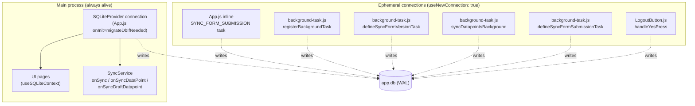
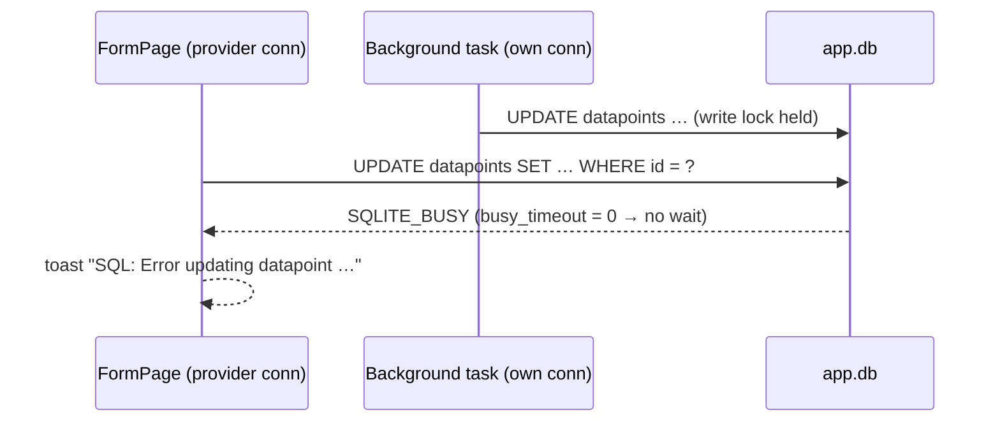

# Design — SQLite Busy Errors & Stuck "Fetching data" Spinner

## 1. Connection Model

`app.db` is opened by several independent native connections at runtime:



WAL mode (set at migration v1) allows readers to proceed alongside one writer,
but **two writers still conflict**. With SQLite's default `busy_timeout = 0`,
the losing writer gets `SQLITE_BUSY` instantly. On Android, expo-sqlite
surfaces this as a rejected native call:

```
Call to function 'NativeDatabase.prepareAsync' has been rejected.
→ … database is locked (code 5)
```

which the app's `sql.updateRow` wraps into
`Error updating row in table datapoints: …` — the toast seen in the field.

### Failure interleaving (issue 2)



## 2. Decision: `PRAGMA busy_timeout = 5000` on every connection

`busy_timeout` makes SQLite retry the lock acquisition internally for up to
N ms before returning `SQLITE_BUSY`. 5000 ms was chosen because:

- Background batches write one datapoint at a time inside short transactions;
  observed write bursts are well under a second.
- It matches the upper bound a user will tolerate on a Submit tap without
  feedback.
- A timeout (rather than infinite) still surfaces genuine deadlocks/stuck
  writers as errors instead of hanging the UI thread's promise forever.

The pragma is **connection-level**, so it must be applied per connection:

| Connection | Where applied |
|------------|---------------|
| Provider connection | Top of `migrateDbIfNeeded` (runs on every launch, before the version check and any transaction) |
| All ephemeral connections | Centralised `openDatabase()` helper |

### The `openDatabase()` helper

```js
// app/src/database/index.js
export const openDatabase = async () => {
  const db = await SQLite.openDatabaseAsync(DATABASE_NAME, {
    useNewConnection: true,
  });
  await db.execAsync('PRAGMA busy_timeout = 5000;');
  return db;
};
```

Rationale for placing it in `src/database/index.js`:

- `src/lib/constants.js` has no imports, so importing `DATABASE_NAME` from it
  creates no cycle (`database/index` → `lib/constants` only).
- Callers in `lib/`, `components/`, and `App.js` already import from
  `../database` or `./src/database`.
- A single choke point prevents future call sites from forgetting the pragma
  (FR1.3). Cascade lookup files (`cascades.js`, `FormPage.refreshForm`)
  intentionally keep raw opens — different database files, read-only usage.

Ownership rule from the prior spec is preserved: the helper **opens** only;
each caller still closes its own connection in `finally`.

## 3. Decision: `BEGIN IMMEDIATE` in `sql.withTransaction`

A deferred `BEGIN TRANSACTION` takes no lock until the first statement, and
takes a **read** lock if that statement is a SELECT. When the transaction later
writes, SQLite upgrades read → write; in WAL mode, if another connection
committed a write after our read snapshot was taken, the upgrade fails with
`SQLITE_BUSY` **immediately — `busy_timeout` does not apply to this case**
(retrying cannot help: the snapshot is stale and only a restart fixes it).

`BEGIN IMMEDIATE` acquires the write lock at `BEGIN`, where `busy_timeout`
*does* apply, eliminating the upgrade path entirely.

Cost: write transactions serialise from their start rather than their first
write. All `withTransaction` users (`downloadDatapointsJson`, migrations,
`executeBatch`, `bulkInsert`) are write transactions anyway, so nothing is
lost.

## 4. Submission screen loading-state machine (issue 1)

Before — three exit paths, only one cleared `loading` reliably:

```
fetchData()
├─ !activeForm.id ──────────────► return            (loading stays true ✗)
├─ query throws ────────────────► unhandled reject  (loading stays true ✗)
└─ success ─► rows.length === 0 ► setLoading(false)
           └► rows.length > 0 ──► setTimeout(1000) ► setLoading(false)
```

After — `finally` guarantees a single terminal state:

```
fetchData()
├─ !activeForm?.id ─► setLoading(false); return
└─ try    : totalSavedData + selectDataPointsByFormAndSubmitted → setData
   catch  : Sentry.captureMessage('[Submission] Unable to fetch data points')
            Sentry.captureException(error)
            ToastAndroid 'SQL: …' (Android only)
   finally: setLoading(false)
```

Design choices:

- **Error → empty state, not a dedicated error view.** Matches the existing
  UX vocabulary (`Home.js` handles `getUserForms` failures the same way:
  toast + Sentry, list stays usable). A retry is implicit — `refreshPage`
  re-triggers `fetchData` on every sync completion and navigation return.
- **Drop the 1 s `setTimeout`.** When rows exist, `ListEmptyComponent` (the
  spinner's host) is not rendered at all, so the delay only ever postponed
  state cleanup; it had no visible purpose and widened the stuck-state window.
- `activeForm.id` → `activeForm?.id` for safety: `FormState.form` is reset to
  `{}` on logout and can be momentarily empty when the screen mounts.

## 5. `getFormOptions` parameter fix

The SQL contains two placeholders:

```sql
LEFT JOIN datapoints dp ON f.id = dp.form AND dp.uuid = ?   -- 1
WHERE f.parentId = ?                                         -- 2
```

but the call bound `[uuid, parentId, uuid]`. `sqlite3_bind_*` with an
out-of-range index returns `SQLITE_RANGE`; whether that surfaces as an error
depends on the binding layer's tolerance. Binding exactly `[uuid, parentId]`
makes the call correct regardless. (Note: `sql.executeQuery` does not validate
parameter counts the way `safeExecuteQuery` does — a future consolidation
candidate, out of scope here.)

## 6. What deliberately did NOT change

| Considered | Rejected because |
|------------|------------------|
| Single shared connection for everything (no `useNewConnection`) | Background tasks run headless when the provider/React tree may not exist; out of scope for a hotfix |
| Retry wrapper around `updateDataPoint` | `busy_timeout` is the same mechanism at the right layer (native, per-statement) without bespoke retry code |
| Dedicated error state UI in `Submission` | Larger UX change; empty state + toast matches `Home.js` precedent |
| Param-count validation inside `sql.executeQuery` | Behavioural change affecting many call sites; tracked as future hardening |
