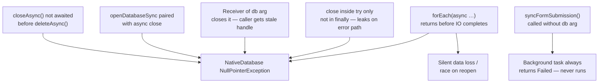
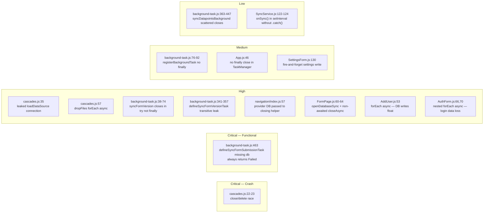

# Mobile SQLite Stability — Investigation & Hardening

## Documents

| Document | Purpose |
|----------|---------|
| [requirements.md](requirements.md) | Functional and non-functional requirements for the fix |
| [design.md](design.md) | Fix patterns, connection ownership model, per-file decisions |
| [implementation-plan.md](implementation-plan.md) | Phased task list with exact line references and code |

---

## Context

The mobile app (`app/`) uses `expo-sqlite` for offline-first data storage. SQLite is the primary persistence layer for forms, datapoints, jobs, config, and cascade lookup files. Sentry crash reports show recurring `NativeDatabase` `NullPointerException` on Android.

This investigation reviewed all Expo SQLite usage in the codebase — library helpers, background tasks, navigation handlers, pages, and the foreground sync component — to identify patterns that can trigger native handle corruption or silent data loss.

---

## Why These Crash

Four mechanisms cause `NativeDatabase` NPE at the JNI boundary, plus one separate category of silent functional failures:

---

## Affected Files

### Library: `app/src/lib/`

#### `cascades.js` — **Highest crash risk**

Three distinct issues in one file:

| Lines | Issue | Severity |
|-------|-------|----------|
| 22–23 | `openDatabaseSync` → `closeAsync()` (no await) → immediate `deleteAsync()` | Critical |
| 35 | `loadDataSource` opens a new DB connection and never closes it | High |
| 57 | `dropFiles` uses `forEach(async …)` — file deletions not awaited before caller continues | High |

The line 22–23 race is the most likely immediate crash contributor: the native handle is in an indeterminate state when `deleteAsync` runs, producing a JNI-level NPE.

#### `background-task.js` — **Multiple issues, one functional bug**

| Lines | Issue | Severity |
|-------|-------|----------|
| 463 | `defineSyncFormSubmissionTask` calls `syncFormSubmission()` with no `db` arg — always throws, always returns `Failed` | **Critical (functional bug)** |
| 38–74 | `syncFormVersion` closes caller-owned `db` inside `try` but not `catch` — ownership violation + leaked handle on error | High |
| 341–357 | `defineSyncFormVersionTask` opens DB, passes to `syncFormVersion`; if SFV's catch runs (no close), the task's catch also has no close — transitive leak | High |
| 76–92 | `registerBackgroundTask` closes DB in success path only — no `finally`, leaks if `registerTaskAsync` throws | Medium |
| 363–447 | `syncDatapointsBackground` uses scattered per-return closes instead of a single `finally` — currently complete but fragile | Low |

The `defineSyncFormSubmissionTask` bug is the most impactful: background form submission has never worked. Every background wake silently returns `Failed` because `db = undefined` causes an immediate throw.

`syncFormVersion` combines two problems: it closes a DB it didn't open (ownership violation), and when an error occurs, the `catch` block runs without closing the handle — compounding a crash risk with a leak.

> **Confirmed production crash** — Sentry issue [#7286813050](https://akvo-foundation.sentry.io/issues/7286813050/?environment=production&project=4508924320415744&query=is%3Aunresolved) (`2e39e03f264d49e5b2e9fe9937ee0878`) is a direct reproduction of the `syncFormVersion` + `navigation/index.js:57` ownership violation. User resumes app after a background sync notification → Home query hits the closed provider handle → `NativeStatement.finalizeAsync` rejected with "Access to closed resource".

### Foreground Sync: `app/src/components/SyncService.js` — **Mostly correct**

This file is well-written. The only issue is minor:

| Lines | Issue | Severity |
|-------|-------|----------|
| 122–124 | `onSync()` called from `setInterval` without `.catch()` — rejected Promise is unhandled | Low |

Good patterns already present (no changes needed):
- `useSQLiteContext()` provider DB — never closed ✓
- All async loops use `reduce` (lines 214, 301, 411) ✓
- Lock refs (`syncLockRef`, `onSyncLockRef`) prevent concurrent execution ✓
- `runSyncSequence` and `onSync` both release locks in `finally` ✓
- Stale job detection (ON_PROGRESS + attempt ≥ MAX_ATTEMPT) self-heals stuck jobs ✓

### Navigation: `app/src/navigation/index.js`

| Line | Issue | Severity |
|------|-------|----------|
| 57 | Passes `useSQLiteContext()` provider DB to `syncFormVersion`, which closes it | High |

Combined with the `background-task.js` ownership issue above, this is the primary code path for provider-handle invalidation crashes. After `syncFormVersion` is fixed (Pattern D), this call site needs no code change.

### App entry: `app/App.js`

| Line | Issue | Severity |
|------|-------|----------|
| 46 | `TaskManager.defineTask` closes `db` inside `try` but has no `finally` — leaked handle on exception | Medium |

### Pages: `app/src/pages/`

#### `FormPage.js` — **High risk**

| Lines | Issue | Severity |
|-------|-------|----------|
| 60–64 | `refreshForm`: iterates cascade files with `forEach`, calls `openDatabaseSync` then `connDB.closeAsync()` with no `await` per iteration | High |

This triggers on every form navigation-back. The non-awaited `closeAsync` on a sync-opened handle leaves native state unfinalized, and with multiple cascade files the closes race each other.

#### `AddUser.js`

| Line | Issue | Severity |
|------|-------|----------|
| 53 | `handleGetAllForms` uses `forEach(async …)` — all form upserts and cascade downloads fire-and-forget | High |

The function returns before any DB write or download completes. If the user navigates away or the process suspends, writes are lost without error.

#### `AuthForm.js`

| Lines | Issue | Severity |
|-------|-------|----------|
| 66, 70 | `handleGetAllForms` has **nested** `forEach(async …)` — outer loop over forms and inner loop over cascade downloads both float | High |

At login, forms may appear missing or cascade lookup tables may be absent because the DB writes and file downloads have not completed when the UI transitions to Home.

#### `Settings/SettingsForm.js`

| Line | Issue | Severity |
|------|-------|----------|
| 130 | `handleOnSwitch` calls `handleUpdateOnDB(...)` without `await` — settings DB write is fire-and-forget | Medium |

A toggle (e.g. WiFi-only sync) updates the in-memory store immediately but the DB write can silently fail, causing the setting to revert on app restart.

---

## Issue Summary by Severity

---

## Fix Strategy (Summary)

Full fix patterns with code are in [design.md](design.md). In brief:

| Pattern | Applies to |
|---------|-----------|
| **A** — `forEach(async)` → awaited `reduce` | `dropFiles`, `FormPage.js`, `AddUser.js`, `AuthForm.js` |
| **B** — `forEach(async)` → `Promise.allSettled` | Inner cascade download loops in `AddUser.js`, `AuthForm.js` |
| **C** — `openDatabaseSync` + `closeSync()` | `FormPage.js` refreshForm, `cascades.js` 22-23 |
| **D** — Remove internal close from receiver | `syncFormVersion` in `background-task.js` |
| **E** — Make caller async, add `await` | `SettingsForm.js` handleOnSwitch |
| **F** — Wrap open/use in `try/finally` with close | `loadDataSource`, `registerBackgroundTask`, `defineSyncFormVersionTask`, `syncDatapointsBackground`, `App.js` |
| **G** — Open DB inside task, pass to function, close in finally | `defineSyncFormSubmissionTask` |
| **H** — Add `.catch` to async callback in setInterval | `SyncService.js` |

The rule underlying all patterns: **only the function that opens a connection may close it, and always in `finally`.**

---

## Most Likely Immediate Crash Contributors

1. `app/src/lib/cascades.js` — close/delete race + `forEach(async)` in `dropFiles`
2. `app/src/pages/FormPage.js` — non-awaited `closeAsync` on sync-opened DB, triggered on every back-navigation
3. `app/src/lib/background-task.js` + `app/src/navigation/index.js` — provider DB closed by non-owner; leaked handle when `syncFormVersion` fails

Fix these three areas in Phase 1. Fix the functional bug (`defineSyncFormSubmissionTask`) in Phase 0 — it is independent and can ship first.
