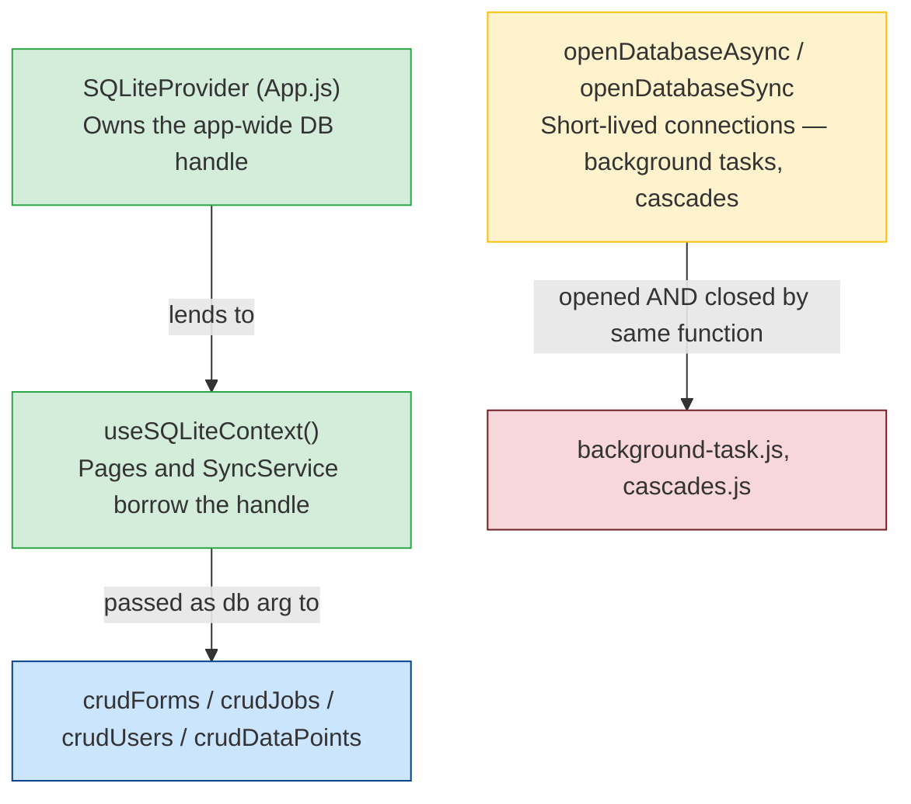
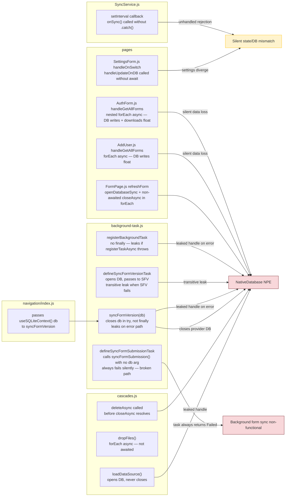
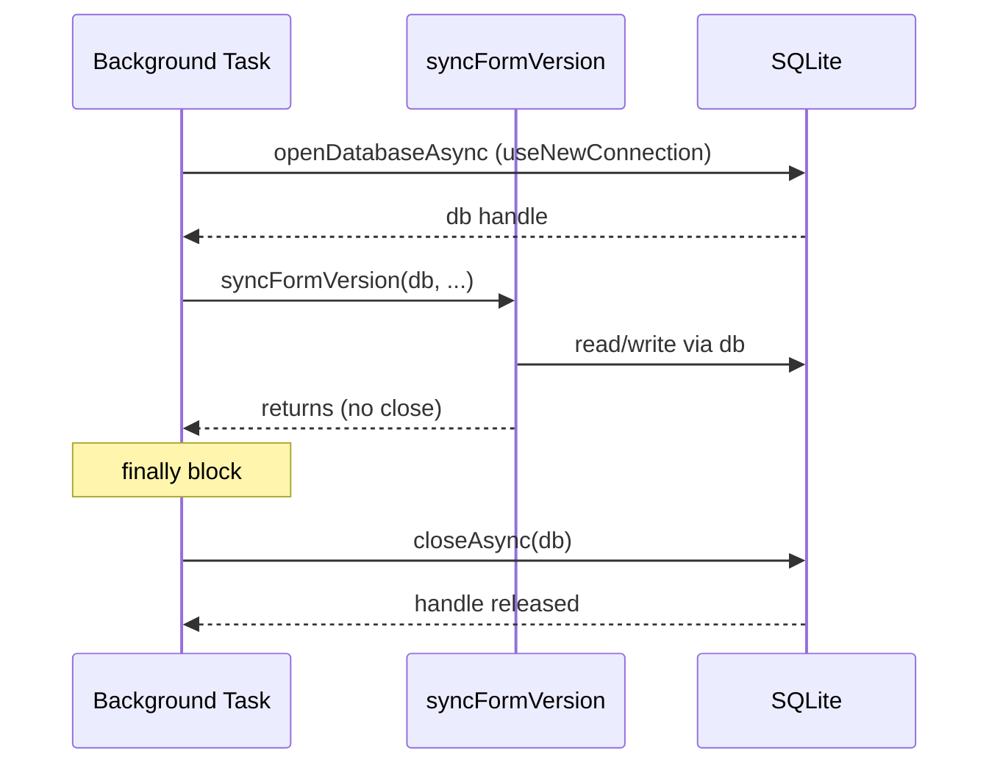
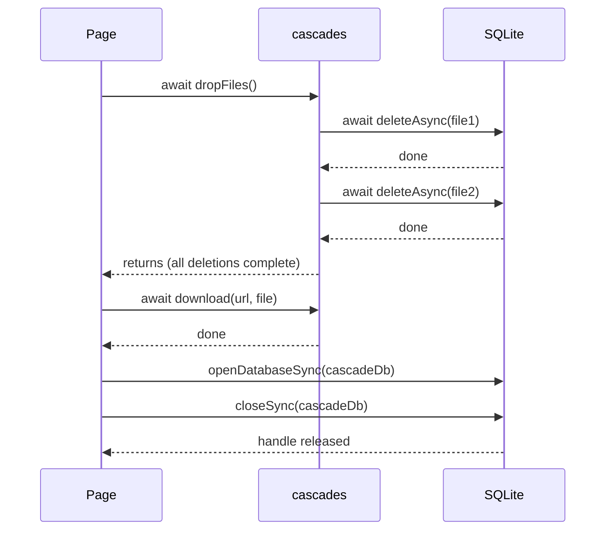

# Design: Mobile SQLite Stability Hardening

## Connection Ownership Model

The app uses two categories of DB connections that must never be confused:



**Rule**: An arrow pointing right is the only permitted direction of DB handle flow. A function must never close a handle it received via an arrow — only the node that originated the handle may close it, always in `finally`.

## Problem Map



## Fix Patterns

### Pattern A — Awaited sequential reduce (replaces forEach(async))

Use wherever async operations must complete in order before the caller returns.

```js
// BEFORE (broken)
items.forEach(async (item) => {
  await doSomething(item);
});

// AFTER (correct — ESLint compliant, no for…of)
await items.reduce(async (prev, item) => {
  await prev;
  await doSomething(item);
}, Promise.resolve());
```

### Pattern B — Concurrent with awaited Promise.allSettled (replaces forEach(async) when order doesn't matter)

Use when items are independent and concurrent execution is safe.

```js
// BEFORE (broken)
items.forEach(async (item) => {
  await doSomething(item);
});

// AFTER (correct)
await Promise.allSettled(items.map((item) => doSomething(item)));
```

### Pattern C — openDatabaseSync with closeSync (FormPage cascade cleanup)

Use when a sync-opened DB is immediately closed and not used again.

```js
// BEFORE (broken)
const connDB = SQLite.openDatabaseSync(dbFile);
connDB.closeAsync();   // async close, not awaited

// AFTER (correct)
const connDB = SQLite.openDatabaseSync(dbFile);
connDB.closeSync();    // sync API matches sync open
```

If `closeSync()` is unavailable in the installed expo-sqlite version, convert the containing function to async and `await connDB.closeAsync()`.

### Pattern D — Remove internal close from syncFormVersion (ownership fix)

```js
// BEFORE (broken) — background-task.js
const syncFormVersion = async (db, ...) => {
  try {
    // ... work ...
    await db.closeAsync();  // closes a DB it didn't open; only in try, not catch
  } catch (err) {
    // db leaked here
  }
};

// AFTER (correct)
const syncFormVersion = async (db, ...) => {
  try {
    // ... work ...
  } catch (err) {
    Sentry.captureException(err);
    // no close — caller manages lifecycle
  }
};
```

All callers that open a dedicated connection must close it in `finally`:

```js
// defineSyncFormVersionTask (owns connection — add try/finally)
const db = await SQLite.openDatabaseAsync(DATABASE_NAME, { useNewConnection: true });
try {
  await syncFormVersion(db, { ... });
  return BackgroundTask.BackgroundTaskResult.Success;
} catch (err) {
  return BackgroundTask.BackgroundTaskResult.Failed;
} finally {
  await db.closeAsync();   // always runs
}

// navigation/index.js (uses provider DB — no change needed after D is applied)
await syncFormVersion(db, ...);  // db is provider-owned; callee no longer closes
```

### Pattern E — Await fire-and-forget DB calls (SettingsForm)

```js
// BEFORE (broken) — handleOnSwitch is not async
const handleOnSwitch = (value, key) => {
  handleUpdateOnDB(stateKey, tinyIntVal);  // Promise floats
};

// AFTER (correct)
const handleOnSwitch = async (value, key) => {
  await handleUpdateOnDB(stateKey, tinyIntVal);
};
```

### Pattern F — Close leaked connections in finally

Use for any function that opens its own connection and may return or throw before the current close point.

```js
// AFTER (correct)
const myFunction = async (...) => {
  const db = await SQLite.openDatabaseAsync(DATABASE_NAME, { useNewConnection: true });
  try {
    // ... work, may throw or return early ...
    return result;
  } finally {
    await db.closeAsync();   // always runs
  }
};
```

### Pattern G — Fix missing db argument in defineSyncFormSubmissionTask

The background task currently calls `syncFormSubmission()` with no arguments, making `db = undefined` and causing an immediate throw.

```js
// BEFORE (broken — db is undefined, always throws)
export const defineSyncFormSubmissionTask = () => {
  TaskManager.defineTask(SYNC_FORM_SUBMISSION_TASK_NAME, async () => {
    try {
      await syncFormSubmission();   // db = undefined!
      return BackgroundTask.BackgroundTaskResult.Success;
    } catch (err) {
      return BackgroundTask.BackgroundTaskResult.Failed;
    }
  });
};

// AFTER (correct — opens own connection, passes to syncFormSubmission)
export const defineSyncFormSubmissionTask = () => {
  TaskManager.defineTask(SYNC_FORM_SUBMISSION_TASK_NAME, async () => {
    const db = await SQLite.openDatabaseAsync(DATABASE_NAME, { useNewConnection: true });
    try {
      await syncFormSubmission(db);
      return BackgroundTask.BackgroundTaskResult.Success;
    } catch (err) {
      Sentry.captureMessage(`[${SYNC_FORM_SUBMISSION_TASK_NAME}] failed`);
      Sentry.captureException(err);
      return BackgroundTask.BackgroundTaskResult.Failed;
    } finally {
      await db.closeAsync();
    }
  });
};
```

### Pattern H — Catch unhandled rejection from async callback in setInterval

```js
// BEFORE (minor — rejected Promise unhandled)
setInterval(() => {
  onSync();
}, syncInSecond);

// AFTER (correct)
setInterval(() => {
  onSync().catch(Sentry.captureException);
}, syncInSecond);
```

## Per-File Design Decisions

### `cascades.js`

| Function | Problem | Fix Pattern |
|----------|---------|-------------|
| `dropFiles` | `forEach(async)` — deletions not awaited | Pattern A or B |
| `loadDataSource` | Opens DB, never closes | Pattern F |
| DB open/delete sequence (lines 22-23) | `closeAsync` not awaited before `deleteAsync` | Pattern C (closeSync) then deleteAsync |

### `background-task.js`

| Function | Lines | Problem | Fix Pattern |
|----------|-------|---------|-------------|
| `syncFormVersion` | 38-74 | Closes caller-owned `db` in `try` only — leaks on error | Pattern D (remove close from callee) |
| `defineSyncFormVersionTask` | 341-357 | Opens DB, passes to `syncFormVersion`; transitive leak when SFV fails | Pattern D + F (add `finally` to task handler) |
| `registerBackgroundTask` | 78-92 | No `finally` — leaks if `registerTaskAsync` throws | Pattern F (wrap in try/finally) |
| `defineSyncFormSubmissionTask` | 460-473 | Calls `syncFormSubmission()` without `db` — always fails | Pattern G (open DB, pass to function, close in finally) |
| `syncDatapointsBackground` | 363-447 | Scattered closes at each early return — fragile | Pattern F (consolidate to single try/finally) |

### `SyncService.js`

| Function | Lines | Problem | Fix Pattern |
|----------|-------|---------|-------------|
| setInterval callback | 122-124 | `onSync()` rejection not caught | Pattern H (add `.catch`) |

**Good patterns already present in SyncService.js** (no change needed):
- `useSQLiteContext()` provider DB — never closed ✓
- All async loops use `reduce` — lines 214, 301, 411 ✓
- `syncLockRef` / `onSyncLockRef` prevent concurrent execution ✓
- `runSyncSequence` and `onSync` both release locks in `finally` ✓
- Stale job detection (ON_PROGRESS + attempt ≥ MAX_ATTEMPT) self-heals stuck jobs ✓

### `FormPage.js`

| Function | Problem | Fix Pattern |
|----------|---------|-------------|
| `refreshForm` | `openDatabaseSync` + `forEach` + non-awaited `closeAsync` | Pattern C inside Pattern A |

`refreshForm` is a `useCallback` — it must become async, and the `forEach` must become a `reduce`:

```js
const refreshForm = useCallback(async () => {
  const { cascades: cascadesFiles } = formJSON || {};
  if (cascadesFiles?.length) {
    await cascadesFiles.reduce(async (prev, csFile) => {
      await prev;
      const [dbFile] = csFile?.split('/')?.slice(-1) || [];
      const connDB = SQLite.openDatabaseSync(dbFile);
      connDB.closeSync();
    }, Promise.resolve());
  }
  FormState.update((s) => { /* ... */ });
}, [formJSON]);
```

Callers of `refreshForm` (`handleOnPressArrowBackButton`, `handleOnExit`, `handleOnSaveAndExit`, `handleOnSubmitForm`) must `await refreshForm()`.

### `AddUser.js`

| Function | Problem | Fix Pattern |
|----------|---------|-------------|
| `handleGetAllForms` | `forEach(async)` — DB upserts and downloads not awaited | Pattern A for form upserts; Pattern B for cascade downloads per form |

### `AuthForm.js`

| Function | Problem | Fix Pattern |
|----------|---------|-------------|
| `handleGetAllForms` | Outer and inner `forEach(async)` | Pattern A (outer), Pattern B (inner cascade downloads) |

### `SettingsForm.js`

| Function | Problem | Fix Pattern |
|----------|---------|-------------|
| `handleOnSwitch` | Fire-and-forget DB write | Pattern E |

## Data Flow After Fix





## Risk Assessment

| Change | Risk | Mitigation |
|--------|------|------------|
| `refreshForm` becomes async | Callers must be updated | All 4 callers are already in async functions or event handlers — low blast radius |
| Remove `db.closeAsync()` from `syncFormVersion` | Background task caller must add `finally` | Pattern D + F applied together — no net change in close semantics |
| `handleOnSwitch` becomes async | React Native event handlers can be async | RN `onValueChange` accepts async callbacks — no issue |
| `forEach` → `reduce` in auth/add-user flows | Slower (sequential) vs potentially concurrent | Auth/add-user forms run once at login — sequential is acceptable |
| `defineSyncFormSubmissionTask` opens own DB | New DB connection in background task | Consistent with `defineSyncFormVersionTask` and `syncDatapointsBackground` patterns |
| `registerBackgroundTask` adds `finally` | None | Pure safety addition, no behaviour change |
