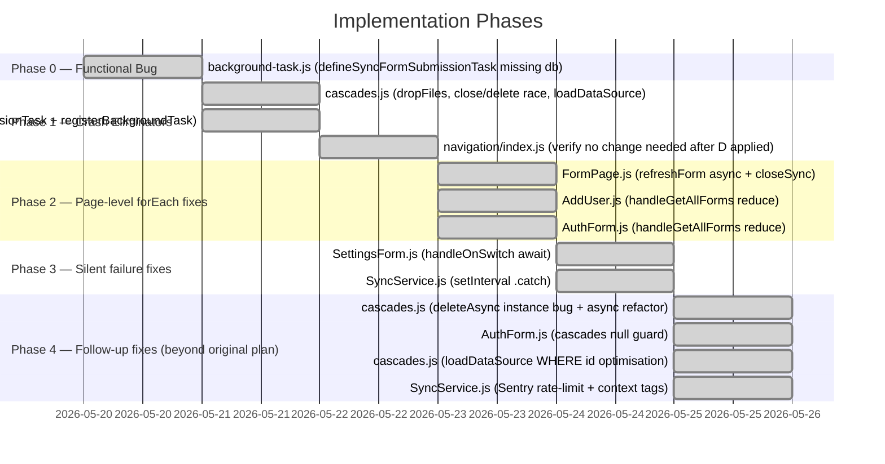

# Implementation Plan: Mobile SQLite Stability Hardening

## Overview

Nine files need changes across four priority tiers. A new Phase 0 handles the critical functional bug (broken background task wiring) separately from the crash eliminators so it can be shipped and verified independently.



---

## Status: ALL PHASES COMPLETE ✓

| Commit | Phase | Description |
|--------|-------|-------------|
| `60da5f2a` | 0+1 | Fix `defineSyncFormSubmissionTask` + eliminate close/delete races |
| `78ebd021` | 2 | Replace `forEach(async)` with awaited reduce |
| `bdd823c8` | 3 | Await fire-and-forget DB write, catch unhandled rejection |
| `a9d79338` | 4a | Replace broken `existingDB.deleteAsync()` with `deleteDatabaseAsync`; async open/close in `refreshForm` |
| `4d61bb24` | 4b | Guard `apiData.cascades` before mapping in `AuthForm` |
| `20053b77` | 4c | `loadDataSource` `WHERE id = ?` — query by id instead of loading all nodes |
| `09d3fe18` | 4d | Sentry rate-limit (1st + every 10th) + context tags on interval errors |

---

## Phase 0 — Functional Bug (P0) ✓

### Task 0.1 — `background-task.js`: Fix `defineSyncFormSubmissionTask` (missing `db` argument) ✓

**File**: `app/src/lib/background-task.js`
**Pattern**: G

`syncFormSubmission` is defined as `async (db, activeJob = {})` but was called as `await syncFormSubmission()`. With `db = undefined`, the first call to `crudUsers.getActiveUser(undefined)` threw immediately. The task had always returned `Failed` silently.

```js
// AFTER (correct) — committed in 60da5f2a
export const defineSyncFormSubmissionTask = () => {
  TaskManager.defineTask(SYNC_FORM_SUBMISSION_TASK_NAME, async () => {
    const db = await SQLite.openDatabaseAsync(DATABASE_NAME, { useNewConnection: true });
    try {
      await syncFormSubmission(db);
      return BackgroundTask.BackgroundTaskResult.Success;
    } catch (err) {
      Sentry.captureMessage(`[${SYNC_FORM_SUBMISSION_TASK_NAME}] defineSyncFormSubmissionTask failed`);
      Sentry.captureException(err);
      return BackgroundTask.BackgroundTaskResult.Failed;
    } finally {
      await db.closeAsync();
    }
  });
};
```

### Phase 0 Checkpoint

```
[x] yarn lint app/src/lib/background-task.js
[ ] Manual: trigger background form submission, verify Sentry no longer logs "defineSyncFormSubmissionTask failed" on every background wake
```

---

## Phase 1 — Crash Eliminators ✓

### Task 1.1 — `cascades.js`: Fix `dropFiles` (forEach → reduce) ✓

**File**: `app/src/lib/cascades.js`
**Pattern**: A (awaited sequential reduce)

```js
// AFTER — committed in 60da5f2a
await Sqlfiles.reduce(async (prev, file) => {
  await prev;
  if (file.includes('sqlite')) {
    const fileUri = `${FileSystem.documentDirectory}${DIR_NAME}/${file}`;
    await FileSystem.deleteAsync(fileUri, { idempotent: true });
  }
}, Promise.resolve());
```

### Task 1.2 — `cascades.js`: Fix close/delete race ✓

**File**: `app/src/lib/cascades.js`

`existingDB.deleteAsync()` was not an instance method in expo-sqlite 15 (zero occurrences in compiled JS). Calling it silently threw `TypeError`, meaning cascade update downloads **never deleted the old file**. Fixed in Phase 4 (commit `a9d79338`) by replacing the entire open+close+delete block with:

```js
// AFTER — committed in a9d79338
if (exists && update) {
  await SQLite.deleteDatabaseAsync(fileSql);
}
```

### Task 1.3 — `cascades.js`: Fix `loadDataSource` leaked connection ✓

**File**: `app/src/lib/cascades.js`
**Pattern**: F (finally close)

```js
// AFTER — committed in 60da5f2a
const db = await SQLite.openDatabaseAsync(cascadeName, { useNewConnection: true });
try {
  // ...query logic...
} finally {
  await db.closeAsync();
}
```

### Task 1.4 — `background-task.js`: Fix `syncFormVersion` ownership violation ✓

**Confirmed production crash**: Sentry #7286813050 — `NativeStatement.finalizeAsync` "Access to closed resource" on Home mount after app resume.

Removed the internal `db.closeAsync()` from `syncFormVersion` — callee must not close a DB it did not open.

### Task 1.5 — `background-task.js`: Fix `defineSyncFormVersionTask` transitive leak ✓

Added `finally { await db.closeAsync() }` to the task handler after Task 1.4 removed the close from the callee.

### Task 1.6 — `background-task.js`: Fix `registerBackgroundTask` missing `finally` ✓

DB open moved outside `try`, single `finally` close added.

### Task 1.7 — `background-task.js`: Consolidate `syncDatapointsBackground` closes ✓

Five scattered `await db.closeAsync()` calls (early returns + catch) replaced with a single `finally { await db.closeAsync() }`.

### Task 1.8 — `navigation/index.js`: No change needed ✓

Verified: `navigation/index.js` passes the provider DB (`useSQLiteContext()`). After Task 1.4 removed the close from `syncFormVersion`, the provider DB is no longer closed by the callee. No change required.

### Phase 1 Checkpoint

```
[x] yarn lint app/src/lib/cascades.js
[x] yarn lint app/src/lib/background-task.js
[x] yarn lint app/src/navigation/index.js
[ ] Manual: sync forms, trigger back-navigation on FormPage, verify no crash
```

---

## Phase 2 — Page-level forEach Fixes ✓

### Task 2.1 — `FormPage.js`: Fix `refreshForm` ✓

`refreshForm` made async. Cascade close converted from `forEach+closeAsync` to `reduce+openDatabaseAsync+closeAsync` (originally `closeSync`, later refined to async API in commit `a9d79338`). All callers now `await refreshForm()`.

### Task 2.2 — `AddUser.js`: Fix `handleGetAllForms` ✓

Sequential form+cascade fetching via `reduce` with inner `Promise.allSettled` for concurrent cascade downloads.

### Task 2.3 — `AuthForm.js`: Fix `handleGetAllForms` ✓

Parallel fetch via `Promise.allSettled`, sequential DB write via `reduce`. `apiData.cascades` guarded with `|| []` (commit `4d61bb24`) to prevent crash when form has no cascades.

### Phase 2 Checkpoint

```
[x] yarn lint app/src/pages/FormPage.js
[x] yarn lint app/src/pages/AddUser.js
[x] yarn lint app/src/pages/AuthForm.js
[ ] Manual smoke test: login flow, add user, open form, navigate back
```

---

## Phase 3 — Silent Failure Fixes ✓

### Task 3.1 — `SettingsForm.js`: Await `handleUpdateOnDB` in `handleOnSwitch` ✓

`handleOnSwitch` made async. DB write wrapped in `try/catch` with `Sentry.captureException` to prevent unhandled rejection crash on switch toggle.

### Task 3.2 — `SyncService.js`: Catch unhandled rejection from `setInterval` ✓

`onSync().catch(Sentry.captureException)` added. Further improved in Phase 4 (commit `09d3fe18`) with rate-limiting and context tags.

### Phase 3 Checkpoint

```
[x] yarn lint app/src/pages/Settings/SettingsForm.js
[x] yarn lint app/src/components/SyncService.js
[ ] Manual smoke test: toggle WiFi-only sync switch, verify it persists after app restart
```

---

## Phase 4 — Follow-up Fixes (beyond original plan) ✓

### Task 4.1 — `cascades.js`: Fix broken `deleteAsync` instance call + async refactor ✓

**Commit**: `a9d79338`

`existingDB.deleteAsync()` is not an instance method in expo-sqlite 15. Replaced with `SQLite.deleteDatabaseAsync(fileSql)`. Also replaced `openDatabaseSync`+`closeSync` in `FormPage.js:refreshForm` with `openDatabaseAsync`+`closeAsync`.

### Task 4.2 — `AuthForm.js`: Guard `apiData.cascades` before `.map()` ✓

**Commit**: `4d61bb24`

`apiData.cascades.map(...)` crashes when `cascades` is `null` or absent (forms without cascade lookups). Fixed: `(apiData.cascades || []).map(...)`.

### Task 4.3 — `cascades.js`: Optimise `loadDataSource` ✓

**Commit**: `20053b77`

When `id` is provided, use `WHERE id = ?` so SQLite returns one row instead of loading the full `nodes` table and filtering in JS.

### Task 4.4 — `SyncService.js`: Sentry rate-limit + context tags ✓

**Commit**: `09d3fe18`

Without throttling, a broken `onSync` fires a Sentry event every `syncInterval` seconds. Fixed:
- Report only on the 1st consecutive failure and every 10th thereafter
- Reset counter on recovery
- Attach `component`, `trigger`, `consecutiveFailures`, `syncIntervalMs` to each event

---

## Full Regression Checklist

```
[x] yarn lint app/src/lib/cascades.js
[x] yarn lint app/src/lib/background-task.js
[x] yarn lint app/src/components/SyncService.js
[x] yarn lint app/src/pages/FormPage.js
[x] yarn lint app/src/pages/AddUser.js
[x] yarn lint app/src/pages/AuthForm.js
[x] yarn lint app/src/pages/Settings/SettingsForm.js
[x] yarn lint app/src/navigation/index.js
```

Manual end-to-end smoke tests:
```
[ ] Login with valid passcode → forms load correctly
[ ] Add new user → forms and cascades downloaded
[ ] Open form → navigate back → no crash
[ ] Save draft → reopen → data preserved
[ ] Submit form → success toast
[ ] Sync button on Home → jobs queued
[ ] Toggle sync WiFi-only setting → persists after restart
[ ] Background sync (form version check) → no crash, notification sent if new forms exist
[ ] Background form submission → task completes (no longer always returns Failed)
[ ] Background datapoint sync → progress saved, resumes on next wake
```

---

## Definition of Done

- [x] All lint checks pass on changed files
- [ ] `defineSyncFormSubmissionTask` background task completes successfully at least once (visible in Sentry or device logs)
- [ ] Sentry `NativeDatabase` NPE alerts stop appearing for the patched code paths (monitor for 48 hours post-release)
- [ ] All manual smoke tests above pass
- [ ] PR reviewed and merged to `develop`
