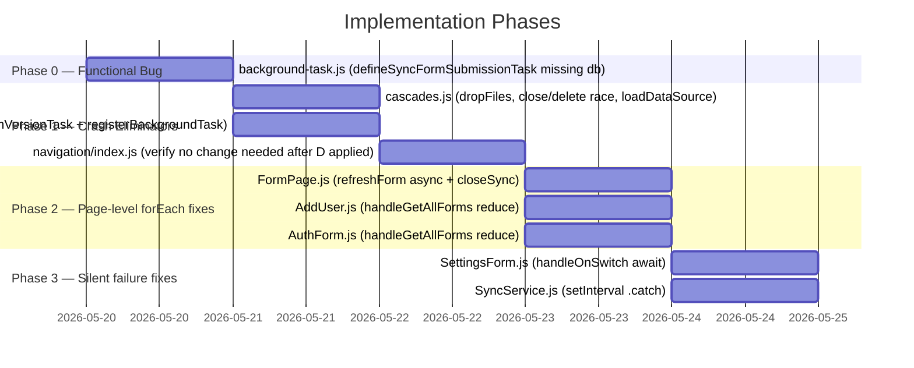

# Implementation Plan: Mobile SQLite Stability Hardening

## Overview

Nine files need changes across four priority tiers. A new Phase 0 handles the critical functional bug (broken background task wiring) separately from the crash eliminators so it can be shipped and verified independently.



---

## Phase 0 — Functional Bug (P0)

### Task 0.1 — `background-task.js`: Fix `defineSyncFormSubmissionTask` (missing `db` argument)

**File**: `app/src/lib/background-task.js:460-473`
**Pattern**: G

`syncFormSubmission` is defined as `async (db, activeJob = {})` but is called as `await syncFormSubmission()`. With `db = undefined`, the first call to `crudUsers.getActiveUser(undefined)` throws immediately. The task has always returned `Failed` silently.

```js
// BEFORE (broken)
export const defineSyncFormSubmissionTask = () => {
  TaskManager.defineTask(SYNC_FORM_SUBMISSION_TASK_NAME, async () => {
    try {
      await syncFormSubmission();   // db is undefined
      return BackgroundTask.BackgroundTaskResult.Success;
    } catch (err) {
      Sentry.captureMessage(...);
      Sentry.captureException(err);
      return BackgroundTask.BackgroundTaskResult.Failed;
    }
  });
};

// AFTER (correct)
export const defineSyncFormSubmissionTask = () => {
  TaskManager.defineTask(SYNC_FORM_SUBMISSION_TASK_NAME, async () => {
    const db = await SQLite.openDatabaseAsync(DATABASE_NAME, { useNewConnection: true });
    try {
      await syncFormSubmission(db);
      return BackgroundTask.BackgroundTaskResult.Success;
    } catch (err) {
      Sentry.captureMessage(`[${SYNC_FORM_SUBMISSION_TASK_NAME}] defineSyncFormSubmissionTask failed`);
      Sentry.captureException(err);
      return BackgroundTask.BackgroundTaskResult.Failed;
    } finally {
      await db.closeAsync();
    }
  });
};
```

**Verify**: Confirm `DATABASE_NAME` is already imported (it is — used at line 344 in `defineSyncFormVersionTask`). No new imports needed.

---

### Phase 0 Checkpoint

```
[ ] yarn lint app/src/lib/background-task.js
[ ] Manual: trigger background form submission, verify Sentry no longer logs "defineSyncFormSubmissionTask failed" on every background wake
```

---

## Phase 1 — Crash Eliminators

### Task 1.1 — `cascades.js`: Fix `dropFiles` (forEach → reduce)

**File**: `app/src/lib/cascades.js:57`
**Pattern**: A (awaited sequential reduce)

Current:
```js
files.forEach(async (file) => {
  await FileSystem.deleteAsync(filePath, { idempotent: true });
});
```

Change to:
```js
await files.reduce(async (prev, file) => {
  await prev;
  await FileSystem.deleteAsync(filePath, { idempotent: true });
}, Promise.resolve());
```

**Verify**: `dropFiles` must now return a `Promise` that resolves only after all deletions complete. `Home.js:80` already `await`s it — no caller changes needed.

---

### Task 1.2 — `cascades.js`: Fix close/delete race (lines 22-23)

**File**: `app/src/lib/cascades.js:22-23`
**Pattern**: C (closeSync before deleteAsync)

Current code opens a DB with `openDatabaseSync`, calls `closeAsync()` without `await`, then immediately calls `deleteAsync()`.

Change to:
```js
const tmpDb = SQLite.openDatabaseSync(dbName);
tmpDb.closeSync();                        // sync close matches sync open
await SQLite.deleteAsync(dbName);         // delete only after close resolves
```

If `closeSync()` is not available, convert to fully async:
```js
const tmpDb = await SQLite.openDatabaseAsync(dbName, { useNewConnection: true });
try {
  // any reads needed
} finally {
  await tmpDb.closeAsync();
}
await SQLite.deleteAsync(dbName);
```

---

### Task 1.3 — `cascades.js`: Fix `loadDataSource` leaked connection (line 35)

**File**: `app/src/lib/cascades.js:35`
**Pattern**: F (finally close)

```js
const db = await SQLite.openDatabaseAsync(source.file, { useNewConnection: true });
try {
  // existing read logic
  return result;
} finally {
  await db.closeAsync();
}
```

---

### Task 1.4 — `background-task.js`: Fix `syncFormVersion` ownership + error-path leak

**File**: `app/src/lib/background-task.js:38-74`
**Pattern**: D (remove internal close from callee)
**Confirmed production crash**: Sentry [#7286813050](https://akvo-foundation.sentry.io/issues/7286813050/?environment=production&project=4508924320415744&query=is%3Aunresolved) — event `2e39e03f264d49e5b2e9fe9937ee0878` — `NativeStatement.finalizeAsync` "Access to closed resource" on Home mount after app resume.

The close is currently inside `try` only. On any throw before line 69, the `catch` runs without closing `db`.

Step 1 — Remove the internal close entirely (line 69):
```js
// DELETE: await db.closeAsync();
```

Step 2 — The `catch` block already exists; ensure it does NOT close `db` (callee must not close what it didn't open):
```js
} catch (err) {
  Sentry.captureMessage('[background-task] syncFormVersion failed');
  Sentry.captureException(err);
  // no db.closeAsync() here
}
```

---

### Task 1.5 — `background-task.js`: Fix `defineSyncFormVersionTask` transitive leak

**File**: `app/src/lib/background-task.js:341-357`
**Pattern**: F (add `finally` to task handler)

After Task 1.4 removes the close from `syncFormVersion`, the task handler must close in `finally`:

```js
export const defineSyncFormVersionTask = () =>
  TaskManager.defineTask(SYNC_FORM_VERSION_TASK_NAME, async () => {
    const db = await SQLite.openDatabaseAsync(DATABASE_NAME, { useNewConnection: true });
    try {
      await syncFormVersion(db, {
        sendPushNotification: notification.sendPushNotification,
        showNotificationOnly: true,
      });
      return BackgroundTask.BackgroundTaskResult.Success;
    } catch (err) {
      Sentry.captureMessage(`[${SYNC_FORM_VERSION_TASK_NAME}] defineSyncFormVersionTask failed`);
      Sentry.captureException(err);
      return BackgroundTask.BackgroundTaskResult.Failed;
    } finally {
      await db.closeAsync();
    }
  });
```

---

### Task 1.6 — `background-task.js`: Fix `registerBackgroundTask` missing `finally`

**File**: `app/src/lib/background-task.js:76-92`
**Pattern**: F (wrap in try/finally)

```js
const registerBackgroundTask = async (TASK_NAME, settingsValue = null) => {
  const db = await SQLite.openDatabaseAsync(DATABASE_NAME, { useNewConnection: true });
  try {
    const config = await crudConfig.getConfig(db);
    const syncIntervalSec = settingsValue || parseInt(config?.syncInterval, 10) || 3600;
    const intervalMinutes = Math.max(Math.round(syncIntervalSec / 60), 15);
    return await BackgroundTask.registerTaskAsync(TASK_NAME, {
      minimumInterval: intervalMinutes,
    });
  } catch (err) {
    return Promise.reject(err);
  } finally {
    await db.closeAsync();
  }
};
```

---

### Task 1.7 — `background-task.js`: Consolidate `syncDatapointsBackground` closes into `finally`

**File**: `app/src/lib/background-task.js:363-447`
**Pattern**: F (refactor scattered closes to single `finally`)

Currently five separate `await db.closeAsync()` calls across early returns and catch. Replace with a single `finally`:

```js
const syncDatapointsBackground = async () => {
  const db = await SQLite.openDatabaseAsync(DATABASE_NAME, { useNewConnection: true });
  try {
    const session = await crudUsers.getActiveUser(db);
    if (!session?.token) {
      return;   // finally closes
    }
    api.setToken(session.token);

    const activeJob = await crudJobs.getActiveJob(db, SYNC_DATAPOINT_JOB_NAME);
    if (!activeJob) {
      return;   // finally closes
    }

    // ... rest of existing logic, remove all await db.closeAsync() calls ...

  } catch (err) {
    Sentry.captureException(err);
    // no close here — finally handles it
  } finally {
    await db.closeAsync();
  }
};
```

Remove the five existing `await db.closeAsync()` calls at lines 370, 377, 390, 442, 445.

---

### Task 1.8 — `navigation/index.js`: Verify no change needed

**File**: `app/src/navigation/index.js:57`

After Task 1.4, `syncFormVersion` no longer closes `db`. If `navigation/index.js` passes the provider DB (`useSQLiteContext()`), no change is needed — the provider manages its own lifecycle.

**Verification step**: Read lines 55-65. If a dedicated `useNewConnection: true` connection is passed instead of the provider DB, apply Pattern F there too.

---

### Phase 1 Checkpoint

```
[ ] yarn lint app/src/lib/cascades.js
[ ] yarn lint app/src/lib/background-task.js
[ ] yarn lint app/src/navigation/index.js
[ ] Manual: sync forms, trigger back-navigation on FormPage, verify no crash
```

---

## Phase 2 — Page-level forEach Fixes

### Task 2.1 — `FormPage.js`: Fix `refreshForm` (openDatabaseSync + forEach + non-awaited closeAsync)

**File**: `app/src/pages/FormPage.js:55-74`
**Pattern**: C (closeSync) + A (reduce)

`refreshForm` must become async. Convert the `useCallback`:

```js
const refreshForm = useCallback(async () => {
  const { cascades: cascadesFiles } = formJSON || {};
  if (cascadesFiles?.length) {
    await cascadesFiles.reduce(async (prev, csFile) => {
      await prev;
      const [dbFile] = csFile?.split('/')?.slice(-1) || [];
      const connDB = SQLite.openDatabaseSync(dbFile);
      connDB.closeSync();
    }, Promise.resolve());
  }
  FormState.update((s) => {
    s.surveyStart = null;
    s.currentValues = {};
    s.visitedQuestionGroup = [];
    s.cascades = {};
    s.surveyDuration = 0;
    s.repeats = {};
  });
}, [formJSON]);
```

**Callers that must now `await refreshForm()`**:

| Caller | Line | Change |
|--------|------|--------|
| `handleOnPressArrowBackButton` | ~81 | Add `await` — function must become `async` |
| `handleOnExit` | ~143 | Add `await` — function must become `async` |
| `handleOnSaveAndExit` | ~124 | Add `await` — already async |
| `handleOnSubmitForm` | ~186 | Add `await` — already async |

`handleOnPressArrowBackButton` and `handleOnExit` are currently synchronous. Making them `async` is safe — React Native `onPress` accepts async handlers.

---

### Task 2.2 — `AddUser.js`: Fix `handleGetAllForms` (forEach → reduce)

**File**: `app/src/pages/AddUser.js:53`
**Pattern**: A (outer reduce) + B (inner Promise.allSettled for cascade downloads)

```js
const handleGetAllForms = async (formsUrl, userID) => {
  await formsUrl.reduce(async (prev, form) => {
    await prev;
    const formRes = await api.get(form.url);
    await crudForms.upsertForm(db, {
      ...form,
      userId: userID,
      formJSON: formRes?.data,
    });
    if (formRes?.data?.cascades?.length) {
      await Promise.allSettled(
        formRes.data.cascades.map((cascadeFile) => {
          const downloadUrl = api.getConfig().baseURL + cascadeFile;
          return cascades.download(downloadUrl, cascadeFile);
        }),
      );
    }
  }, Promise.resolve());
};
```

**Verify**: Locate the call site in `submitData` and confirm it is awaited.

---

### Task 2.3 — `AuthForm.js`: Fix `handleGetAllForms` (nested forEach → reduce + Promise.allSettled)

**File**: `app/src/pages/AuthForm.js:66,70`
**Pattern**: A (outer reduce) + B (inner Promise.allSettled)

```js
const handleGetAllForms = async (formsUrl, userID) => {
  const formsReq = formsUrl?.map((f) => api.get(f.url));
  const formsRes = await Promise.allSettled(formsReq);
  await formsRes.reduce(async (prev, { value, status }, index) => {
    await prev;
    if (status === 'fulfilled') {
      const { data: apiData } = value;
      await Promise.allSettled(
        apiData.cascades.map((cascadeFile) => {
          const downloadUrl = api.getConfig().baseURL + cascadeFile;
          return cascades.download(downloadUrl, cascadeFile);
        }),
      );
      const form = formsUrl?.[index];
      await crudForms.upsertForm(db, {
        ...form,
        userId: userID,
        formJSON: apiData,
      });
    }
  }, Promise.resolve());
};
```

**Verify**: Confirm caller `handleOnPressLogin` awaits `handleGetAllForms`.

---

### Phase 2 Checkpoint

```
[ ] yarn lint app/src/pages/FormPage.js
[ ] yarn lint app/src/pages/AddUser.js
[ ] yarn lint app/src/pages/AuthForm.js
[ ] Manual smoke test: login flow, add user, open form, navigate back
```

---

## Phase 3 — Silent Failure Fixes

### Task 3.1 — `SettingsForm.js`: Await `handleUpdateOnDB` in `handleOnSwitch`

**File**: `app/src/pages/Settings/SettingsForm.js:120-131`
**Pattern**: E (make caller async, add await)

```js
const handleOnSwitch = async (value, key) => {
  const [stateName, stateKey] = key.split('.');
  const tinyIntVal = value ? 1 : 0;
  store[stateName].update((s) => {
    s[stateKey] = tinyIntVal;
  });
  setSettingsState({
    ...settingsState,
    [stateKey]: tinyIntVal,
  });
  await handleUpdateOnDB(stateKey, tinyIntVal);
};
```

---

### Task 3.2 — `SyncService.js`: Catch unhandled rejection from `setInterval`

**File**: `app/src/components/SyncService.js:122-124`
**Pattern**: H (add `.catch`)

```js
// BEFORE
const syncTimer = setInterval(() => {
  onSync();
}, syncInSecond);

// AFTER
const syncTimer = setInterval(() => {
  onSync().catch(Sentry.captureException);
}, syncInSecond);
```

---

### Phase 3 Checkpoint

```
[ ] yarn lint app/src/pages/Settings/SettingsForm.js
[ ] yarn lint app/src/components/SyncService.js
[ ] Manual smoke test: toggle WiFi-only sync switch, verify it persists after app restart
```

---

## Full Regression Checklist

Run after all phases are complete:

```
[ ] yarn lint app/src/lib/cascades.js
[ ] yarn lint app/src/lib/background-task.js
[ ] yarn lint app/src/components/SyncService.js
[ ] yarn lint app/src/pages/FormPage.js
[ ] yarn lint app/src/pages/AddUser.js
[ ] yarn lint app/src/pages/AuthForm.js
[ ] yarn lint app/src/pages/Settings/SettingsForm.js
[ ] yarn lint app/src/navigation/index.js
```

Manual end-to-end smoke tests:
```
[ ] Login with valid passcode → forms load correctly
[ ] Add new user → forms and cascades downloaded
[ ] Open form → navigate back → no crash
[ ] Save draft → reopen → data preserved
[ ] Submit form → success toast
[ ] Sync button on Home → jobs queued
[ ] Toggle sync WiFi-only setting → persists after restart
[ ] Background sync (form version check) → no crash, notification sent if new forms exist
[ ] Background form submission → task completes (no longer always returns Failed)
[ ] Background datapoint sync → progress saved, resumes on next wake
```

## Commit Strategy

One commit per phase, with the beads issue reference:

```
[#<issue>] fix(sqlite): Phase 0 — fix broken defineSyncFormSubmissionTask (missing db argument)
[#<issue>] fix(sqlite): Phase 1 — eliminate close/delete races and ownership violations in cascades.js, background-task.js
[#<issue>] fix(sqlite): Phase 2 — replace forEach(async) with awaited reduce in FormPage, AddUser, AuthForm
[#<issue>] fix(sqlite): Phase 3 — await fire-and-forget DB write in SettingsForm, catch unhandled rejection in SyncService
```

## Definition of Done

- All items in the Full Regression Checklist are checked
- No new ESLint errors on changed files
- `defineSyncFormSubmissionTask` background task completes successfully at least once (visible in Sentry or device logs)
- Sentry `NativeDatabase` NPE alerts stop appearing for the patched code paths (monitor for 48 hours post-release)
- PR reviewed and merged to `develop`
