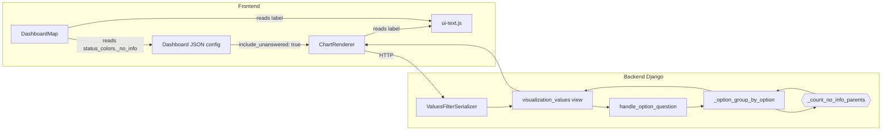
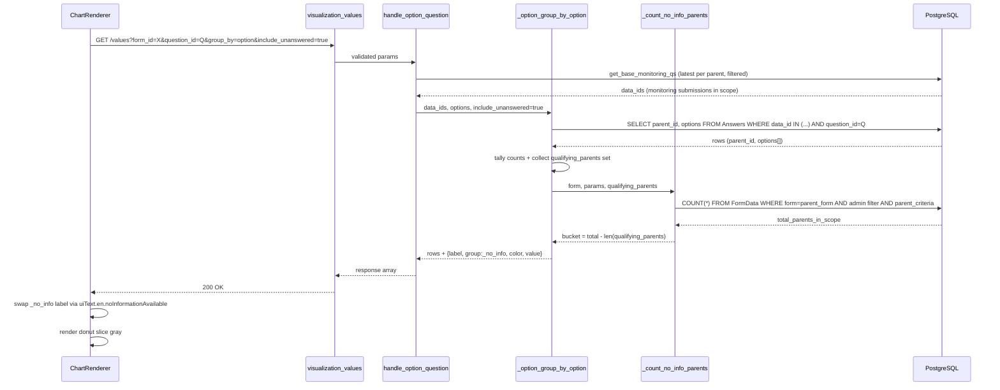
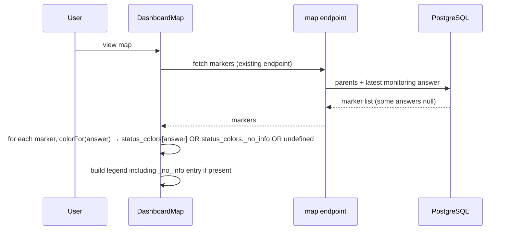

# "No information available" bucket — Design

Architecture, SQL, and implementation plan for the opt-in `_no_info` bucket on `/api/v1/visualization/values`.

For the locked requirements this design satisfies, see [requirements.md](./requirements.md). For the rationale behind each choice, see [README.md](./README.md).

---

## Architecture overview



The change is surgical: one new serializer field, one new helper function, one extra branch in `_option_group_by_option`, one new `share_card`-aware path. Everything else stays untouched.

---

## Backend

### Serializer

In [`backend/api/v1/v1_visualization/dashboard_serializers.py`](../../../backend/api/v1/v1_visualization/dashboard_serializers.py), add to `ValuesFilterSerializer`:

```python
include_unanswered = serializers.BooleanField(
    required=False,
    default=False,
)
```

The field accepts standard truthy strings (`"true"`, `"1"`, `"yes"`) per DRF's `BooleanField` parsing — no custom coercion needed.

### New helper: `_count_no_info_parents`

Add to [`backend/api/v1/v1_visualization/values_functions.py`](../../../backend/api/v1/v1_visualization/values_functions.py):

```python
def _count_no_info_parents(form, params, qualifying_parent_ids):
    """Count parents in scope whose latest monitoring submission has
    no qualifying answer for the question.

    bucket = total_parents_in_scope - len(qualifying_parent_ids)

    Returns 0 (not None) for non-monitoring forms so callers can
    short-circuit cleanly. Respects administration_id and parent_criteria
    on the registration form so the count reconciles with the option
    counts under filtering (FR-3).
    """
    if not form.parent:
        return 0
    parent_form = form.parent
    qs = FormData.objects.filter(
        form=parent_form,
        parent__isnull=True,
        is_pending=False,
        is_draft=False,
    )
    administration_id = params.get("administration_id")
    if administration_id:
        qs = apply_administration_filter(qs, administration_id)
    qs = apply_parent_criteria_to_qs(
        qs, True, params.get("parent_criteria"),
    )
    total = qs.count()
    return max(0, total - len(qualifying_parent_ids))
```

### Modify `_option_group_by_option`

Update the existing function at [`values_functions.py:474`](../../../backend/api/v1/v1_visualization/values_functions.py#L474). The change collects the set of distinct parent IDs that contributed to any tally, then optionally appends the synthetic row.

```python
def _option_group_by_option(
    question, options, data_ids, qs,
    is_latest, value_type, restricted_values=None,
    include_unanswered=False, form=None, params=None,
):
    option_values = {o.value for o in options}
    tally_values = (
        option_values & restricted_values
        if restricted_values else option_values
    )
    tallies = defaultdict(int)
    qualifying_parents = set()
    for parent_id, opts in Answers.objects.filter(
        data_id__in=data_ids,
        question_id=question.id,
        options__isnull=False,
    ).values_list("data__parent_id", "options"):
        matched = False
        for v in (opts or []):
            if v in tally_values:
                tallies[v] += 1
                matched = True
        if matched:
            qualifying_parents.add(parent_id)

    counts = [tallies.get(opt.value, 0) for opt in options]

    bucket_count = (
        _count_no_info_parents(form, params, qualifying_parents)
        if include_unanswered else 0
    )

    if value_type == "percentage":
        denom = (
            sum(counts) + bucket_count
            if not include_unanswered else (
                len(qualifying_parents) + bucket_count
            )
        )
        # When include_unanswered=true, denom is total_parents_in_scope
        # (single-choice exact, multiple_option may exceed sum).
    else:
        denom = None

    data = []
    for opt, count in zip(options, counts):
        val = (
            round((count / denom * 100), 2)
            if value_type == "percentage" and denom else count
        )
        data.append({
            "value": val,
            "label": opt.label,
            "group": opt.value,
            "color": opt.color,
        })

    if include_unanswered and bucket_count > 0:
        bucket_val = (
            round((bucket_count / denom * 100), 2)
            if value_type == "percentage" and denom else bucket_count
        )
        data.append({
            "value": bucket_val,
            "label": "No information available",
            "group": "_no_info",
            "color": "#bfbfbf",
        })

    labels = [d["label"] for d in data]
    return data, labels
```

> **Multi-choice percentage note (FR-6 nuance).** For single-choice `option` questions, the N+1 percentages sum exactly to 100%. For `multiple_option` questions, each option's `count` can include a parent that also answered other options, so the sum of N option percentages may exceed 100% even before the bucket. This is consistent with the existing multi-choice percentage behavior — the bucket is added on top using the same `total_parents_in_scope` denominator. Reviewers should expect "≥100% for multi-choice" and only "exactly 100%" for single-choice.

### Wire the flag through `handle_option_question`

In `handle_option_question` at [`values_functions.py:292`](../../../backend/api/v1/v1_visualization/values_functions.py#L292), pass the new param + form/params context to `_option_group_by_option`. Existing callers (single-axis bar, donut, share_card) all flow through this branch when `group_by="option"`.

```python
if group_by == "option":
    restricted = _extract_criteria_option_values(
        params, question.id
    )
    return _option_group_by_option(
        question, options, data_ids, qs,
        is_latest, value_type, restricted,
        include_unanswered=params.get("include_unanswered", False),
        form=form,
        params=params,
    )
```

### Share-card path

`share_card` rides the same `group_by="option"` shape today (see the `target_group` discussion in [`README.md:372`](../../../frontend/src/config/visualizations/README.md#L372)) — no separate backend handler. The frontend strips `target_group` before the call, so the response simply includes the bucket and the existing share calculation `numerator / sum(values)` naturally pulls it in. **No backend code change for share_card** beyond what the donut path already provides.

### Edge cases

| Case | Handling |
|---|---|
| Question is on a registration form | `_count_no_info_parents` returns 0; bucket suppressed |
| `include_unanswered=true` but `bucket_count == 0` | No row appended (avoid noise) |
| `monitoring=all` (not `latest`) | Definition still holds: bucket = parents with no qualifying answer in any submission within filters; `_count_no_info_parents` uses the same parent universe |
| `restricted_values` (criteria filters one option) | Parents whose only answer falls outside `tally_values` count as un-answered (consistent with "no qualifying answer") |
| Soft-deleted parent | Excluded — `FormData.objects` is the soft-delete-aware default manager |
| Parent has multiple monitoring submissions, latest has answer, older doesn't | Latest-mode picks the latest by `latest_monitoring_subquery`; if latest has answer → not in bucket. Matches existing semantics |

---

## Frontend wiring

### `ui-text.js`

Add one key in [`frontend/src/lib/ui-text.js`](../../../frontend/src/lib/ui-text.js) under the existing Charts comment block at [line 80](../../../frontend/src/lib/ui-text.js#L80):

```diff
   // Charts
   showEmpty: "Show empty values",
+  noInformationAvailable: "No information available",
```

The German `de` map at [line 1024](../../../frontend/src/lib/ui-text.js#L1024) is empty today and inherits the English string at runtime (existing fallback behavior); no action needed there.

### ChartRenderer

The donut at [`ChartRenderer.jsx`](../../../frontend/src/components/dashboard/ChartRenderer.jsx) already renders whatever rows the backend returns. The only intentional change is to **swap the backend label for the i18n string** when the row's `group === "_no_info"`:

```jsx
// in the row mapping that becomes chart data
const label = row.group === "_no_info"
  ? uiText.en.noInformationAvailable
  : row.label;
```

The `color` field on the synthetic row falls through to akvo-charts' color resolver — chart-level color arrays in the JSON config still win over the backend default, matching today's precedence.

### DashboardMap

[`DashboardMap.jsx`](../../../frontend/src/components/dashboard/DashboardMap.jsx) currently colors markers via `status_colors[answer]`. Add a single fall-through:

```jsx
const colorFor = (answer) => {
  if (answer && status_colors[answer]) return status_colors[answer];
  if (status_colors._no_info) return status_colors._no_info;
  return undefined; // existing behavior
};

// legend
const legendEntries = Object.entries(status_colors).map(([key, color]) => ({
  color,
  label: key === "_no_info" ? uiText.en.noInformationAvailable : labelFor(key),
}));
```

Map configs that don't define `_no_info` see no behavior change (FR-10).

### Dashboard JSON configs

Flip the flag on for the two existing operational-status donuts:

[`frontend/src/config/visualizations/1749623934933.json`](../../../frontend/src/config/visualizations/1749623934933.json) (EPS Overview):
```diff
 "api": {
   "form_id": 1749632545233,
   "question_id": 1749633373968,
   "group_by": "option",
-  "monitoring": "latest"
+  "monitoring": "latest",
+  "include_unanswered": true
 }
```

[`frontend/src/config/visualizations/1749621221728.json`](../../../frontend/src/config/visualizations/1749621221728.json) (RWS Overview): same diff on the equivalent donut.

Optionally extend `status_colors` on each dashboard's `map` item to color un-monitored markers gray:
```diff
 "status_colors": {
   "operational": "#64A73B",
-  "issue_with_system": "#e41a1c"
+  "issue_with_system": "#e41a1c",
+  "_no_info": "#bfbfbf"
 }
```

---

## Sequence diagrams

### Donut request with `include_unanswered=true`



### Map widget opt-in



---

## Test plan

### Backend tests

Add to [`backend/api/v1/v1_visualization/tests/tests_values_option.py`](../../../backend/api/v1/v1_visualization/tests/tests_values_option.py):

| Test | Setup | Assertion |
|---|---|---|
| `test_include_unanswered_appends_no_info_row` | 5 parents registered, 3 have monitoring with answers (a, a, b) | response has 3 rows: `a=2`, `b=1`, `_no_info=2` |
| `test_include_unanswered_default_false_unchanged` | same as above, no flag | response has only `a=2`, `b=1`; no `_no_info` row |
| `test_include_unanswered_multiple_option_distinct_parents` | parent A answered ["x","y"], parent B answered ["x"], parent C no submission | `_no_info=1`, qualifying-parents math correct |
| `test_include_unanswered_percentage_sums_100_single_choice` | 4 parents, 3 answered (2 a, 1 b), 1 unanswered | percentages: a=50, b=25, `_no_info`=25, sum=100 |
| `test_include_unanswered_respects_administration_filter` | 10 parents in 2 admins, filter to admin A (5 parents, 3 monitored) | bucket reflects only admin A's gap: 2 |
| `test_include_unanswered_zero_bucket_emits_no_row` | every parent has an answer | response unchanged; no synthetic row |
| `test_include_unanswered_excludes_soft_deleted_parents` | soft-delete one parent before the request | bucket count does not include the deleted parent |
| `test_include_unanswered_ignored_on_registration_form` | request a registration-form question with the flag | response unchanged (FR-7) |
| `test_include_unanswered_ignored_on_count_mode` | no `question_id`, flag set | response unchanged (FR-7) |
| `test_include_unanswered_share_card_denominator_includes_bucket` | share request with `target_group=operational`, 50 operational of 80 monitored, 24 unanswered | denominator = 50+x+y+24 ≥ 104 |

### Frontend smoke

Manual / Jest — verify in this order:

1. Boot stack (`./dc.sh up -d`). Visit `/dashboard/eps-overview`.
2. Donut "Operational Status" shows a gray slice; legend reads "No information available"; total of all slices equals the "Total EPS registered" KPI above.
3. Apply administration filter → both KPI and donut total drop to the same number.
4. Switch to `/dashboard/rws-overview` → same behavior.
5. If map's `_no_info` color is added → un-monitored markers render gray; legend shows the new entry.
6. With flag absent (a different chart on the same dashboard) → donut behavior unchanged.

### Regression

Run the existing test suite — every test should pass without modification (NFR-1):

```bash
./dc.sh exec backend python manage.py test api.v1.v1_visualization
cd frontend && npm run lint && npm run test:ci
```

---

## Implementation plan

Phased so the PR can land in one merge with clean commit boundaries:

1. **Backend** — serializer field + `_count_no_info_parents` helper + `_option_group_by_option` change + 10 tests.
2. **Frontend i18n** — `ui-text.js` key + `ChartRenderer` label swap.
3. **Map widget** — `DashboardMap` honors `status_colors._no_info` and emits legend entry.
4. **Flip dashboards on** — flag added to EPS + RWS operational-status donuts; manual smoke.
5. **Documentation** — new paragraph in [`frontend/src/config/visualizations/README.md`](../../../frontend/src/config/visualizations/README.md) under "Empty-data behaviour".
6. **Verify + PR** — full test suite, lint, prettier, stakeholder note in PR body.

For the line-by-line execution checklist (file paths, exact diffs, commit messages, smoke-test steps, rollback recipe), see [implementation-plan.md](./implementation-plan.md).

---

## Risk register

| Risk | Likelihood | Impact | Mitigation |
|---|---|---|---|
| Multi-choice percentage semantics confuse a reader | Medium | Low | Documented in design + README; reviewers are pre-warned |
| Existing dashboard config silently picks up a bucket because of an inherited default | Low | Medium | Default is `False`; flag is explicit per-chart |
| Performance regression on very large parent sets (>100k) | Low | Low | One additional `COUNT(*)` per request; PostgreSQL handles trivially |
| Stakeholder surprise at "operational EPS share" dropping from e.g. 62% to 48% | Medium | Low | Note in PR body + dashboard release notes |
| A future chart re-uses `_no_info` as a real option value | Very low | Medium | Underscore prefix is reserved; document in README; reject in form-seeder if it ever ships |
